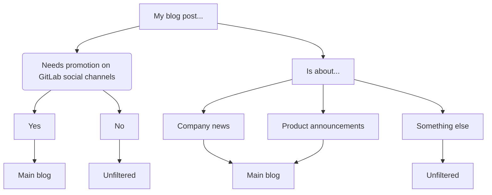

## On this page
{:.no_toc .hidden-md .hidden-lg}

- TOC
{:toc .hidden-md .hidden-lg}

The GitLab Unfiltered blog is inspired by the spirit of [transparency](/handbook/values/#transparency) and "[everyone can contribute](/company/strategy/#mission)." Team members can publish posts without going through the Editorial team for review, and we may choose some posts to feature on the main blog. You can publish as often as you like, get your posts up much faster, and don't need to ensure that they align with our content strategy.

Any GitLab team member can publish to the GitLab Unfiltered blog, provided they follow the process below, the post is relevant to GitLab or your work at GitLab (i.e. don't treat it as your personal blog), is in keeping with our [values](/handbook/values/), and would not cast GitLab in a negative light. If you're not sure if your topic is appropriate for GitLab Unfiltered, please share your issue or merge request in #content on Slack to get feedback. If any team member publishes a post that is unsuitable they may have their right to publish revoked.

## Is my blog post right for Unfiltered?

Corporate news, product announcements, or any post which requires promotion from official GitLab branded channels should be published on the main GitLab blog. The process for submitting these posts is outlined in the [blog handbook](/handbook/marketing/blog/#publishing-process).


### Examples:

- Company news: Launching a Diversity, Inclusion & Belonging  initiative, announcing an event, sharing updates about an external-facing program
- Product announcements: A breaking change, new integration, announcing a partnership

 If you're still not sure where your post should live, ask in #content on Slack!
 
## Advantages of publishing on Unfiltered

The main blog is our official corporate blog, whereas the Unfiltered blog is more like a peer-to-peer publishing platform.

Unfiltered is not a consolation prize or the death knell for blog posts! Many Unfiltered posts get plenty of attention without being on the main blog or being promoted on branded social channels. Sometimes, Unfiltered posts are well suited to the main blog, in which case we will feature them. Many posts are better suited for Unfiltered anyway, for example, if the blog post is about your personal experience as a new team member at GitLab, that is not something that GitLab the company or product would talk about. In this case, an Unfiltered post could come across as more authentic, as it hasn't gone through the official publishing process and therefore can be perceived as coming directly from the author, vs from GitLab itself.

As mentioned above, you can publish to Unfiltered as often as you like, get your posts up much faster, and don't need to ensure that they align with our content strategy.

You can learn more about how the Editorial team reviews blog post pitches and considers [where to publish different types of stories in the Editorial team handbook](/handbook/marketing/inbound-marketing/content/editorial-team/#what-to-look-for).

If you are interested in hearing about how Unfiltered posts perform, we share results of Unfiltered blog posts in the Growth Marketing Team Weekly Recap & Demo Day on every last Thursday of the month. The recording is shared after the call, or you can reach out in #growth-mktg if you'd like to join live.

## Process

### Issue

Start by opening an issue in the [gitlab.com/gitlab-com/www-gitlab-com](https://gitlab.com/gitlab-com/www-gitlab-com/issues) project, using the `unfiltered blog post` issue template.

### Merge request

Open a merge request for your blog post using the `unfiltered blog post` MR template. Make sure your MR is set to close your associated issue automatically.

Create your blog post file, following the instructions in the main [blog handbook](/handbook/marketing/blog/#formatting-guidelines). You may do this before you open your MR, depending on your preferred workflow.

#### Frontmatter

All blog post files begin with this frontmatter. Some fields from the [standard frontmatter for blog posts](/handbook/marketing/blog/#frontmatter) are unnecessary for Unfiltered posts, so to simplify things, you can copy and paste the below frontmatter:

```yaml
---
title: "This is the post title"
author: Firstname Lastname # if name includes special characters use double quotes "First Last"
author_gitlab: GitLab.com username # ex: johndoe
author_twitter: Twitter username or gitlab # ex: johndoe
categories: unfiltered
image_title: '/images/blogimages/gitlab-values-cover.png'
description: "Short description for the blog post"
tags: tag1, tag2, tag3 # Please add some relevant tags from the blog handbook: https://about.gitlab.com/handbook/marketing/blog/#tags. Please only use tags from this list (do not create new ones).
---
```

#### Link to disclaimer

Add the following to the top of your blog post file, underneath the frontmatter (leave one blank line in between):

```md
{::options parse_block_html="true" /}

<i class="fab fa-gitlab" style="color:rgb(107,79,187); font-size:.85em" aria-hidden="true"></i>&nbsp;&nbsp;
This blog post is [Unfiltered](/handbook/marketing/blog/unfiltered/#legal-disclaimer)
&nbsp;&nbsp;<i class="fab fa-gitlab" style="color:rgb(107,79,187); font-size:.85em" aria-hidden="true"></i>
{: .alert .alert-webcast}
```

This will render as follows:

{::options parse_block_html="true" /}

<i class="fab fa-gitlab" style="color:rgb(107,79,187); font-size:.85em" aria-hidden="true"></i>&nbsp;&nbsp;
This blog post is [Unfiltered](/handbook/marketing/blog/unfiltered/#legal-disclaimer)
&nbsp;&nbsp;<i class="fab fa-gitlab" style="color:rgb(107,79,187); font-size:.85em" aria-hidden="true"></i>
{: .alert .alert-webcast}

### Cover image

You can choose a cover image for yourself by following the [guidelines in the blog handbook](/handbook/marketing/blog/#cover-image), but if you prefer not to, please use the following in your frontmatter, which will apply the default cover image for Unfiltered posts.

`image_title: "/images/blogimages/gitlab-values-cover.png"`

### Review

As a final step, you might want to do a quick search of our blog to see if there are related posts you could include links to in your post. Cross-linking helps the reader and helps SEO, meaning more people will see what you've written.

Please check [the review app for the blog post](/handbook/marketing/blog/#previewing-your-blog-post) to ensure there are no formatting problems (e.g. links not working, images not rendering).

When you are completely finished, assign your MR to another team member for review. This does not have to be a member of the Editorial or Content teams. In most cases you would assign someone from your own team or group to review. Ideally your reviewer should be someone familiar with the topic you are writing about, so that they can fact check as well as catch typos or grammatical errors.

#### If you are asked to review an Unfiltered post

- You might find this [editorial review checklist](/handbook/marketing/inbound-marketing/content/editorial-team/#editorial-review-checklist) helpful
- Please ensure the `unfiltered` category has been entered in the post frontmatter
- Please ensure the [disclaimer](#link-to-disclaimer) has been included at the top of the blog post
- Remove the line `featured: yes` from the frontmatter if present
- Please check [the review app for the blog post](/handbook/marketing/blog/#previewing-your-blog-post) to ensure there are no formatting problems (e.g. links not working, images not rendering)

### Merging

Your reviewer may be able to merge your post, but if they don't have maintainer access for the www-gitlab-com project you may need to assign the MR to someone else on your team to merge. If no one on your team has maintainer access to www-gitlab-com, you can post in the #content channel on Slack and ask someone to merge the blog post for you. You don't need to assign someone from the Editorial team to merge.

### Featured posts

The Editorial and PR teams will [monitor Unfiltered for blog posts that we may choose to polish and feature on the main blog](/handbook/marketing/inbound-marketing/content/editorial-team/#featuring-unfiltered-posts) or develop into contributed articles for other publications. If you publish an Unfiltered post that you think could be a good fit for either of these, feel free to share it in #content.

### Legal disclaimer

DISCLAIMER: This blog is intended for user-generated content submitted by the GitLab team. The views and opinions represented in this blog are personal to the author of each respective blog post and do not represent the views or opinions of GitLab unless explicitly stated.
All content provided on this blog is for informational purposes only. Neither GitLab nor any of the individual blog contributors ("Contributors") make any representations as to the accuracy or completeness of any information on this site. Neither GitLab nor any Contributors will be liable for any errors or omissions in this information or any losses, injuries, or damages from the display or use of this information.
Comments are welcome, and in fact, encouraged. However, GitLab reserves the right to edit or delete any comments submitted to this blog without notice should GitLab determine them to i) be spam or questionable spam; ii) include profanity; iii) include language or concepts that could be deemed offensive, hate speech, credible threats, or direct attacks on an individual or group; or iv) are in any other way a violation of GitLab's Website Terms of Use. GitLab is not responsible for the content in comments.
This policy is subject to change at any time.
{: .alert .alert-info .note}
