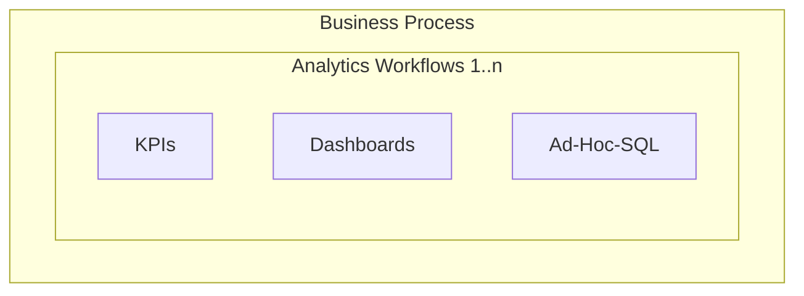

{::options parse_block_html="true" /}

## On this page
{:.no_toc .hidden-md .hidden-lg}

- TOC
{:toc .toc-list-icons .hidden-md .hidden-lg}

---

## Introduction

This page lists GitLab self-service [analytics Workflows](/handbook/business-technology/data-team/data-catalog/#analytics-workflow) and [data definitions](/handbook/business-technology/data-team/data-catalog/#data-definition), collectively known as **The Data Catalog**. This single source of truth for trusted [self-service data](/handbook/business-technology/data-team/direction/self-service/) is organized by function and maintained within the Data Team handbook. In cases where a subject crosses functional boundaries, content will reside alongside the function that owns the source system of record. For example, consider Product SKUs, although many groups may use this data to make decisions, the documentation will live in Finance because Zuora is the SSOT for SKUs.

### Analytics Workflow

An _Analytics Workflow_ is a routine activity undertaken to analyze the performance of a well-defined business process. A given business process will likely have one or more supporting Analytics Workflows. As an example, the Marketing Lead Generation business process might include analytics workflows for Email Campaign Performance Analytics, Lead Qualification Analytics, and Pipeline Generation Analysis. Analytics Workflows are purposefully designed with established business processes in mind.

#### Analytics Workflow Development

1. Create a merge request to add the Analytics Workflow definition to the the appropriate section of the Data Catalog.
1. Define the Analytics Workflow page as completely as possible with all of its parts based on the [Level 2 Reference](/handbook/business-technology/data-team/direction/reference/).
1. Self-Service Development is considered complete once all key parts are operationalized, a Knowledge Assessment is published, and the Self-Service entry on this page is tagged with the appropriate [operational status](/handbook/business-technology/data-team/data-catalog/#legend).

### Data Definition

The Data Definition is a standard definition and set of use cases used as part of an Analytics Workflow.

#### Data Definition Development Workflow

1. Create a merge request to add the Data Definition to the appropriate section of the Data Catalog. If a Data Definition is part of an existing Subject Area page, only add a link to it from the Data Catalog Index and do not create a new stand-alone page with the Definition.
1. Define the Data Definition page as completely as possible with all of its parts, including a business summary and links to source systems of record and dashboards.
1. Data Definition is considered complete once all key parts are defined and the entry on this page is tagged with the appropriate [operational status](/handbook/business-technology/data-team/data-catalog/#legend).

### Data Catalog

<h1 id="headerformat">Engineering </h1>

  * <a href="https://about.gitlab.com/handbook/business-technology/data-team/data-catalog/engineering/mr_rate.html" > Narrow MR Rate</a>

<h1 id="headerformat">Finance </h1>

  * <a href="/handbook/business-technology/data-team/data-catalog/finance-arr/" > 🚧 WIP Self-Service Analytics Workflow: Finance ARR</a>

<h1 id="headerformat">Marketing </h1>

  * <a href="/handbook/business-technology/data-team/data-catalog/email-data-mart/" class="">🚧  WIP Self-Service Analytics Workflow: Email Marketing Data Mart</a>

<h1 id="headerformat">People </h1>

[People Metrics Overview](/handbook/business-technology/data-team/data-catalog/people-analytics/)

  Data Models

  * <a href="#" class="/handbook/business-technology/data-team/data-catalog/people-analytics/pto/pto.html">PTO By Roots (Slack)</a>

  Data Solutions

  * <a href="/handbook/business-technology/data-team/data-catalog/people_key_metrics_dashboard/" class="">People Metrics</a>
  * <a href="/handbook/business-technology/data-team/data-catalog/people-analytics/promotions_report.html" class="">Promotions Report</a>
  * <a href="#" class="/handbook/business-ops/data-team/data-catalog/people-analytics/talent-acquisition-metrics.html.md">Talent Acquisition Metrics</a>
  * <a href="https://app.periscopedata.com/app/gitlab/topic/People/abaa4b1155104d529eed2464838d3f39" class="">Other People Dashboards</a>
  * <a href="#" class="https://app.periscopedata.com/app/gitlab/topic/recruiting/abc202b7029542f98ffb8fefa4958907">Other Talent Acquisition Dashboards</a>
  * <a href="https://app.periscopedata.com/app/gitlab/831245/People-Data-Discovery-Feature" class="">People Metrics - Data Discovery in Sisense Dashboard</a>
  * <a href="https://app.periscopedata.com/app/gitlab/831245/People-Data-Discovery-Feature" class="">Team Member Separations Report</a>
  * <a href="/handbook/business-technology/data-team/data-catalog/people-analytics/people_kpi_deck.html" class="">People KPI Deck</a>

<h1 id="headerformat">Product </h1>

  Data Solutions

  * <a href="/handbook/business-technology/data-team/data-catalog/product-geolocation/" class="">📊 Self-Service Analytics Workflow: Product Geolocation Analysis</a>  
  * <a href="/handbook/business-technology/data-team/data-catalog/pricing/" class="">📊 Self-Service Analytics Workflow: Pricing Analysis</a>  
  * <a href="/handbook/business-technology/data-team/data-catalog/xmau-analysis/" class="">🚧 WIP Self-Service Analytics Workflow: XMAU Analysis</a>  
  * <a href="/handbook/business-technology/data-team/data-catalog/product-usage-data/" class="">🚧 WIP Product Usage Data</a>  
  * <a href="https://app.periscopedata.com/app/gitlab/803470/Customer-Product-Usage-Dashboard" class="">📊 Customer Product Usage Dashboard</a>  

  Data Definitions

  * <a href="/handbook/product/performance-indicators/#structure/" class="">Data Definition: XMAU</a>
  * <a href="/handbook/product/product-categories/#devops-stages/" class="">Data Definition: Product Stage</a>

<h1 id="headerformat">Sales </h1>

  * <a href="/handbook/business-technology/data-team/data-catalog/customer-segmentation/" class="">📊 Self-Service Analytics Workflow: Customer Segmentation Analysis</a>  
  * <a href="/handbook/business-technology/data-team/data-catalog/sales-funnel/" class="">📊  Self-Service Analytics Workflow: Sales Funnel</a>  
  * <a href="/handbook/business-technology/data-team/data-catalog/manual-data-upload/" class="">🚧  Manual Usage Data Upload</a>  

<h1 id="headerformat">Solutions for the Data Team </h1>

  * <a href="/handbook/business-technology/data-team/data-catalog/trusted-data-solutions/" class="">📊 Trusted Data Solutions</a>

<h1 id="headerformat">Sisense</h1>

  * <a href="https://app.periscopedata.com/app/gitlab/topic/Sisense-Maintenance/abde7717743143098ac071be8c646bdb" class="">Sisense Related Dashboards - this accounts for Sisense Users, Dashboard Usage, Query Runtime</a>

### Legend

📊 indicates that the solution is operational and is embedded in the handbook.

🚧 indicates that the solution is in a `Work In Progress` and is actively being developed. When using this indicator, an issue should also be linked from this page.

🐔 indicates that the solution is unlikely to be operationalized in the near term.
