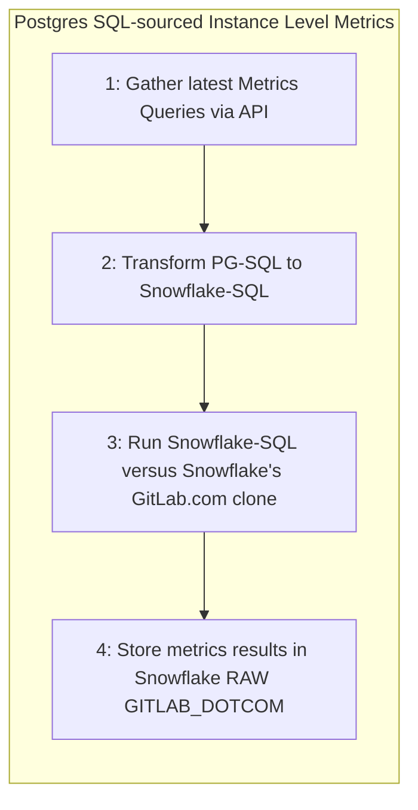
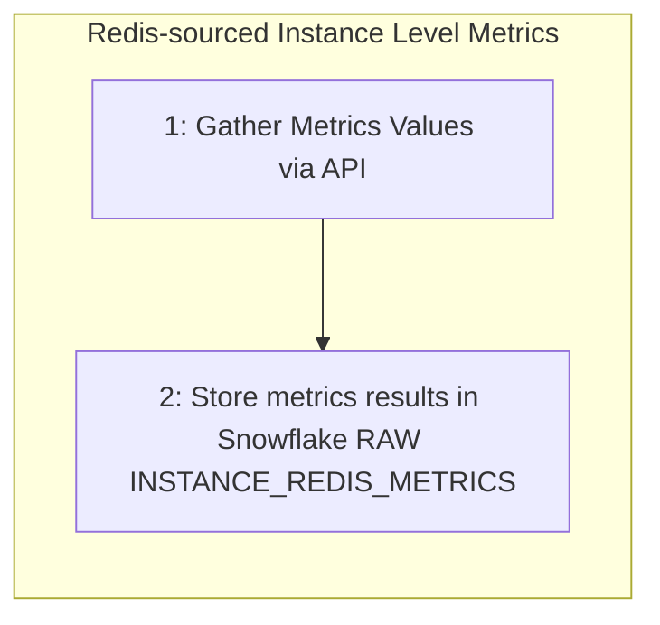
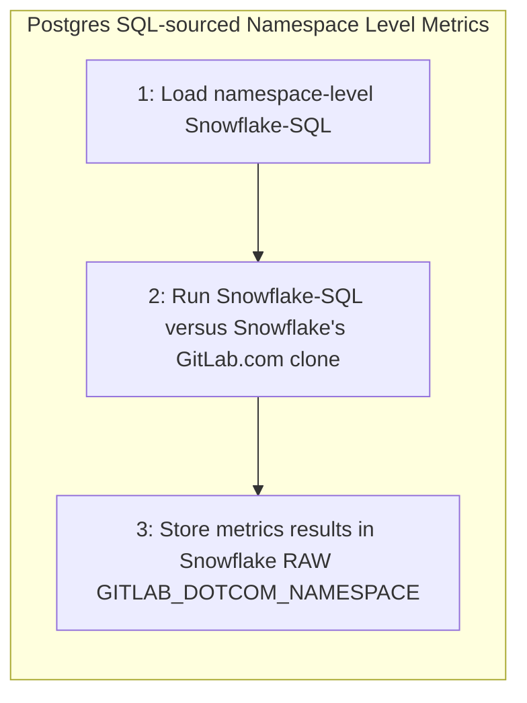

## On this page

- TOC
{:toc}

{::options parse_block_html="true" /}

---
## Service Ping Overview

Previously called "Usage Ping", [Service Ping](https://docs.gitlab.com/ee/development/service_ping/) is a background process that [runs weekly](https://docs.gitlab.com/ee/development/service_ping/#how-service-ping-works) in a GitLab Instance and is responsible for collecting, aggregating, and packaging [a set of metrics](https://docs.gitlab.com/ee/development/service_ping/metrics_dictionary.html#metrics-definition-and-validation) useful for analytics purposes. Metrics are easily extensible, with new metrics changing regularly per the [Metric Lifecycle](https://docs.gitlab.com/ee/development/service_ping/metrics_lifecycle.html). The full set of metrics are defined in the [Metric Dictionary](https://gitlab-org.gitlab.io/growth/product-intelligence/metric-dictionary/). Once metrics are collected from the instance, they are bundled into a JSON payload (the "ping") and posted to the GitLab Versions App where they are then synced to downstream processes such as Snowflake. [Here is an example of a Service Ping Payload](https://docs.gitlab.com/ee/development/service_ping/#example-service-ping-payload). There are two primary variants of Service Ping: Self-Managed Service Ping and SaaS Service Ping. Self-Managed Service Ping runs versus a single-tenant deployment of GitLab, while SaaS Service Ping runs versus the multi-tenant GitLab.com.

### Service Ping Use Cases

Service Ping metics provide insights that help our Product, Support, and Sales teams understand how GitLab is used. For example, the data helps to:

1. Support [GitLab xMAU KPIs](https://about.gitlab.com/handbook/business-technology/data-team/data-catalog/xmau-analysis/) KPI
1. Calculate Stage Monthly Active Users (SMAU), which helps to measure the success of our stages and features
1. Understand which features are or are not being used and provide guidance to customers to help them take advantage of GitLab's rich feature set
1. Compare counts month over month (or week over week) to get a rough sense for how an instance uses different product features
1. Collect other facts that help us classify and understand GitLab installations

### Self-Managed Service Ping

Self-Managed customers setup and run Service Ping to provide analytics for their own deployments (instances) of GitLab. Customers optionally [disable Service Ping](https://docs.gitlab.com/ee/development/service_ping/#disable-service-ping) in which case metrics will not be sent to GitLab. Customers have access to Service Ping data through the console application.

### SaaS Service Ping

GitLab.com (or GitLab SaaS) is essentially a GitLab-hosted multi-tenant version of GitLab. A manually generated version of Service Ping (Manual SaaS Service Ping) has been implemented for SaaS and provides analytics coverge of SaaS equivalent to what we achieve with Self-Managed instances.

However, the current process suffers from two major sets of problems: 

**Performance Problems**

* The process is error-prone and causes resource contention with live customer activity
* The process is slow, and individual metric queries regularly fail
* The process is implemented to run manually during off-peak hours
* The process requires available staffing to manage end-to-end

**Data Coverage Deficiency**

In addition, Manual SaaS Service Ping is only capable of generating instance-level (the entire site) data and does not meet all the needs of Sales, Customer Success, and others who need more granular data from the `namespace` level to measure individual GitLab.com customer adoption.

To solve for these two primary sets of problems, the Data Team is developing "Automated SaaS Service Ping". Automated SaaS Service Ping is a set of programs that run natively in the [Enterprise Data Platform](/handbook/business-technology/data-team/platform/), a system designed for Big Data, Automation, and Scale. With Automated SaaS Service Ping fully operationalized, Manual SaaS Service Ping can be decomissioned. There are two major sub-programs that make up Automated SaaS Service Ping:

* **SaaS Instance Service Ping** - Automated weekly generation of Service Ping for the GitLab.com instance
* **SaaS Namespace Service Ping** - Automated weekly generation of Service Ping for every GitLab.com instance->namespace

#### 4 Types of Service Ping Processes Run Versus 3 Environments

In total, there are 4 types of Service Ping either in production or development:

| | 1. Self-Managed Service Ping | 2. Manual SaaS Service Ping | 3. Automated SaaS Instance Service Ping | 4. Automated SaaS Namespace Service Ping |
| :--- | :--- | :--- | :--- | :--- |
| Where Run | Environment 1: A Customer's Self-Managed Instance | Environment 2: Within GitLab.com Infrastructure | Environment 3: Data Platform Infrastructure | Environment 3: Data Platform Infrastructure |
| Run By | GitLab (Automatically) | Product Intelligence (Manually) | Airflow (Automatically) | Airflow (Automatically) |
| Frequency | Weekly | Weekly | Weekly | Weekly |
| Code Owner | Product Intelligence | Product Intelligence | Data Team | Data Team |
| Source Code | Ruby, SQL | Ruby, SQL | Python, SQL, dbt | Python, SQL, dbt |
| Data Granularity | Instance | Instance | Instance | Namespace |
| Development Status | Live-Production | Live-Production | In Development | Live-Production | 

## (Automated) SaaS Service Ping Implementation

### Process Overview

**(Automated) SaaS Service Ping** is a collection of [python programs](https://gitlab.com/gitlab-data/analytics/-/blob/master/extract/saas_usage_ping/usage_ping.py) and dbt processes orchestrated with Airflow and scheduled to run weekly within the Enterprise Data Platform. The [Automated SaaS Service Ping Project](https://gitlab.com/gitlab-data/analytics/-/tree/master/extract/saas_usage_ping) stores all source code and configuration files. The program relies on two primary data sources: redis counters and SQL-Based postgres tables. Both sources are implemented as automated data pipelines into Snowflake, intended to run independently of the SaaS Service Ping implementation process.
* SQL-Based postgres data from SaaS is synced via [pgp](https://gitlab.com/gitlab-data/analytics/-/tree/master/extract/postgres_pipeline) and made available in RAW
* Redis data is accessed at program runtime and also stored in RAW

#### SaaS Instance Service Ping

SaaS Instance Service Ping runs as described in the Process Overview.





#### SaaS Namespace Service Ping

SaaS Namespace Service Ping produces metrics at a finer-level of granularity than SaaS Instance Service Ping. The process accesses a list of all namespaces in GitLab.com and loops through each namespace to generate ultimate-parent namespace-level usage metrics. The [`namespaces`](https://gitlab.com/gitlab-org/gitlab/-/blob/master/db/structure.sql) table provides input to the the program and for efficiency, a SQL SET OPERATION is used with SQL `GROUP BY` namespace-id instead of a traditional 1-by-1 namespace loop. **Final metrics output is stored at the ultimate parent namespace level**. A drawback with Namespace Service Ping is that only SQL-sourced metrics are currently available and Redis-sourced metrics such as `analytics_unique_visits.g_analytics_contribution` are currently unavailable.



### Metric Generation Process Pseudo-code

1. Assume the GitLab.com postgres source data pipelines are running and fresh up-to-date data is available in Snowflake RAW and PREP
1. Begin [Service Ping python program](https://gitlab.com/gitlab-data/analytics/-/blob/master/extract/saas_usage_ping/usage_ping.py)
     1. Start Instance-level metrics generation
          1. Start Postgres SQL-sourced Metrics
               1. Grab the latest set of Postgres SQL-sourced (PG-SQL) metric queries from the [Metrics Dictionary API Query Endpoint](https://docs.gitlab.com/ee/api/usage_data.html#export-service-ping-sql-queries)
               1. Transform Instance-Level PG-SQL to Snowflake SQL (S-SQL) using the [python transformer](https://gitlab.com/gitlab-data/analytics/-/blob/master/extract/saas_usage_ping/transform_instance_level_queries_to_snowsql.py)
               1. Run S-SQL versus the SaaS GitLab.com clone data available in the Snowflake Data Warehouse and store the results in `RAW.SAAS_USAGE_PING.GITLAB_DOTCOM`
          1. Start Redis-sourced Metrics
                1. Call the Redis API
                1. Data is picked up and stored in a [JSON format](https://gitlab.com/-/snippets/2095831), the approximate size is around 2k lines, usually one file per load (at the moment, it is a weekly load) and stored in `RAW.SAAS_USAGE_PING.INSTANCE_REDIS_METRICS`
     1. Start Namespace-Level metrics generation
          1. Grab the latest metrics queries from the [Namespace Queries JSON](https://gitlab.com/gitlab-data/analytics/-/blob/master/extract/saas_usage_ping/usage_ping_namespace_queries.json)
          1. Run the Namespace Queries versus the SaaS GitLab.com clone data available in the Snowflake Data Warehouse and store the results in `RAW.SAAS_USAGE_PING.GITLAB_DOTCOM_NAMESPACE`
1. Now with all source data in Snowflake, start dbt processing
    1. [Begin instance dbt processing ](https://dbt.gitlabdata.com/#!/model/model.gitlab_snowflake.saas_usage_ping_instance?g_v=1&g_i=%2Bsaas_usage_ping_instance%2B)
    1. [Begin namespace dbt processing](https://dbt.gitlabdata.com/#!/model/model.gitlab_snowflake.saas_usage_ping_namespace)


### Instance Ping DBT Process Pseudo-code

`coming soon`

### Namespace Ping DBT Process Pseudo-code

`coming soon`

#### Known Limitations/Improvements

- Namespace-level Redis-source Metrics are not yet available
- Snowflake has redundant "legacy" service-ping processes and these need to be deprecated

### Service Ping Metrics Types

Within Service Ping, there are 2 main types of metrics supported:

- SQL metrics: metrics sourced from postgres tables
- Redis metrics: metrics sourced from Redis counters


<div style="width: 640px; height: 480px; margin: 10px; position: relative;"><iframe allowfullscreen frameborder="0" style="width:640px; height:480px" src="https://lucid.app/documents/embeddedchart/8e8decaf-a45c-4bc3-9fd5-6fa3dd1ea660" id="ZaD2gkT4TN7D"></iframe></div>


#### SQL Metrics Implementation

The SQL-based metrics workflow is the most complicated flow. SQL-based metrics are actually created by a SQL query run against the Postgres SQL database of the instance. For large tables, these queries can be very long to run. An example is for example the `counts.ci_builds` metric which is running a COUNT(*) on the ci_builds which is one of our largest (see dbt table containing more than 1 billion rows). The goal of this module will be to run against our Snowflake database instead of the postgres SQL database of our SaaS Instance.

The Product Intelligence team has created an API endpoint that enables us to retrieve all the SQL queries to run to calculate the metrics. Here is an example file.

A technical documentation about the API endpoint [is available here](https://docs.gitlab.com/ee/api/usage_data.html#export-service-ping-sql-queries)

Let's take a look at a few queries received in the JSON response:

```
 "counts": {
    "assignee_lists": "SELECT COUNT(\"lists\".\"id\") FROM \"lists\" WHERE \"lists\".\"list_type\" = 3",
    "boards": "SELECT COUNT(\"boards\".\"id\") FROM \"boards\"",
    "ci_builds": "SELECT COUNT(\"ci_builds\".\"id\") FROM \"ci_builds\" WHERE \"ci_builds\".\"type\" = 'Ci::Build'",
    "ci_internal_pipelines": "SELECT COUNT(\"ci_pipelines\".\"id\") FROM \"ci_pipelines\" WHERE (\"ci_pipelines\".\"source\" IN (1, 2, 3, 4, 5, 7, 8, 9, 10, 11, 12, 13) OR \"ci_pipelines\".\"source\" IS NULL)",
    "ci_external_pipelines": "SELECT COUNT(\"ci_pipelines\".\"id\") FROM \"ci_pipelines\" WHERE \"ci_pipelines\".\"source\" = 6",
    "ci_pipeline_config_auto_devops": "SELECT COUNT(\"ci_pipelines\".\"id\") FROM \"ci_pipelines\" WHERE \"ci_pipelines\".\"config_source\" = 2",
    "ci_pipeline_config_repository": "SELECT COUNT(\"ci_pipelines\".\"id\") FROM \"ci_pipelines\" WHERE \"ci_pipelines\".\"config_source\" = 1",
    "ci_runners": "SELECT COUNT(\"ci_runners\".\"id\") FROM \"ci_runners\"",
    "ci_triggers": "SELECT COUNT(\"ci_triggers\".\"id\") FROM \"ci_triggers\"",
```

So the goal would be to be able to run them against tables in Snowflake (synced from GitLab Saas). We need to do so, to have tables that have the same column names and the same granularity as the ones in the Postgres SQL tables.

Here below, you see the way we currently transform the Postgres data in Snowflake:


As highlighted here, we created a `dedupe` layer that is exactly meeting this criteria. 

We have then identified the tables against which we can run the SQL-based metrics queries. We will then need to transform the SQL statements to query agains these tables.

We have a script running that transforms this SQL statements :

```
"SELECT COUNT(\"ci_builds\".\"id\") FROM \"ci_builds\" WHERE \"ci_builds\".\"type\" = 'Ci::Build'",
```

to this SQL statement:

```
"SELECT 'counts.ci_builds' AS counter_name,  COUNT(ci_builds.id) AS counter_value, TO_DATE(CURRENT_DATE) AS run_day   FROM prep.gitlab_dotcom.gitlab_dotcom_ci_builds_dedupe_source AS ci_builds WHERE ci_builds.type = 'Ci::Build'"
```

We then run all these queries and store the results in a json that we send them to the table called `RAW.SAAS_USAGE_PING.GITLAB_DOTCOM`. This table has the following columns:

- query_map: that stores all the queries run 
- run_results: that stores the results returns
- ping_date: date when the query got run

#### Redis Metrics Implementation

Redis counters are used to record high-frequency occurrences of some arbitrary situation happening in GitLab, that do not create a permanent record in our Database, for example when a user folds or unfolds the side bar. In such cases, the backend engineer will define a name that would represent a given situation, for example navigation_sidebar_opened, and also arbitrarily decide on the moment (by adding dedicated piece of code in existing execution path) when it happens.

The Product Intelligence team has created an API endpoint that allows the Data Team to retrieve all Redis metrics value at any time we want. An example of the JSON Response is available here. Note that `-3` means that the metrics is not redis so the API doesn't retrieve any value for it. Once the JSON response received, we store it in Snowflake. Additional technical documentation about the API endpoint [is available here](https://docs.gitlab.com/ee/api/usage_data.html#usagedatanonsqlmetrics-api).

### Airflow setup

We created a Airflow dag `saas-instance-usage-ping` run every Saturday that executes all the operations described below:

- fetching the queries from the API Endpoint
- transforming the queries to be able to run them against Snowflake dedupe layer
- run the queries
- store the results in Snowflake 

## From RAW to PROD database and Sisense

We currently do limited transformation once the data is stored in RAW. In the future, the data flow will look like that:

That means the data set created will be UNIONED with the current data pipeline in the model `prep_usage_data_flattened`.
