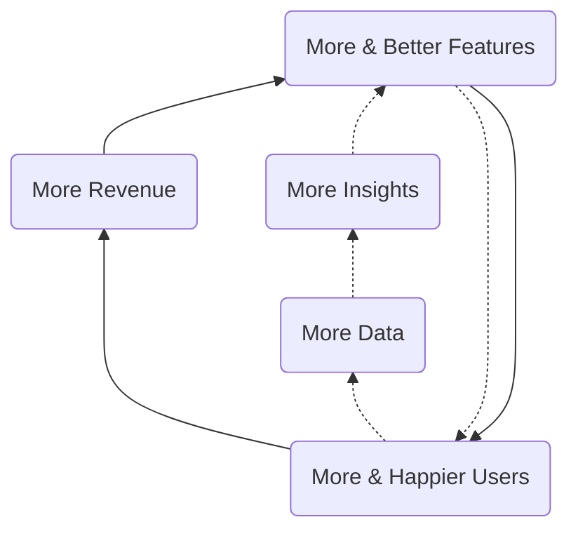
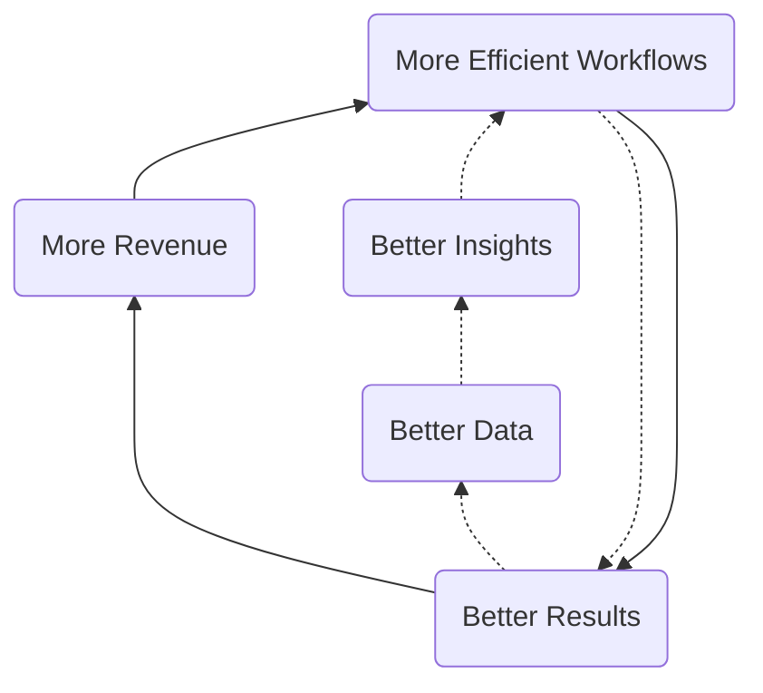
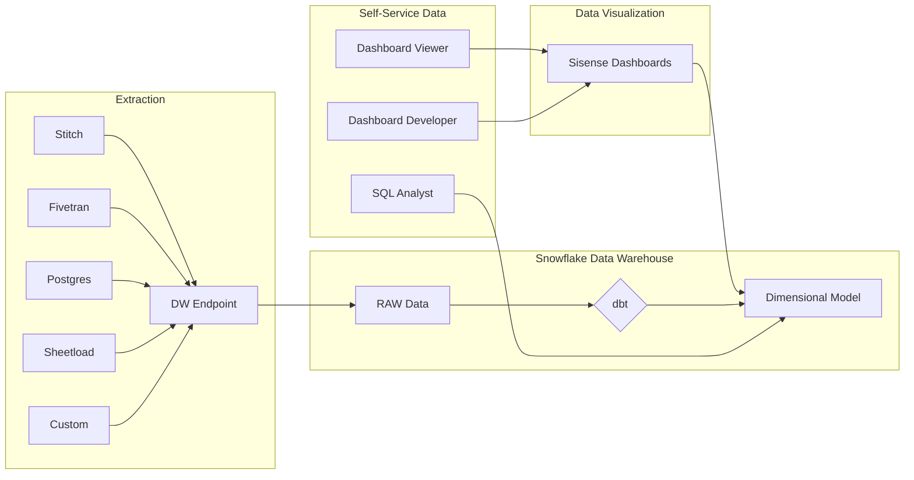
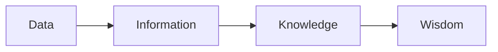

## On this page
{:.no_toc .hidden-md .hidden-lg}

- TOC
{:toc .toc-list-icons .hidden-md .hidden-lg}

---

`This page contains forward-looking content and may not accurately reflect current-state or planned feature sets or capabilities.`

## Quarterly Objectives

### [FY22-Q1](https://gitlab.com/groups/gitlab-com/business-technology/-/epics/200#data) 

FY22-Q1 was a very important quarter for the Data Team because the team completed many initiatives started earlier in FY21, including the new organization model with Fusion Teams, the first major release of the Trusted Data solutions and Sales Funnel Dashboard, integration of Product Usage Data into Gainsight, among other things. The Team successfully delivered on all major commitments in the quarter and helped position itself for success and scale heading into Q2.

- [FY22-Q1 Retrospective](https://gitlab.com/gitlab-data/managers/-/issues/259)
- [FY22-Q1 Report Card](https://gitlab.com/gitlab-data/managers/-/issues/258)
- [FY22-Q1 Handbook Jamboree](https://gitlab.com/gitlab-data/analytics/-/issues/8281)

|  Theme | Objective | Notes and Key Results |
| :--- | :--- | :--- |
| Mature the Data Program | Objective 1: Define FY22 Fusion Teams, support Project Compass, report on internal stakeholder satisfaction with surveys, and make sure we have alignment on priority and deliverables. | Rolled-out Fusion Teams, XMAU Handbook Page, Gainsight SM Usage Data, and Marketing Data Mart |
| Level 2-Corporate Intelligence | Objective 2: Improve GTM Performance Management Efficiency | Shipped TD: Sales Funnel dashboard, Shipped Analytics Hub MVC |
| Level 2-Platform Maturity | Objective 3: Expand the Enterprise Data Platform to be more Reliable and Secure | Created v1 of the Quarterly Audit, Shipped Data Pump v1 |

### [FY22-Q2](https://gitlab.com/groups/gitlab-com/business-technology/-/epics/247#data)

- [FY22-Q2 Data Team Handbook Updates](https://gitlab.com/gitlab-data/analytics/-/issues/8600)
- FY22-Q2 Retrospective `Coming Soon`
- FY22-Q2 Report Card `Coming Soon`
- FY22-Q2 Handbook Jamboree  `Coming Soon`

|  Theme | Objective |
| :--- | :--- | 
| Level 2-Corporate Intelligence | Objective 1: Accelerate GTM Teams and Project Compass |
| Level 2-Corporate Intelligence | Objective 2: Enable GitLab to be a Public Company |
| Level 2-Platform Maturity | Objective 3: Improve Product Decision Quality and Accuracy with Trusted Data |

### [FY22-Q3](https://gitlab.com/groups/gitlab-com/business-technology/-/epics/248#data)

|  Theme | Objective |
| :--- | :--- | 
| Level 2-Corporate Intelligence | Objective 1: Accelerate GTM Teams and Project Compass |
| Level 2-Corporate Intelligence | Objective 2: Public Company Readiness |
| Level 2-Product & Customer Intelligence | Objective 3: Accelerate R&D Teams with Trusted Data |

## Strategy

As an important step towards achieving our [mission](/handbook/business-technology/data-team/#mission), meeting our [responsibilities](/handbook/business-technology/data-team/#responsibilities), and helping GitLab [become a successful public company](/handbook/being-a-public-company/), we are creating an Enterprise Data Platform (EDP), a single unified data and analytics stack, along with a broad suite of Data Programs such as Self-Serve Data and Data Quality. The EDP will power GitLab's KPIs, cross-functional reporting and analysis, and in general, allow all team members to make better decisions with trusted data. Over time, the EDP will further accelerate GitLab's analytics capabilities with features such as data publishing and products - enriched and aggregated data integrated into business systems or into the GitLab product for use by our customers. This acceleration happens through the development of "Data Flywheels", much like GitLab's [Open Core and Development Spend](https://about.gitlab.com/company/strategy/#dual-flywheels) flywheels.

### Data Flywheels

#### Customer & Product Intelligence Flywheel

The Customer & Product Intelligence Flywheel is focused on improving the Customer Experience and encompasses the data and analytics involved in user-product interactions, customer use cases, product development, product adoption, and most aspects of the [Customer Journey](https://about.gitlab.com/handbook/customer-success/vision/).

#### Corporate Intelligence

The Corporate Intelligence Flywheel is focused on improving (internal) Business Efficiency and this is accomplished by instrumenting, monitoring, and improving business workflows. Common outputs of Corporate Intelligence teams include performance dashboards, balanced scorecards, KPIs, MBOs, and related data-enabled frameworks.

### Short-Term Direction

Measured in Quarters, our short-term direction is to help GitLab be a [public company](/handbook/being-a-public-company/) by reaching [Level 2 of the Data Capability Model](/handbook/business-technology/data-team/direction/#data-capability-model) with support for GitLab's [KPIs](/company/kpis/) and Self-Serve Data coverage of GitLab's two most important business processes: the _lead-to-cash_ cycle and the _product-release-to-adoption_ cycle.

In priority order, the elements of the EDP we are actively building include:

1. An [Enterprise Dimensional Model](/handbook/business-technology/data-team/platform/edw/) to serve as single-source-of-truth for reporting and analysis, including all of our Sisense dashboards and SQL analysis in Snowflake
1. A [Trusted Data Framework](/handbook/business-technology/data-team/platform/#tdf) to help ensure all of our Data Solutions are thoroughly tested, with automated ongoing validations
1. [Data Visualizations](/handbook/business-technology/data-team/platform/periscope/) to support performance analysis, including [KPIs](/company/kpis/).
1. A [Self-Service Data Program](/handbook/business-technology/data-team/direction/self-service/) to allow all GitLab teams to reliably access trusted data without requiring central Data Team involvement. Our three Self-Serve Data options are:
    1. **Dashboard Viewer** - GitLab team members login to the Sisense portal and access pre-built dashboards
       1. **Dashboard Developer** - GitLab team members certified in Sisense login to the Sisense portal and build their own Dashboards sourced from trusted data available in the Enterprise Dimensional Model
       1. **SQL Developer** - any GitLab team member certified in SQL Analysis writes their own SQL to query trusted data from the Enterprise Dimensional Model hosted in Snowflake

### Long-Term Direction

Measured in Years, our long-term direction is to extend the EDP with features found in a mature [Enterprise Data Platform](/handbook/business-technology/data-team/direction/#a-complete-enterprise-data-platform) such as master data management, a data lake, and advanced analytics. Also, once we have reached Level 2, we:

- want to find more ways to contribute to open-source data projects
- would like to work with [Meltano](https://meltano.com/) as a data pipeline and processing component
- want to integrate aspects of the EDP with GitLab.com to provide deep analytic capabilities to GitLab's customers
- provide DevOps Industry Benchmark Reports along the lines of [Okta's Business @ Work](https://www.okta.com/businesses-at-work/)
- revisit our overall data tech stack to ensure we have the required elements to reach Level 3

### Measuring Success

We will measure progress towards our short-term direction in the following ways:

1. [Data Team KPIs](/handbook/business-technology/data-team/direction/#data-team-kpis)
1. The business impact of our results as they align to the [Data Value Pyramid](/handbook/business-technology/data-team/direction/#data-value-pyramid)
1. The data features we provide as they map to the [Data Capability Model](/handbook/business-technology/data-team/direction/#data-capability-model)
1. The Data Team Quarterly Report Card

We have not yet defined criteria for measuring long-term progress.

#### Data Team KPIs

1. `All-Time` Number of Self-Service Data Customers Enabled
1. `Monthly` Number of active Self-Service Dashboard Developers
1. `Monthly` Number of active Self-Service SQL Developers
1. `Monthly` % of Dashboard Traffic From User Generated Content

## A Complete Enterprise Data Platform

The following table represents capabilities of a mature Enterprise Data Platform which can solve for the wide range of data and analytics needed by a large business. Not all capabilities listed are required to meet GitLab's short-term needs or known long-term needs. The decision to implement a given capability will be driven by a clear business need and the final result may differ significantly from the reference example.

|                                                                                                                               |                                                                                                    |                                                                                                     |
| ----------------------------------------------------------------------------------------------------------------------------- | -------------------------------------------------------------------------------------------------- | --------------------------------------------------------------------------------------------------- |
| [Data Architecture](https://en.wikipedia.org/wiki/Data_architecture)                                                          | [Data Security](https://en.wikipedia.org/wiki/Data_security)                                       | [Data Quality](https://en.wikipedia.org/wiki/Data_quality)                                          |
| [Descriptive](https://www.kdnuggets.com/2017/07/4-types-data-analytics.html)                                                  | [Diagnostic](https://www.kdnuggets.com/2017/07/4-types-data-analytics.html)                        | [Advanced Analytics](https://www.gartner.com/en/information-technology/glossary/advanced-analytics) |
| [Reporting](https://en.wikipedia.org/wiki/Report)                                                                             | [Dashboarding](https://www.microstrategy.com/us/resources/introductory-guides/business-dashboards) | [Self-Service](https://www.gartner.com/en/information-technology/glossary/self-service-analytics)               |
| [Operational Data Store](https://en.wikipedia.org/wiki/Operational_data_store)                                                | [Data Warehouse](https://en.wikipedia.org/wiki/Data_warehouse)                                     | [Data Lake](https://aws.amazon.com/big-data/datalakes-and-analytics/what-is-a-data-lake/)           |
| [Data Model Standards](https://en.wikipedia.org/wiki/Data_modeling)                                                           | [Enterprise Dimensional Model](https://en.wikipedia.org/wiki/Dimensional_modeling)                 | [Data Marts ](https://en.wikipedia.org/wiki/Data_mart)                                              |
| [Reference Data Management](https://en.wikipedia.org/wiki/Reference_data)                                                     | [Data Enrichment](https://www.redpointglobal.com/blog/what-is-data-enrichment)                     | [Master Data Management](https://en.wikipedia.org/wiki/Master_data)                                 |
| [Data Pipeline](https://www.alooma.com/blog/what-is-a-data-pipeline)                                                          | [Data Transformation](https://en.wikipedia.org/wiki/Data_transformation)                           | [Real-Time Data](https://en.wikipedia.org/wiki/Real-time_data)                                      |
| [Data Exports](https://www.qualtrics.com/support/survey-platform/data-and-analysis-module/data/download-data/export-formats/) | [Data Publishing](https://en.wikipedia.org/wiki/Open_data)                                         | [Data Products](https://hbr.org/2018/10/how-to-build-great-data-products)                           |
| [Data Taxonomy](https://www.nielsen.com/us/en/insights/resource/2019/why-you-need-a-data-taxonomy/)                           | [Data Catalog](https://www.alation.com/blog/what-is-a-data-catalog/)                               | [Data Portal](https://dataportals.org/)                                                             |

## Data Value Pyramid

We want to help all GitLab teams move up (or left-to-right in the diagram below) the [Data Value Pyramid](https://en.wikipedia.org/wiki/DIKW_pyramid) and turn basic metrics and counts into wisdom that helps them create better products for our customers, run our business more efficiently, and add new capabilities to our business model. Relative to the Data Value Pyramid, we are currently working primarily within the Data and Information stages.

## Data Capability Model

The Data Capability Model is used to identify target state requirements to support [GitLab's Strategy](https://about.gitlab.com/company/strategy).

**To help GitLab become a public company, we need our lead-to-cash and public-facing metrics to reach Level 2 of the capability model.**

| Level                                                                                   | Characteristics                                                                                                                                                                        | Benefits                                                                                              |
| --------------------------------------------------------------------------------------- | -------------------------------------------------------------------------------------------------------------------------------------------------------------------------------------- | ----------------------------------------------------------------------------------------------------- |
| (5)Prescriptive                                                                         | Real-time complex analysis embedded in products, shape actions and perceptions; Data analytics is a strategic differentiator                                                           | New Data Products, Improved Decision ROI                                                              |
| (4)Predictive                                                                           | Data Science” Insight into what is likely to happen, Widespread and effortless analytics production, Enterprise Data Quality and Governance                                            | Reliable Customer Lifetime Value, Expansion & Churn Prediction, Product Embedded Analytics            |
| (3)Strategic                                                                            | Widespread & effortless drillable analysis, Drillable cross-functional scorecards, dashboards, Enterprise Data Warehouse                                                               | Customer 360 & Health Score, Predictable & Trusted Data Reporting, Robust Self-Service & Data @ Scale |
| (2)Advanced: [Reference Solution](/handbook/business-technology/data-team/direction/reference/) | Operational Automated Reports and Dashboards, Reliable and validated data with automated tests, Mixture of manual and automated integration, core integrated data with some Data silos | Trusted Data, Self-Service Data, Key Performance Indicators, Stable platform for expansion            |
| **(1)Reactive**                                                                         | Static lists and reports, Highly focused on history/lagging - last 30/90/365 days, Unpredictable velocity, minimal cross-functional analysis, Data Silos                               | Historical Tabular Reports, Data Visualization                                                        |
| (0)None                                                                                 | Inconsistent report generation, Results not widely trusted, No stable analytics infrastructure                                                                                         |                                                                                                       |
