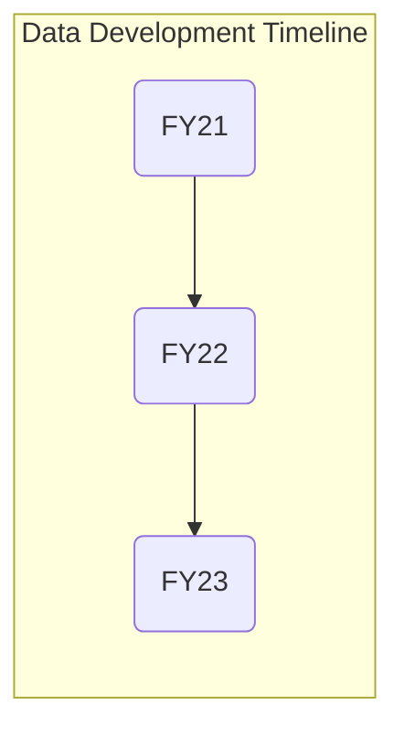
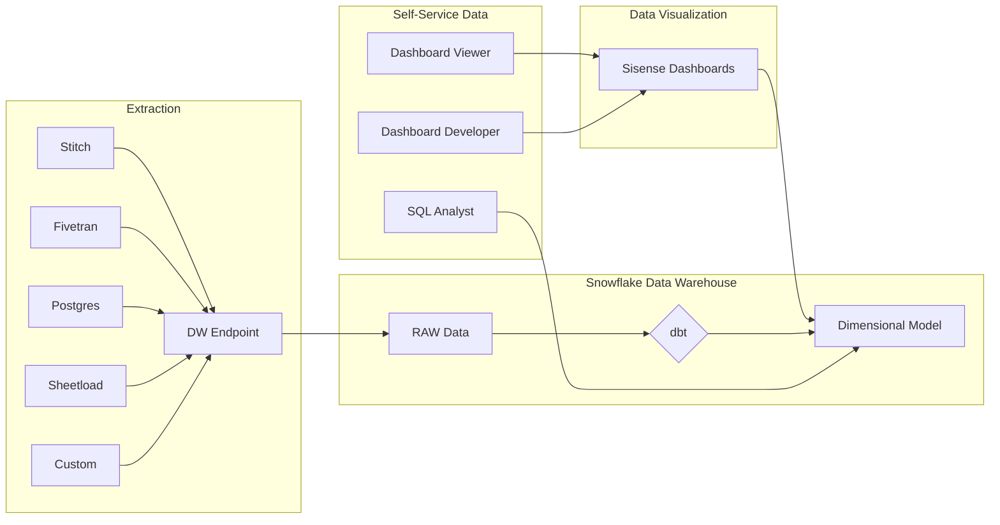

## On this page
{:.no_toc .hidden-md .hidden-lg}

- TOC
{:toc .toc-list-icons .hidden-md .hidden-lg}

---

## Data Development Timeline

--- 

### Fiscal Year 2023

####  FY23 Direction

_Help GitLab Make Better Decisions, Faster_

#### [FY23-Q1 Objectives and Planning Drumbeat](https://gitlab.com/gitlab-data/managers/-/issues/278) 

- [FY23-Q1 Release Roundup]()

--- 

### Fiscal Year 2022

#### FY22 Direction

_Deliver A Trusted Data Foundation To Help GitLab Be A Public Company_

Our FY22 Direction was to accelerate the development of Trusted Data platform components to help GitLab be a [public company](/handbook/being-a-public-company/) by reaching [Level 2 of the Data Capability Model](/handbook/business-technology/data-team/direction/#data-capability-model).

#### [FY22-Q4 Objectives and Planning Drumbeat](https://gitlab.com/gitlab-data/managers/-/issues/264) 

- [FY22-Q4 Release Roundup](https://gitlab.com/gitlab-data/managers/-/issues/277)

#### [FY22-Q3 Objectives](https://gitlab.com/gitlab-data/managers/-/issues/260)

With [GitLab's IPO on 2021-10-14](https://ir.gitlab.com/), FY22-Q3 turned out to be an incredible quarter for all of GitLab. But business carries on and the team delivered several important projects over the quarter, including a new Solutions Architect Dashboard and new Working Group Issue-Prioritization Dashboard for [Customer Success ](/handbook/business-technology/data-team/data-catalog/#customer-success), advancements to [SAFE Data Controls](/handbook/business-technology/data-team/data-catalog/#accessing-a-safe-dashboard), new xActly and Marketo data, and our first predictive model with [Propensity to Expand](/handbook/business-technology/data-team/organization/data-science/#projects).

- [FY22-Q3 Release Roundup](https://gitlab.com/gitlab-data/analytics/-/issues/10090)
- [FY22-Q3 Report Card](https://gitlab.com/gitlab-data/managers/-/issues/274)
- [FY22-Q3 Handbook Jamboree](https://gitlab.com/gitlab-data/analytics/-/issues/9868)
- [FY22-Q3 Data Team Handbook Updates](https://gitlab.com/gitlab-data/analytics/-/issues/9868)
- [FY22-Q3 Release Roundup](https://gitlab.com/gitlab-data/analytics/-/issues/10090)

#### [FY22-Q2 Objectives](https://gitlab.com/gitlab-data/managers/-/issues/249)

FY22-Q2 carried forward and completed several multi-quarter initiatives begun in FY22-Q1, including  adding SaaS Usage Data for Gainsight, shipping a new Company Metrics Dashboard, upgrading Data Access controls across the tech stack, and expanding the GTM Hub. The team continued to build-out GTM components of the Trusted Data Models and the investment in the area started to pay off, with increases in efficiency for Dashboard development and analysis as a result of using standard design patterns. A few additional improvements: rollout of the [Planning Drumbeat](/handbook/business-technology/data-team/how-we-work/planning/), a [Handbook Jamboree](https://gitlab.com/gitlab-data/analytics/-/issues/9441), 3 [Data 3P Parties](https://docs.google.com/document/d/1cUtE75rbXzLCLpq3SDQS3TtsNTEmAAES6UJoZGoP0-Y/edit#heading=h.qq9lf68vhd66) (Pizza, Pet Peeves, and Predictions), and formalizing [Data Development](/handbook/business-technology/data-team/data-development/#data-development-at-gitlab) approaches.

- [FY22-Q2 Data Team Handbook Updates](https://gitlab.com/gitlab-data/analytics/-/issues/8600)
- [FY22-Q2 Retrospective](https://gitlab.com/gitlab-data/managers/-/issues/262)
- [FY22-Q2 Release Roundup](https://gitlab.com/gitlab-data/managers/-/issues/276)

#### [FY22-Q1](https://gitlab.com/gitlab-data/managers/-/issues/248) 

FY22-Q1 was a very important quarter for the Data Team because the team completed many initiatives started earlier in FY21, including the new organization model with [Fusion Teams](/handbook/business-technology/data-team/#data-fusion-teams), the first major release of the Trusted Data solutions and [Sales Funnel Dashboard](/handbook/business-technology/data-team/data-catalog/#sales), integration of Product Usage Data into Gainsight, among other things. The Team successfully delivered on all major commitments in the quarter and helped position itself for success and scale heading into Q2.

- [FY22-Q1 Retrospective](https://gitlab.com/gitlab-data/managers/-/issues/259)
- [FY22-Q1 Report Card](https://gitlab.com/gitlab-data/managers/-/issues/258)
- [FY22-Q1 Handbook Jamboree](https://gitlab.com/gitlab-data/analytics/-/issues/8281)
- [FY22-Q1 Release Roundup](https://gitlab.com/gitlab-data/managers/-/issues/275)

---

### Fiscal Year 2021

####  FY21 Direction

Measured in Quarters, our FY21 short-term direction was to help GitLab be a [public company](/handbook/being-a-public-company/) by reaching [Level 2 of the Data Capability Model](/handbook/business-technology/data-team/direction/#data-capability-model) with support for GitLab's [KPIs](/company/kpis/) and Self-Serve Data coverage of GitLab's two most important business processes: the _lead-to-cash_ cycle and the _product-release-to-adoption_ cycle.

In priority order, the elements of the EDP we sought to build included:

1. An [Enterprise Dimensional Model](/handbook/business-technology/data-team/platform/edw/) to serve as single-source-of-truth for reporting and analysis, including all of our Sisense dashboards and SQL analysis in Snowflake
1. A [Trusted Data Framework](/handbook/business-technology/data-team/platform/#tdf) to help ensure all of our Data Solutions are thoroughly tested, with automated ongoing validations
1. [Data Visualizations](/handbook/business-technology/data-team/platform/periscope/) to support performance analysis, including [KPIs](/company/kpis/).
1. A [Self-Service Data Program](/handbook/business-technology/data-team/direction/self-service/) to allow all GitLab teams to reliably access trusted data without requiring central Data Team involvement. Our three Self-Serve Data options are:
    1. **Dashboard Viewer** - GitLab team members login to the Sisense portal and access pre-built dashboards
       1. **Dashboard Developer** - GitLab team members certified in Sisense login to the Sisense portal and build their own Dashboards sourced from trusted data available in the Enterprise Dimensional Model
       1. **SQL Developer** - any GitLab team member certified in SQL Analysis writes their own SQL to query trusted data from the Enterprise Dimensional Model hosted in Snowflake

