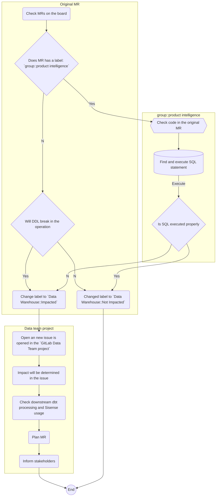

## On this page
{:.no_toc .hidden-md .hidden-lg}

- TOC
{:toc .toc-list-icons .hidden-md .hidden-lg}

{::options parse_block_html="true" /}

---

## <i class="fas fa-users fa-fw color-orange font-awesome" aria-hidden="true"></i>Data Triage

### Triager

The Data team has implemented the following triage schedule to take advantage of native timezones:

| UTC Day   | Data Analyst / Analytics Engineer      | Data Engineer     |
| --------- | ----------------- | ----------------- |
| Sunday    | `@ken_aguilar`  |  no assignment | no assignment |
| Monday    | See below for R&D assignee | `@vedprakash2021` |
| Tuesday   | See below for R&D assignee | `@paul_armstrong` |
| Wednesday | `@michellecooper` | `@rbacovic` |
| Thursday  | `@ken_aguilar`    | `@laddula` |
| Friday    | `@jeanpeguero`    | `@jjstark` |

R&D Fusion team triage schedule:

| UTC Day   | R&D Data Analyst / Analytics Engineer | 
| --------- | ----------------- | 
| Dec 13-14 | `@chrissharp`    | 
| Dec 20-21 | `@ttnguyen28`    | 
| Dec 27-28 | `@snalamaru`    | 
| Jan 3-4   | `@mdrussell`    |
| Jan 10-11 | `@chrissharp`    | 
| Jan 17-18 | `@ttnguyen28`    | 
| Jan 24-25 | `@snalamaru`    | 
| Jan 31-Feb 1 | `@mdrussell`    | 
| Feb 7-8 | `@chrissharp`    | 
| Feb 14-15 | `@ttnguyen28`    | 
| Feb 21-22 | `@snalamaru`    | 
| Feb 28-Mar 1 | `@mdrussell`    | 
| Mar 7-8 | `@chrissharp`    | 
| Mar 14-15 | `@ttnguyen28`    | 
| Mar 21-22 | `@snalamaru`    | 
| Mar 28-29 | `@mdrussell`    | 
| Apr 4-5 | `@chrissharp`    | 
| Apr 11-12 | `@ttnguyen28`    | 
| Apr 18-19 | `@snalamaru`    | 
| Apr 25-26 | `@mdrussell`    | 


A team member who is off, on vacation, or working on a high priority project is responsible for finding coverage and communicating to the team who is taking over their coverage;
this should be updated on the [Data Team's Google Calendar](https://calendar.google.com/calendar?cid=Z2l0bGFiLmNvbV9kN2RsNDU3ZnJyOHA1OHBuM2s2M2VidW84b0Bncm91cC5jYWxlbmRhci5nb29nbGUuY29t). To avoid putting the _Monday workload_ on the same shoulders every week again, the Data Engineers will will rotate/exchange every now and then triage days in good collaboration on an ad-hoc basis.

Having dedicated triagers on the team helps address the bystander affect. The schedule shares clear daily ownership information but is not an on-call position. Through clear ownership, we create room for everyone else on the team to spend most of the day around deep work. The triager is encouraged to plan their day for the kind of work that can be accomplished successfully with this additional demand on time.

Data triagers are the first responders to requests and problems for the Data team.

- The Data Analyst triager is primarily responsible for responding to GitLab team member Requests whether via issue, which posts to **#data-triage**, or directly via slack in **#data**.
- The Data Engineer triager is primarily responsible for resolving problems with our data platform, which will either be in the **#analytics-pipelines** slack channel or on the [DE - Triage Errors board](https://gitlab.com/groups/gitlab-data/-/boards/1917859). Issues created from these errors should use the [DE Triage Errors issue template](https://gitlab.com/gitlab-data/analytics/issues/new?issuable_template=DE%20Triage%20Errors).
    - During the assigned triage day the Data Engineer should be primarily focused on active issues or the issues on the [DE - Triage Errors board](https://gitlab.com/groups/gitlab-data/-/boards/1917859).
- The Data Analyst and Data Engineer triagers are secondarily responsible for platform problems and GitLab team member requests respectively.
- For more information on responsibilities of a triager watch the [Data Engineer triage training session video](https://www.youtube.com/watch?v=0eGpgaQgEGg).

Many issues that come into the data team project from other GitLab team members need additional info and/or context in order to be understood, estimated, and prioritized.
It is the triager's priority to ask those questions and to surface issues sooner, rather than later.

**Note:**
The Data Analyst triager

- is not expected to know the answer to all the questions
- should cc (mention) other team members who are subject matter experts (SME) or [functional DRIs](/handbook/business-technology/data-team/#-team-organization) for their feedback
- should document any issues stumbled upon and help to disseminate knowledge amongst all team members

### How to Complete Data Triage

Create [an issue in the Data Team project](https://gitlab.com/gitlab-data/analytics/issues/new?issue%5Bassignee_id%5D=&issue%5Bmilestone_id%5D=&issuable_template=Data%20Triage). Task and duties are stated in the issue template. 

[Read](/handbook/business-technology/data-team/how-we-work/triage/) the FAQ and common issues.

### Triage Bot

Parts of triage are assisted by the [GitLab Triage Bot](https://gitlab.com/gitlab-org/gitlab-triage), which is setup in the Analytics project. The bot runs every hour and takes actions based on a set of rules defined in [a policies file](https://gitlab.com/gitlab-data/analytics/-/blob/master/.triage-policies.yml). The [GitLab Triage README](https://gitlab.com/gitlab-org/gitlab-triage#defining-a-policy) contains all documentation for the formatting and definition of rules.

Changes to the triage bot policy file should be tested in the MR by running the "dry-run:triage" CI job and inspecting the log output.  This CI job is a dry-run, meaning it will not actually take any actions in the project but will print out what would happen if the policy was actually executed.

### End of day wrap-up

In order to get better and be more efficient in daily triage, we wrap-up the work by the end of the day. The following information is provided by the Data Analyst and Data Engineer each day:
 
- Time Tracking: Listing down the time spent that day on triage and which activities are performed. The general idea is to gain an understanding on where the workload is, in order to optimize those activities. Please list down the work so it is useful for analysis purposes. I.e:
   - 2 hours solving data ingestion issue, for source x
   - 1 hours solving data transformation issue
   - 1 hour on solving a broken Sisense Dashboard
   - 1 hour triaging and re-routing (new) issues
   - 0.5 hour on answering Slack questions
- Groundhog Issues. Issues that occur on a regular basis are annoying and costing us unnecessary time. List down any issue that is popping up time after time. This is in order to find any spots in the current landscape to address.
 
A triage roundup will take place at the end of every milestone by the data leadership team to consolidate the milestones triage efforts. Please bear in mind the purpose of the information provided, to make it useful and improve Triage.

### GitLab.com DB structure changes
1 of the most important data source, that regularly changes, is the GitLab.com database. In order not to break the daily operation, changes to the database needs to be tracked and checked. Any change to the GitLab.com database, is made to the db/structure\.sql file. The Data Team gets notified, by applying labels to the MR, if a change to the db/structure\.sql is made, via the Danger Bot. 

A label `Data Warehouse::Impact Check` is added by the Danger Bot as call to action for the data team. 
- On triage, the Triager will [check](https://gitlab.com/gitlab-org/gitlab/-/merge_requests?scope=all&state=opened&label_name[]=Data%20Warehouse%3A%3AImpact%20Check) for MRs with label `Data Warehouse::Impact Check`.

The following actions are perfored by Data Team Triager:
- Every merge request (`MR`) will be judged
   - If `MR` contains the label `group::product intelligence` along with `Data Warehouse::Impact Check`, there are a couple of checks that need to do:   
      - Because a new metric is added or the existing one is altered, the `Data team` should ensure the change will not break the `Service ping` extraction process 
      - Check new metric `SQL` statement from the original `MR` _(a typical example is [gitlab-org/gitlab/merge_requests/75504](https://gitlab.com/gitlab-org/gitlab/-/merge_requests/75504/diffs#78300240169ab9f44b4dc25f6b6dcb56b3b629c7))_ and execute it on `Snowflake` - usually, it is just a `SELECT` `SQL` statement
   - If the changes to the `SQL` file are not causing a break in the operation, the label will be changed to `Data Warehouse::Not Impacted`.
   - If the changes to the `SQL` file causing a break in the operation:
      - The Label will be changed to `Data Warehouse::Impacted`
      - A new issue is opened in the `GitLab Data Team project`, assigned to the correct DRI and linked to the original MR. 
      - Impact will be determined in the issue.
      - Any MRs will be created to overcome loading issues, downstream dbt processing and Sisense usage.
      - According to the Merge of the GitLab.com MR, merge will be plannend.
      - All stakeholders will be informed.

#### Graphical representation of the process

<details><summary>Click to expand graphical representation of the process</summary>



</details>


Determination matrix: **

| Change | Call to action needed* |
| ------ | ------ |
| New table created | :x: |
| Table deleted | :white_check_mark: |
| Table renamed | :white_check_mark: | 
| Field added | :x: |
| Field removed | :white_check_mark: |
| Field name altered | :white_check_mark: |
| Field datatype altered | :question:|
| Constraints changed | :question: |

*We are not loading all the tables and columns by default. Thus if new tables or columns are added, we only will load these tables if there is a specific business request. Any change to the current structure that causes a potential break of operation needs to be determined. 

** Determination matrix is not extensive. Every MR should be checked carefully.  

### GitLab Postgres Database not accessible
In a scenario when gitlab cloned Postgres database is not accessible, the airflow task log is showing below error. 
```
sqlalchemy.exc.OperationalError: (psycopg2.OperationalError) FATAL:  the database system is starting up\n
b'FATAL:  the database system is starting up\n'
```
Follow the steps mentioned below. 

1. Open an issue using the DE Triage template.
2. Pause all the gitlab.com DAG named `gitlab_com_data_reconciliation_extract_load` , `gitlab_com_db_extract`,`gitlab_com_db_incremental_backfill`,`gitlab_com_scd_db_sync`.  The reason behind is to keep the alerting down and not use unwanted resources.
3. Look into the alert channel and search for the “GitLab Job has failed” to locate the alert. The sample alert will have content like below.
```
Firing 1 - GitLab Job has failed
The GitLab job "clone" resource "zlonk.datalytics.dailyx" has failed.
:chart: View Prometheus graph:label: Labels:
 Alertname: JobFailed
 Alert_type: symptom
 Env: gprd
 Environment: gprd
 Fqdn: blackbox-01-inf-gprd.c.gitlab-production.internal
 Job: clone
 Monitor: default
 Provider: gcp
 Region: us-east
 Resource: zlonk.datalytics.dailyx
 Severity: s3
 Shard: default
 Stage: main
 Tier: db
 Type: zlonk.postgres
Show less
```
4. Reach out to `@sre-oncall` slack handle to look into the issue also raise an incident request using [incident declare](https://about.gitlab.com/handbook/engineering/infrastructure/incident-management/#reporting-an-incident). This will create a production incident issue for the SRE on-call team to act upon also `cc @gitlab-data/engineers` for broader visibility of the incident. 
5. Link the Infra issue with the Triage Issue raised. 
6. Once the issue is resolved or confirmed from the `@sre-oncall` person or someone from the DBRE team, try re-running one of the failed tasks by clearing one alone to validate the stability of the connection.
7. For DAG `gitlab_com_scd_db_sync` , `gitlab_com_data_reconciliation_extract_load` and `gitlab_com_db_incremental_backfill` clear failed task so that it get picked up for run as these task runs only once in 24 hour window.In case we have missed the whole schedule, we re-trigger the DAG itself. 
8. If DBT runs for the day miss the source refreshes, then post notification in the #data channel for the delay in source freshness using triage template.

### Automated service ping issue

In a situation when [Service ping](https://about.gitlab.com/handbook/business-technology/data-team/data-catalog/saas-service-ping-automation/#service-ping-overview) fail while it generates metrics, we should be informed either via `Trusted data dashboard` or `Airflow` log - generally, the error log is stored in `RAW.SAAS_USAGE_PING.INSTANCE_SQL_ERRORS` table. Follow the instructions from the link [error-handling-for-sql-based-service-ping](https://about.gitlab.com/handbook/business-technology/data-team/data-catalog/saas-service-ping-automation/#error-handling-for-sql-based-service-ping) in order to fix the issue.

## Zuora Stitch Integration single or set of table-level reset
It could happen, in any case, to [reset the table](https://www.stitchdata.com/docs/troubleshooting/destinations/destination-loading-error-reference#snowflake-error-reference) in Stitch for the Zuora data pipeline, in order to backfill a table completely (i.e. new columns added to in the source, technical error etc).
Currently, Zuora Stitch integration does not provide [table level reset](https://www.stitchdata.com/docs/integrations/saas/zuora#zuora-feature-snapshot), and thus we have to perform a reset of all the tables in the integration. This will result in extra costs and risks.

To this below steps can be followed using which we have successfully done the table level reset. 
In this example, we have used Zuora `subscription` table, but this could be applied to any other table in the Stitch Zuora data pipeline.

#### Step 1:- Rename existing table with the date suffix to identity the backup, recommended format YYYYMMDD

    ALTER TABLE "RAW"."ZUORA_STITCH"."SUBSCRIPTION" RENAME TO "RAW"."ZUORA_STITCH"."SUBSCRIPTION_20210903";
    
#### Step 2:- Pause the regular integration.


#### Step 3:- Create a new integration Zuora-Subscription in Stitch.
While setting it up setup the extraction frequency to 30 minutes and date from extraction to 1st Jan 2012 to ensure all data gets pulled through.


#### Step 4:- Run the newly created integration..
Try running the newly created integration manually and wait for it to complete. Once completed then and it shows on the home page successfully. Once done Pause the newly integration task because we don't want any misaligned data while we follow the next steps.

#### Step 5:- Check for the records.
In the newly created table `"RAW"."ZUORASUBSCRIPTION"."SUBSCRIPTION"` cross-check the number of rows showing as loaded in the integration UI in stitch and loaded in the table is same.

#### Step 6:- Create the table in the main schema.
Move the newly loaded data to `ZUORA_STITCH` schema because the new integration will create the table in the `ZUORASUBSCRIPTION` as stated above in the image. 

    CREATE TABLE "RAW"."ZUORA_STITCH"."SUBSCRIPTION" CLONE  "RAW"."ZUORASUBSCRIPTION"."SUBSCRIPTION";
**Note:** Check for the primary key present in the table post clone or not if not check for the primary key in the [link](https://www.stitchdata.com/docs/integrations/saas/zuora#subscription) and add the constraints on those columns. 

#### Step 7:- Make records count check to ensure we don't have fewer records in the new table. 
    select count(*) from "RAW"."ZUORA_STITCH"."SUBSCRIPTION_20210903" where deleted = 'FALSE';
    select count(*) from "RAW"."ZUORA_STITCH"."SUBSCRIPTION" ;

#### Step 8:- Drop the new schema 
    DROP SCHEMA "RAW"."ZUORASUBSCRIPTION"  CASCADE ;

### Step 9:- Delete temp Zuora-Subscription integration and enable regular integration
### Step 10:- Run regular integration and validate
This is to ensure that error observed previously to the table is gone and data is getting populated in the table.
Check on duplicate ids due to 2 different extractors, to ensure the data is getting populated in the table correctly.

    select id, count(*) from "RAW"."ZUORA_STITCH"."SUBSCRIPTION"
    group by id
    having count(*) > 1
**Note** Refer to the [MR](https://gitlab.com/gitlab-data/analytics/-/issues/10065#note_668365681) for more information.

## Triage FAQ
**Is Data Triage 24/7 support or shift where we need to support it for 24 hours?** <br>
We need to work in our normal working hour perform the list of task mentioned for the triage day in the [Triage Template](https://gitlab.com/gitlab-data/analytics/-/issues/new?issuable_template=Data%20Triage&issue%5Bassignee_id%5D=&issue%5Bmilestone_id%5D=)

**If any issue is found do we directly jump to fix it in production or take it as part of the incident and solve it within the defined time?** <br>
On the Triage day the data team member present will look for all the failures, questions or errors in:
- The Slack-channels; #data-prom-alerts #analytics-pipelines and #data
- Newly added [issues](https://gitlab.com/groups/gitlab-data/-/boards/1917859?&label_name[]=Priority%3A%3A1-Ops&label_name[]=Triage)
- The TDF dashboard in [Sisense](https://app.periscopedata.com/app/gitlab/756199/Trusted-Data-Dashboard)

It includes all the failures since the last person did sign off and will create an issue for all the failures since then till the person signs off.
If any data pipeline has broken and there is expected to be a delay in getting data loaded or refreshed. The concerned team has to be notified using the [Triage Template](https://gitlab.com/gitlab-data/analytics/-/issues/new?

**Is there ETA for a different kind of issue?** <br>
If the pipeline is broken it needs to be fixed, currently we are working on defining SLO's for our data assets. For our data extraction pipelines, there is a comprehensive overview [here](/handbook/business-ops/data-team/platform/#extract-and-load/).

**If I work my normal hours on triage day i.e. till 11 AM of US timeline. What happens when the pipeline breaks post my normal hours and there is a delay in data availability?** <br>
Yes, the benefit of our presence is that we have a wide overage of hours. If the person who is on Triage is ahead of US timelines, we have an advantage of solving issues timely. The downside is that we have not full coverage that day for US timelines. This is an attention point towards the future. 
 
## Triage common issues
In this section we state down common issues and resolutions

| **Airflow Task failure!** |
| ------------------------- |
| DAG `gitlab_com_db_extract` <br> Task `gitlab-com-dbt-incremental-source-freshness`  <br> |
| Background: This extract relies on a copy (replication) database of the GitLab.com environment. Its high likely that this is the root cause of a high replication [lag](https://prometheus-db.gprd.gitlab.net/graph?g0.expr=(pg_replication_lag)%20and%20on(instance)%20(pg_replication_is_replica%7Btype%3D~%22postgres-(archive)%22%7D%20%3D%3D%201)&g0.tab=0&g0.stacked=0&g0.range_input=1w&g1.expr=pg_long_running_transactions_age_in_seconds%7Btype%3D~%22postgres-(archive)%22%7D&g1.tab=0&g1.stacked=0&g1.range_input=6h). |
| More information of the setup [here](https://gitlab.com/gitlab-data/analytics/-/issues/8283#note_537332709).  |
| Possible steps, resolution and actions: - Check for replication lag <br> - Pause the DAG if needed <br> - Check for data gaps <br> - Perform backfilling <br> - Reschedule the DAG  |
| Note: The GitLab.com data source is a very important data source and commonly used. Please inform an update business stakeholders accordingly. |

| **Sheetload - Column '#REF!' is not recognised** |
| ------------------------- |
| DAG `sheetload` <br> Task `dbt-sheetload`  <br> |
| Background: This is an issue with Google sheets when data is being imported from a second sheet using Google sheets' import function. Occasionally the connections between the sheets stop working and the sheet needs to be refreshed. |
| More information of the setup [here](https://about.gitlab.com/handbook/business-technology/data-team/platform/pipelines/#sheetload).  |
| Possible steps, resolution and actions: <br> - In general you should just need to open the Google sheet which is failing and confirm the data has been re-populated. <br> - If you do not have access to the sheet contact @gitlab-data/engineers and confirm if anyone else does. |


### Useful regex 

##### Match lines where these terms do not exist 

`^(?!.*(<First term to find>|<Second term to find>)).*$`

e.g. For cleaning up Airflow logs: 

`^(?!.*(Failure in test|Database error)).*$`

