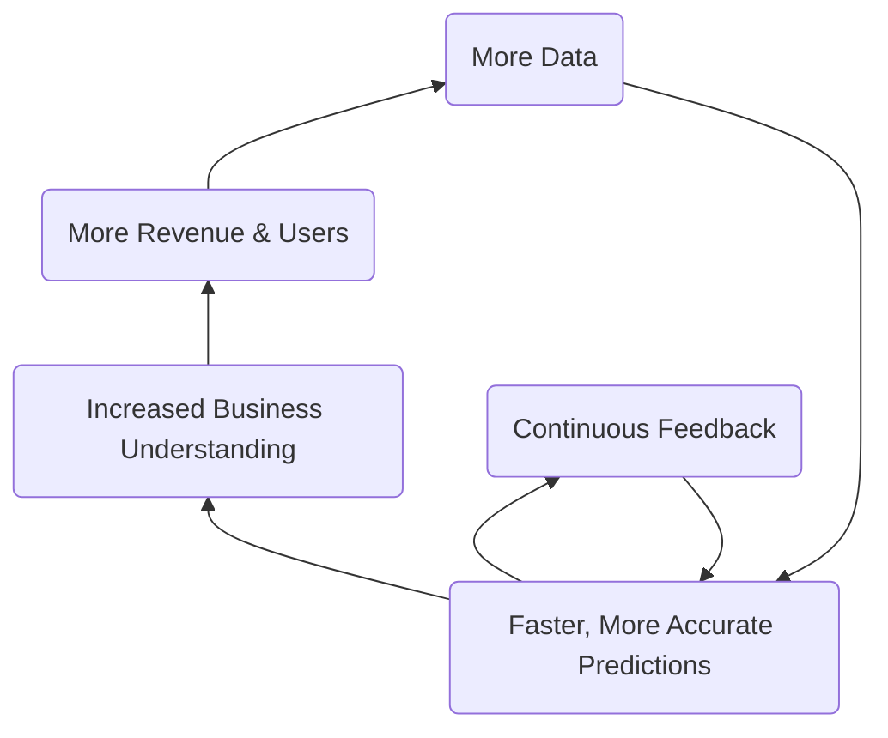
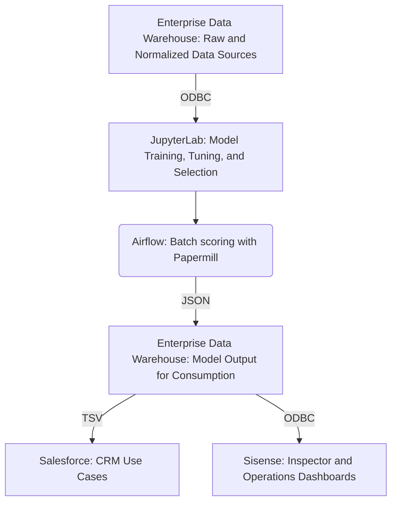

## On this page 
{:.no_toc .hidden-md .hidden-lg}

- TOC
{:toc .toc-list-icons .hidden-md .hidden-lg}

{::options parse_block_html="true" /}

----

# Data Science at GitLab 

The mission of the data science team is to facilitate **_making better decisions faster_** using **_predictive analytics_**.

## Handbook First

At GitLab we are [Handbook First](https://about.gitlab.com/handbook/handbook-usage/#why-handbook-first) and promote this concept by ensuring the data science team page remains updated with the most accurate information regarding data science objectives, processes, and projects. We also strive to keep the handbook updated with useful resources and our data science toolset. 

## Data Science Responsibilities 

Of the [Data Team's Responsibilities](https://about.gitlab.com/handbook/business-technology/data-team/#responsibilities), the Data Science Team is **directly responsible** for:

- Delivering _descriptive_, _predictive_, and _prescriptive_ solutions that promote and improve [Gitlab's KPIs](https://about.gitlab.com/company/kpis/)
- Being a **_Center of Excellence_** for predictive analytics and supporting other teams in their data science endeavors 
- Developing tooling, processes, and best practices for data science and machine learning

Additionally, the Data Science Team **supports** the following responsibilities:

- With **Data Leadership**:
  - Scoping and executing a data science strategy that directly impacts business KPIs
  - Broadcasting regular updates about deliverables, ongoing initiatives, and roadmap
- With the [**Data Engineering Team**](https://about.gitlab.com/handbook/business-technology/data-team/organization/engineering/):
  - Defining and championing data quality best practices and programs for GitLab data systems
  - Deploying data science models, ensuring data quality and integrity, shaping datasets to be compatible with machine learning, and brining new datasets online
  - Creating data science pipelines that work natively with the Gitlab platform and the Data Team tech stack
- With the [**Data Analytics Team**](https://about.gitlab.com/handbook/business-technology/data-team/organization/analytics/):
  - Incorpating data science into analytics initiatives
  - Designing dashboard to enhance the value and impact of the data science models

## How We Work

The Data Science flywheel is focused on improving business efficiency and KPIs by creating accurate and reliable predictions. This is done in collaboration with [Functional Analytics Center of Excellence](https://about.gitlab.com/handbook/business-technology/data-team/functional-analytics-center-of-excellence/) to ensure the most relevant datasources are utilized, business objectives are met, and results can be quantifiably measured. As business needs change, and as the user-base grows, this flywheel approach will allow the data science team to quickly adapt, iterate, and improve machine learning models.

## What is Data Science?

Check out this brief overview of what data science is at Gitlab:

<!-- blank line -->
<figure class="video_container">
  <iframe src="https://www.youtube.com/embed/wRbNExL0hv8" frameborder="0" allowfullscreen="true"> </iframe>
</figure>
<!-- blank line -->

([Corresponding slides](https://docs.google.com/presentation/d/1Y-V6bZ5w8Ms5yfMiuYCYZs9ald7Q5MxydYhSh9DWwwQ/edit?usp=sharing))

### Data Science Tools at Gitlab

- **[Pre-configured JuypterLab Image](https://gitlab.com/gitlab-data/data-science)**: The data science team uses JupyterLab pre-configured with common python modules (pandas, numpy, etc.), native Snowflake connectivity, and git support. Working from a common framework allows us to create models and derive insights faster. This setup is freely available for anyone to use. Check out our [Jupyter Guide](/handbook/business-technology/data-team/platform/jupyter-guide/) for additional information.
- **[gitlabds python tools](https://gitlab.com/gitlab-data/gitlabds/)**: Functions to help automate common data prep (dummy coding, outlier detection, variable reduction, etc.) and modeling tasks (i.e. evaluating model performance). Install directly via [pypi](https://pypi.org/project/gitlabds/) (`pip install gitlabds`), or use as part of the above JupyterLab image.
- **[Modeling Templates](https://gitlab.com/gitlab-data/data-science/-/tree/main/templates)**: The data science team has created modeling templates to allow you to easily start building predictive models without writing python code from scratch. To enable these templates, follow the instructions on the [Jupyter Guide](/handbook/business-technology/data-team/platform/jupyter-guide/#enabling-jupyter-templates).

### Common Data Science Terms 

- **Algorithm** -  sequence of computer-implementable instructions used to solve specific problem
- **Classification** - process of predicting a category for each observation. For example, determining if a picture is of a cat or a dog. 
- **Clustering** - process of finding natural groupings of observations in dataset. Often used for segmenation of users or customers.
- **Data Science (DS)** - interdisciplinary field that uses computer science, statistical techniques and domain expertise to extract insights from data
- **Feature** - single column in dataset that can be used for analysis, such as country or age. Also refered to as variables or attributes 
- **Feature Engineering** -  process of selecting, combining and transforming data into features that can be used by machine learning algorithms 
- **Imputation** - process of replacing missing or incorrect data with statistical "best guesses" of the actual values
- **Machine Learning (ML)** - use and development of algorithms without being explicitly programmed to determine patterns in data
- **Model** - A complex set of mathematical formulas that generates predictions
- **Regression** - A statistical method for predicting an outcome. For example, predicting a person's income, or how likely a customer is to churn
- **Training** -  Applying an algorithm to data to generate a model
- **Test Dataset** - Deliberately excluding some observations from training the model so they can be used to test how well the model predicts  
- **Weight** - numerical value assigned to feature that determines it's strength

## Projects

| Name | Maturity | Objective | Sponsor | Status | Deliverables |
| ----- | -----| -----| ----- | ----- | ----- |
| [Propensity to Expand](https://gitlab.com/gitlab-data/propensity-to-expand) (PtE) | Complete | Determine which paid accounts are likely to expand their ARR by > 10% in next 3 months | Sales | Last update: FY23-Q1, Next update: FY23-Q2 | [Exec Summary](https://docs.google.com/presentation/d/1Aaf2HzFYrYDPgrZKDHxS9gzep4LHGMlwF5SxYs-her0/edit#slide=id.gf528ae95ed_0_0), [PtE Inspector](https://app.periscopedata.com/app/gitlab:safe-dashboard/951374/PtE-Inspector), [PtE Results Dashboard](https://app.periscopedata.com/app/gitlab:safe-dashboard/958412/PtE-Results), [Epic](https://gitlab.com/groups/gitlab-data/-/epics/340) |
| [Propensity to Contract](https://gitlab.com/gitlab-data/propensity-to-contract) (PtC) | Viable | Determine which paid accounts are likely to reduce their ARR by > 10% in next 3 months | Customer Success | Last update:  FY23-Q1, Next update: FY23-Q2 |[PtC slide deck](https://docs.google.com/presentation/d/1Gd-GhHhWHHc1N8zJtLGKtNF4W2T9d82Sv_fZ_j2236U/edit#slide=id.g29a70c6c35_0_68), [PtC Inspector](https://app.periscopedata.com/app/gitlab/990981/PtC-Inspector), [PtC Results Dashboard](https://app.periscopedata.com/app/gitlab:safe-dashboard/971930/PtC-Results-2021-12-to-2022-02), [Epic](https://gitlab.com/groups/gitlab-data/-/epics/382)|
| [Namespace Segmentation](https://gitlab.com/gitlab-data/namespace-segmentation) | In progress | Define groups for paid and free SaaS namespaces based on its product usage and impact on conversions | Growth | Started in FY23-Q1 | [Epic](https://gitlab.com/groups/gitlab-data/-/epics/488) | 
| [Propensity to First Purchase](https://gitlab.com/gitlab-data/propensity-to-first-purchase) | Planned | Identify which free accounts are likely to become paid accounts | Growth | Start in FY23-Q1 | | 
| Golden Journey | Planned | Identify optimal paths to increasing platform usage and adoption | Growth |  Start in FY23-Q2 | | 
| Stage Adoption MRI | Planned | - | | Start in FY23-Q2 | | 
| Product Usage Event | Planned | - | | Start in FY23-Q3 | |
| Marketing Lead Scoring | Planned | Identify leads most likely to convert to closed won oppertunities | Marketing | Start in FY23-Q4 | |  
| Expansion Predicted ARR | Unplanned | Predict expansion ARR dollar amount | Sales | | |  
| Community Sentiment Analysis | Unplanned | - | Product | | | 
| Feature $ARR Uplift Prediction | Unplanned | Attribute incremental ARR lift based on feature adoption | Product | | | 
| GitLab MLOps Product Development | Unplanned | - | Product (Taylor) | | | 

### Maturity
Maturity of data science projects is similar to the [Gitlab product maturity model](https://about.gitlab.com/direction/maturity/):
- **Unplanned**: Not implemented, and not yet on our roadmap.
- **Planned**: Not implemented, but on our roadmap; executive sponsor attached to project.
- **In Progress**: Plan established, developing model.
- **Viable**: Available, but not fully productionalized yet; scores and insights manually generated; low adoption outside of immediate stakeholders.
- **Complete**: Fully implemented into Data Team cloud production infrastructure; increasing adoption of corresponding dashboards and scores within the intended organization.
- **Optimized**: Fine-tuned, fully automated, and self-service; continuous model monitoring and scoring; high adoption within intended organization.

### Project Slack Channels

- [#data-propensity-projects](https://gitlab.slack.com/archives/C02172C5KH7): For PtE & PtC
- [#namespace-segmentation](https://app.slack.com/client/T02592416/C0341FPNB1C): For Namespace Segmentation 

### Project Structure 

The Data Science Team follows [Cross-Industry standard process for data mining (CRISP-DM)](https://en.wikipedia.org/wiki/Cross-industry_standard_process_for_data_mining), which consists of 6 iterative phases:

##### Business Understanding 

The first step is to understand the business needs of the stakeholders and the success criteria of the project. This phase includes requirements gathering, stakeholders interviews, project defintion, product user stories, and potential use cases. This phase is closely aligned with GitLab's [OKRs](https://about.gitlab.com/company/okrs/) and company's value - [Iteration](/handbook/values/#iteration)

##### Data Understanding 

Data understanding is closely aligned with business understanding. It requires determining the breadth and scope of existing relevant datasources. In this phase, data scientists work closely with data engineers and data analysts to determine where gaps may exist and to identify any data discrepancies or risks. If there is a need to bring external data, a request should be raised in this phase. 

##### Data Preparation 

After defining business needs and data sources, it is time to dive into the data! This phase requires conducting data quality checks and exploratory data analysis (EDA). At this stage, data scientists are developing a greater understanding of data and how different datapoints relate to solving the business need. This will be very useful in the next phase - modeling.

##### Modeling 

Modeling refers process by which various machine learning techniques are used to find a solution that addresses the business need. This often takes the form of predicting why/when/how future instances of a business outcome will occur (e.g. which customers are likely to churn in the next 6 months?). This is achieved by looking at the complex mathematical relationships between the data and the outcome. Often, this process is referred to as "training the model."

##### Evaluation 

Performance is generally measured by how _accurate_, _powerful_, and _explainable_ the model is. Findings are presented to the stakeholders for feedback. This phase is strongly aligned with the GitLabs values of [Iteration](/handbook/values/#iteration) Incorporating feedback, data scientists iterate over _Modeling_ and _Evalution_ long as business goal is met.

##### Deployment

Once the model has been approved by the stakeholders, it then gets deployed into the data science production pipeline. This process automatically updates, generates predictions, and monitors the model on a regular cadence.  

## Data Science Platform

Our current platform consists of:
- the [Enterprise Data Warehouse](https://about.gitlab.com/handbook/business-technology/data-team/platform/) for storing raw and normalized source data as well as final model output for consumption by downstream consumers
- JupyterLab for model training, tuning, and selection

Over time we plan to dogfood as many components of the GitLab MLOps Stage as possible, leading to fully automated productionalized pipelines. However,  the [MLOps Stage is currently incubating](https://about.gitlab.com/handbook/engineering/incubation/mlops/) and is not yet ready for our use. Our immediate next step is to automate `Current State Data Flows` using a combination of python and airflow.

### Current State Data Flows

**Legend**

- TSV = [tab-separated value file](https://fileinfo.com/extension/tsv)
- ODBC = [Open Database Connectivity](https://en.wikipedia.org/wiki/Open_Database_Connectivity)

## Useful Data Science & Machine Learning Resources

- **_Python Data Science Handbook_** by Jake VanderPlas: Great for beginngers looking to learn python and dip their toes into data science.
- **_Python Machine Learning_** by Sebastian Raschka & Vahid Mirjalili: More advanced topics with the assumption of a basic level of python.
- **_The Elements of Stastical Learning, Data Mining, Inference, and Prediction_** by Trevor Hastie, Robert Tibshirani, & Jerome Friedman: Great deep dive into all the statistics and logic behind many of the commonly used predictive techniques. Can be pretty stats/math heavy at time.
