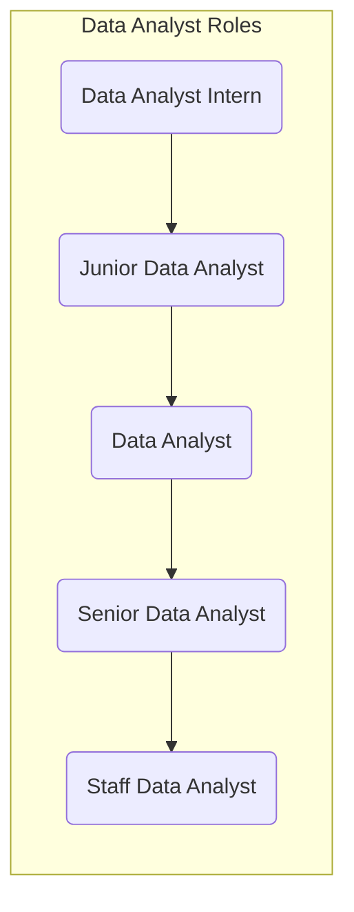
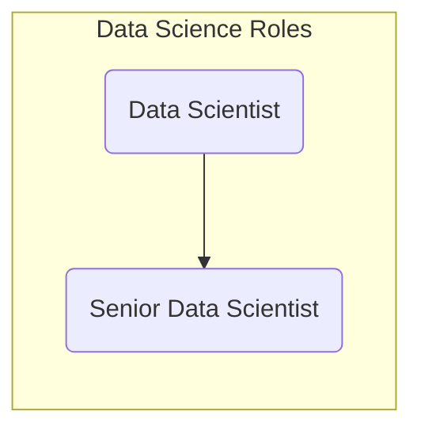
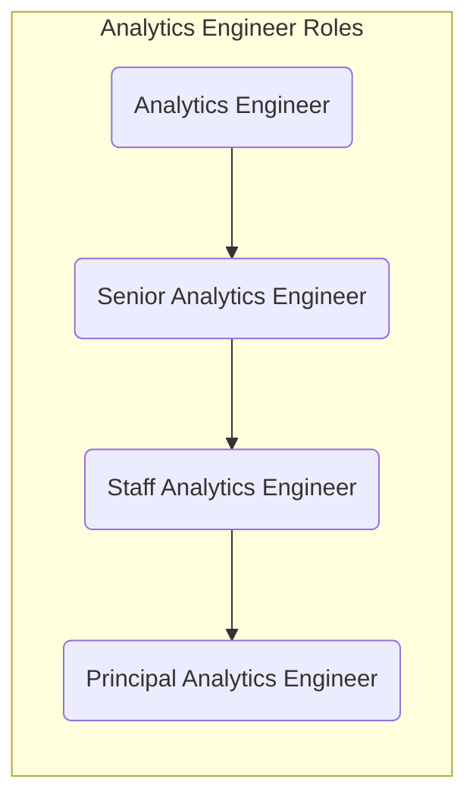
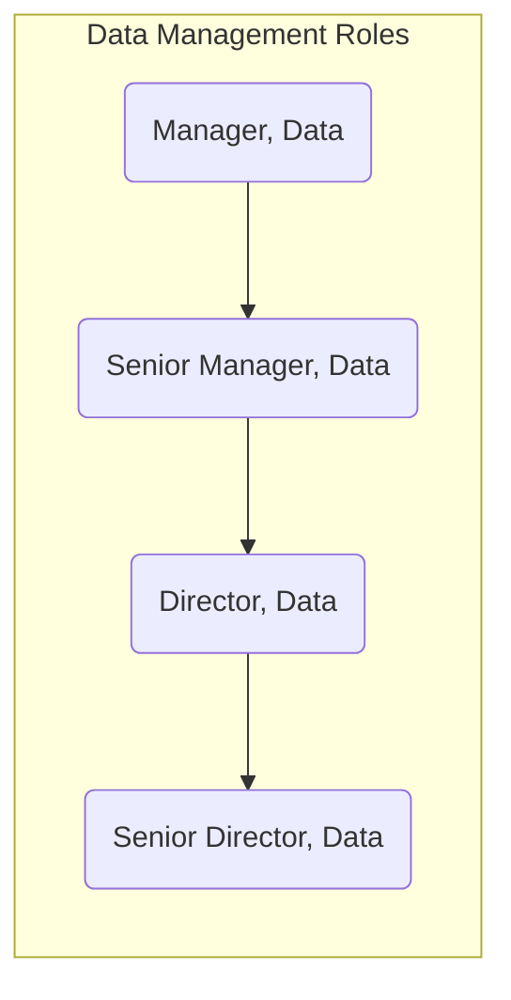

## On this page
{:.no_toc .hidden-md .hidden-lg}

- TOC
{:toc .toc-list-icons .hidden-md .hidden-lg}

{::options parse_block_html="true" /}

---

## Data Team Organization

The Data Team is organized into centers of technical and subject matter excellence, complemented by __Business-Focused__ and __Business-Involved__ teams responsible for delivering data solutions that we call [**Fusion Teams**](/handbook/business-technology/data-team/#data-fusion-teams). Complementing the Data Fusion Teams by providing a high-performance compute and storage layer, in addition to data sources, pipelines, and analytics tooling is the [Data Platform & Engineering Team](https://about.gitlab.com/handbook/business-technology/data-team/#the-data-platform--engineering-team). And complemeting the Data Teams bu providing advanced analytics is the [Data Science Team](/handbook/business-technology/data-team/#the-data-science-team). Read more about how the team is organized and how we work with the rest of GitLab in [How Data Works at GitLab](/handbook/business-technology/data-team/#how-data-works-at-gitlab).

### Data & Analytics Demos

Data & Analytics Demos are a great way for everyone involved in the Data Program to share progress, innovation, collaborate, and just have fun. Data & Analytics Demos are [held every Thursday](https://calendar.google.com/event?action=TEMPLATE&tmeid=Z2Zibm5rbWZvamptajYwOGs4dWI2ODk0c2tfMjAyMTA5MTZUMTUwMDAwWiBnaXRsYWIuY29tX2Q3ZGw0NTdmcnI4cDU4cG4zazYzZWJ1bzhvQGc&tmsrc=gitlab.com_d7dl457frr8p58pn3k63ebuo8o%40group.calendar.google.com&scp=ALL) and recordings are posted to the [GitLab Unfildered Data Team playlist](https://www.youtube.com/playlist?list=PL05JrBw4t0KrRVTZY33WEHv8SjlA_-keI). 

### Data Program Recruiting Video

We've put together a short [GitLab Data Recruiting](https://youtu.be/4DlwsBIPxUw) video to say "Hi" and give you some insight into how we work and what we work on. Enjoy!

## Data Fusion Team Organization

Data Fusion Teams are composed of team members from across the business and the Data Team. Read about the current [Data Fusion Teams](/handbook/business-technology/data-team/#data-fusion-teams) on our front page.

```mermaid
classDiagram
   GTM <|-- Platform
        GTM : + Business Partner
        GTM : + Function Analyst
        GTM : + Data Analyst
        GTM : + Analytics Engineer
    R_and_D <|-- Platform
        R_and_D : + Business Partner
        R_and_D : + Function Analyst
        R_and_D : + Data Analyst
        R_and_D : + Analytics Engineer
    G_and_A <|-- Platform
        G_and_A : + Business Partner
        G_and_A : + Function Analyst
        G_and_A : + Data Analyst
        G_and_A : + Analytics Engineer
    Platform : +Analytics Engineer
    Platform : +Data Engineer
  ```

### Fusion Team Assignments

| **GTM** | **R&D** | **G&A** |
| ----- | ----- | ----- |
| `@iweeks` _Lead/DRI_ | `@mlaanen` _Lead/DRI_  | `@iweeks` _DRI_                 | 
| `@ken_aguilar`       | `@snalamaru`           | `@pempey` _Lead_                |
| `@jeanpeguero`       | `@chrissharp`          | `@jjstark` Data Platform Team [Stable Counterpart](https://about.gitlab.com/handbook/leadership/#stable-counterparts)  |
| `@michellecooper`    | `@rbacovic` Data Platform Team [Stable Counterpart](https://about.gitlab.com/handbook/leadership/#stable-counterparts)  |                                 |
| `@paul_armstrong` Data Platform Team [Stable Counterpart](https://about.gitlab.com/handbook/leadership/#stable-counterparts) | | |  

#### Data Platform Team Stable Counterpart

Following the GitLab [Stable Counterpart](https://about.gitlab.com/handbook/leadership/#stable-counterparts) principles, every **Fusion Team** have a **Data Platform Team** Stable Counterpart assigned. The Data Platform Stable Counterpart divides their time, work and priorities between the Data Platform Team and Fusion Team (general an average of 50% each). The Stable Counterpart is aware of the direction and priorities of the Fusion Team and when needed brought into discussion with the Data Platform Team. I.e. when there is a bigger demand than the Stable Counterpart can handle in the assigned availability or architectural direction needs to change. The Stable Counterpart recognize, flags and address this with the applicable stakeholders (in general the Lead/DRI of the Data Platform Team and the Fusion Team). 
						
### Fusion Team Operations

Critical to successful Data Fusion Teams are the following elements:

1. Regular and transparent Engagement with Business Partners and Data Champions through the [Data for GTM Series](https://docs.google.com/document/d/1m-SygSyUqEcfd276_Jb1ZARMXIb4Z8clDF0eoxmudyw/edit#) and [Data for R&D Series](https://docs.google.com/document/d/1CRIGdNATvRAuBsYnhpEfOJ6C64B7j8hPAI0g5C8EdlU/edit#).
1. Planning our Work through the [Data Team Planning Drumbeat](/handbook/business-technology/data-team/how-we-work/planning/)
1. Performing a regular CSAT survey to provide feedback to the Data Fusion Team towards the goal of continuous improvement

We encourage our stakeholders to follow along with our issue boards to understand the scope of work:

1. [GTM](https://gitlab.com/gitlab-data/analytics/-/issues?label_name%5B%5D=Team%3A%3AGTM)
2. [R&D](https://gitlab.com/gitlab-data/analytics/-/issues?label_name%5B%5D=Team%3A%3AR%26D)
3. G&A: [People](https://gitlab.com/groups/gitlab-data/-/boards/1435002?&label_name[]=People), Engineering Analytics `coming soon`
4. [Platform](https://gitlab.com/gitlab-data/analytics/-/issues?label_name%5B%5D=Team%3A%3AData+Platform)

## Data Roles and Career Development

### [Data Engineering](https://about.gitlab.com/job-families/finance/data-engineer)

```mermaid
  graph LR;
  subgraph Data Engineering Roles
    supe:de(Data Engineer)-->supe:sde(Senior Data Engineer);
    supe:sde(Senior Data Engineer)-->supe:fde(Staff Data Engineer);
  end

  click supe:de "https://about.gitlab.com/job-families/finance/data-engineer#data-engineer";
  click supe:sde "https://about.gitlab.com/job-families/finance/data-engineer#senior-data-engineer";
  click supe:fde "https://about.gitlab.com/job-families/finance/data-management#staff-data-engineer";
```

### [Data Analysis](https://about.gitlab.com/job-families/finance/data-analyst)



### [Data Science](https://about.gitlab.com/job-families/finance/data-scientist)



### [Analytics Engineering](https://about.gitlab.com/job-families/finance/analytics-engineer)



### [Data Management](https://about.gitlab.com/job-families/finance/manager-data)


