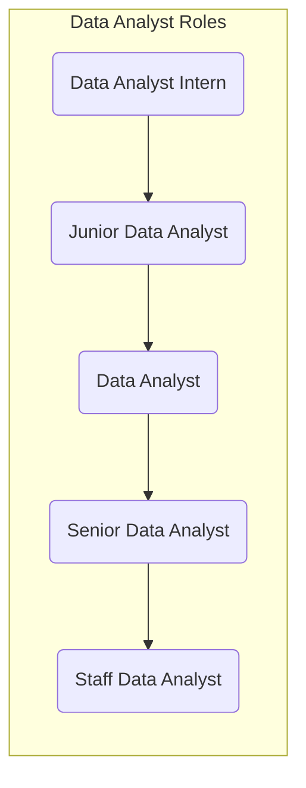
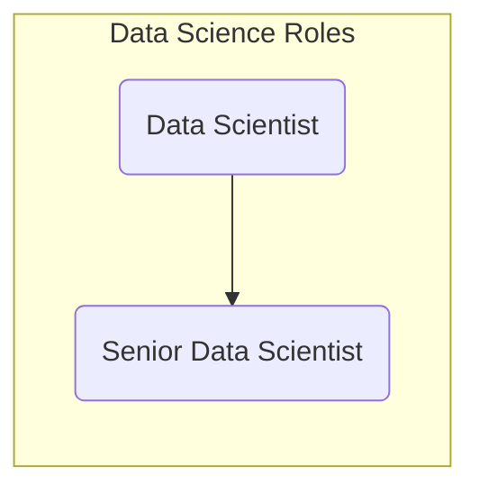
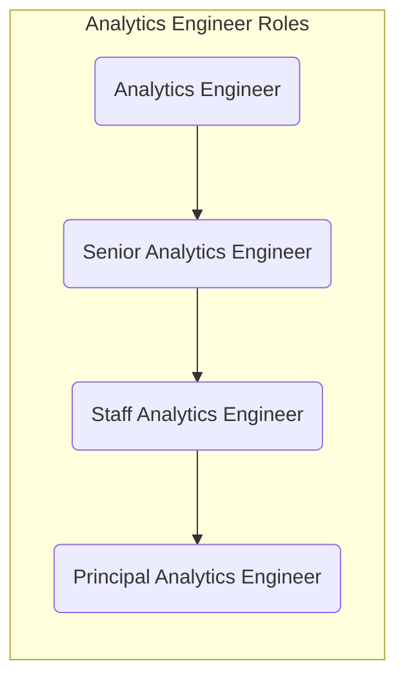
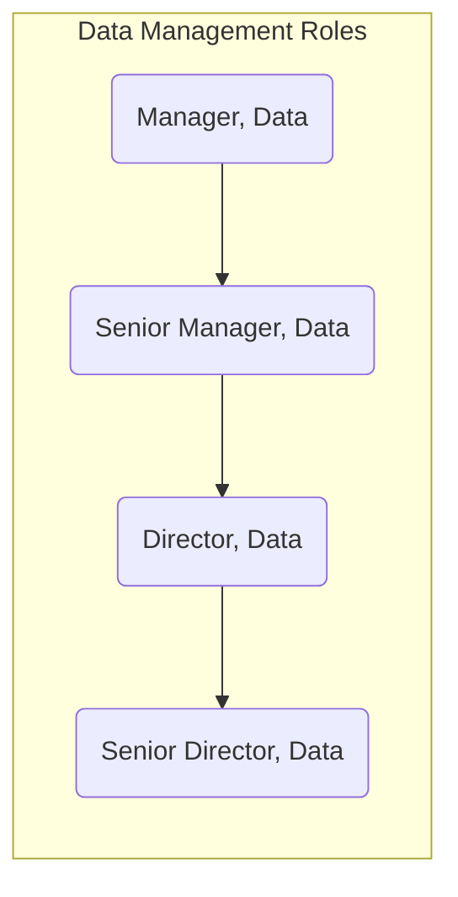

## On this page
{:.no_toc .hidden-md .hidden-lg}

- TOC
{:toc .toc-list-icons .hidden-md .hidden-lg}

{::options parse_block_html="true" /}

---

# Data Team Organization

The Data Team Organization model is guided by three primary business needs:

1. The need for **bespoke data solutions** unique to the GitLab business.
1. The need for **high-performance and reliable data storage and compute** platform to support distributed analyst teams.
1. The need for centers of excellence for **data technologies** and **advanced analytics**.
1. The need for flexible data solutions driven by varying **urgency and quality** requirements.

Based on these needs, the Data Team is organized in the following way:

1. **[Data Fusion Teams](/handbook/business-technology/data-team/#data-fusion-teams):** __Business-Focused__ and __Business-Involved__ teams responsible for delivering data solutions
1. **[Data Platform & Engineering Team](/handbook/business-technology/data-team/#the-data-platform--engineering-team):** __Center of Excellence__ for data technologies, including owning and operating the Data Stack
1. **[Data Science Team](/handbook/business-technology/data-team/#the-data-science-team):** __Center of Excellence__ for advanced analytics, including delivery of data science projects to the business

## Data Fusion Team Organization

Data Fusion Teams are composed of team members from across the business and the Data Team. Read about the current [Data Fusion Teams](/handbook/business-technology/data-team/#data-fusion-teams) on our front page.

```mermaid
classDiagram
   GTM <|-- Platform
        GTM : + Business Partner Data Champion
        GTM : + Function Analyst
        GTM : + Data Analyst
        GTM : + Analytics Engineer
    R_and_D <|-- Platform
        R_and_D : + Business Partner Data Champion
        R_and_D : + Function Analyst
        R_and_D : + Data Analyst
        R_and_D : + Analytics Engineer
    G_and_A <|-- Platform
        G_and_A : + Business Partner Data Champion
        G_and_A : + Function Analyst
        G_and_A : + Data Analyst
        G_and_A : + Analytics Engineer
    Platform : +Analytics Engineer
    Platform : +Data Engineer
  ```

### Fusion Team Assignments

| **GTM** | **R&D** | **G&A** |
| ----- | ----- | ----- |
| `@iweeks` _Lead/DRI_ | `@mlaanen` _Lead/DRI_  | `@iweeks` _DRI_                 | 
| `@ken_aguilar`       | `@snalamaru`           | `@pempey` _Lead_                |
| `@jeanpeguero`       | `@chrissharp`          | `@jjstark` Data Platform Team [Stable Counterpart](https://about.gitlab.com/handbook/leadership/#stable-counterparts)  |
| `@michellecooper`       | `@ttnguyen28`           |   |
| `@tpoole1`    | `@mdrussell`  |                                 |
| `@paul_armstrong` Data Platform Team [Stable Counterpart](https://about.gitlab.com/handbook/leadership/#stable-counterparts) |`@jeanpeguero ` GTM Fusion Team [Stable Counterpart](https://about.gitlab.com/handbook/leadership/#stable-counterparts)  | |  
|  |`@rbacovic` Data Platform Team [Stable Counterpart](https://about.gitlab.com/handbook/leadership/#stable-counterparts)  | |  

### Data Platform Team Stable Counterpart

Following the GitLab [Stable Counterpart](https://about.gitlab.com/handbook/leadership/#stable-counterparts) principles, every **Fusion Team** have a **Data Platform Team** Stable Counterpart assigned. The Data Platform Stable Counterpart divides their time, work and priorities between the Data Platform Team and Fusion Team (general an average of 50% each). The Stable Counterpart is aware of the direction and priorities of the Fusion Team and when needed brought into discussion with the Data Platform Team. I.e. when there is a bigger demand than the Stable Counterpart can handle in the assigned availability or architectural direction needs to change. The Stable Counterpart recognize, flags and address this with the applicable stakeholders (in general the Lead/DRI of the Data Platform Team and the Fusion Team). 
						
### Data Fusion Team Operations

Critical to successful Data Fusion Teams are the following elements:

1. Regular and transparent Engagement with Business Partners and Data Champions through the [Data for GTM Series](https://docs.google.com/document/d/1m-SygSyUqEcfd276_Jb1ZARMXIb4Z8clDF0eoxmudyw/edit#) and [Data for R&D Series](https://docs.google.com/document/d/1CRIGdNATvRAuBsYnhpEfOJ6C64B7j8hPAI0g5C8EdlU/edit#).
1. Planning our Work through the [Data Team Planning Drumbeat](/handbook/business-technology/data-team/how-we-work/planning/)
1. Performing a regular CSAT survey to provide feedback to the Data Fusion Team towards the goal of continuous improvement

We encourage our stakeholders to follow along with our issue boards to understand the scope of work:

1. [GTM](https://gitlab.com/gitlab-data/analytics/-/issues?label_name%5B%5D=Team%3A%3AGTM)
2. [R&D](https://gitlab.com/gitlab-data/analytics/-/boards/3544389?label_name[]=Team%3A%3AR%26D)
3. G&A: [People](https://gitlab.com/groups/gitlab-data/-/boards/1435002?&label_name[]=People), Engineering Analytics `coming soon`
4. [Platform](https://gitlab.com/gitlab-data/analytics/-/issues?label_name%5B%5D=Team%3A%3AData+Platform)

# Data & Analytics Programs

## Show-n-Tell and Demos

Data & Analytics Demos are a great way for everyone involved in the Data Program to share progress, innovation, collaborate, and just have fun. Data & Analytics Demos are [held every Thursday](https://calendar.google.com/event?action=TEMPLATE&tmeid=Z2Zibm5rbWZvamptajYwOGs4dWI2ODk0c2tfMjAyMTA5MTZUMTUwMDAwWiBnaXRsYWIuY29tX2Q3ZGw0NTdmcnI4cDU4cG4zazYzZWJ1bzhvQGc&tmsrc=gitlab.com_d7dl457frr8p58pn3k63ebuo8o%40group.calendar.google.com&scp=ALL) and recordings are posted to the [GitLab Unfildered Data Team playlist](https://www.youtube.com/playlist?list=PL05JrBw4t0KrRVTZY33WEHv8SjlA_-keI). 

## Data Science AMAs

The Data Science Team regularly holds AMAs to help spread awareness of Data Science and initiatives. Check out the [AMA with GitLab Data Scientists Agenda](https://docs.google.com/document/d/1C5odZ14Fbnbb5uqNnrJsDnYQR_ZrvfPQCQ43xUEZsJY/edit) to learn more.


# Data Program Recruiting

Recruiting great people is critical to our success and we've invested much effort into making the process efficient. Here are some reference materials we use:
- a [GitLab Data Recruiting](https://youtu.be/4DlwsBIPxUw) video to say "Hi" and give you some insight into how we work and what we work on. Enjoy!
- [Data Roles and Career Development](https://about.gitlab.com/handbook/business-technology/data-team/organization/#data-roles-and-career-development) to help existing team members and prospects understand growth opportunities
- a [Take Home Test](https://about.gitlab.com/handbook/business-technology/data-team/organization/#data-roles-and-career-development) that we ask each candidate to complete; this test is good for the candidate and for us because it represents the type of work we perform regularly and if the candidate is not interested in this work it helps them make a more informed decision about their application

# Data Roles and Career Development

## [Data Engineering](https://about.gitlab.com/job-families/finance/data-engineer)

```mermaid
  graph LR;
  subgraph Data Engineering Roles
    supe:de(Data Engineer)-->supe:sde(Senior Data Engineer);
    supe:sde(Senior Data Engineer)-->supe:fde(Staff Data Engineer);
  end

  click supe:de "https://about.gitlab.com/job-families/finance/data-engineer#data-engineer";
  click supe:sde "https://about.gitlab.com/job-families/finance/data-engineer#senior-data-engineer";
  click supe:fde "https://about.gitlab.com/job-families/finance/data-management#staff-data-engineer";
```

### Intermediate and Senior Data Engineer Onboarding Timeline

| By Day 30 | By Day 60 |  By Day 90 | By Day 120 |
| ------ | ------ |------ |------ |
| Complete People and Data Onboarding | Perform [triage](/handbook/business-technology/data-team/how-we-work/triage/) activities | Extract [new data sources](/handbook/business-technology/data-team/how-we-work/new-data-source/) | Own a specific area of the data platform |
Create a MR to contribute to handbook or templates | Investigate incidents and issues | Work on [OKR assignments](/handbook/business-technology/data-team/direction/#quarterly-objectives) | Propose new ideas and come up with Data Platform improvement initiatives |
| Understand the current setup of the data platform | Make small/corrective changes to the platform infrastructure or data pipelines | Contribute on work breakdown |

## [Data Analysis](https://about.gitlab.com/job-families/finance/data-analyst)



### Intermediate and Senior Data Analyst Onboarding Timeline

| By Day 30 | By Day 60 |  By Day 90 | By Day 120 |
| ------ | ------ |------ |------ |
| Complete People and Data Onboarding | Extend an existing [Sisense dashboard](/handbook/business-technology/data-team/platform/periscope/) or complete the triage phase for a dbt issue | Run a project end-to-end as DRI with support from a Data Fusion Team | Create ERDs/Data Artifacts (e.g. dashboards) or complete a product evaluation|
| Start attending [Data Fusion Team](/handbook/business-technology/data-team/#data-fusion-teams) and Business Team synchronous meetings | Perform [triage](/handbook/business-technology/data-team/how-we-work/triage/) activities | | |
| Complete First Issue: S to M T-Shirt Size  |  |  |


## [Data Science](https://about.gitlab.com/job-families/finance/data-scientist)



## [Analytics Engineering](https://about.gitlab.com/job-families/finance/analytics-engineer)



### Intermediate and Senior Analytics Engineer Onboarding Timeline

| By Day 30 | By Day 60 |  By Day 90 | By Day 120 |
| ------ | ------ |------ |------ |
| Complete People and Data Onboarding  | Extend an existing dbt [Trusted Data Models](/handbook/business-technology/data-team/data-development/#trusted-data-development) | Run a project end-to-end as DRI with support from a Data Fusion Team | Create ERDs/Data Artifacts|
| Start attending Data Fusion Team and Business Team synchronous meetings | Perform [triage](/handbook/business-technology/data-team/how-we-work/triage/) activities | | |
| Complete First Issue: S to M T-Shirt Size  |  |  |

## [Data Management](https://about.gitlab.com/job-families/finance/manager-data)



### Data Manager Onboarding Timeline

| By Day 30 | By Day 60 |  By Day 90 | By Day 120 |
| ------ | ------ |------ |------ |
| Complete People, Data, and Manager Onboarding | Meet everyone on the team and business data champions | Complete a Team Assessment | Draft a people development Roadmap | 
| Understand the current setup of the data platform | Work on [OKR assignments](/handbook/business-technology/data-team/direction/#quarterly-objectives) and map them to the data platform | Lead discussions with Users/Stakeholders on initiatives and OKRs | Draft a program development Roadmap (Process Improvements /Future State) | 
| Add a new page to the handbook | Make regular contributions to the handbook spanning your area of management | Become DRI for major portions of hte Data Handbook | System/Application Change Control Management of one or more modules |
