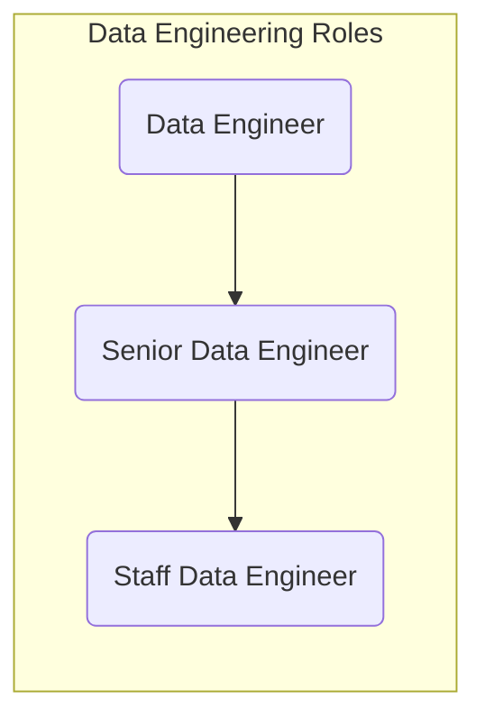
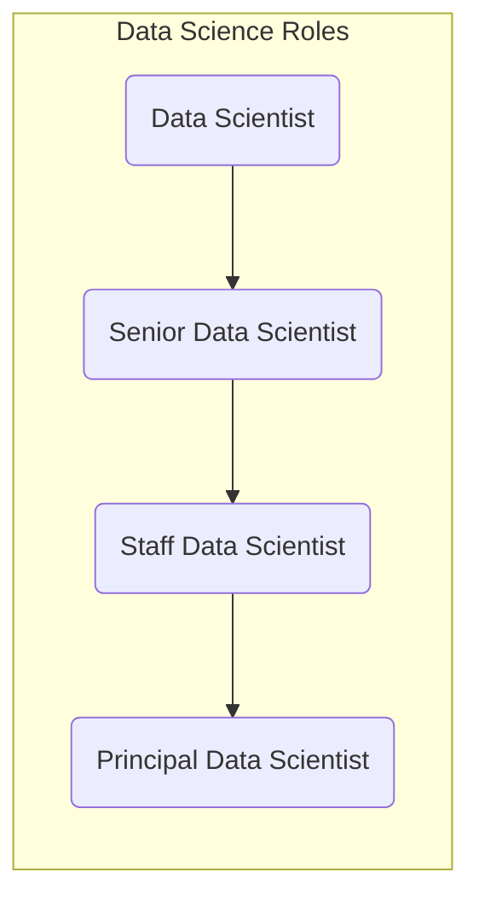

## On this page
{:.no_toc .hidden-md .hidden-lg}

- TOC
{:toc .toc-list-icons .hidden-md .hidden-lg}

{::options parse_block_html="true" /}

---

# Data Team Organization

The Data Team Organization model is guided by three primary business needs:

1. The need for **bespoke data solutions** unique to the GitLab business.
1. The need for **high-performance and reliable data storage and compute** platform to support distributed analyst teams.
1. The need for centers of excellence for **data technologies** and **advanced analytics**.
1. The need for flexible data solutions driven by varying **urgency and quality** requirements.

Based on these needs, the Data Team is organized in the following way:

1. **[Data Fusion Teams](/handbook/business-technology/data-team/#data-fusion-teams):** __Business-Focused__ and __Business-Involved__ teams responsible for delivering data solutions
1. **[Data Platform & Engineering Team](/handbook/business-technology/data-team/#the-data-platform--engineering-team):** __Center of Excellence__ for data technologies, including owning and operating the Data Stack
1. **[Data Science Team](/handbook/business-technology/data-team/#the-data-science-team):** __Center of Excellence__ for advanced analytics, including delivery of data science projects to the business
1. **[Data Collaboration Team](/handbook/business-technology/data-team/#the-data-collaboration-team):** __Center of Excellence__ for business intelligence and data findability

## Data Fusion Team Organization

Data Fusion Teams are composed of team members from across the business and the Data Team. Read about the current [Data Fusion Teams](/handbook/business-technology/data-team/#data-fusion-teams) on our front page.

```mermaid
classDiagram
   GTM <|-- Platform
        GTM : + Business Partner Data Champion
        GTM : + Function Analyst
        GTM : + Analytics Engineer
    R_and_D <|-- Platform
        R_and_D : + Business Partner Data Champion
        R_and_D : + Function Analyst
        R_and_D : + Analytics Engineer
    G_and_A <|-- Platform
        G_and_A : + Business Partner Data Champion
        G_and_A : + Function Analyst
        G_and_A : + Analytics Engineer
    Financial_Analytics <|-- Platform
        Financial_Analytics : + Business Partner Data Champion
        Financial_Analytics : + Function Analyst
        Financial_Analytics : + Analytics Engineer
    Engineering_Analytics <|-- Platform
        Engineering_Analytics : + Business Partner Data Champion
        Engineering_Analytics : + Function Analyst
        Engineering_Analytics : + Analytics Engineer
    Platform : +Data Engineer
  ```

### Fusion Team Assignments

| Data Fusion Team Name | Data Champion Team | Data Champion Name | Manager, Data | Lead Analytics Engineer | Function Analyst(s) | Analytics Engineer(s) | Data Engineer(s) |
| --------------------- | ------------------ | ------------------ | ------------- | ----------------------- | ---------------- | --------------------- | ---------------- |
| **Research and Development Data Fusion** | **Product Data Insights** | `@cbraza` | `@mdrussell` (Acting Manager) | `@mdrussell` | `@cbraza` `@eneuberger` `@nicolegalang` `@dpeterson1` `@nraisinghani` `@matthewpetersen` | `@jeanpeguero` `@michellecooper` | `@rbacovic ` |
|  | **Customer Success**  | `@jdbeaumont` | `@mdrussell` (Acting Manager) | `@mdrussell` |  `@bbutterfield` `@marntz` |  `@mdrussell` `@michellecooper`  |    |
| **Go to Market Data Fusion** | **Sales Strategy and Analytics** | `@aileenlu` | `@nmcavinue` | `@snalamaru` | `@nfiguera` `@mvilain` |  `@chrissharp` | `@paul_armstrong` `@Rigerta` |
|  | **Marketing Strategy and Analytics**  |  `@christinelee` |     |     | `@jahye1` `@rkohnke` `@degan` |                     |                          |
|  | **Online Sales and Self-Service**  | `@mfleisher` |           |                   | `@mfleisher` |             |              |
| **Financial Analytics Data Fusion** | **Corporate Finance** | `@james.shen` | `@nmcavinue`  | `@chrissharp` | `@vagrawalg` `@dgupta5` `@smishra27` | `@chrissharp` | `@paul_armstrong` |
|  | **GTM Finance**  | `@alixtucker` `@nbernardo`  |   |  |  `@ofalken` `@vagrawalg` `@dgupta5` `@smishra27` `@kkarthikeyan`    |     |                |
| **Engineering Analytics Data Fusion** | **Engineering Analytics** | `@cdeleon_gitlab` | `@nmcavinue`  | `@pempey` | `@lmai1` `@ddeng1` `@raulrrendon` `@clem.lr` | `@pempey` `@lisvinueza` |  `@jjstark`   |
| **General and Administrative Data Fusion** | **People Analytics** | `@aperez349` | `@nmcavinue`  | `@pempey` | `@aperez349` `@mccormack514` | `@pempey` `@lisvinueza` |  `@Rigerta`   |

The Data Fusion Team has several leadership roles on the team. These leaders live the GitLab `Collaboration` value and achieve great `Results` while doing so. The Manager, Data, Data Champion, and Lead Analytics Engineer provide leadership, mentoring, and guidance to the Data Fusion Team.

### Manager, Data

In support of the Data Fusion Team, the Manager, Data fulfills the below responsibilities from the [Senior Manager, Data](https://handbook.gitlab.com/job-families/finance/manager-data/#senior-manager-data) Job Responsibilites:

1. Works with the Director, Data and Data Champions to envision and draft Quarterly Objectives, driven by requirements gathered from multiple business partners.
1. Monitor, measure, and improve key aspects of the Data Fusion Teams.
1. Regularly meet with business partners to understand and solve for data needs.
1. Serve as a Maintainer on the Data Team Project. Provide final review, feedback, and approval of Merge Requests submitted by the Data Fusion Teams.
1. Work closely with the Enterprise Data Fusion team to develop and evangelize Dimensional Modeling adoption and best practices.

### Data Champion

In support of the Data Fusion Team, the Data Champion is the `DRI for Data` within a Functional Analytics Team. The Data Champion fulfills the below responsibilities from the [Data Champion Program](https://about.gitlab.com/handbook/business-technology/data-team/direction/data-champion/) in Data Fusion:

1. Develop a Data Success Plan in coordination with the Data Team.
1. Serve as Data DRI for their functional team, capturing all Data requests, including Data Quality problems.
1. Prioritize and stack-rank Data Issues and Epics, ensuring the Data Issue Board remains up-to-date.
1. Communicate priorities to the Data Team through the Issue Board.
1. Develop a Data handbook page geared to their functional team audience, such as Data For Product Managers.
1. Regularly communicate and cascade data news and practices.
1. Helps to improve Data Quality in source systems.
1. Watch changes in source systems and help incorporate necessary updates in the Enterprise Data Warehouse.

### Lead Analytics Engineer

In support of the Data Fusion Team, the Lead Analytics Engineer fulfills the below responsibilities from the [Senior Analytics Engineer](https://handbook.gitlab.com/job-families/finance/analytics-engineer/#senior-analytics-engineer-responsibilities) Job Responsibilites:

1. Own one or more stakeholder relationship in Go To Market, Research & Development, General & Administrative, Financial Analytics, or Engineering Analytics business functions.
1. Co-DRI of Key Results along with the Manager, Data.
1. Lead [work breakdown](https://about.gitlab.com/handbook/business-technology/data-team/how-we-work/planning/#work-breakdowns) sessions for OKRs. Incorporate the Data Champion and other required team members in the work breakdown sessions.
1. Lead twice-weekly [iteration planning](https://about.gitlab.com/handbook/business-technology/data-team/how-we-work/#quarterly-and-iteration-planning) sessions for the assigned Fusion Team. Work with Data Champions to prioritze `P3-Other` issues. The target state is for the Fusion team to spend 75% of their time working on `OKR` issues and 25% of their time working on `Other` issues. The OKRs are set by the Manager, Data and the Director, Data. Any changes to these priorities will be coordinated by Data Management.
1. Review the weekly stand-up and provide support as needed to unblock team members and answer questions.
1. Update the Rolly Bot Epic description section for the Key Results that the Lead AE is Co-DRI off.
1. Keep Fusion Team boards updated on a bi-weekly cadence aligning to the Planning Drumbeat cadence.

### Data Platform Team Stable Counterpart

Following the GitLab [Stable Counterpart](https://about.gitlab.com/handbook/leadership/#stable-counterparts) principles, every **Fusion Team** have a **Data Platform Team** Stable Counterpart assigned. The Data Platform Stable Counterpart divides their time, work and priorities between the Data Platform Team and Fusion Team (general an average of 50% each). The Stable Counterpart is aware of the direction and priorities of the Fusion Team and when needed brought into discussion with the Data Platform Team. I.e. when there is a bigger demand than the Stable Counterpart can handle in the assigned availability or architectural direction needs to change. The Stable Counterpart recognize, flags and address this with the applicable stakeholders (in general the Lead/DRI of the Data Platform Team and the Fusion Team).

The stable counterpart is expected to participate in the following meetings asynchronously or synchronously. When in doubt, please reach out to the Fusion Team Manager to learn which meetings on the calendar you should participate in. In general, the meetings in scope are as follows:

1. Data Team <> Business Function syncs. For example, People Analytics <> Data Team, Engineering Analytics <> Data Team, Product Intelligence <> Data Team syncs.
1. Data Program Sync meetings where issue prioritization is discussed amongst cross-functional stakeholders. For example, Data Program Support for R&D and Data Program Support for GTM.
1. Data Fusion Team Iteration Planning Meetings.
1. Data Fusion Team Meetings.

### Data Fusion Team Operations

Critical to successful Data Fusion Teams are the following elements:

1. Regular and transparent Engagement with Business Partners and Data Champions through the [Data for GTM Series](https://docs.google.com/document/d/1m-SygSyUqEcfd276_Jb1ZARMXIb4Z8clDF0eoxmudyw/edit#) and [Data for R&D Series](https://docs.google.com/document/d/1CRIGdNATvRAuBsYnhpEfOJ6C64B7j8hPAI0g5C8EdlU/edit#).
1. Planning our Work through the [Data Team Planning Drumbeat](/handbook/business-technology/data-team/how-we-work/planning/)
1. Performing a regular CSAT survey to provide feedback to the Data Fusion Team towards the goal of continuous improvement

We encourage our stakeholders to follow along with our issue boards to understand the scope of work:

| Data Fusion Team Name | Data Champion Team Name | Priority 1-Ops Board | Priority 2-OKRs Board | Priority 3-Other Board |
| --------------------- | ----------------------- | -------------------- | --------------------- | ---------------------- |
| **Research and Development Data Fusion** |  **Product Analysis**  | [Product Analysis - P1:Ops](https://gitlab.com/gitlab-data/analytics/-/boards/3884681?label_name[]=Champion%3A%3AProduct%20Analysis&label_name[]=Priority%3A%3A1-Ops)  | [Product Analysis - P2:OKR](https://gitlab.com/gitlab-data/analytics/-/boards/3884681?label_name[]=Champion%3A%3AProduct%20Analysis&label_name[]=Priority%3A%3A2-OKRs) | [Product Analysis - P3:Other](https://gitlab.com/gitlab-data/analytics/-/boards/3884681?label_name[]=Champion%3A%3AProduct%20Analysis&label_name[]=Priority%3A%3A3-Other) |
|                                          | **Customer Success**  | [Customer Success - P1:Ops](https://gitlab.com/gitlab-data/analytics/-/boards/3884681?label_name[]=Priority%3A%3A1-Ops&label_name[]=Champion%3A%3ACustomer%20Success) | [Customer Success - P2:OKR](https://gitlab.com/gitlab-data/analytics/-/boards/3884681?label_name[]=Champion%3A%3ACustomer%20Success&label_name[]=Priority%3A%3A2-OKRs) | [Customer Success - P3:Other](https://gitlab.com/gitlab-data/analytics/-/boards/3884681?label_name[]=Champion%3A%3ACustomer%20Success&label_name[]=Priority%3A%3A3-Other)|
| **Go to Market Data Fusion** | **Sales Strategy and Analytics** | [SS&A - P1:Ops](https://gitlab.com/gitlab-data/analytics/-/boards/3884681?label_name[]=Priority%3A%3A1-Ops&label_name[]=Champion%3A%3ASS%26A)| [SS&A - P2:OKR](https://gitlab.com/gitlab-data/analytics/-/boards/3884681?label_name[]=Champion%3A%3ASS%26A&label_name[]=Priority%3A%3A2-OKRs)| [SS&A - P3:Other](https://gitlab.com/gitlab-data/analytics/-/boards/3884681?label_name[]=Champion%3A%3ASS%26A&label_name[]=Priority%3A%3A3-Other)|
|                              | **Marketing Strategy and Performance**  | [MS&P - P1:Ops](https://gitlab.com/gitlab-data/analytics/-/boards/3884681?label_name[]=Champion%3A%3AMS%26P&label_name[]=Priority%3A%3A1-Ops)| [MS&P - P2:OKR](https://gitlab.com/gitlab-data/analytics/-/boards/3884681?label_name[]=Champion%3A%3AMS%26P&label_name[]=Priority%3A%3A2-OKRs)| [MS&P - P3:Other](https://gitlab.com/gitlab-data/analytics/-/boards/3884681?label_name[]=Champion%3A%3AMS%26P&label_name[]=Priority%3A%3A3-Other)|
|                              | **Online Sales and Self-Service**  | [Online Sales and Self-Service - P1:Ops](https://gitlab.com/gitlab-data/analytics/-/boards/3884681?label_name[]=Champion%3A%3AOnline%20Sales&label_name[]=Priority%3A%3A1-Ops)| [Online Sales and Self-Service - P2:OKR](https://gitlab.com/gitlab-data/analytics/-/boards/3884681?label_name[]=Champion%3A%3AOnline%20Sales&label_name[]=Priority%3A%3A2-OKRs) | [Online Sales and Self-Service - P3:Other](https://gitlab.com/gitlab-data/analytics/-/boards/3884681?label_name[]=Champion%3A%3AOnline%20Sales&label_name[]=Priority%3A%3A3-Other) |
|                              | **Business Insights**              |[Business Insights - P1:Ops](https://gitlab.com/gitlab-data/analytics/-/boards/3884681?label_name[]=Champion%3A%3ABusiness%20Insights&label_name[]=Priority%3A%3A1-Ops) | [Business Insights - P2:OKR](https://gitlab.com/gitlab-data/analytics/-/boards/3884681?label_name[]=Champion%3A%3ABusiness%20Insights&label_name[]=Priority%3A%3A2-OKRs) | [Business Insights - P3:Other](https://gitlab.com/gitlab-data/analytics/-/boards/3884681?label_name[]=Champion%3A%3ABusiness%20Insights&label_name[]=Priority%3A%3A3-Other) |
| **Financial Analytics Data Fusion** | **Corporate Finance** |[Corporate Finance - P1:Ops](https://gitlab.com/gitlab-data/analytics/-/boards/3884681?label_name[]=Champion%3A%3ACorporate%20Finance&label_name[]=Priority%3A%3A1-Ops)| [Corporate Finance - P2:OKR](https://gitlab.com/gitlab-data/analytics/-/boards/3884681?label_name[]=Champion%3A%3ACorporate%20Finance&label_name[]=Priority%3A%3A2-OKRs)| [Corporate Finance - P3:Other](https://gitlab.com/gitlab-data/analytics/-/boards/3884681?label_name[]=Champion%3A%3ACorporate%20Finance&label_name[]=Priority%3A%3A3-Other) |
|                                 | **Sales Finance**            | [Sales Finance - P1:Ops](https://gitlab.com/gitlab-data/analytics/-/boards/3884681?label_name[]=Champion%3A%3ASales%20Finance&label_name[]=Priority%3A%3A1-Ops) | [Sales Finance - P2:OKR](https://gitlab.com/gitlab-data/analytics/-/boards/3884681?label_name[]=Champion%3A%3ASales%20Finance&label_name[]=Priority%3A%3A2-OKRs)| [Sales Finance - P3:Other](https://gitlab.com/gitlab-data/analytics/-/boards/3884681?label_name[]=Champion%3A%3ASales%20Finance&label_name[]=Priority%3A%3A3-Other) |
|                                 | **Business Insights**        | [Business Insights - P1:Ops](https://gitlab.com/gitlab-data/analytics/-/boards/3884681?label_name[]=Champion%3A%3ABusiness%20Insights&label_name[]=Priority%3A%3A1-Ops) | [Business Insights - P2:OKR](https://gitlab.com/gitlab-data/analytics/-/boards/3884681?label_name[]=Champion%3A%3ABusiness%20Insights&label_name[]=Priority%3A%3A2-OKRs)| [Business Insights - P3:Other](https://gitlab.com/gitlab-data/analytics/-/boards/3884681?label_name[]=Champion%3A%3ABusiness%20Insights&label_name[]=Priority%3A%3A3-Other) |
| **Engineering Analytics Data Fusion** | **Engineering Analytics** |    |                       |                        |
| **General and Administrative Data Fusion** | **People Analytics** |    |                       |                        |
| **Enterprise Data Center of Excellence** | **All Data Fusion Teams** | |                       |                        |

# Data Program Recruiting

Recruiting great people is critical to our success and we've invested much effort into making the process efficient. Here are some reference materials we use:
- a [GitLab Data Recruiting](https://youtu.be/4DlwsBIPxUw) video to say "Hi" and give you some insight into how we work and what we work on. Enjoy!
- [Data Roles and Career Development](https://about.gitlab.com/handbook/business-technology/data-team/organization/#data-roles-and-career-development) to help existing team members and prospects understand growth opportunities
- a [Take Home Test](https://about.gitlab.com/handbook/business-technology/data-team/organization/#data-roles-and-career-development) that we ask each candidate to complete; this test is good for the candidate and for us because it represents the type of work we perform regularly and if the candidate is not interested in this work it helps them make a more informed decision about their application

# Data Roles and Career Development

## Data Internships

See [Data Team Internships](/handbook/business-technology/data-team/organization/internships/).

## Data Platform

* [Data Engineering Job Family](https://handbook.gitlab.com/job-families/finance/data-engineer)



### Intermediate and Senior Data Engineer Onboarding Timeline

| By Day 30 | By Day 60 |  By Day 90 | By Day 120 |
| ------ | ------ |------ |------ |
| Complete People and Data Onboarding | Perform [triage](/handbook/business-technology/data-team/how-we-work/triage/) activities | Extract [new data sources](/handbook/business-technology/data-team/how-we-work/new-data-source/) | Own a specific area of the data platform |
Create a MR to contribute to handbook or templates | Investigate incidents and issues | Work on [OKR assignments](/handbook/business-technology/data-team/direction/#quarterly-objectives) | Propose new ideas and come up with Data Platform improvement initiatives |
| Understand the current setup of the data platform | Make small/corrective changes to the platform infrastructure or data pipelines | Contribute on work breakdown |

## Data Analyst

* [Data Analyst Job Family](https://handbook.gitlab.com/job-families/finance/data-analyst)


### Intermediate and Senior Data Analyst Onboarding Timeline

| By Day 30 | By Day 60 |  By Day 90 | By Day 120 |
| ------ | ------ |------ |------ |
| Complete People and Data Onboarding | Extend an existing [Sisense dashboard](/handbook/business-technology/data-team/platform/sisensecdt/) or complete the triage phase for a dbt issue | Run a project end-to-end as DRI with support from a Data Fusion Team | Create ERDs/Data Artifacts (e.g. dashboards) or complete a product evaluation|
| Start attending [Data Fusion Team](/handbook/business-technology/data-team/#data-fusion-teams) and Business Team synchronous meetings | Perform [triage](/handbook/business-technology/data-team/how-we-work/triage/) activities | | |
| Complete First Issue: S to M T-Shirt Size  |  |  |

## Data Science

* [Data Science Job Family](https://handbook.gitlab.com/job-families/finance/data-science)



### Intermediate and Senior Data Scientist Onboarding Timeline

| By Day 30 | By Day 60 |  By Day 90 | By Day 120 |
| ------ | ------ |------ |------ |
| Complete People and Data Onboarding | Meet stakeholders across the organization | Re-train or enhance an existing data science model |  Make a contribution to improve the Data Science handbook, packages, or processes |
| Start attending Data Science Team meetings | Refine/improve one data science dashboard | Work on [OKR assignments](https://about.gitlab.com/handbook/business-technology/data-team/direction/#quarterly-objectives) | Take ownership of at least one quarterly OKR |
| Understand the current data science systems and processes |  | |  |

## Analytics Engineering

### [Analytics Engineering Job Family](https://handbook.gitlab.com/job-families/finance/analytics-engineer)


### Intermediate and Senior Analytics Engineer Onboarding Timeline

| By Day 30 | By Day 60 |  By Day 90 | By Day 120 |
| ------ | ------ |------ |------ |
| Complete People and Data Onboarding  | Extend an existing dbt [Trusted Data Models](/handbook/business-technology/data-team/data-development/#trusted-data-development) | Run a project end-to-end as DRI with support from a Data Fusion Team | Create ERDs/Data Artifacts|
| Start attending Data Fusion Team and Business Team synchronous meetings | Perform [triage](/handbook/business-technology/data-team/how-we-work/triage/) activities | | |
| Complete First Issue: S to M T-Shirt Size  |  |  |

## Data Management

* [Data Management Job Family](https://handbook.gitlab.com/job-families/finance/manager-data)


### Data Manager Onboarding Timeline

| By Day 30 | By Day 60 |  By Day 90 | By Day 120 |
| ------ | ------ |------ |------ |
| Complete People, Data, and Manager Onboarding | Meet everyone on the team and business data champions | Complete a Team Assessment | Draft a people development Roadmap |
| Understand the current setup of the data platform | Work on [OKR assignments](/handbook/business-technology/data-team/direction/#quarterly-objectives) and map them to the data platform | Lead discussions with Users/Stakeholders on initiatives and OKRs | Draft a program development Roadmap (Process Improvements /Future State) |
| Add a new page to the handbook | Make regular contributions to the handbook spanning your area of management | Become DRI for major portions of the Data Handbook | System/Application Change Control Management of one or more modules |
