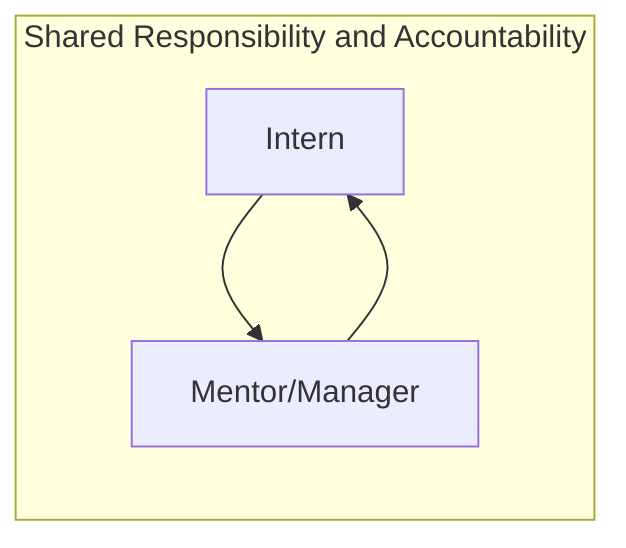

## On this page
{:.no_toc .hidden-md .hidden-lg}

- TOC
{:toc .toc-list-icons .hidden-md .hidden-lg}

{::options parse_block_html="true" /}

---

## <i id="biz-tech-icons" class="far fa-paper-plane"></i>Introduction

Welcome to the **Data Team Internship Program** page. The Program is launching in 2022 and we are seeking to help all team members experience life in the fast-paced, results-oriented, and rapidly-evolving world of Data!

- **Slack Channel**: `#data`

## <i class="far fa-newspaper" id="biz-tech-icons"></i> The 2022 Data Team Internship Program

The 2022 Program will follow the [GitLab Internship for Learning Program](/handbook/people-group/learning-and-development/career-development/#internship-for-learning), focused on supporting existing GitLab Team Members. Later in the calendar year we will evaluate extending the program to support non-GitLab Team Members and traditional internships for undergraduates and individuals interested in a new career.

At launch in January 2022, the Data Team Internship Program will be structured as follows:
- Follow the [GitLab Internship for Learning Program](/handbook/people-group/learning-and-development/career-development/#internship-for-learning)
- Open to only current GitLab Team Members
- Intern time allocation should range from 25%-50%, with a 3-month commitment
- Data Team Mentor/Manager time allocation should range from 15-25%, with a 3-month committment

### How Does A Data Team Internship Work?

A GitLab Team Member Data Team Internship follows [GitLab Internship for Learning Program](/handbook/people-group/learning-and-development/career-development/#internship-for-learning) guidelines. Given the rapid growth of the Data Team, we are seeking to partner every Intern with a Data Team member who is interested in their own career development towards a Team Lead specialization or [Data Management](https://about.gitlab.com/job-families/finance/manager-data/) role. With this model, each Intern is assigned a Data Team Mentor/Manager and this partnership and shared commitment to both team member's development is critical to the program's success. 

#### Criteria For Creating A Data Team Internships

Requests to create a Data Team Intern position will be evaluated on the following criteria:

1. Team Size, Maturity, and Need
     * How established is the team the intern will be joining? Is this an established team with processes, roles, a roadmap, and backlog?
     * Will the team be able to take on an intern without risking a decrease in velocity?
     * Would the team benefit from an intern to support a more senior member's career development, to introduce new perspectives, or to accelerate the roadmap in one or more areas.
1. Mentorship Commitment
     * Does the team have a manager and 1-2 individual contributors committed to serve as mentors for the duration of the program?
     * Do the mentors have previous experience mentoring interns or junior engineers? Previous experience is a nice-to-have, but not a must-have.
1. Workload
     * Does the team have a roadmap containing low weight issues with few dependencies suitable for an intern?
1. Time Commitment
     * Can the intern AND mentor commit to a 3-month program, including regular meetings and progress reviews? 

If the answer to these questions is **YES**, there is a good chance the internship is a fit.

#### Data Team Internship KPIs

1. Successfull Data Team Onboarding within 30 Calendar Days
1. Monthly Progress Report and Feedback issue
1. Final CSAT Score of 4 or higher on a 5 point scale
1. # of Data Project MRs successfully Merged > 5
1. # of Data Team Handbook MRs sucessfully Merged > 5

#### What Does A Data Team Intern Do?

An internship gives you insight into a [Data Team role](/handbook/business-technology/data-team/organization/#data-roles-and-career-development) by providing you opportunities to learn and contribute to GitLab results. You will be fully integrated into the team through Data Onboarding and be assigned **real** projects that contribute to Quarterly Objectives and the [Data Team Roadmap](/handbook/business-technology/data-team/direction/). In the GitLab Data Team we believe in full end-to-end ownership of the work we do, ranging from requirements gathering all the way to production deployment and operations. During your internship you will be assigned a Senior team member as a mentor-manager, who will help you to navigate in daily tasks.  Examples of your tasks will include:

- Requirements gathering
- Extraction of data from various sources to support project’s objective
- Analysing and visualising data to develop new insights
- Collaboration with stakeholders (including explaining technical concepts with non-technical language)
- Working in GitLab to manage projects (via epics and issues)
- Writing new source code and merging the code through a Merge Request

### Analytics Engineering Internship

#### Requirements

- Familiarity with and Interest in the [Analytics Engineering](https://about.gitlab.com/job-families/finance/analytics-engineer/) job family 
- BS or MS in data-related fields (statistics, computer science, engineering), but self-learners are also welcome to apply
- Positive and solution-oriented mindset
- Comfort working in a highly agile, intensely iterative environment
- Self-motivated and self-managing, with task organizational skills
- Working knowledge of SQL
- Working knowledge of Python (we use Jupyter notebooks to analyse and visualise data)
- Basic knowledge of dashboard tools (we use Sisense)
- At least 1 completed demoable data project (Non-commercial projects done in a spare time also count)
- Nice to have
     - Understanding of software industry
     - Prior experience in a Data Role
     - Experience designing and managing projects

### Data Science Internship

#### Requirements

- Familiarity with and Interest in the [Data Science](https://about.gitlab.com/job-families/finance/data-science/) job family 
- BS or MS in data-related fields (statistics, computer science, engineering), but self-learners are also welcome to apply
- Working knowledge of SQL
- Working knowledge of Python (we use Jupyter notebooks to analyse and visualise data)
- Basic knowledge of dashboard tools (we use Sisense)
- Understanding of machine learning algorithms including decision trees, gradient and regression models
- Ability to communicate in English, including concise writing that summarises your work
- Ability to work asynchronously - as a fully-remote company we have team members all around a globe with differing working hours
- At least 1 completed data science project (Non-commercial projects done in a spare time also count)
- Being proactive in a work you do, but also not afraid to ask questions
- Nice to have
     - Understanding of CRISP-DM framework
     - Understanding of software industry
