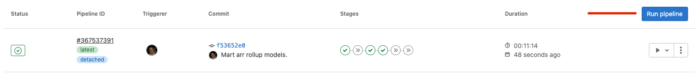

## On this page
{:.no_toc .hidden-md .hidden-lg}

- TOC
{:toc .toc-list-icons .hidden-md .hidden-lg}

{::options parse_block_html="true" /}

---

This page documents the CI jobs used by the data team in Merge Requests in both the [Data Tests](https://gitlab.com/gitlab-data/data-tests) and [Analytics](https://gitlab.com/gitlab-data/analytics) projects.

## What to do if a pipeline fails 

* If a weekend has passed re-run any CLONE steps which were performed prior, every Saturday all old pipeline databases are dropped from SnowFlake. 
* Merge master branch. Due to how dbt handles packages pipelines can fail due to package failures which should always be handled in the latest branch. 
* Confirm [model selection syntax](https://docs.getdbt.com/reference/node-selection/syntax). In general, it is easiest to simply use the file names of the models you are changing. 
* If still uncertain, tag @gitlab-data/data-engineers (or any individual engineer if urgent assistance is required) on your issue and request assistance in resolving the issue.  

### Pipeline variables not being passed to the job

* There is currently an issue with the GitLab CI pipelines. Pipelines which require variables to be passed through to them only allow for this to happen once.
* This means that if you would like to test using the dbt models pipelines to run the process for a second time you should create a new pipeline. 
* The easiest way to do to this is to click the blue run pipeline button as below: 

# Analytics pipelines 

## Stages

CI jobs are grouped by stages.

### ❄️ Snowflake

These jobs are defined in [`.gitlab-ci.yml`](https://gitlab.com/gitlab-data/analytics/-/blob/master/.gitlab-ci.yml).

#### clone_prod

Runs automatically when the MR opens to be able to run any dbt jobs. Subsequent runs of this job will be fast as it only verifies if the clone exists. This is an empty clone of the `prod` and `prep` databases.

#### clone_prod_real

Run this if you need to do a real clone of the `prod` and `prep` databases. This is a full clone both databases.

#### clone_raw_full

Run this if you need to run extract, freshness, or snapshot jobs. Subsequent runs of this job will be fast as it only verifies if the clone exists.

### clone_raw_postgres_pipeline

Run this if you only need a clone of the raw `tap_postgres` schema in order to test changes to postgres pipeline or a manifest file.  If the raw clone already exists, this will do nothing.

### clone_raw_sheetload

Run this if you only need a clone of the raw `sheetload` schema in order to test changes or additions to sheetload.  If the raw clone already exists, this will do nothing.

### clone_raw_specific_schema

Run this if you need a clone of any other raw schema in order to test changes or additions. Specify which raw schema to clone with the `SCHEMA_NAME` variable. If the raw clone already exists, this will do nothing. 

#### force_clone_both

Run this if you want to force refresh raw, prod, and prep. This does a full clone of raw, but a shallow clone of `prep` and `prod`.

### 🚂 Extract

These jobs are defined in [`extract-ci.yml`](https://gitlab.com/gitlab-data/analytics/-/blob/master/extract/extract-ci.yml)

#### boneyard_sheetload

Run this if you want to test a new boneyard sheetload load. This requires the real `prod` and `prep` clones to be available.

#### sheetload

Run this if you want to test a new sheetload load. This jobs runs against the clone of `RAW`. Requires the `clone_raw` job to have been run.

#### pgp_test

With the exception of gitlab-ops DB, run this if you're adding or updating a postgres pipeline manifest. Requires a clone of RAW and the `MANIFEST_NAME` variable, possibly `TASK_INSTANCE` variable if it's an SCD table.

The `MANIFEST_NAME` is not the same as the manifest filename. Its the filename except postfix `_db_manifest.yaml`.

#### gitlab_ops_pgp_test

Run this if you're updating the gitlab-ops manifest file.  Requires a clone of RAW.  Does not require any variables, except possibly a `TASK_INSTANCE` variable if it's an SCD table.  This is separate from the `pgp_test` job because it requires a CloudSQL Proxy to be running in order to connect to the database.

### ⚙️ dbt Run

These jobs are defined in [`snowflake-dbt-ci.yml`](https://gitlab.com/gitlab-data/analytics/-/blob/master/transform/snowflake-dbt/snowflake-dbt-ci.yml)

> As part of a DBT Model Change MR, you need to trigger a pipeline job to test that your changes won't break anything in production. To trigger these jobs, go to the "Pipelines" tab at the bottom of this MR and click on the appropriate stage (dbt_run or dbt_misc).

These jobs are scoped to the `ci` target. This target selects a subset of data for the snowplow and version datasets.

Note that job artifacts are available for all dbt run jobs. These include the compiled code and the run results.

These jobs run against the primary `RAW` database.

Most dbt run jobs can be parameterized with a variable specifying dbt model that requires testing. Watch [this intro](https://youtu.be/l14N7l-Sco4) to see an example of how to set the variable.

The variable `DBT_MODELS` is a stand-in for any of the examples in [the dbt documentation on model selection syntax](https://docs.getdbt.com/docs/model-selection-syntax#section-specifying-models-to-run).

If you are testing changes to tests in the `data-tests` project, you can pass in `DATA_TEST_BRANCH` to the manual jobs along with the branch name. This will update the branch in the `packages.yml` for the data-tests package. This works for any job running `dbt test`.

You can also add `--fail-fast` to the end of the model selection to quickly end the dbt call at the first failure. Read the [dbt docs](https://docs.getdbt.com/reference/commands/run#failing-fast) for more information.

#### ➕🐭specify_model

Specify which model to run with the variable `DBT_MODELS`

#### ➕🦖specify_l_model

Specify which model to run using an L warehouse with the variable `DBT_MODELS`

#### ➕🐘specify_xl_model

Specify which model to run using an XL warehouse with the variable `DBT_MODELS`

#### ➖🐭specify_exclude

Specify which model to exclude with the variable `DBT_MODELS`

#### ➖🦖specify_l_exclude

Specify which model to exclude using an L warehouse with the variable `DBT_MODELS`

#### ➖🐘specify_xl_exclude

Specify which model to exclude using an XL warehouse with the variable `DBT_MODELS`

#### ➕🐭🥩specify_raw_model

Specify a dbt model against the clone of the RAW database. This jobs runs against the clone of `RAW`. Requires the `clone_raw` job to have been run. This is useful for the following scenarios:

* You have a new sheetload file that you're uploading. You can use this to test the sheetload dbt models in the same MR you're adding the sheet.
* You have a new gitlab.com or other pgp table you're adding. You can use this to test the dbt models in the same MR you're adding the table.
* You're adding a dbt snapshot and want to test models built on top of that snapshot.

#### ➕🌱specify_csv_seed

This job tests specific seed file.

Specify seed file with the variable `DBT_MODELS`.

#### ➕📸🥩specify_snapshot

Specify which snapshot to run with the variable `DBT_MODELS`.
This jobs runs against the clone of `RAW`. Requires the `clone_raw` job to have been run.

### 🛠 dbt Misc

These jobs are defined in [`snowflake-dbt-ci.yml`](https://gitlab.com/gitlab-data/analytics/-/blob/master/transform/snowflake-dbt/snowflake-dbt-ci.yml)

#### 🧠all_tests

Runs all of the tests

- Note: it is not necessary to run this job if you've run any of the dbt_run stage jobs as tests are included.

#### 💾data_tests

Runs only data tests

#### 🌻freshness

Runs source freshness test. This jobs runs against the clone of `RAW`. Requires the `clone_raw` job to have been run.

#### 🔍periscope_query

This job runs automatically and only appears when `.sql` files are changed. In its simplest form, the job will check to see if any of the currently changed models are queried in Periscope. If they are, the job will fail with a notification to check the relevant dashboard. If it is not queried, the job will succeed.

Current caveats with the job are:

- It will not tell you which dashboard to check
- It is not able to validate tables that are queried with any string interpolation syntax (i.e. `retention_[some_variable]`)
- It is not able to validate if a table is aliased via dbt

##### Explanation

This section explains how the periscope query works.

`git clone -b periscope/master --single-branch https://gitlab.com/gitlab-data/periscope.git --depth 1`

This clones the periscope project.

`git diff origin/$CI_MERGE_REQUEST_TARGET_BRANCH_NAME...HEAD --name-only | grep -iEo "(.*)\.sql" | sed -E 's/\.sql//' | awk -F '/' '{print tolower($NF)}' | sort | uniq > diff.txt`

This gets the list of files that have changed from the master branch (i.e. target branch) to the current commit (HEAD). It then finds (grep) only the sql files and substitutes (sed) the `.sql` with an empty string. Using `awk`, it then prints the lower-case of the last column of each line in a file (represented by $NF - which is the number of fields), using a slash (/) as a field separator. Since the output is directory/directory/filename and we make the assumption that most dbt models will write to a table named after its file name, this works as expected. It then sorts the results, gets the unique set, and writes it to a file called diff.txt.

`periscope_check.py`

This recursively searches the entire periscope repo for a string that matches a `from|join` statement from any of the 3 currently queryable schemas. It does some cleaning on files that match and creates a dictionary of table name mapping to all of the files it is referenced in. It then reads in `diff.txt` to do a lookup and write to comparison.txt and matches based on the model name.

`if (( $(cat comparison.txt | wc -l | tr -d ' ') > 0 )); then echo "Check these!" && cat comparison.txt && exit 1; else echo "All good" && exit 0; fi;`

This uses word count (wc) to see how many lines are in the comparison file. If there is more than zero it will print the lines and exit with a failure. If there are no lines it exits with a success.

#### schema_tests

Runs only schema tests

#### snapshots

Runs snapshots. This jobs runs against the clone of `RAW`. Requires the `clone_raw_full` job to have been run.

#### specify_tests

Runs specified model tests with the variable `DBT_MODELS`

### 🐍 Python

These jobs are defined in [`.gitlab-ci.yml`](https://gitlab.com/gitlab-data/analytics/-/blob/master/.gitlab-ci.yml).

There are several jobs that only appear when `.py` files have changed. All of them will run automatically on each new commit where `.py` files are present. Otherwise they are unavailable to run. Other jobs are:

#### permifrost_manual

Manual job to do a dry run of [Permifrost](https://gitlab.com/gitlab-data/permifrost/).

#### yaml_validation

Triggered when there is a change to `permissions/snowflake/roles.yml`. Validates that the YAML is correctly formatted.

### 🛑 Snowflake Stop

These jobs are defined in [`.gitlab-ci.yml`](https://gitlab.com/gitlab-data/analytics/-/blob/master/.gitlab-ci.yml).

#### clone_stop

Runs automatically when MR is merged or closed. Do not run manually.

# Data Test Pipelines 

All of the below run against the Prod DB using the changes provided in the repo. No cloning is needed to run the below. 

#### 🧠 all_tests_prod

Runs through all tests in the analytics & data tests repo. 

#### 💾 data_tests_prod

Runs through all of the data tests in the analytics & data tests repo's. 

#### schema_tests_prod

Runs through all of the schema tests in the analytics & data tests repo's. 

#### specify_tests_prod

Runs specified model tests with the variable `DBT_MODELS`
