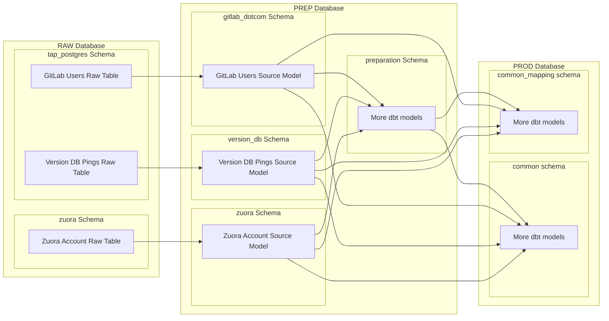
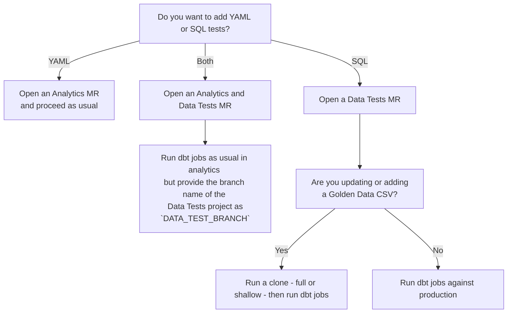

## On this page
{:.no_toc .hidden-md .hidden-lg}

- TOC
{:toc .toc-list-icons .hidden-md .hidden-lg}

{::options parse_block_html="true" /}

---

## Quick Links

[Primary Project](https://gitlab.com/gitlab-data/analytics/){:.btn .btn-purple-inv}
[dbt docs](https://dbt.gitlabdata.com/){:.btn .btn-purple-inv}

## What and why

dbt, short for [data build tool](https://www.getdbt.com/), is an [open source project](https://github.com/fishtown-analytics/dbt) for managing data transformations in a data warehouse. Once data is loaded into a warehouse, dbt enables teams to manage all data transformations required for driving analytics. It also comes with built in testing and documentation so we can have a high level of confidence in the tables we're generating and analyzing.

The following links will give you an excellent overview of what dbt is:

- [What, exactly, is dbt?](https://blog.getdbt.com/what--exactly--is-dbt-/) - This is a less technical overview for understanding the tool
- [What is dbt?](https://docs.getdbt.com/docs/introduction) - This is a bit more technical and comes straight from the docs

But why do we use dbt? There are several reasons.

First is that it is an open source tool with a vibrant community.
Choosing an open source tool enables us to collaborate with the larger data community and solve problems faster than had we gone with a proprietary solution.

Second, it was built with version control in mind.
For GitLab, this is essential since we use the product for building and running the company.

Third, it speaks the language of analysts - SQL.
This increases the number of people that can contribute since SQL is becoming such a critical part of many people's jobs.

Finally, it enables teams to move faster by integrating [testing and documentation](https://docs.getdbt.com/docs/building-a-dbt-project/building-models/#testing-and-documenting-models) from the start.

For even more information about the basics of dbt, see our [data analyst onboarding issue template](https://gitlab.com/gitlab-data/analytics/blob/master/.gitlab/issue_templates/Data%20Onboarding.md#what-is-dbt)

At times, we rely on dbt packages for some data transformation.
[Package management](https://docs.getdbt.com/docs/building-a-dbt-project/package-management/) is built-in to dbt.
A full list of packages available are on the [dbt Hub site](https://hub.getdbt.com).

## Running dbt

If you're interested in using dbt, the [dbt documentation has a great tutorial](https://tutorial.getdbt.com/tutorial/setting-up/) on getting setup to work on data from a fictional business called Jaffle Shop.

If you wish to use dbt and contribute to the data team project, you'll need to gain access to our Snowflake instance, which can be done via an [access request](/handbook/business-technology/team-member-enablement/onboarding-access-requests/access-requests/).

### Configuration

- Ensure you have access to our Snowflake instance
- Ensure you have [Make](https://en.wikipedia.org/wiki/Make_(software)) installed (should be installed on new Macs and with XCode)
- Create a folder in your home directory called `.dbt`
- In the `~/.dbt/` folder there should be a `profiles.yml`file that looks like this [sample profile](https://gitlab.com/gitlab-data/analytics/blob/master/admin/sample_profiles.yml)
- The smallest possible warehouse should be stored as an environment variable. Our dbt jobs use `SNOWFLAKE_TRANSFORM_WAREHOUSE` as the variable name to identify the warehouse. The environment variable can be set in the `.bashrc` or `.zshrc` file as follows:
    - `export SNOWFLAKE_TRANSFORM_WAREHOUSE="ANALYST_XS"`
    - In cases where more compute is required, the variable can be overwritten by adding `--vars '{warehouse_name: analyst_xl}'` to the dbt command
- Clone the [analytics project](https://gitlab.com/gitlab-data/analytics/)
- If running on Linux: 
  - Ensure you have [Docker installed](https://docs.docker.com/docker-for-mac/)

Note that many of these steps are done in the [onboarding script](https://gitlab.com/gitlab-data/analytics/-/blob/master/admin/onboarding_script.zsh) we recommend new analysts run.

### Venv Workflow
{: #Venv-workflow}

Recommended workflow for anyone running a Mac system. 

#### Using dbt

- Ensure you have the `DBT_PROFILE_PATH` environment variable set. This should be set if you've used the [onboarding_script.zsh](https://gitlab.com/gitlab-data/analytics/-/blob/master/admin/onboarding_script.zsh) (recommened to use this as this latest and updated regularly), but if not, you can set it in your `.bashrc` or `.zshrc` by adding `export DBT_PROFILE_PATH="/<your_root_dir/.dbt/"` to the file or simply running the same command in your local terminal session
- Ensure your SSH configuration is setup according to the [GitLab directions](https://gitlab.com/help/ssh/README). Your keys should be in `~/.ssh/` and the keys should have been generated with no password.
    - You will also need access to [this project](https://gitlab.com/gitlab-data/data-tests) to run `dbt deps` for our main project.
- **NB**: Ensure your default browser is set to chrome. The built-in SSO login only works with chrome 
- **NB**: Before running dbt for the first time run `make prepare-dbt`. This will ensure you have venv installed. 
- To start a `dbt` container and run commands from a shell inside of it, use `make run-dbt`
- This will automatically import everything `dbt` needs to run, including your local `profiles.yml` and repo files
- To see the docs for your current branch, run `make run-dbt-docs` and then visit `localhost:8081` in a web-browser. Note that this requires the `docs` profile to be configured in your `profiles.yml`

### Docker Workflow
{: #docker-workflow}

The below is the recommended workflow primarily for users running Linux as the venv workflow has fewer prerequisites and is considerably faster. 

To abstract away some of the complexity around handling `dbt` and its dependencies locally, the main [analytics project](https://gitlab.com/gitlab-data/analytics/) supports using `dbt` from within a `Docker` container.
We build the container from the [`data-image`](https://gitlab.com/gitlab-data/data-image) project.
There are commands within the `Makefile` to facilitate this, and if at any time you have questions about the various `make` commands and what they do, use `make help` to get a list of the commands and what each of them does.

Before your initial run (and whenever the containers get updated) make sure to run the following commands:

1. `make update-containers`
1. `make cleanup`

These commands will ensure you get the newest versions of the containers and generally clean up your local `Docker` environment.

#### Using dbt

- Ensure you have the `DBT_PROFILE_PATH` environment variable set. This should be set if you've used the [onboarding_script.zsh](https://gitlab.com/gitlab-data/analytics/-/blob/master/admin/onboarding_script.zsh) (recommened to use this as this latest and updated regularly) or   [onboarding_script.sh](https://gitlab.com/gitlab-data/analytics/blob/master/admin/onboarding_script.sh), but if not, you can set it in your `.bashrc` or `.zshrc` by adding `export DBT_PROFILE_PATH="/<your_root_dir/.dbt/"` to the file or simply running the same command in your local terminal session
- Ensure your SSH configuration is setup according to the [GitLab directions](https://gitlab.com/help/ssh/README). Your keys should be in `~/.ssh/` and the keys should have been generated with no password.
    - You will also need access to [this project](https://gitlab.com/gitlab-data/data-tests) to run `dbt deps` for our main project.
- To start a `dbt` container and run commands from a shell inside of it, use `make dbt-image`
- This will automatically import everything `dbt` needs to run, including your local `profiles.yml` and repo files
    - You may see some WARNINGS about missing variables (`GIT_BRANCH`, `KUBECONFIG`, `GOOGLE_APPLICATION_CREDENTIALS`, etc.). Unless you are developing on Airflow this is ok and expected.
- To see the docs for your current branch, run `make dbt-docs` and then visit `localhost:8081` in a web-browser. Note that this requires the `docs` profile to be configured in your `profiles.yml`
- Once inside of the `dbt` container, run any `dbt` commands as you normally would
- Changes that are made to any files in the repo will automatically be updated within the container. There is no need to restart the container when you change a file through your editor!

#### Command line cheat sheet

This is a simplified version of the [primary command reference](https://docs.getdbt.com/reference/dbt-commands/).

dbt specific:

- `dbt clean` - this will remove the `/dbt_modules` (populated when you run deps) and `/target` folder (populated when models are run)
- `dbt run` - regular run
- Model selection syntax ([source](https://docs.getdbt.com/docs/model-selection-syntax)). Specifying models can save you a lot of time by only running/testing the models that you think are relevant. However, there is a risk that you'll forget to specify an important upstream dependency so it's a good idea to understand the syntax thoroughly:
    - `dbt run --models modelname` - will only run modelname
    - `dbt run --models +modelname` - will run modelname and all parents
    - `dbt run --models modelname+` - will run modelname and all children
    - `dbt run --models +modelname+` - will run modelname, and all parents and children
    - `dbt run --models @modelname` - will run modelname, all parents, all children, AND all parents of all children
    - `dbt run --exclude modelname` - will run all models except modelname
    - Note that all of these work with folder selection syntax too:
        - `dbt run --models folder` - will run all models in a folder
        - `dbt run --models folder.subfolder` - will run all models in the subfolder
        - `dbt run --models +folder.subfolder` - will run all models in the subfolder and all parents
- `dbt run --full-refresh` - will refresh incremental models
- `dbt test` - will run custom data tests and schema tests; TIP: `dbt test` takes the same `--model` and `--exclude` syntax referenced for `dbt run`
- `dbt seed` - will load csv files specified in the `data-paths` [directory](https://gitlab.com/gitlab-data/analytics/-/tree/master/transform/snowflake-dbt/data) into the data warehouse. Also see the [seeds section of this guide](/handbook/business-technology/data-team/platform/dbt-guide/#seeds)
- `dbt compile` - compiles all models. This isn't a command you will need to run regularly. dbt will compile the models when you run any models.

    Works only if you've run the [onboarding script](https://gitlab.com/gitlab-data/analytics/-/blob/master/admin/onboarding_script.sh):
- `dbt_run_changed` - a function we've added to your computer that only runs models that have changed (this is accessible from within the docker container)
- `cycle_logs` - a function we've added to your computer to clear out the dbt logs (not accessible from within the docker container)
- `make dbt-docs` - a command that will spin up a local container to serve you the `dbt` docs in a web-browser, found at `localhost:8081`

### Configuration for contributing to dbt project

If you're interested in contributing to dbt, here's our recommended way of setting up your local environment to make it easy.

- Fork the [dbt project](https://github.com/fishtown-analytics/dbt) via the GitHub UI to your personal namespace
- Clone the project locally
- Create a virtual environment (venv) for dbt following these commands

    ```bash
    cd ~
    mkdir .venv # This should be in your root "~" directory
    python -m venv .venv/dbt
    source ~/.venv/dbt/bin/activate
    pip install dbt
    ```
- Consider adding `alias dbt!="source ~/.venv/dbt/bin/activate"` to your `.bashrc` or `.zshrc` to make it easy to start the virtual environment
- Navigate to the dbt project in the same terminal window - you should see `(dbt)` at the start of the command prompt
- Run `pip install -r editable_requirements.txt`. This will ensure when you run dbt locally in your venv you're using the code on your machine.
- Run `which dbt` to ensure it's pointing to the venv
- Develop code locally, commit your changes as you would, and push up to your namespace on GitHub

When you're ready to submit your code for a PR, ensure you've [signed their CLA](https://github.com/fishtown-analytics/dbt/blob/dev/0.15.1/CONTRIBUTING.md#signing-the-cla).

## Style and Usage Guide

### Model Structure

As we transition to a more Kimball-style warehouse, we are improving how we organize models in the warehouse and in our project structure.
The following sections will all be top-level directories under the `models` directory, which is a dbt default.
This structure is inspired by how Fishtown Analytics [structures their projects](https://discourse.getdbt.com/t/how-we-structure-our-dbt-projects/355).

<div class="panel panel-warning">
**Legacy Structure**
{: .panel-heading}

  <div class="panel-body">

  Prior to our focus on Kimball dimensional modeling, we took inspiration from the BEAM\* approach to modeling introduced in ["Agile Data Warehouse Design" by Corr and Stagnitto](https://books.google.com/books/about/Agile_Data_Warehouse_Design.html?id=TRWFmnv8jP0C&source=kp_book_description).
  Many of the existing models still follow that pattern.
  The information in this section is from previous iterations of the handbook.

  - The goal of a (final) `_xf` dbt model should be a `BEAM*` table, which means it follows the business event analysis & model structure and answers the who, what, where, when, how many, why, and how question combinations that measure the business.
  - `base models`- the only dbt models that reference the source table; base models have minimal transformational logic (usually limited to filtering out rows with data integrity issues or actively flagged not for analysis and renaming columns for easier analysis); can be found in the `legacy` schema; is used in `ref` statements by `end-user models`
  - `end-user models` - dbt models used for analysis. The final version of a model will likely be indicated with an `_xf` suffix when it’s goal is to be a `BEAM*` table. It should follow the business event analysis & model structure and answer the who, what, where, when, how many, why, and how question combinations that measure the business. End user models are found in the `legacy` schema.

  </div>
</div>

<div class="panel panel-success">
**FY21-Q4 Model Migration**
{: .panel-heading}

  <div class="panel-body">

  In FY21-Q4 the `prod` and `prep` databases were introduced to replace the `analytics` database. These 2 new databases will fully replace the `analytics` database.

  Local development was also switched from custom schemas to custom databases.

  </div>
</div>

#### Sources

All raw data will still be in the `RAW` database in Snowflake.
These raw tables are referred to as `source tables` or `raw tables`.
They are typically stored in a schema that indicates its original data source, e.g. `netsuite`

Sources are defined in dbt using a `sources.yml` file.

- We use a variable to reference the database in dbt sources, so that if we're testing changes in a Snowflake clone, the reference can be programmatically set
- When working with source tables with names that don't meet our usual convention or have unclear meanings, use identifiers to override source table names when the original is messy or confusing. ([Docs on using identifiers](https://docs.getdbt.com/reference/resource-properties/identifier/))

    ```yaml
    # Good
    tables:
      - name: bizible_attribution_touchpoint
        identifier: bizible2__bizible_attribution_touchpoint__c

    # Bad
    tables:
      - name: bizible2__bizible_attribution_touchpoint__c
    ```

##### Source Models

We are enforcing a very thin source layer on top of all raw data.
This directory is where the majority of source-specific transformations will be stored.
These are "base" models that pull directly from the raw data and do the prep work required to make facts and dimensions and should do _only_ the following:

- Rename fields to user-friendly names
- Cast columns to appropriate types
- Minimal transformations that are 100% guaranteed to be useful for the foreseeable future. An example of this is parsing out the Salesforce ID from a field known to have messy data.
- Placement in a logically named schema

Even in cases where the underlying raw data is perfectly cast and named, there should still exist a source model which enforces the formatting.
This is for the convenience of end users so they only have one place to look and it makes permissioning cleaner in situations where this perfect data is sensitive.

The following should not be done in a source model:

- Removing data
- Joining to other tables
- Transformations that fundamentally alter the meaning of a column

For all intents and purposes, the source models should be considered the "raw" data for the vast majority of users.

Key points to remember:

- These models will be written to a logically named schema in the `prep` database based on the data source type. For example:
    - Zuora data stored in `raw.zuora` would have source models in `prep.zuora`
    - GitLab.com data with tables stored in `raw.tap_postgres.gitlab_db_*` would have source models in `prep.gitlab_dotcom`
    - Customers.gitlab.com data with tables stored in `raw.tap_postgres.customers_db_*` would have source models in `prep.customers_db`
- These models should be organized by source - this will usually map to a schema in the raw database
- The name of source models should end with `_source`
- Only source models should select from source/raw tables
- Source models should not select from the `raw` database directly. Instead, they should reference sources with jinja, e.g. `FROM {{ source('bamboohr', 'job_info') }}`
- Only a single source model should be able to select from a given source table
- Source models should be placed in the `/models/sources/<data_source/` directory
- Source models should perform all necessary data type casting, using the `::` syntax when casting (You accomplish the same thing with fewer characters, and it presents as cleaner).
    - Ideally, source models should cast every column. Explicit is better than implicit. Test your assumptions
- Source models should perform all field naming to force field names to conform to standard field naming conventions
- Source fields that use reserved words must be renamed in Source models
- Source models for particularly large data should always end with an ORDER BY statement on a logical field (usually a relevant timestamp). This essentially defines the cluster key for the warehouse and will help to take advantage of [Snowflake's micro-partitioning](https://docs.snowflake.net/manuals/user-guide/tables-clustering-micropartitions.html).

For a visual of how the source models relate to the raw tables and how they can act as a clean layer for all downstream modeling, see the following chart:



#### Sensitive Data

In some cases, there are columns whose raw values should not be exposed. This includes things like customer emails and names. There are legitimate reasons to need this data however, and the following is how we secure this data while still making it available to those with a legitimate need to know.

For a given model, the source format is followed as above. There is no hashing of columns in the source model. This should be treated the same as the raw data in terms of security and access.

Sensitive columns are documented in the `schema.yml` file using the `meta` key and setting `sensitive` equal to `true`. An example is as follows.

```yaml
  - name: sfdc_contact_source
    description: Source model for SFDC Contacts
    columns:
         - name: contact_id
           tests:
              - not_null
              - unique
         - name: contact_email
           meta:
              sensitive: true
         - name: contact_name
           meta:
              sensitive: true
```

Two separate models are then created from the source model: a sensitive and non-sensitive model.

The non-sensitive model uses a dbt macro called [`hash_sensitive_columns`](https://dbt.gitlabdata.com/#!/macro/macro.gitlab_snowflake.hash_sensitive_columns) which takes the source table and hashes all of the columns with `sensitive: true` in the `meta` field. There is no specific join key specified since all columns are hashed in the same way. Another column can be added in this model as a join key outside of the macro, if needed. The [`sfdc_contact`](https://dbt.gitlabdata.com/#!/model/model.gitlab_snowflake.sfdc_contact) model is a good example of this. 2 columns are hashed but an additional primary key of `contact_id` is specified.

In the sensitive model, the dbt macro [`nohash_sensitive_columns`](https://dbt.gitlabdata.com/#!/macro/macro.gitlab_snowflake.nohash_sensitive_columns) is used to create a join key. The macro takes the source table and a column as the join key and it returns the hashed column as the join key and the remaining columns unhashed. The [`sfdc_contact_pii` ](https://dbt.gitlabdata.com/#!/model/model.gitlab_snowflake.sfdc_contact_pii) model is a good example of the macro in use.

All hashing includes a [salt](https://en.wikipedia.org/wiki/Salt_(cryptography)) as well. These are specified via environment variables. There are different salts depending on the type of data. These are defined in the [`get_salt` macro](https://dbt.gitlabdata.com/#!/macro/macro.gitlab_snowflake.get_salt) and are also set when using the dbt container for local development.

In general, team members should not be permitted to see the salt used in the query string within the Snowflake UI.  In table models this goal is met by using the [Snowflake built-in `ENCRYPT` function](https://docs.snowflake.com/en/sql-reference/functions/encrypt.html). For models materialized into views, the `ENCRYPT` function seems to not work. Instead, a workaround using secure views is utilized.  A secure view limits DDL viewing to the owner only, thus limiting visibility of the hash.  To create a secure view, set `secure` equal to true in the [model configuration](/handbook/business-technology/data-team/platform/dbt-guide/#model-configuration). A view that utilizes the hashing functionality as described, but is not configured as a secure view, will likely not be queryable.

#### Staging

Prior to our implementation of Kimball modeling, most all of our models would have fallen into Staging category.

This directory is where the majority of business-specific transformations will be stored. This layer of modeling is considerably more complex than creating source models, and the models are highly tailored to the analytical needs of business.
This includes:

- Filtering irrelevant records
- Choosing columns required for analytics
- Renaming columns to represent abstract business concepts
- Joining to other tables
- Executing business logic
- Modelling of fct_* and dim_* tables following Kimball methodology

#### Dimensional Modeling

{: #dimensional}

Fact and dimensional tables are abstracted from the source data and represent entities and processes relevant to the business.
Information on why we're using Dimensional Modeling can be found in the [EDW portion of the handbook](/handbook/business-technology/data-team/platform/edw).

##### Modeling Development Process

1. Extend the [dimension bus matrix](https://docs.google.com/spreadsheets/d/1j3lHKR29AT1dH_jWeqEwjeO81RAXUfXauIfbZbX_2ME/edit#gid=1372061550) as the blueprint for the EDM.
1. Add the table to the appropriate LucidChart ERD.
1. Deploy dimension tables. Each dimension also includes a common record entry of -1 key value to represent `unknown`
1. Create fact tables. Populate facts with correct dimension keys, and use the -1 key value for unknowable keys.

##### Naming Standards

It is critical to be intentional when organizing a self-service data environment, starting with naming conventions. The goal is to make navigating the data warehouse easy for beginner, intermediate, and advanced users. We make this possible by following these best practices:

1. FACT TABLES: `fct_<verb>` Facts represent events or real-world processes that occur. Facts can often be identified because they represent the action or 'verb'.  (e.g. session, transaction)
1. DIMENSION TABLES: `dim_<noun>` = dimension table. Dimensions provide descriptive context to the fact records. Dimensions can often be identified because they are 'nouns' such as a person, place, or thing (e.g. customer, employee) The dimension attributes act as 'adjectives'. (e.g. customer type, employee division)
1. Singular naming should be used, e.g. dim_customer, not dim_customers.
1. Use prefixes in table and column names to group like data. Data will remain logically grouped when sorted alphabetically, e.g. dim_geo_location, dim_geo_region, dim_geo_sub_region.
1. Use dimension table names in primary and foreign key naming. This makes it clear to the user what table will need to be joined to pull in additional attributes. For example, the primary key for dim_crm_account is dim_crm_account_id. If this field appears in fct_subscription, it will be named dim_crm_account_id to make it clear the user will need to join to dim_crm_account to get additional account details.

##### Modeling Requirements

- Typically, we will create the dimensions in the `common` schema first, and then the code that builds the fact tables references these common dimensions (LEFT JOIN) to ensure the common key is available. There are some situation where logically we are 100% confident every key that is in the fact table will be available in the dimension. This depends on the source of the dimension and any logic applied.
- Both facts and dimensions should be tested using [Trusted Data Framework (TDF)](/handbook/business-technology/data-team/platform/dbt-guide/#trusted-data-framework) tests.
    - For dimensions, we can test for the existence of the -1 (unknown) dimension_id, and total row counts.
    - For facts, we can test to ensure the number of records/rows is not expanded due to incorrect granularity joins, and can add a golden data test to pull the dimension attribute from the dimension table for the related fact record and compare to the expected value on the golden data record.
- fct_ and dim_ models should be materialized as tables to improve query performance,
- All dimensions must have:
    - An hashed surrogate key,
    - A natural unique key. This key value can be composed from multiple columns to generate uniqueness.
- Models are tested and documented in a schema.yml file in the same directory as the models,
- All facts and dimensions have the following audit columns:
    - revision_number - this is a manually incremented number representing a logical change in the model
    - created_by - this is a GitLab user id
    - updated_by - this is a GitLab user id
    - model_created_at timestamp - this is a static value for when the model was created
    - model_updated_at timestamp - this is the last time the model was updated by someone
    - dbt_created_at timestamp - this is populated by dbt when the table is created
    - dbt_updated_at timestamp - this is the date the data was last loaded. For most models, this will be the same as dbt_created_at with the exception of incremental models.
- The Prep(prep_) and mapping/look-up(map_) tables to support dimension tables should be created in `common_mapping` schema.
- Additional Bridge(bdg_) tables should reside in `common` schema. These tables act as intermediate tables to resolve many-to-many relationships between two tables.

##### ERD Requirements

- Generated in Lucidchart
- Embedded into the dbt docs for all relevant models as an iframe
- Cross-linking from the ERD to the dbt docs for the give model
- Proper relationship connections
- Primary and foreign keys listed
- At least 3-5 other columns that demonstrate the nature of the table and are unlikely to change
- Working SQL reference example

##### Additional Guidelines

The Dimensional Model is meant to be simple to use and designed for the user. Dimensional models are likely to be denormalized, as opposite to source models, making them easier to read and interpret, as well as allowing efficient querying by reducing the number of joins.

- Very often a CTE duplicated across two models qualifies to be a separate fct_/dim_ table

#### Marts

Mart models describe business entities and processes. They are often grouped by business unit: marketing, finance, product.

When a model is in this directory it communicates to business stake holders that the data is cleanly modelled and is ready for querying.

Following the naming convention for fact and dimension tables all marts should start with the prefix `mart_`.

Marts should not be built on top of other marts. Marts should be built on top of FCT and DIM tables.

#### Workspaces

We provide a space in the dbt project for code that is team specific and not meant to adhere to all of the coding and style guides. This is in an effort to help teams iterate faster using solutions that don't need to be more robust.

Within the project there is a `/models/workspaces/` folder where teams can create a folder of the style `workspace_<team>` to store their code. This code will not be reviewed by the Data Team for style. The only concern given prior to merge is whether it runs and if there are egregious inefficiencies in the code that could impact production runs.

To add a new space:

* Create an issue in the [`analytics`](https://gitlab.com/gitlab-data/analytics/) project and open a new merge request
* Create a new folder in [`/models/workspaces/`](https://gitlab.com/gitlab-data/analytics/-/tree/master/transform/snowflake-dbt/models/workspaces/) e.g. `workspace_security`
* Add an entry to to the [`dbt_project.yml`](https://gitlab.com/gitlab-data/analytics/-/blob/master/transform/snowflake-dbt/dbt_project.yml#L340) file for the new workspace. Include the schema it should write to:

    ```yaml
    # ------------------
    # Workspaces
    # ------------------
    workspaces:
      +tags: ["workspace"]

      workspace_security: # This maps to the folder in `/models/workspaces/`
        +schema: workspace_security # This is the schema in the `prod` database
    ```

* Add your `.sql` files to the folder
* Add any entries to the [CODEOWNERS file](https://gitlab.com/gitlab-data/analytics/-/blob/master/CODEOWNERS)
* Use the [dbt Workspace Changes](https://gitlab.com/gitlab-data/analytics/-/blob/master/.gitlab/merge_request_templates/dbt%20Workspace%20Changes.md) MR template and follow the instructions there to submit the MR for review and final merge

Newly added code will take up to 24 hours to appear in the data warehouse.

The Data Team reservers the right to reject code that will dramatically slow the production dbt run. If this happens, we will consider building a separate dbt execution job just for the workspaces.


### General

- Model names should be as obvious as possible and should use full words where possible, e.g. `accounts` instead of `accts`.

- Documenting and testing new data models is a part of the process of creating them. A new dbt model is not complete without tests and documentation.

- Follow the naming convention of `analysis type, data source (in alpha order, if multiple), thing, aggregation`

    ```sql
    -- Good
    retention_sfdc_zuora_customer_count.sql

    -- Bad
    retention.sql
    ```

- All `{{ ref('...') }}` statements should be placed in CTEs at the top of the file. (Think of these as import statements.)
    - This does not imply all CTE's that have a `{{ ref('...') }}` should be `SELECT *` only. It is ok to do additional manipulations in a CTE with a `ref` if it makes sense for the model

- If you want to separate out some complex SQL into a separate model, you absolutely should to keep things DRY and easier to understand. The config setting `materalized='ephemeral'` is one option which essentially treats the model like a CTE.

#### Model Configuration

There are multiple ways to provide configuration definitions for models.
The [dbt docs for configuring models](https://docs.getdbt.com/reference/model-configs/) provide a concise explanation of the ways to configure models.

Our guidelines for configuring models:

- The default materialization is `view`
- The default schema is `prep.preparation`.
- Disabling any model should always be done in the `dbt_project.yml` via the `+enabled: false` declaration
- Configs should be applied in the smallest number of locations:
    - If <50% of models in a directory require the same configuration, then configure the individual models
    - If >=50% of models in a directory require the same configuration, strongly consider setting a default in the `dbt_project.yml`, but think about whether that setting is a sensible default for any new models in the directory

##### Depends On

In normal usage, dbt knows the proper order to run all models based on the usage of the `{{ ref('...') }}` syntax. There are cases though where dbt doesn't know when a model should be run. A specific example is when we use the [`schema_union_all`](https://dbt.gitlabdata.com/#!/macro/macro.gitlab_snowflake.schema_union_all) or [`schema_union_limit`](https://dbt.gitlabdata.com/#!/macro/macro.gitlab_snowflake.schema_union_limit) macros. In this case, dbt thinks the model can run first because no explicit references are made at compilation time. To address this, a comment can be added in the file, after the configuration setting, to indicate which model it depends on:

     ```sql
      {{config({
          "materialized":"view"
        })
      }}

      -- depends on: {{ ref('snowplow_sessions') }}

      {{ schema_union_all('snowplow_', 'snowplow_sessions') }}
     ```

dbt will see the `ref` and build this model after the specified model.

#### Database and Schema Name Generation

In dbt, it is possible to generate custom database and schema names. This is used extensively in our project to control where a model is materialized and it changes depending on production or development use cases.

##### Databases
The default behavior is documented in the ["Using databases" section of the dbt documentation](https://docs.getdbt.com/docs/building-a-dbt-project/building-models/using-custom-database). A macro called `generate_database_name` determines the schema to write to.

We override the behavior of this macro with our own [`generate_database_name` definition](https://gitlab.com/gitlab-data/analytics/-/blob/master/transform/snowflake-dbt/macros/utils/generate_database_name.sql). This macro takes the configuration (target name and schema) supplied in the profiles.yml as well as the schema configuration provided in the model config to determine what the final schema should be.

##### Schemas
The default behavior is documented in the ["Using custom schemas" section of the dbt documentation](https://docs.getdbt.com/docs/using-custom-schemas). A macro called `generate_schema_name` determines the schema to write to.

We override the behavior of this macro with our own [`generate_schema_name` definition](https://gitlab.com/gitlab-data/analytics/-/blob/master/transform/snowflake-dbt/macros/utils/generate_schema_name.sql). This macro takes the configuration (target name and schema) supplied in the profiles.yml as well as the schema configuration provided in the model config to determine what the final schema should be.

##### Development behavior
In FY21-Q4, we switched to having development databases instead of schemas. This means that the schemas that are used in production match what is used in development, but the database location is different. dbt users should have their own scratch databases defined, such as `TMURPHY_PROD` and `TMURPHY_PREP`, where models are written to.

This switch is controlled by the target name defined in the `profies.yml` file. Local development should never have `prod` or `ci` as the target.

#### Macros

##### Naming conventions

* File name must match the macro name

##### Structure

* Macros should be documented in either the macros.yml file or in a macros.md file in descriptions are long
* Use the [arguments property](https://docs.getdbt.com/reference/macro-properties/) in macros.yml to describe the input variables

##### dbt-utils

In our dbt project we make use of the [dbt-utils package](https://github.com/fishtown-analytics/dbt-utils). This adds several macros that are commonly useful. Important ones to take note of:

- [group_by](https://github.com/fishtown-analytics/dbt-utils#group_by-source) - This macro build a group by statement for fields 1...N
- [star](https://github.com/fishtown-analytics/dbt-utils#star-source) - This macro pulls all the columns from a table excluding the columns listed in the except argument
- [surrogate_key](https://github.com/fishtown-analytics/dbt-utils#surrogate_key-source) - This macro takes a list of field names and returns a hash of the values to generate a unique key

### Seeds
{: #seeds}

Seeds are a way to load data from csv files into our data warehouse ([dbt documentation](https://docs.getdbt.com/docs/building-a-dbt-project/seeds/)).
Because these csv files are located in our dbt repository, they are version controlled and code reviewable.
This method is appropriate for loading static data which changes infrequently.
A csv file that’s up to ~1k lines long and less than a few kilobytes is probably a good candidate for use with the `dbt seed` command.

#### Organizing columns

When writing a base model, columns should have some logical ordering to them.
We encourage these 4 basic groupings:

- Primary data
- Foreign keys
- Logical data - This group can be subdivided further if needed
- Metadata

Primary data is the key information describing the table. The primary key should be in this group along with other relevant unique attributes such as name.

Foreign keys should be all the columns which point to another table.

Logical data is for additional data dimensions that describe the object in reference. For a Salesforce opportunity this would be the opportunity owner or contract value. Further logical groupings are encouraged if they make sense. For example, having a group of all the variations of contract value would make sense.

Within any group, the columns should be alphabetized on the alias name.

An exception to the grouping recommendation is when we control the extraction via a defined manifest file. A perfect example of this is our [gitlab.com manifest](https://gitlab.com/gitlab-data/analytics/blob/master/extract%2Fpostgres_pipeline%2Fmanifests%2Fgitlab_com_db_manifest.yaml) which defines which columns we extract from our application database. The base models for these tables can be ordered identically to the manifest as it's easier to compare diffs and ensure accuracy between files.

- Ordered alphabetically by alias within groups

    ```sql
    -- Good

    SELECT
      id                    AS account_id,
      name                  AS account_name,

      -- Foreign Keys
      ownerid               AS owner_id,
      pid                   AS parent_account_id,
      zid                   AS zuora_id,

      -- Logical Info
      opportunity_owner__c  AS opportunity_owner,
      account_owner__c      AS opportunity_owner_manager,
      owner_team_o__c       AS opportunity_owner_team,

      -- metadata
      isdeleted             AS is_deleted,
      lastactivitydate      AS last_activity_date
    FROM table
    ```

- Ordered alphabetically by alias without groups

    ```sql
    -- Less Good

    SELECT
      id                    AS account_id,
      name                  AS account_name,
      isdeleted             AS is_deleted,
      lastactivitydate      AS last_activity_date,
      opportunity_owner__c  AS opportunity_owner,
      account_owner__c      AS opportunity_owner_manager,
      owner_team_o__c       AS opportunity_owner_team,
      ownerid               AS owner_id,
      pid                   AS parent_account_id,
      zid                   AS zuora_id
    FROM table
    ```

- Ordered alphabetically by original name

    ```sql
    -- Bad

    SELECT
      account_owner__c      AS opportunity_owner_manager,
      id                    AS account_id,
      isdeleted             AS is_deleted,
      lastactivitydate      AS last_activity_date
      name                  AS account_name,
      opportunity_owner__c  AS opportunity_owner,
      owner_team_o__c       AS opportunity_owner_team,
      ownerid               AS owner_id,
      pid                   AS parent_account_id,
      zid                   AS zuora_id
    FROM table
    ```

### Tags

[Tags in dbt](https://docs.getdbt.com/reference/resource-configs/tags/) are a way to label different parts of a project. These tags can then be utilized when selecting sets of models, snapshots, or seeds to run.

Tags can be added in YAML files or in the config settings of any model. Review the [`dbt_project.yml`](https://gitlab.com/gitlab-data/analytics/-/blob/master/transform/snowflake-dbt/dbt_project.yml) file for several examples of how tags are used. Specific examples of adding tags for the [Trusted Data Framework](/handbook/business-technology/data-team/platform/dbt-guide/#tagging) are shown below.

Within the `analytics` and `data-tests` projects we enforce a Single Source of Truth for all tags. We use the [Valid Tags CSV](https://gitlab.com/gitlab-data/analytics/-/blob/master/transform/snowflake-dbt/data/valid_tags.csv) to document which tags are used. Within merge requets, there is a validation step within every dbt CI job that will check this csv against all tags used in the project and fail the job if there is a mismatch. In the future, we aim to include more metadata about tags within this csv file.

Be aware that tags applied at any level do not apply to any tests. Tags for tests have to be explicitly applied for every test within the `schema.yml` file.

### Trusted Data Framework

See the [Trusted Data Framework](/handbook/business-technology/data-team/platform/#tdf) section of our Platform page for a deeper dive into the philosophy behind the Trusted Data Framework.

#### Schema To Golden Data Coverage

We implement 5 categories of Trusted Data Framework (TDF) tests:

1. [Schema tests](/handbook/business-technology/data-team/platform/dbt-guide/#schema-tests) to validate the integrity of a schema
1. [Column Value tests](/handbook/business-technology/data-team/platform/dbt-guide/#column-value-tests) to determine if the data value in a column matches pre-defined thresholds or literals
1. [Rowcount tests](/handbook/business-technology/data-team/platform/dbt-guide/#rowcount-tests) to determine if the number of rows in a table over a pre-defined period of time match pre-defined thresholds or literals
1. [Golden Data tests](/handbook/business-technology/data-team/platform/dbt-guide/#golden-data-tests) to determine if pre-defined high-value data exists in a table
1. [Custom SQL tests](/handbook/business-technology/data-team/platform/dbt-guide/#custom-sql) any valid SQL that doesn't conform to the above categories

Our tests are stored in 2 primary places - either in a YAML file within our [main project](https://gitlab.com/gitlab-data/analytics) or within our [Data Tests](https://gitlab.com/gitlab-data/data-tests) project.

Schema and Column Value tests will usually be in the main project. These will be in `schema.yml` and `sources.yml` files in the same directory as the models they represent.

Rowcount, Golden Data, and any other custom SQL tests will always be in the [Data Tests](https://gitlab.com/gitlab-data/data-tests) project. This is a private project for internal GitLab use only.

##### Tagging

Tagging the tests is an important step in adding new tests. Labeling the test with a [dbt tag](https://docs.getdbt.com/reference/resource-configs/tags/) is how we parse and identify tests when building trusted data dashboards. There are 2 ways to tag tests depending on their type.

The first is by adding tags in the YAML definition. This can be done at the highest level of the YAML definition for source tests, or on the column level for model tests.

```yaml
## Source Labeling in sources.yml
version: 2

sources:
  - name: zuora
    tags: ["tdf","zuora"]

## Model Labeing in schema.yml
version: 2

models:
  - name: zuora_accounting_period_source
    description: Source layer for Zuora Accounting Periods for cleaning and renaming
    columns:
      - name: accounting_period_id
        tags: ["tdf","zuora"]
        tests:
          - not_null
          - unique
```

Each of these examples will apply the tags to all tests nested in the underlying hierarchy.

The second way of adding tags is via the `config` declaration at the top of a test file:

```sql
{{ config({
    "tags": ["tdf","zuora"]
    })
}}

WITH test AS (...)
```

##### General Guidance

- Every model should be tested in a `schema.yml` file
- At minimum, unique fields, not nullable fields, and foreign key constraints should be tested (if applicable)
- The output of dbt test should be pasted into MRs
- Any failing tests should be fixed or explained prior to requesting a review

#### Schema Tests

Schema tests are designed to validate the existence of known tables, columns, and other schema structures. Schema tests help identify planned and accidental schema changes.

All Schema Tests result in a PASS or FAIL status.

##### Schema Test Example

Purpose: This test validates critical tables exist in the Zuora Data Pipeline.

We've implemented schema tests as a [dbt macro](https://docs.getdbt.com/docs/building-a-dbt-project/jinja-macros/). This means that instead of writing SQL, a user can add the test by simply calling the macro. This is controlled by the [`raw_table_existence`](https://dbt.gitlabdata.com/#!/macro/macro.gitlab_snowflake.raw_table_existence) macro.

```sql
-- File: https://gitlab.com/gitlab-data/analytics/-/blob/master/transform/snowflake-dbt/tests/sources/zuora/existence/zuora_raw_source_table_existence.sql
{{ config({
    "tags": ["tdf","zuora"]
    })
}}

{{ raw_table_existence(
    'zuora_stitch',
    ['account', 'subscription', 'rateplancharge']
) }}
```

#### Column Value Tests

Column Value Tests determine if the data value in a column is within a pre-defined threshold or matches a known literal. Column Value Tests are the most common type of TDF test because they have a wide range of applications. Column Value tests are useful in the following scenarios:

- change management: pre-release and post-release testing
- ensuring sums/totals for important historical data meets previously reported results
- ensuring known "approved" data always exists

Column value tests can be added as both YAML and SQL. dbt natively has tests to assert that a column is not null, has unique values, only contains certain values, or that all values in a column are represented in another model (referential integrity).

We also use the [dbt-utils](https://github.com/fishtown-analytics/dbt-utils) package to add even more testing capabilities.

All Column Value Tests result in a PASS or FAIL status.

##### Column Value Test Example 1

Purpose: This test validates the account ID field in Zuora. This field is always 32 characters long and only has numbers and lowercase letters.

Because we use dbt, we have documentation for all of our source tables and most of our downstream modeled data. With in the yaml documentation files, we're able to add tests to individual columns.

```yaml
# File: https://gitlab.com/gitlab-data/analytics/-/blob/master/transform/snowflake-dbt/models/sources/zuora/sources.yml
    - name: account
    description: '{{ doc("zuora_account_source") }}'
    columns:
        - name: id
        description: Primary Key for Accounts
        tags: ["tdf","zuora"]
        tests:
            - dbt_utils.expression_is_true:
                expression: "id REGEXP '[0-9a-z]{32}'"
```

#### Rowcount Tests

The Rowcount test is a specialized type of Column Value test and is broken out because of its importance and utility. Rowcount tests determine if the number of rows in a table over a period of time meet expected pre-defined results. If data volumes change rapidly for legitimate reasons, rowcount tests will need to be updated appropriately.

##### Rowcount Test Example 1

Purpose: This test validates we always had 18,849 Zuora subscription records created in 2019.

This test is implemented as a [dbt macro](https://docs.getdbt.com/docs/building-a-dbt-project/jinja-macros/). This means that instead of writing SQL, a user can add the test by simply calling the macro. This is controlled by the [`source_rowcount`](https://dbt.gitlabdata.com/#!/macro/macro.gitlab_snowflake.source_rowcount) macro.

```sql
-- https://gitlab.com/gitlab-data/data-tests/-/blob/main/tests/sources/zuora/rowcount/zuora_subscription_source_rowcount_2019.sql
{{ config({
    "tags": ["tdf","zuora"]
    })
}}

{{ source_rowcount(
    'zuora',
    'subscription',
    18489,
    "autorenew = 'TRUE' and createddate > '2019-01-01' and createddate < '2020-01-01'"
) }}

```

##### Rowcount Test Example 2

Purpose: We have a fast-growing business and should always have at least 50 and at most 200 new Subscriptions loaded from the previous day. This is controlled by the [`model_new_reocrds_per_day`](https://dbt.gitlabdata.com/#!/macro/macro.gitlab_snowflake.model_new_rows_per_day) macro.

```sql
-- https://gitlab.com/gitlab-data/data-tests/-/blob/main/tests/sources/zuora/rowcount/zuora_subscription_source_model_new_records_per_day.sql
{{ config({
    "tags": ["tdf","zuora"],
    "severity": "warn",
    })
}}

{{ model_new_rows_per_day(
    'zuora_subscription_source',
    'created_date',
    50,
    200,
    "date_trunc('day',created_date) >= '2020-01-01'"
) }}

```

#### Golden Data Tests

Some data is so important it should always exist in your data warehouse and should never change: your top customer's record, the 2019 total global users count, the KPI result when you passed 1,000,000 subscriptions. Some of these cases can be solved by a developing new database capabilities, but this can be complicated and may not always match your existing data processing workflow. In addition, bugs can be accidentally added to data transforms or someone can accidentally run a bad UPDATE versus a critical production table. The Golden Data test is a specialized type of Column Value test that validates the existence of a known data literal and helps catch these problems when they occur.

Golden Data tests are implemented using CSVs. To preserve privacy and to enable users to encode any data they need to, we store the Golden Data CSVs in the [Data Tests](https://gitlab.com/gitlab-data/data-tests/-/tree/main/) project under the `/data` folder.  These files are imported into our production runs as a [dbt package](https://docs.getdbt.com/docs/building-a-dbt-project/package-management/) and uploaded in the `prep.tdf` schema.

Users can create a test that uses the Golden Data Macros to run the comparison.

##### Golden Data Test Examples

Purpose: ACME is our most important customer. This test validates ACME is always in our DIM_ACCOUNT table. This is controlled by the [`model_golden_data_comparison`](https://dbt.gitlabdata.com/#!/macro/macro.gitlab_snowflake.model_golden_data_comparison) macro.

```csv
-- dim_account_golden_data
account_name, account_status, account_currency, is_deleted, crm_id
ACME, Active, USD, FALSE, 0016100001BrzkTQZY
```

```sql
{{ config({
    "tags": ["tdf","dim_account"]
    })
}}

{{ model_golden_data_comparison('dim_account') }}
```

Similarly, if this same data exists in a source table in the RAW database, the format would be as shown below. This is controlled by the [`source_golden_data_comparison`](https://dbt.gitlabdata.com/#!/macro/macro.gitlab_snowflake.source_golden_data_comparison) macro.


```csv
-- sfdc_account_raw_golden_data
name, status, currency, deleted, id
ACME, Active, USD, FALSE, 0016100001BrzkTQZY
```

```sql
{{ config({
    "tags": ["tdf","sfdc"]
    })
}}

{{ source_golden_records_comparison('sfdc','account') }}
```

#### Custom SQL

You may have a test in mind that doesn't fit into any of the above categories. You can also write arbitrary SQL as a test. The key point to keep in mind is that the test is _passing_ if no rows are returned. If any rows are returned from the query, then the test would fail.

An example of this from the dbt docs:

```sql
{{ config({
    "tags": ["tdf","fct_payments"]
    })
}}

-- Refunds have a negative amount, so the total amount should always be >= 0.
-- Therefore return records where this isn't true to make the test fail
SELECT
    order_id,
    sum(amount) AS total_amount
FROM {{ ref('fct_payments' )}}
GROUP BY 1
HAVING total_amount < 0
```

Any valid SQL can be written here and any dbt models or source tables can be referenced.

#### Merge Request Workflow

There are a few scenarios to think about when adding or updating tests.

The first scenario is modifying or adding a test in a YAML file within our main project. This follows our standard MR workflow and nothing is different. Run the [CI jobs](/handbook/business-technology/data-team/platform/ci-jobs) as you normally would.

The second scenario is adding any test or golden data records within the `data-tests` project against tables that are being updated or added via an MR in the `analytics` project. This is the most common scenario. In this case, no pipelines need to be executed in the `data-tests` project MR. The regular dbt pipelines in the `analytics` MR can be run and the only change is the branch name of the `data-tests` project needs to be passed to the job via the `DATA_TEST_BRANCH` environment variable.

The third scenario is when tests are being added to the `data-tests` project, but no golden data CSV files are being updated or added, AND there is no corresponding MR in the `analytics` project. In this scenario, you will see some CI jobs that will run your tests against production data. This is useful for ensuring minor changes (such as syntax, tags, etc.) work.

The fourth scenario is when golden data CSV files are being added or updated and there is no corresponding `analytics` MR. In this case, we do not want to test against production as the golden data files are inserted into the database as tables. In this scenario, you will see additional CI jobs. There are some to create a clone of the warehouse, some to run dbt models stored in the `analytics` project against the clone, and some to run the tests against the clone.

This flowchart should give a rough guide of what to do. Follow the instructions in the relevant MR template in the project for more detailed instructions.



In the case where you have a merge request in `data-tests` and one in `analytics`, the `analytics` [MR should be set as a dependency](https://docs.gitlab.com/ee/user/project/merge_requests/merge_request_dependencies.html) of the `data-tests` MR. This means that the `analytics` MR must be merged prior the `data-tests` MR being merged.

#### Trusted Data Dashboard

The Trusted Data Dashboard is used to quickly evaluate the health of the Data Warehouse. The most important data is presented in a simple business-friendly way with clear color-coded content for test PASS or FAIL status.

<iframe class="dashboard-embed" src="https://app.periscopedata.com/shared/09d9881e-f5ac-474c-b5a3-cc21b2b96d33??embed=true" height="700"> </iframe>


### Snapshots
{: #snapshots}

Snapshots are a way to take point-in-time copies of source tables. dbt has [excellent documentation](https://docs.getdbt.com/docs/building-a-dbt-project/snapshots) on how the snapshots work.
Take note of how we [talk about and define snapshots](/handbook/business-technology/data-team/platform/#snapshots-definition).

#### Create snapshot tables with `dbt snapshot`

Snapshot definitions are stored in the [snapshots folder](https://gitlab.com/gitlab-data/analytics/tree/master/transform/snowflake-dbt/snapshots) of our dbt project.
We have organized the different snapshots by data source for easy discovery.

The following is an example of how we implement a snapshot:

```sql


    {{
        config(
          unique_key='id',
          strategy='timestamp',
          updated_at='systemmodstamp',
        )
    }}

    SELECT *
    FROM {{ source('salesforce', 'opportunity') }}


```

Key items to note:

- The database and schema are configured in `dbt_project.yml`. The database is an environmental variable while the schema is set to `snapshots`.
- _Always_ select from a source table. Even if some deduplication is required, a source table must be selected from, as selecting from a downstream dbt model is prone to failure
- As snapshots are stored in `RAW`, your role will need to be explicitly granted access to the schema or tables
- Follow the naming convention `{source_name}_{source_table_name}_snapshots` for your file name
- Avoid any transformations in snapshots aside from deduplication efforts. Always clean data downstream
- Unless you don't have a reliable `updated_at` field, always prefer using `timestamp` as a strategy (over `check`). Please find [documentation about strategy here](https://docs.getdbt.com/docs/building-a-dbt-project/snapshots)

##### Testing Snapshots

Testing of a snapshot can be done in a merge request using the [specify_snapshot](https://about.gitlab.com/handbook/business-technology/data-team/platform/ci-jobs/#specify_snapshot) CI job.
Engineers should test locally using Airflow, as the proper environment variables are handled based on the git branch.
Testing should NOT be done while on the master branch.
It is not recommended to test locally by setting the `SNOWFLAKE_SNAPSHOT_DATABASE` environment variable.
This should never be set to `RAW` as it will overwrite production data.

#### Make snapshots table available in prod database

Once a snapshot is taken, it becomes, and should be treated as, a [data source](/handbook/business-technology/data-team/platform/dbt-guide/#sources).

We currently follow the legacy method for generating models based on snapshots.
This means we don't have source models.
Base models for snapshots are available in the folder /models/snapshots of our dbt project.
Key items to note:

- Before writing a snapshot base model, don't forget to add it in the [sources.yml file](https://gitlab.com/gitlab-data/analytics/-/blob/master/transform/snowflake-dbt/models/snapshots/base/sources.yml) (keep this file sorted)
- The name of the table in the data warehouse should be consistent with our data warehouse design guideline. Ideally we would like to stick to `{source_name}_{source_table_name}_snapshots` as our naming convention. But dbt doesn't allow duplicated file names in projects. In order to avoid this the snapshot and the snapshot base model having the same name, we follow this pattern:
    - The name of the base model file will be the name of the source snapshot table to which we suffix `_base`. Ex: we have a `gitlab_dotcom_members_snapshots` snapshot file [here](https://gitlab.com/gitlab-data/analytics/-/blob/master/transform/snowflake-dbt/snapshots/gitlab_dotcom/gitlab_dotcom_members_snapshots.sql) and a base model of this snapshot [here](https://gitlab.com/gitlab-data/analytics/-/blob/master/transform/snowflake-dbt/models/snapshots/base/gitlab_dotcom_members_snapshots_base.sql) named `gitlab_dotcom_members_snapshots_base`.
    - We use the [dbt config alias argument](https://docs.getdbt.com/docs/building-a-dbt-project/building-models/using-custom-aliases/) to rename the table by removing the `_base` suffix and keep the table name clean
- If a base model built upon the snapshotted source table exists, please re-use the query that has been already written and apply the following modifications:
    - Remove the deduplication process, it is not necessary.
    - Always add `dbt_scd_id` as a primary key to your snapshot base model and rename it to something more explicit (documentation about snapshot meta-fields can be found [here](https://docs.getdbt.com/docs/building-a-dbt-project/snapshots/#snapshot-meta-fields))
    - Add columns `dbt_valid_from` and `dbt_valid_to` to your query
    - Good example [here with the snapshot base model](https://gitlab.com/gitlab-data/analytics/-/blob/master/transform/snowflake-dbt/models/snapshots/base/gitlab_dotcom_gitlab_subscriptions_snapshots_base.sql) and [the source model](https://gitlab.com/gitlab-data/analytics/-/blob/master/transform/snowflake-dbt/models/sources/gitlab_dotcom/gitlab_dotcom_gitlab_subscriptions_source.sql)


#### Building models on top of snapshots

In some cases there is a need to have a record per day, rather than a record per changed record with timeframe constraints `dbt_valid_from` and `dbt_valid_to`. In this case a technique called `date spining` can be used to create a model with daily snapshots.

In date spining, a snapshot model is joined to a date table based on `dbt_valid_from` and `dbt_valid_to`.
 A good example of daily snapshot model is [dim_subscriptions_snapshots table](https://gitlab.com/gitlab-data/analytics/-/blob/master/transform/snowflake-dbt/models/staging/common/dim_subscriptions_snapshots.sql) where [source model of zuora_subscription_snapshots](https://gitlab.com/gitlab-data/analytics/-/blob/master/transform/snowflake-dbt/snapshots/zuora/zuora_subscription_snapshots.sql) is joined to  [dim_dates](https://gitlab.com/gitlab-data/analytics/-/blob/master/transform/snowflake-dbt/models/staging/common/dim_dates.sql) based on `dbt_valid_from` and `dbt_valid_to`. This join results with one record per subscription per day with subscription version that was active on given day (called snapshot_date).

Another possibility to generate daily records is using [dbt utility function date_spine](https://github.com/fishtown-analytics/dbt-utils/blob/master/macros/datetime/date_spine.sql). We use this function currently to generate [date details source model](https://gitlab.com/gitlab-data/analytics/-/blob/master/transform/snowflake-dbt/models/sources/date/date_details_source.sql).

We also have a convenience macro [create_snapshot_base](https://gitlab.com/gitlab-data/analytics/-/blob/master/transform/snowflake-dbt/macros/utils/create_snapshot_base.sql) that utilizes date_spine to generate model with daily records out of any snapshot table. For example implementation look at [sfdc_opportunity_snapshots_base model](https://gitlab.com/gitlab-data/analytics/-/blob/master/transform/snowflake-dbt/models/snapshots/base/sfdc_opportunity_snapshots_base.sql).


#### Incremental models on top of snapshots

If you are using date spining to generate record for each day, consider materializing the model as [incremental](https://docs.getdbt.com/docs/building-a-dbt-project/building-models/configuring-incremental-models/). This way only new records will be added based on the snapshot_date condition. For an example implementation look at the [mart_arr_snapshots model](https://gitlab.com/gitlab-data/analytics/-/blob/master/transform/snowflake-dbt/models/marts/arr/mart_arr_snapshots.sql#L35)

### Testing Downstream Impact

As a way to manually test the downstream impact of the changes made to dbt models the `sisense_check.py` is included within the transform dbt project.  This script will check the [Periscope](https://gitlab.com/gitlab-data/periscope/-/tree/periscope/master) and [Sisense Safe](https://gitlab.com/gitlab-data/sisense-safe/-/tree/periscope/master) repositories for views, snippets, dashboard, and charts that reference any of a provided list of dbt models.  With the output of the this script individual views, snippets, and charts can be manually evaluated for column level impact.

To provide a list of models to check use the [`dbt list`](https://docs.getdbt.com/reference/commands/list) command with relevant conditions to output the desired set of models and export the list of a file named `to_check.txt`.
```
dbt list -m sfdc_account_source+ netsuite_transaction_lines_source+ --exclude date_details dim_date > to_check.txt
```

The script assumes that the Periscope and the Sisense Safe repositories are checked out in the same parent directory as the analytics repository.  If the repository is not checked out the script will not return any results, additionally if the repository is not up to date the results may be incomplete.   The script will check for nested references, a table is references in a snippet that is then referenced in a chart, adding the nested references to the output of the check.  However, the script will only check for direct database references in the following schemas:
- legacy
- boneyard
- common*
- restricted_safe*
- workspace*


Running the script will produce a JSON, `sisense_elements.json` file as an output that will contain the name of all of the views, snippets, dashboards, and charts that reference and of the models provided to check.

```json
"mart_arr": {
        "periscope-snippets": [
            "base_pricing_customer_overview.sql",
            "mrarr_base.sql",
            "nf_ptb_account_features.sql"
        ],
        "periscope-dashboards": {
            "Investor Relations": [
                "Licensed users -- Saas/self-managed",
                "Total ARPU Breakdown",
                "Customer (Parent Customer) Count by ARR Buckets"
            ]
        },
        "sisense-safe-dashboards": {
            "TD: ARR per Licensed User (ARPU)": [
                "Customer ARR by Product, Sales Segment, Account Owner Team",
                "Total ARPU Breakdown",
                "ARPU: Self-Managed by Customer Segment",
                "ARPU: Other by Customer Segment",
                "ARPU: Total"
            ],
        }
}
```

Views and snippets included in the output will be surrounded by square brackets `[]` and listed at the same level of the output as the models checked.

```json
    "[nf_ptb_account_features]": {
        "sisense-safe-dashboards": {
            "NF - WIP Sandbox": [
                "ARR per Periods - Extra data",
                "SMB - ARR per Periods - Extra data",
                "Current Period - PTB For Prediction"
            ]
        }
    }
```


