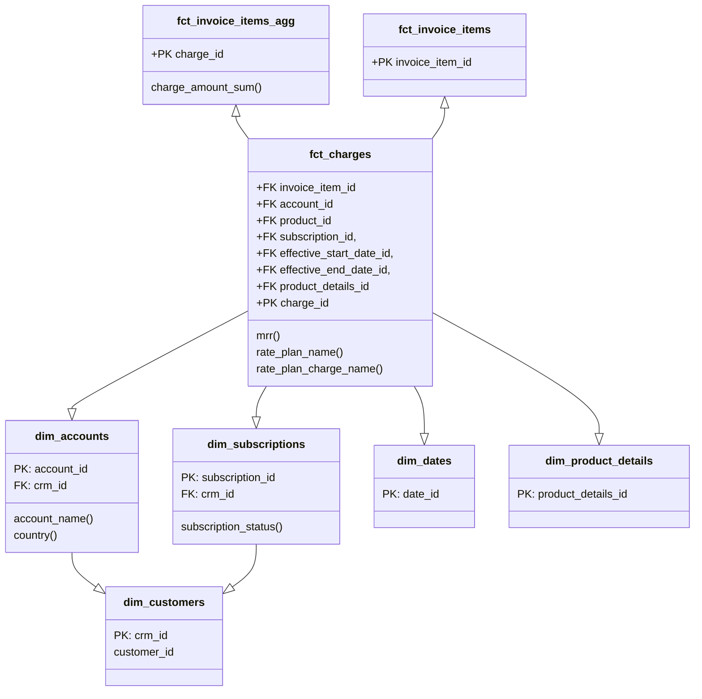

## On this page
{:.no_toc .hidden-md .hidden-lg}

- TOC
{:toc .hidden-md .hidden-lg}

{::options parse_block_html="true" /}

## Background

The Enterprise Dimensional Model (EDM) is GitLab's centralized data model, designed to enable and support the highest levels of accuracy and quality for reporting and analytics. The data model follows the [Kimball](https://www.kimballgroup.com/data-warehouse-business-intelligence-resources/kimball-techniques/dimensional-modeling-techniques/) technique, including a Bus Matrix and Entity Relationship Diagram. Dimensional Modeling is the third step of our overarching [Data Development Approach](https://about.gitlab.com/handbook/business-technology/data-team/organization/#development-approach) (after Requirements definition and UI Wireframing) and this overall approach enables us to repeatedly produce high-quality data solutions. The EDM is housed in our Snowflake [Enterprise Data Warehouse](https://about.gitlab.com/handbook/business-technology/data-team/platform/#our-data-stack) and is generated using [dbt](https://about.gitlab.com/handbook/business-technology/data-team/platform/dbt-guide/).

As of 2021-April, the EDM solves for Go-To-Market funnel analytics and is actively being expanded to solve for Product Usage analytics. Example SiSense dashboards powered by the EDM include:
- [TD: Sales Funnel](https://app.periscopedata.com/app/gitlab/761665/TD:-Sales-Funnel---Target-vs.-Actual)
- [TD: Customer Segmentation](https://app.periscopedata.com/app/gitlab/718514/TD:-Customer-Segmentation)
- [TD: Drillable Net Retention](https://app.periscopedata.com/app/gitlab/763726/TD:-Drillable-Net-Retention)
- [TD: Pricing Dashoard](https://app.periscopedata.com/app/gitlab/748119/TD:-Pricing-Dashboard---Customer-Overview)

### Primary Dimensional Modeling Artifacts
- The [Enterprise Bus Matrix](https://docs.google.com/spreadsheets/d/1j3lHKR29AT1dH_jWeqEwjeO81RAXUfXauIfbZbX_2ME/edit#gid=1372061550) consolidates all of our Fact and Dimension tables into an easy-to-use table and is patterned after the [Kimball bus matrix](https://www.kimballgroup.com/data-warehouse-business-intelligence-resources/kimball-techniques/kimball-data-warehouse-bus-architecture/).
- The [Enterprise Entity Relationship Diagram](https://lucid.app/lucidchart/12ee91c1-7ae5-4e99-96ae-bc51652dfa19/view?page=B47EyN20O.G6#) presents a unified entity-level view of the Fact and Dimension tables.
- The [Dimensional Modelling Development Process](https://about.gitlab.com/handbook/business-technology/data-team/platform/dbt-guide/#dimensional-modeling) covers our modeling standards, including naming conventions.

### The Enterprise Dimensional Model 'BIG PICTURE' Diagram
- We use Lucidchart's [ER diagram template](https://www.lucidchart.com/pages/er-diagrams) to build [Enterprise Entity Relationship Diagram](https://lucid.app/lucidchart/12ee91c1-7ae5-4e99-96ae-bc51652dfa19/view?page=B47EyN20O.G6#) source.

<iframe allowfullscreen frameborder="0" style="width:640px; height:480px" src="https://lucid.app/documents/embeddedchart/12ee91c1-7ae5-4e99-96ae-bc51652dfa19" id="jBktl-f497ew"></iframe>

## What Is Dimensional Modeling?

Dimensional modeling is part of the Business Dimensional Lifecycle methodology developed by [Ralph Kimball](https://en.wikipedia.org/wiki/Ralph_Kimball) which includes a set of methods, techniques and concepts for use in data warehouse design.

_a logical design technique that seeks to present the data in a standard, intuitive framework that allows for high-performance access_

Dimensional Modeling is business process oriented and can be built in 4 steps:

1. Choose the business process e.g. track monthly revenue
1. Declare the grain e.g. per customer
1. Identify the dimensions
1. Identify the fact

### Fact and dimension tables

Dimensional modeling always uses the concepts of facts (measures), and dimensions (context).
Facts are typically (but not always) numeric values that can be aggregated, and dimensions are groups of hierarchies and descriptors that define the facts.

In the simplest version fact table is a central table and is linked to dimensional tables with foreign keys creating a star schema.
Star schema with dimensional tables linking to more dimensional tables are called snowflake schemas, multi fact tables schemas are called galaxies.

### Why is it worth using dimensional modeling 

- Dimensional Modeling has a few flavors, but the overall design is industry standard and has been used successfully for decades
- The FACT and DIM structures result in easy to understand and access data, suitable for business teams
- Dimensional modeling supports centralized implementation of business logic and consistent definitions across business users e.g. one source of truth of customer definition
- The design supports 'plug and play' of new subject areas and in fact the model grows in power as more dimensions are added

## Our Very First Iteration - Solving for ARR and Customer Counts

The initial iteration was proposed in [2019-December](https://gitlab.com/gitlab-data/managers/-/merge_requests/1) and we deployed a model to support ARR/ Customer counts in [2020-May](https://gitlab.com/groups/gitlab-data/-/epics/76). 

## Enterprise Data Model Governance

##### Modeling Development Process

1. Extend the [dimension bus matrix](https://docs.google.com/spreadsheets/d/1j3lHKR29AT1dH_jWeqEwjeO81RAXUfXauIfbZbX_2ME/edit#gid=1372061550) as the blueprint for the EDM.
1. Add the table to the appropriate LucidChart ERD.
1. Model each source in the `PREP` database using source specific schema names.
1. Create `PREP` tables in the `COMMON_PREP` schema in the `PROD` database.
1. Deploy dimension tables. Each dimension also includes a common record entry of -1 key value to represent `unknown`
1. Create fact tables. Populate facts with correct dimension keys, and use the -1 key value for unknowable keys.

##### Naming Standards

It is critical to be intentional when organizing a self-service data environment, starting with naming conventions. The goal is to make navigating the data warehouse easy for beginner, intermediate, and advanced users. We make this possible by following these best practices:

1. FACT TABLES: `fct_<verb>` Facts represent events or real-world processes that occur. Facts can often be identified because they represent the action or 'verb'.  (e.g. session, transaction)
1. DIMENSION TABLES: `dim_<noun>` = dimension table. Dimensions provide descriptive context to the fact records. Dimensions can often be identified because they are 'nouns' such as a person, place, or thing (e.g. customer, employee) The dimension attributes act as 'adjectives'. (e.g. customer type, employee division)
1. Singular naming should be used, e.g. dim_customer, not dim_customers.
1. Use prefixes in table and column names to group like data. Data will remain logically grouped when sorted alphabetically, e.g. dim_geo_location, dim_geo_region, dim_geo_sub_region.
1. Use dimension table names in primary and foreign key naming. This makes it clear to the user what table will need to be joined to pull in additional attributes. For example, the primary key for dim_crm_account is dim_crm_account_id. If this field appears in fct_subscription, it will be named dim_crm_account_id to make it clear the user will need to join to dim_crm_account to get additional account details.

##### Modeling Requirements

- Typically, we will create the dimensions in the `common` schema first, and then the code that builds the fact tables references these common dimensions (LEFT JOIN) to ensure the common key is available. There are some situation where logically we are 100% confident every key that is in the fact table will be available in the dimension. This depends on the source of the dimension and any logic applied.
- Both facts and dimensions should be tested using [Trusted Data Framework (TDF)](/handbook/business-technology/data-team/platform/dbt-guide/#trusted-data-framework) tests.
    - For dimensions, we can test for the existence of the -1 (unknown) dimension_id, and total row counts.
    - For facts, we can test to ensure the number of records/rows is not expanded due to incorrect granularity joins, and can add a golden data test to pull the dimension attribute from the dimension table for the related fact record and compare to the expected value on the golden data record.
- fct_ and dim_ models should be materialized as tables to improve query performance,
- All dimensions must have:
    - An hashed surrogate key,
    - A natural unique key. This key value can be composed from multiple columns to generate uniqueness.
- Models are tested and documented in a schema.yml file in the same directory as the models,
- All facts and dimensions have the following audit columns:
    - revision_number - this is a manually incremented number representing a logical change in the model
    - created_by - this is a GitLab user id
    - updated_by - this is a GitLab user id
    - model_created_at timestamp - this is a static value for when the model was created
    - model_updated_at timestamp - this is the last time the model was updated by someone
    - dbt_created_at timestamp - this is populated by dbt when the table is created
    - dbt_updated_at timestamp - this is the date the data was last loaded. For most models, this will be the same as dbt_created_at with the exception of incremental models.
- The Prep(prep_) and mapping/look-up(map_) tables to support dimension tables should be created in `common_mapping` schema.
- Additional Bridge(bdg_) tables should reside in `common` schema. These tables act as intermediate tables to resolve many-to-many relationships between two tables.

##### ERD Requirements

- Generated in Lucidchart
- Embedded into the dbt docs for all relevant models as an iframe
- Cross-linking from the ERD to the dbt docs for the give model
- Proper relationship connections
- Primary and foreign keys listed
- At least 3-5 other columns that demonstrate the nature of the table and are unlikely to change
- Working SQL reference example

##### Additional Guidelines

The Dimensional Model is meant to be simple to use and designed for the user. Dimensional models are likely to be denormalized, as opposite to source models, making them easier to read and interpret, as well as allowing efficient querying by reducing the number of joins.

- Very often a CTE duplicated across two models qualifies to be a separate fct_/dim_ table

## Schemas

#### Common Prep

The Common Prep Schema has 6 primary use cases at this time. As we iterate on the EDM 2.0, we will evaluate each of these cases for efficacy and performance and determine if there is a more streamlined and efficient approach to perform the transformation being done in Common Marts. The use cases are as follows:

1. Generate Surrogate Keys used in the Common Schema.
1. Clean Source System data such as the conversion of datatypes and replacing NULL values.
1. Generate calculated fields and perform transformations to be used in multiple downstream dimensions and facts in the Common Schema.
1. Bring in Foreign Keys/Identifier fields from other models that are useful for joins in dimensions and facts in the Common Schema.
1. Unioning data coming from multiple sources before loading into dimension tables.
1. No specific case but built for consistency in design.

#### Common Mart

Marts are a combination of dimensions and facts that are joined together and used by business entities for insights and analytics. They are often grouped by business units such as marketing, finance, product, and sales. When a model is in this directory, it communicates to business stakeholders that the data is cleanly modelled and is ready for querying.

Below are some guidlines to follow when building marts:

1. Following the naming convention for fact and dimension tables, all marts should start with the prefix `mart_`.
1. Marts should not be built on top of other marts. Marts should be built on top of FCT and DIM tables. However, there are cases where we have mart level code snippets that join DIM and FCT tables together that needs to be resused across multiple different marts. In these use cases, we can create an ephemeral mart model to make the code snippet available for use by multiple marts without materializing the table in the data warehouse. This keeps the code DRY and allows for maintaining mart logic in one place. The ephemeral mart model should follow the name convention `mart_model_name_ephemeral`. We can also use macros to accomplish the same objective if the use case allows for that.

## Useful links and resources

- [dbt Discourse about Kimball dimensional modelling](https://discourse.getdbt.com/t/is-kimball-dimensional-modeling-still-relevant-in-a-modern-data-warehouse/225/6) in modern data warehouses including some important ideas why we should still use Kimball
- [Dimensional modelling manifesto](https://www.kimballgroup.com/1997/08/a-dimensional-modeling-manifesto/)
- [Dimensional Modelling techniques](https://www.kimballgroup.com/data-warehouse-business-intelligence-resources/kimball-techniques/dimensional-modeling-techniques/) by Kimball Group
