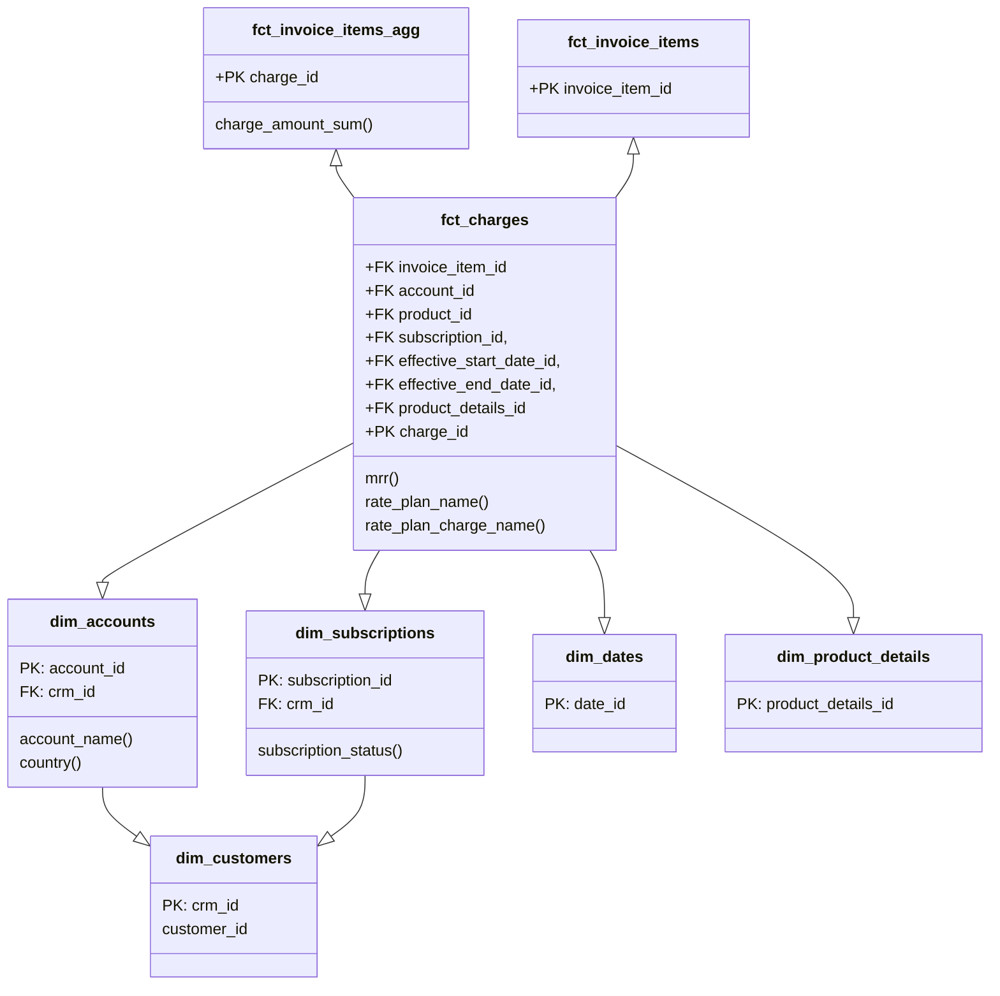

## On this page
{:.no_toc .hidden-md .hidden-lg}

- TOC
{:toc .hidden-md .hidden-lg}

{::options parse_block_html="true" /}

## Background

The Enterprise Dimensional Model (EDM) is GitLab's centralized data model, designed to enable and support the highest levels of accuracy and quality for reporting and analytics. The data model follows the [Kimball](https://www.kimballgroup.com/data-warehouse-business-intelligence-resources/kimball-techniques/dimensional-modeling-techniques/) technique, including a Bus Matrix and Entity Relationship Diagram. Dimensional Modeling is the third step of our overarching [Data Development Approach](https://about.gitlab.com/handbook/business-technology/data-team/organization/#development-approach) (after Requirements definition and UI Wireframing) and this overall approach enables us to repeatedly produce high-quality data solutions. The EDM is housed in our Snowflake [Enterprise Data Warehouse](https://about.gitlab.com/handbook/business-technology/data-team/platform/#our-data-stack) and is generated using [dbt](https://about.gitlab.com/handbook/business-technology/data-team/platform/dbt-guide/).

As of 2021-April, the EDM solves for Go-To-Market funnel analytics and is actively being expanded to solve for Product Usage analytics. Example SiSense dashboards powered by the EDM include:
- [TD: Sales Funnel](https://app.periscopedata.com/app/gitlab/761665/TD:-Sales-Funnel---Target-vs.-Actual)
- [TD: Customer Segmentation](https://app.periscopedata.com/app/gitlab/718514/TD:-Customer-Segmentation)
- [TD: Drillable Net Retention](https://app.periscopedata.com/app/gitlab/763726/TD:-Drillable-Net-Retention)
- [TD: Pricing Dashoard](https://app.periscopedata.com/app/gitlab/748119/TD:-Pricing-Dashboard---Customer-Overview)

### Primary Dimensional Modeling Artifacts
- The [Enterprise Bus Matrix](https://docs.google.com/spreadsheets/d/1j3lHKR29AT1dH_jWeqEwjeO81RAXUfXauIfbZbX_2ME/edit#gid=1372061550) consolidates all of our Fact and Dimension tables into an easy-to-use table and is patterned after the [Kimball bus matrix](https://www.kimballgroup.com/data-warehouse-business-intelligence-resources/kimball-techniques/kimball-data-warehouse-bus-architecture/).
- The [Enterprise Entity Relationship Diagram](https://lucid.app/lucidchart/12ee91c1-7ae5-4e99-96ae-bc51652dfa19/view?page=B47EyN20O.G6#) presents a unified entity-level view of the Fact and Dimension tables.
- The [Dimensional Modelling Development Process](https://about.gitlab.com/handbook/business-technology/data-team/platform/dbt-guide/#dimensional-modeling) covers our modeling standards, including naming conventions.

### The Enterprise Dimensional Model 'BIG PICTURE' Diagram
- We use Lucidchart's [ER diagram template](https://www.lucidchart.com/pages/er-diagrams) to build [Enterprise Entity Relationship Diagram](https://lucid.app/lucidchart/12ee91c1-7ae5-4e99-96ae-bc51652dfa19/view?page=B47EyN20O.G6#) source.

<iframe allowfullscreen frameborder="0" style="width:640px; height:480px" src="https://lucid.app/documents/embeddedchart/12ee91c1-7ae5-4e99-96ae-bc51652dfa19" id="jBktl-f497ew"></iframe>

## What Is Dimensional Modeling?

Dimensional modeling is part of the Business Dimensional Lifecycle methodology developed by [Ralph Kimball](https://en.wikipedia.org/wiki/Ralph_Kimball) which includes a set of methods, techniques and concepts for use in data warehouse design.

_a logical design technique that seeks to present the data in a standard, intuitive framework that allows for high-performance access_

Dimensional Modeling is business process oriented and can be built in 4 steps:

1. Choose the business process e.g. track monthly revenue
1. Declare the grain e.g. per customer
1. Identify the dimensions
1. Identify the fact

### Fact and dimension tables

Dimensional modeling always uses the concepts of facts (measures), and dimensions (context).
Facts are typically (but not always) numeric values that can be aggregated, and dimensions are groups of hierarchies and descriptors that define the facts.

In the simplest version fact table is a central table and is linked to dimensional tables with foreign keys creating a star schema.
Star schema with dimensional tables linking to more dimensional tables are called snowflake schemas, multi fact tables schemas are called galaxies.

### Why is it worth using dimensional modeling 

- Dimensional Modeling has a few flavors, but the overall design is industry standard and has been used successfully for decades
- The FACT and DIM structures result in easy to understand and access data, suitable for business teams
- Dimensional modeling supports centralized implementation of business logic and consistent definitions across business users e.g. one source of truth of customer definition
- The design supports 'plug and play' of new subject areas and in fact the model grows in power as more dimensions are added

## Our Very First Iteration - Solving for ARR and Customer Counts

The initial iteration was proposed in [2019-December](https://gitlab.com/gitlab-data/managers/-/merge_requests/1) and we deployed a model to support ARR/ Customer counts in [2020-May](https://gitlab.com/groups/gitlab-data/-/epics/76). 

## Useful links and resources

- [dbt Discourse about Kimball dimensional modelling](https://discourse.getdbt.com/t/is-kimball-dimensional-modeling-still-relevant-in-a-modern-data-warehouse/225/6) in modern data warehouses including some important ideas why we should still use Kimball
- [Dimensional modelling manifesto](https://www.kimballgroup.com/1997/08/a-dimensional-modeling-manifesto/)
- [Dimensional Modelling techniques](https://www.kimballgroup.com/data-warehouse-business-intelligence-resources/kimball-techniques/dimensional-modeling-techniques/) by Kimball Group
