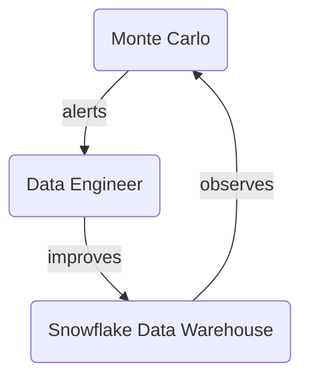

## On this page
{:.no_toc .hidden-md .hidden-lg}

- TOC
{:toc .toc-list-icons .hidden-md .hidden-lg}

{::options parse_block_html="true" /}

---

## What and why

[Monte Carlo](https://www.montecarlodata.com/) (MC) is our [Data Observability](https://www.montecarlodata.com/blog-what-is-data-observability/) tool and helps us **deliver better results more efficiently**.

## How We Operate Monte Carlo

We use the [#Data Obs Channel](https://gitlab.slack.com/archives/C037WAWHERM) for MC alerts.

Monte Carlo will be an integral part of our [Daily Data Triage](https://about.gitlab.com/handbook/business-technology/data-team/how-we-work/triage/) and will replace the [TD Trusted Data Dashboards](https://about.gitlab.com/handbook/business-technology/data-team/platform/dbt-guide/#trusted-data-operations-dashboard).

The whole body of work covering the Monte Carlo rollout at GitLab falls under epic [Rollout Data Observability Tool with 100% coverage of Tier 1 Tables to improve Trusted Data, Data Quality, and Data Team member efficiency](https://gitlab.com/groups/gitlab-data/-/epics/567), where the work breakdown has been done and issues have been created to reflect the necessary steps until we are up and running with Monte Carlo on production. 

## Logging In

Login to Monte Carlo is done via Okta. Go to https://getmontecarlo.com/signin . The following screen appears upon login and after providing your email and clicking "Sign in with SSO", you should be redirected to your Okta login. 

## Navigating the UI

`Coming Soon`

## Adding a New Monitor

`Coming Soon`

## Fine-Tuning an Existing Monitor

`Coming Soon`

## Responding To A Slack Alert

`Coming Soon`
