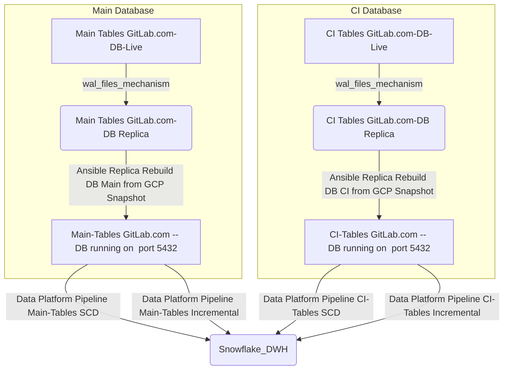

## On this page
{:.no_toc .hidden-md .hidden-lg}

- TOC
{:toc .toc-list-icons .hidden-md .hidden-lg}

{::options parse_block_html="true" /}

---
 
# Source system / application / data pipeline name

Gitlab.com SAAS

## Business Use Case (Please explain what this data will be used for):

Data for reporting and analytics use cases like MR Rate & Performance KPIs (Product development), Product Usage for Gainsight, License Utilization (Customer Success), Product Health Dashboard (Health) Propensity to Expand and Churn Models, Forecast, Territory Management (Sales).
 
### Data information 

* Does it contain MNPI data? `No`
* Does it contain PII data? `Yes`
* How often does the data need to be refreshed? `Extract runs twice per day`
* SLA Description: 
   - Max 32 hours to Snowflake
   - Max 55 hours to Sisense/Tableau 
* Severity in case of an incident
  - [x] Critical - S1
  - [ ] High - S2
  - [ ] Medium - S3
  - [ ] Low - S4
* Who will be using this data, and where (dashboards, snowflake UI, etc.)?
  - Service pushing
  - Sisense
  - Tableau
  - Datapump
* Label used: GitLab.com
* Relevant issues:
  - 
 
## People matrix

| Role | Name | Gitlab Handle |
| ---- | ---- | ------------- |
| System owner | `N/A` | `N/A` | 
| Technical contact for data related questions | `#database` | `N/A` |
| Technical contact for infrastructural related questions | `Slack, type /incident declare, this can be done from any channel.` | `N/A` |
| Data access approval* | `N/A` | `N/A` |
| Business users who need to be informed in case of data outage | See [runbook](https://gitlab.com/gitlab-data/runbooks/-/blob/main/Gitlab_dotcom/Gitlab_DB_recreation_failure.md#slo-breach) | `N/A` |
 
* Data access approval will be involved in the Access Request process and need to give approval if a GitLab team member applies for raw data access.
 
## SLO explaination

The extract runs twice per day on a replica Postgres database with static data. During the extract, we use a static source. If data is added or modified 1 second before the snapshot creation, it's included in the snapshot. However, if data is added or modified 1 second _after_ the snapshot is created, that data is excluded. Therefore, data is always older than the duration of the extraction process (approximately 6 hours) when it lands in Snowflakes `RAW` [layer](/handbook/business-technology/data-team/platform/#raw). After landing in Snowflake it requires [multiple steps](/handbook/business-technology/data-team/platform/dbt-guide/#what-and-why) to make it available for usage in Sisense/Tableau (`PROD` [layer](/handbook/business-technology/data-team/platform/#prod)).
 
The setup currently, and SLO, is set that if the [Ansible Replica Rebuild](handbook/business-technology/data-team/platform/pipelines/SAAS-Gitlab-com/#ansible -replica-ebuild) step fails once (and subsequently we could not run the extract step) it does not lead to a SLO breach.

**Example 1:**
- Sunday 23:59:59AM UTC - Data is added or modified via GitLab.com
- Monday 00:00:00AM UTC - Snapshot created 
- Monday 01:00:00AM UTC - Ansible Replica Rebuild 
- Monday 02:30:00AM UTC - Pipeline to extract data starts
- Monday 06:00:00AM UTC - Data available in `raw` format in Snowflake
- Monday 05:00:00PM UTC - Data available in for consumption in Sisense/Tableau 

**Example 2:**
- Monday 00:00:01AM UTC - Data is added or modified via GitLab.com
- Monday 12:00:00PM UTC - Snapshot created 
- Monday 01:00:00PM UTC - Ansible Replica Rebuild 
- Monday 02:30:00PM UTC - Pipeline to extract data starts
- Monday 06:00:00PM UTC - Data available in `raw` format in Snowflake**
- Tuesday 05:00:00PM UTC - Data available in for consumption in Sisense/Tableau

**Example 3:**
- Monday 12:00:01PM UTC - Data is added or modified via GitLab.com
- Tuesday 00:00:00AM UTC - Snapshot created 
- Tuesday 01:00:00AM UTC - Ansible Replica Rebuild fails
- No extract
- Tuesday 12:00:00PM UTC - Snapshot created
- Tuesday 02:30:00PM UTC - Pipeline to extract data starts
- Tuesday 06:00:00PM UTC - Data available in `raw` format in Snowflake
- Wednesday 05:00:00PM UTC - Data available in for consumption in Sisense/Tableau

## Data pipeline (technical) description
 
There are **dedicated** gitlab.com _read_ replica database instances used for data pulls into Snowflake. There are 2 replicas available, with each having their own replication frequency and behavior.  



 - `GitLab.com-DB (Main and CI) created from GCP snapshots` 
    Since GCP snapshot is scheduled to takes snapshot every 6 hours. The current schedule  for Snapshot restoration is set as below.
      - GitLab.com-DB(Main) 
          - 01:00 UTC  This should restore GCS snapshot of current_day (00:00 Hours) 
          - 13:00 UTC  This should restore GCS snapshot of current_day (12:00 Hours)
      - GitLab.com-DB(Ci) 
          - 01:10 UTC  This should restore GCS snapshot of current_day (00:00 Hours)
          - 13:10 UTC  This should restore GCS snapshot of current_day (12:00 Hours)

The build of the database takes about 45 mins. This results in two available time window everyday to query this database.
    - 02:00 UTC to 13:00 UTC 
    - 14:00 UTC to 01:00 UTC 
Extracting data from this database outside the window will result in an error, but no data loss will occur. The recreation process is executed in this [project](https://gitlab.com/gitlab-com/gl-infra/data-server-rebuild-ansible/activity).  

- `Gitlab.com-DB (Main and CI) Live Replica` is populated with data via WAL files continuously. 

During development and tests activities, we faced issues with loading out of the `Gitlab.com-DB Live Replica` as a result of write and read actions at the same time (query conflicting). To increase the time for a query conflicting with recovery, there are `max_standby_archive_delay` and `max_standby_streaming_delay` settings. This should be configured on the server side and could result increasing lag on the replication process. We should avoid that and thus we are reading out of a more static data source.

### Ansible Replica Rebuild 
Currently, to ensure a stable data-feed, both the incremental and full loads utilise the `GitLab.com-DB (Main and CI) created from GCP snapshots` instance.  The read replicas are build by an Ansible process which is configured in this [project](https://gitlab.com/gitlab-com/gl-infra/data-server-rebuild-ansible). 

### Monitoring/Alerting

The Data Platform Team is notified when the build fails via email and in Slack channel `#data-pipelines`. There is [runbook](https://gitlab.com/gitlab-data/runbooks/-/blob/main/Gitlab_dotcom/Gitlab_DB_recreation_failure.md) entry of where to look for issue in the clone setup. 

Failure alerts looks like below 


### Incremental and full loads

1. **Incremental extract** 
- This is the most convenient methodology, a minimal amount of records is transferred. Prerequisite is that there is a delta column available on the source table level
- +/- 120 tables are incrementally extracted
- Load time about 1 hour 30 Minutes
- Executed every 12 hours 
2. **Full extract** (at this moment +/- 100 tables & load tie about 4 hours)
- This is the alternative if no delta column is available on source table level, or if records are deleted in the source.
- +/- 70 tables are incrementally extracted
- Load time about 2 Hour 20 Minutes
- Executed every 12 hours

The extraction methodology is determined via the [manifest file](https://gitlab.com/gitlab-data/analytics/-/tree/master/extract/postgres_pipeline/manifests_decomposed). 

Below a overview of the end 2 end flow. From GCP snapshot creation up untill dbt processing:


#### Large tables backfilling

In case files in the `Postgres` pipeline definition are changed in the files:
* [el_gitlab_com_ci_db_manifest.yaml](https://gitlab.com/gitlab-data/analytics/-/blob/master/extract/postgres_pipeline/manifests_decomposed/el_gitlab_com_ci_db_manifest.yaml) and
* [el_gitlab_com_db_manifest.yaml](https://gitlab.com/gitlab-data/analytics/-/blob/master/extract/postgres_pipeline/manifests_decomposed/el_gitlab_com_db_manifest.yaml) 

and the changes lead to modifying the table structure and will trigger the backfill. In case some of the huge tables are changed - will be running for a long duration generating an outage for a large number of data sets downstream. 

Check the number of records in the table using the `SQL` command:
```sql
SELECT COUNT(1)
  FROM raw.tap_postgres.{TABLE_NAME};
```

A suitable example of the enormous table is `CI_JOB_ARTIFACT`.

It is difficult to say what represents _"huge"_ table,  probably everything with over `200m` records should be considered a huge table.
 
> **Warning:** In case you have a huge table among changed tables, avoid deploying the code during the work days. 

Generally, when we have had to do backfill on tables with large volumes of data, we should do it on a weekend so that no business stakeholders are affected by the long execution of backfilling. 

This recommendation is relevant to 2 `DAG`s which are affected by the changes:
* [el_gitlab_com_ci_db_incremental_backfill](https://airflow.gitlabdata.com/tree?dag_id=el_gitlab_com_ci_db_incremental_backfill)
* [el_gitlab_com_db_incremental_backfill](https://airflow.gitlabdata.com/tree?dag_id=el_gitlab_com_db_incremental_backfill)

A matching example is exposed in the [**issue**](https://gitlab.com/gitlab-data/analytics/-/issues/15990) should use to backfill your changes.

### Manual Backfill of table from Postgres To Snowflake

This section is used only when we need to do a backfill for a table that has below condition satisfied of gitlab Postgres database. 
- Airflow task for the table has been completed to the latest date. 
- The data in the table is missing for a date or date range for which catch-up has already been completed. 
- If dropping the table and reloading will breach the SLO.

In the above case, we can use this approach to pull the data and load it to the snowflake target table. It has been done for one of the table in this [issue (internal link)](https://gitlab.com/gitlab-data/analytics/-/merge_requests/5003)

Below is the step to be followed for the same. 

Step 1:- Connect to Kubernetes pod:<br>
 `kubectl exec -ti <pod_name> -c <webserver|scheduler> /bin/bash`.<br>

 In our current setup: <br>
 `kubectl exec -ti airflow-deployment-7484d899c6-tfm8v -c scheduler /bin/bash` 

As gcp client changed some things from time to time, you might encounter the following error: `Unable to connect to the server: x509: certificate signed by unknown authority`. To resolve this, run the following command:<br>
`gcloud container clusters get-credentials data-ops --zone us-west1-a --project gitlab-analysis` 

Step 2:- Established connection to Postgres using python library. This is required to go through the Kubernetes pod because we don't have access to Postgres directly. The table for which the data has to be extracted picks up the query from the respective manifest file. Below is the step to execute the query and fetch the output in the csv file. In this example, it is being done for table `experiment_subjects`
```
python3
import psycopg2
conn = psycopg2.connect(
host="",
database="",
user="",
password="",
port=,
options='-c statement_timeout=900000'
)
cur=conn.cursor()
sqlstr = "COPY (SELECT id , experiment_id, user_id, group_id, project_id, variant, created_at, updated_at, converted_at, context FROM experiment_subjects WHERE updated_at BETWEEN '2021-04-05T19:14:20'::timestamp AND '2021-04-26T10:08:16'::timestamp) TO STDOUT WITH CSV HEADER "
with open('experiment_subjects.csv','w') as f:
cur.copy_expert(sqlstr, f)
```
This will generate the file in the Kubernetes pod itself. 
Notes:- The credentials need to be picked up from the secure vault

Step 3: Upload the file using gsutil to GCS to postgres_pipeline
```
  gsutil cp experiment_subjects.csv gs://postgres_pipeline/
```
Step 4: Prepare the timestamp variable as we are not pushing this through the dataframe to enrich the file with _uploaded_at column. Hence it needs to be done using the command line.
```
  import time 
  print(time.time())
```
The value returned will be used while performing copy into snowflake as target table has _uploaded_at column which needs to be populated. 
Step 5: Read each column defined in the manifest file as below and add a _uploaded_at timestamp column to it like below. This needs to be executed in snowflake to validate the data is correct and it can also be used to do a certain audit. 
```
SELECT $1 as id ,
$2 as experiment_id,
$3 as user_id,
$4 as group_id,
$5 as project_id,
$6 as variant,
$7 as created_at,
$8 as updated_at,
$9 as converted_at,
$10 as context, '1621841251.8090081' as _uploaded_at
FROM `@stage`/experiment_subjects.csv ;
```
The stage is the Postgres pipeline stage.

Step 6: Load the data using copy into and load this data in RAW.tap_postgres.gitlab_db_experiment_subjects table.
 
### GitLab Database Schema Changes and DangerFile

The Data Platform team maintains a Dangerfile in the main GitLab project [here](https://gitlab.com/gitlab-org/gitlab/-/blob/master/danger/datateam/Dangerfile) with the purpose of alerting the `@gitlab-data/engineers` group about any changes to the gitlab.com source schema definition file. Being notified about source schema changes is essential to avoiding errors in the extraction process from the GitLab.com database since extraction is based on running a series of select statements. The data engineer on triage for any given day is the DRI for investigating schema changes as well as creating issues for any needed action from the data team.

### Trusted data framework tests

On this data pipeline, 2 types of Trusted Data Framework tests are executed:
1. Source freshness.
2. Data actual tests.

Data is monitored via Monte-Carlo

### Decommission Postgres pipeline table

When one (or more) tables require decommissioning from the `Postgres` pipeline, follow the steps mentioned in the [**Runbook guideline**](https://gitlab.com/gitlab-data/runbooks/-/blob/main/Gitlab_dotcom/table_decommission/README.md) to avoid any failure caused due to removal of the table.

### Gitlab.com additional table details
[This handbook page](https://about.gitlab.com/handbook/business-technology/data-team/platform/pipelines/SAAS-Gitlab-com/gitlab-com-additional-table-details/) has more detail on any tables that don't fit the normal mold.

So far, that includes these tables:
- `merge_request_diff_commits`
