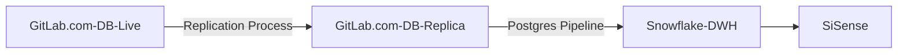

## On this page
{:.no_toc .hidden-md .hidden-lg}

- TOC
{:toc .hidden-md .hidden-lg}

{::options parse_block_html="true" /}

## Background
The data warehouse contains source data from different source systems, via different extraction methodologies (i.e. Fivetran, Stich and Postgres pipeline). This page describes the different data sources and the way we extract this data via data pipelines.

## Postgres Pipeline GitLab Database

The gitlab.com read replica database used for data pulls into Snowflake occasionally has problems with replication lag. This means the database is behind in applying changes to the replica from the primary database. This can kill queries from pgp extracts and cause significant delays. The amount of lag can be monitored by [checking Thanos](https://thanos-query.ops.gitlab.net/graph?g0.range_input=2d&g0.max_source_resolution=0s&g0.expr=pg_replication_lag%7Btype%3D%22postgres-archive%22%2Cenv%3D%22gprd%22%7D&g0.tab=0&g1.range_input=3d&g1.max_source_resolution=0s&g1.expr=rate(pg_xlog_position_bytes%7Benv%3D%22gprd%22%7D%5B1m%5D)%20and%20on%20(instance)%20(pg_replication_is_replica%20%3D%3D%200)&g1.tab=0).  

The Infrastructure team has an alert setup to post to the `#alerts` slack channel when the replication lag is over 3 hours.  The name of this alert is `PostgreSQL_ReplicationLagTooLarge_ArchiveReplica`.  Monitoring the `#alerts` channel for this alert name can help proactively address high lag situations.

### Incremental and full loads
1. Incremental extract 
- This is the most convenient methodology, a minimal amount of records is transferred. Prerequisite is that there is a delta column available on the source table level
- +/- 120 tables are incrementally extracted
- Load time about 1 hour
- Executed every 6 hours
2. Full extract (at this moment +/- 100 tables & load tie about 4 hours)
- This is the alternative if no delta column is available on source table level, or if records are deleted in the source.
- +/- 100 tables are incrementally extracted
- Load time about 4 hours
- Executed every 24 hours

The extraction methodology is determined via the manifest file. 

### GitLab Database Schema Changes and DangerFile

The data engineering team maintains a Dangerfile in the main GitLab project [here](https://gitlab.com/gitlab-org/gitlab/-/blob/master/danger/datateam/Dangerfile) with the purpose of alerting the `@gitlab-data/engineers` group about any changes to the gitlab.com source schema definition file. Being notified about source schema changes is essential to avoiding errors in the extraction process from the GitLab.com database since extraction is based on running a series of select statements. The data engineer on triage for any given day is the DRI for investigating schema changes as well as creating issues for any needed action from the data team.

## Using SheetLoad

SheetLoad is the process by which a Google Sheets and CSVs from GCS or S3 can be ingested into the data warehouse.

Technical documentation on usage of SheetLoad can be found in the [readme](https://gitlab.com/gitlab-data/analytics/tree/master/extract/sheetload) in the data team project.

If you want to import a Google Sheet or CSV into the warehouse, please [make an issue](https://gitlab.com/gitlab-data/analytics/issues/new?issue%5Bassignee_id%5D=&issue%5Bmilestone_id%5D=) in the data team project using the "CSV or GSheets Data Upload" issue template. This template has detailed instructions depending on the type of data you want to import and what you may want to do with it.

### Considerations
{: #mind-about-sheetload}

SheetLoad should primarily be used for data whose canonical source is a spreadsheet - i.e. Sales quotas. If there is a source of this data that is not a spreadsheet, you should at least [make an issue for a new data source](https://gitlab.com/gitlab-data/analytics/-/issues/new?issuable_template=New%20Data%20Source) to get the data pulled automatically. However, if the spreadsheet is the SSOT for this data, then SheetLoad is the appropriate mechanism for getting it into the warehouse.

### Loading into Snowflake

SheetLoad is designed to make the table in the database an exact copy of the sheet from which it is loading. Whenever SheetLoad detects a change in the source sheet, it will drop the database table and recreate it in the image of the updated spreadsheet. This means that if columns are added, changed, etc. it will all be reflected in the database. Changes are detected within 24 hours.

### Preparing for SheetLoad

Except for where absolutely not possible, it is best that the SheetLoad sheet import from the original Google Sheet directly using the `importrange` function. This allows you to leave the upstream sheet alone while enabling you to format the SheetLoad version to be plain text. Any additional data type conversions or data cleanup can happen in the base dbt models. (This does not apply to the Boneyard.)

Some additional considerations for preparing the data for loading:

* format all numeric columns to have no commas or other symbols - 1000.46 instead of $1,000.46
* use simple headers where possible - `user_name` instead of `GitLab - User Name`
* use blank cells to indicate no data. blank cells are stored as `null` in the database.

### Modeling

Before regular SheetLoad data can be accessible by Sisense, it has to be modeled via dbt. A minimum of 2 models will be made for the sheet: a [source model](/handbook/business-technology/data-team/platform/dbt-guide/#source-models) and a [staging model](/handbook/business-technology/data-team/platform/dbt-guide/#staging). These will be made by a member of the data team once you've [made an issue](https://gitlab.com/gitlab-data/analytics/issues/new?issue%5Bassignee_id%5D=&issue%5Bmilestone_id%5D=) in the data team project.

### Boneyard

The `boneyard` schema is where data can be uploaded from a spreadsheet and it will be directly available for querying within Sisense. However, this is for instances where a one-off analysis is needed and/or you need to join this to data already in the warehouse. It is called Boneyard to highlight that this data is relevant only for an **_ad hoc/one off_** use case and will become stale within a relatively short period of time. We will periodically remove stale data from the `boneyard` schema.

### Certificates

If you are adding Certificates to SheetLoad, refer to the instructions in the [People Group page](/handbook/people-group/learning-and-development/certifications/#step-5-add-to-sheetload)

