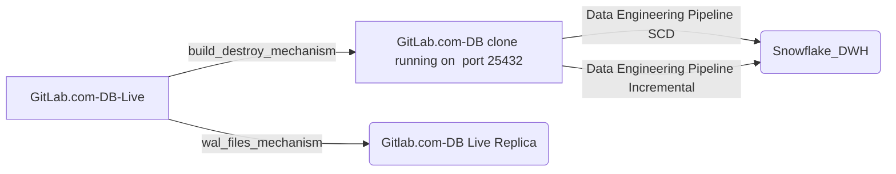

## On this page
{:.no_toc .hidden-md .hidden-lg}

- TOC
{:toc .hidden-md .hidden-lg}

{::options parse_block_html="true" /}

## Background
The data warehouse contains source data from different source systems, via different extraction methodologies (i.e. Fivetran, Stich and Postgres pipeline). This page describes the different data sources and the way we extract this data via data pipelines.

## GitLab Postgres Database

There are **dedicated** gitlab.com _read_ replica database instances used for data pulls into Snowflake. There are 2 replicas available, with each having their own replication frequency and behavior.  



 - `GitLab.com-DB clone` will be destroyed at 10:30PM UTC and rebuilt at 11:15PM UTC. This results in an available time window between 00:00AM UTC to 11:30PM UTC to query this database. If data is extracted from this replica outside the window, an error will occur, but it will not result in any data loss.
- `Gitlab.com-DB Live Replica` is populated with data via WAL files continuously. 

Currently, to ensure a stable data-feed, both the incremental and full loads utilise the `GitLab.com-DB clone` instance. During development and tests activities, we faced issues with loading out of the `Gitlab.com-DB Live Replica` as a result of write and read actions at the same time (query conflicting). To increase the time for a query conflicting with recovery, there are `max_standby_archive_delay` and `max_standby_streaming_delay` settings. This should be configured on the server side and could result increasing lag on the replication process. We should avoid that and thus we are reading out of a more static data source.

### Incremental and full loads
1. Incremental extract 
- This is the most convenient methodology, a minimal amount of records is transferred. Prerequisite is that there is a delta column available on the source table level
- +/- 120 tables are incrementally extracted
- Load time about 1 hour
- Executed every 6 hours
2. Full extract (at this moment +/- 100 tables & load tie about 4 hours)
- This is the alternative if no delta column is available on source table level, or if records are deleted in the source.
- +/- 100 tables are incrementally extracted
- Load time about 4 hours
- Executed every 24 hours

The extraction methodology is determined via the manifest file. 

### Manual Backfill of table from Postgres To Snowflake
This section is used only when we need to do a backfill for a table that has below condition satisfied of gitlab Postgres database. 
- Airflow task for the table has been completed to the latest date. 
- The data in the table is missing for a date or date range for which catch-up has already been completed. 
- If dropping the table and reloading will breach the SLO.

In the above case, we can use this approach to pull the data and load it to the snowflake target table. It has been done for one of the table in this [issue](https://gitlab.com/gitlab-data/analytics/-/merge_requests/5003)

Below is the step to be followed for the same. 

Step 1:- Connect to Kubernetes pod
 `kubectl exec -ti <pod_name> -c <webserver|scheduler> /bin/bash`.
 In our current setup 
 `kubectl exec -ti airflow-deployment-7484d899c6-tfm8v -c scheduler /bin/bash` 

Step 2:- Established connection to Postgres using python library. This is required to go through the Kubernetes pod because we don't have access to Postgres directly. The table for which the data has to be extracted picks up the query from the respective manifest file. Below is the step to execute the query and fetch the output in the csv file. In this example, it is being done for table `experiment_subjects`
```
python3
import psycopg2
conn = psycopg2.connect(
host="",
database="",
user="",
password="",
port=,
options='-c statement_timeout=900000'
)
cur=conn.cursor()
sqlstr = "COPY (SELECT id , experiment_id, user_id, group_id, project_id, variant, created_at, updated_at, converted_at, context FROM experiment_subjects WHERE updated_at BETWEEN '2021-04-05T19:14:20'::timestamp AND '2021-04-26T10:08:16'::timestamp) TO STDOUT WITH CSV HEADER "
with open('experiment_subjects.csv','w') as f:
cur.copy_expert(sqlstr, f)
```
This will generate the file in the Kubernetes pod itself. 
Notes:- The credentials need to be picked up from the secure vault

Step 3: Upload the file using gsutil to GCS to postgres_pipeline
```
  gsutil cp experiment_subjects.csv gs://postgres_pipeline/
```
Step 4: Prepare the timestamp variable as we are not pushing this through the dataframe to enrich the file with _uploaded_at column. Hence it needs to be done using the command line.
```
  import time 
  print(time.time())
```
The value returned will be used while performing copy into snowflake as target table has _uploaded_at column which needs to be populated. 
Step 5: Read each column defined in the manifest file as below and add a _uploaded_at timestamp column to it like below. This needs to be executed in snowflake to validate the data is correct and it can also be used to do a certain audit. 
```
SELECT $1 as id ,
$2 as experiment_id,
$3 as user_id,
$4 as group_id,
$5 as project_id,
$6 as variant,
$7 as created_at,
$8 as updated_at,
$9 as converted_at,
$10 as context, '1621841251.8090081' as _uploaded_at
FROM `@stage`/experiment_subjects.csv ;
```
The stage is the Postgres pipeline stage.

Step 6: Load the data using copy into and load this data in RAW.tap_postgres.gitlab_db_experiment_subjects table.

### GitLab Database Schema Changes and DangerFile

The data engineering team maintains a Dangerfile in the main GitLab project [here](https://gitlab.com/gitlab-org/gitlab/-/blob/master/danger/datateam/Dangerfile) with the purpose of alerting the `@gitlab-data/engineers` group about any changes to the gitlab.com source schema definition file. Being notified about source schema changes is essential to avoiding errors in the extraction process from the GitLab.com database since extraction is based on running a series of select statements. The data engineer on triage for any given day is the DRI for investigating schema changes as well as creating issues for any needed action from the data team.

### Trusted data framework tests

On this data pipeline, 3 types of Trusted Data Framework tests are executed:
1. Source freshness.
2. Row-count tests.
3. Data actual tests.

 **Source freshness** is checked via the dbt functionality.
<br> **Row count** and **Data actual** are performed via an extra `DAG`, named `..` in a Airflow and the results are stored in `..`

## SheetLoad

SheetLoad is the process by which a Google Sheets and CSVs from GCS or S3 can be ingested into the data warehouse.

Technical documentation on usage of SheetLoad can be found in the [readme](https://gitlab.com/gitlab-data/analytics/tree/master/extract/sheetload) in the data team project.

If you want to import a Google Sheet or CSV into the warehouse, please [make an issue](https://gitlab.com/gitlab-data/analytics/issues/new?issue%5Bassignee_id%5D=&issue%5Bmilestone_id%5D=) in the data team project using the "CSV or GSheets Data Upload" issue template. This template has detailed instructions depending on the type of data you want to import and what you may want to do with it.

### Considerations
{: #mind-about-sheetload}

SheetLoad should primarily be used for data whose canonical source is a spreadsheet - i.e. Sales quotas. If there is a source of this data that is not a spreadsheet, you should at least [make an issue for a new data source](https://gitlab.com/gitlab-data/analytics/-/issues/new?issuable_template=New%20Data%20Source) to get the data pulled automatically. However, if the spreadsheet is the SSOT for this data, then SheetLoad is the appropriate mechanism for getting it into the warehouse.

### Loading into Snowflake

SheetLoad is designed to make the table in the database an exact copy of the sheet from which it is loading. Whenever SheetLoad detects a change in the source sheet, it will drop the database table and recreate it in the image of the updated spreadsheet. This means that if columns are added, changed, etc. it will all be reflected in the database. Changes are detected within 24 hours.

### Preparing for SheetLoad

Except for where absolutely not possible, it is best that the SheetLoad sheet import from the original Google Sheet directly using the `importrange` function. This allows you to leave the upstream sheet alone while enabling you to format the SheetLoad version to be plain text. Any additional data type conversions or data cleanup can happen in the base dbt models. (This does not apply to the Boneyard.)

Some additional considerations for preparing the data for loading:

* format all numeric columns to have no commas or other symbols - 1000.46 instead of $1,000.46
* use simple headers where possible - `user_name` instead of `GitLab - User Name`
* use blank cells to indicate no data. blank cells are stored as `null` in the database.

### Modeling

Before regular SheetLoad data can be accessible by Sisense, it has to be modeled via dbt. A minimum of 2 models will be made for the sheet: a [source model](/handbook/business-technology/data-team/platform/dbt-guide/#source-models) and a [staging model](/handbook/business-technology/data-team/platform/dbt-guide/#staging). These will be made by a member of the data team once you've [made an issue](https://gitlab.com/gitlab-data/analytics/issues/new?issue%5Bassignee_id%5D=&issue%5Bmilestone_id%5D=) in the data team project.

### Boneyard

The `boneyard` schema is where data can be uploaded from a spreadsheet and it will be directly available for querying within Sisense. However, this is for instances where a one-off analysis is needed and/or you need to join this to data already in the warehouse. It is called Boneyard to highlight that this data is relevant only for an **_ad hoc/one off_** use case and will become stale within a relatively short period of time. We will periodically remove stale data from the `boneyard` schema.

### Certificates

If you are adding Certificates to SheetLoad, refer to the instructions in the [People Group page](/handbook/people-group/learning-and-development/certifications/#step-5-add-to-sheetload)

