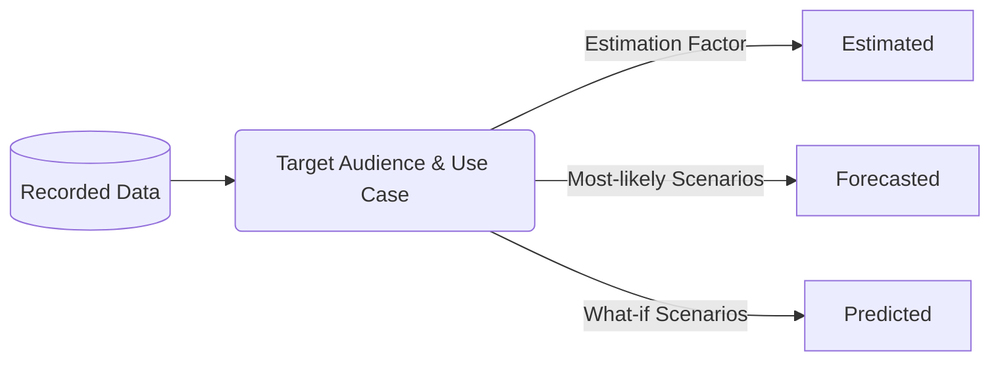

## On this page
{:.no_toc .hidden-md .hidden-lg}

- TOC
{:toc .toc-list-icons .hidden-md .hidden-lg}

---

## Overall Look and Feel

### KPI Charts

`under construction`

### Filterable Reports

`under construction`

### Choosing the Right Chart

`under construction`

## Colors, Labels, and Data Values

### Standard Color Pallete

SiSense charts use the standard GitLab color pallete.

### Rounding

To round or not to round? Know your audience. Present numbers suitable for your target audience and analysis use cases.
- Executive-level charts do not normally require multiple digits of precision and rounding to the nearest ten, hundred, or thousand is sufficient.
- Depending on the chart, 1 or 2 significant digits on percentages may be required for totals to equal 100%.
- In general except for currency, numbers should be displayed in their full form.

### Currency

- All currency is presented in USD.
- At $10,000 and above, each `000` is replaced with a k; example $10k instead of $10,000.
- At $1,000,000 and above, each `000,000` is replaced with a m; example $10m instead of $10,000,000.

### Data and Time 

Fiscal Dates should be extracted from the DIM_DATE dimension table.

Date formats must adhere to the [GitLab Writing Style Guidelines](https://about.gitlab.com/handbook/communication/#writing-style-guidelines):
- Dates are yyyy-mm-dd
- Time is presented as a 24 hour clock using UTC
- Fiscal Quarter is Qn, example Q1
- Fiscal Year is FYyy, example FY21
- Fiscal Year and Quarter is FYyy-Qn, example FY21-Q2 

### Recorded and Calculated Data

Data is prepared for presentation, or reporting, for a specific target audience and use case. **Recorded Data** is the basis for all **Calculated Data**.

- **Recorded Data** - "Factual" data which originates from a verifiable source and observable events. To aid in verification, recorded data commonly includes audit metadata such as the name of data creator/source, the date and time of data capture, and the location where the event occurred.
- **Estimated Data** - calculated data based on Recorded data plus an Estimation Factor. The Estimation Factor is typically based on historical data trends over a meaningful and relevant period of time. [Estimation](https://en.wikipedia.org/wiki/Estimation) is widely used across all industries and domains.
- **Forecasted Data** - calculated data based on historical Recorded data plus assessments based on "most-likely" future scenarios. [Forecasting](https://en.wikipedia.org/wiki/Forecasting) is commonly used in Financial Planning.
- **Predicted Data** - calculated data based on historical Recorded data plus assessments based on "what-if" future scenarios.

#### Presentation

Recorded data does not require special labeling, but Calculated data does. Calculated data should _always_ be:
- clearly labeled, such as in the chart title and legend (E.g. use "Estimated Seats" instead of "Seats")
- clearly identified in the chart elements (E.g. use different line styles when mixing Calculation types on the same chart)

## Custom Python Modules

Python modules help with maintaining reusable, quality and clean code in a single place.

To start / modify a custom python module start a MR in the [periscope/master branch of the Sisense project](https://gitlab.com/gitlab-data/periscope/-/tree/periscope/master). You can see the available custom modules in Sisense at any point at the left side menu of the Create Chart page.

Official documentation on Custom Modules can be found [HERE](https://dtdocs.sisense.com/article/custom-modules).
