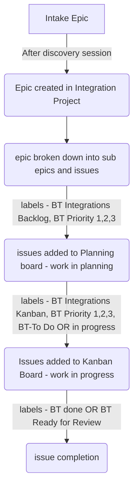

{::options parse_block_html="true" /}

<link rel="stylesheet" type="text/css" href="/stylesheets/biztech.css" />

## On this page
{:.no_toc .hidden-md .hidden-lg}

- TOC
{:toc .hidden-md .hidden-lg}

## Integrations - SDLC Process

### Quick links
- [Integration Planning Board](https://gitlab.com/groups/gitlab-com/-/boards/3224617)
- [Integration Kanban Board](https://gitlab.com/groups/gitlab-com/-/boards/2031131?milestone_title=22%20-%20BT%20EntApps%20-%202021-09-07&label_name%5B%5D=BT%20Integrations%3A%3AKanban)
- [Backlog filter](https://gitlab.com/groups/gitlab-com/-/issues?scope=all&utf8=%E2%9C%93&state=opened&label_name%5B%5D=BT%20Integrations%3A%3ABacklog)
- [Nexus Project](https://gitlab.com/gitlab-com/business-technology/enterprise-apps/integrations/nexus)

### SDLC
The page defines the different workflow stages and artifacts used to define those stages. In here, we use combinations of milestones, boards, epics, issues and labels to manage and plan the work.

#### SDLC stage 1 - Intake
The work lifecycle starts when BSAs create epics/issues in Intake Project and tag integration team for the implementation. 
Once integration team is onboarded depending upon the size of the project (Small, Medium, large) it traverses through the [project workflow](https://gitlab.com/gitlab-com/business-technology/enterprise-apps/integrations/integrations-work/-/issues/289) and goes live.
Labels specific to this stage: `EntApps Intake`

#### SDLC stage 2 - Design
During the Design phase of the project, the epic or user stories are created in the [Gitlab.com group](https://gitlab.com/gitlab-com). It describes the unit of work and its acceptance criteria. The epic is then sub divided into issues. 

Issues are the smallest unit of work. They are created in the [Nexus Project](https://gitlab.com/gitlab-com/business-technology/enterprise-apps/integrations/nexus/-/issues). As a good practice, make sure the merge requests in the Nexus project have issue number in their names. For example: [WIP: #20 Ship coverage report artifact from tests](https://gitlab.com/gitlab-com/business-technology/enterprise-apps/integrations/nexus/-/merge_requests/25)

These issues are then added to the [BT Integrations Planning board](https://gitlab.com/groups/gitlab-com/-/boards/3224617) via label `BT Integrations::Backlog`. Good practice is to use additional labels to define the priority like BT Priority 1, 2, 3 and the nature of work like Field Marketing, Finance Systems or Bug. The board comes in handy while planning for milestones (each of 1 month long) where we know what is to be planned in the current milestone and what goes in the next one as per their priority. [Guide on how to use and plan milestones](#3-milestone-process)

#### SDLC stage 3 - Build
During the build phase, when we plan for the upcoming milestone, issues are transfered from Backlog board to Kanban board by assiging the label `BT Integrations::Kanban`. This is the board which holds all the in-progress work and therefore all the issues in the current miletsone must have this label.

#### SDLC stage 4 & 5 - Test and Deploy
When the issues are complete, they are either closed or marked with label `BT::Done` or mark the issue merge request as `BT::Ready for Review` . At this stage, the code is merged in master branch and is ready for peer review.

Once reviewed and approved, the merge request is marked `BT::Ready to Deploy`

#### SDLC Flowchart

#### SDLC Artifact

##### Labels

| Label                         | Description                                                                                     |      project/group     |  type  |
| :---------------------------- | :---------------------------------------------------------------------------------------------- | :--------------------: | :----: |
| BusinessTechnology                   | Business Technology is actively involved                                                                        | gitlab-com |    - |
| BT Integrations::Backlog                       | Add issues to the Planning board              | gitlab-com |    - |
| BT Integrations::Kanban                            | Add issues to the In progress board work                                                                   | gitlab-com |    - |
| BT-Priority::1               | Critical                                                                                        | gitlab-com | scoped |
| BT-Priority::2               | Important not urgent                                                                            | gitlab-com | scoped |
| BT-Priority::3               | No rush to do, but please do it.                                                                | gitlab-com | scoped |
| BT::To Do                   | This is for work that's not started yet                                                        | gitlab-com| scoped |
| BT::Blocked                       | This blocks other work                                                                          | gitlab-com | scoped |
| BT::In Progress                | This is for work that's in progress stage request                                                                                  | gitlab-com | scoped |
| BT::Done               | This is for work completed by the assignee request                                                                                  | gitlab-com | scoped |
| BT::Ready to Deploy                | This is for merge request ready to be deployed in master request                                                                                  | gitlab-com | scoped |
| BT::Ready for Review                | This is for merge request ready for team memeber review request                                                                                  | gitlab-com | scoped |
| Bug               | This is for issues raised in the delivered work request                                                                                  | gitlab-com | scoped |

#### Issue Weights

Issue weight is an estimate of how much time is required to complete the tasks in the issue. The idea is to go over the problem statement raised in the issue with the team that will be working on it and put it into one of 5 buckets: XS, S, M, L, XL as a way to group the unit of work.

**Process**

- When an issue is opened for the Enterprise App team with the appropriate [labels](/handbook/business-technology/how-we-work/#labels), a team member must be assigned.
- The assignee works with all parties involved in the issue to recommend a weight.
- After the issue is closed, the assignee who helped coordinating the the work can update the weight to reflect the actual effort if different from the original weight.
    They should provide a reason and mention it in the Enterprise Applications Sync or in the [Enterprise Applications wiki](https://gitlab.com/gitlab-com/business-technology/enterprise-apps/enterprise-applications-sync/-/wikis/Enterprise-Applications-weekly-sync) to help us improve our weighting accuracy going forward.

**Guidelines**

| Size/Weight | Description | Estimate work range  |
| ----------- | ----------- | ----------- | 
| XS:1        | A task.   **Example:**  - Documentation update. | <4 hours |
| S:2         | The problem statement has been determined and a solution identified. No need for (extra) discussion with other teams or people.   **Examples are:**  - A problem that has been discussed but needs an issue to track the development and outcome. - Regular bugs to be addressed by the Integrations engineers where some investigation has already taken | 4 hours / half a day |
| M:3         | The problem statement has been defined with understood requirements. A solution is yet to be identified and coordination with other teams or people may be required.  Bugs that are not fully understood and may not yet have a suggested solution. Extra investigation is required but the expectation is that once a solution is identified, it should be relatively easy to implement.   **Examples are:**  - A deliverable from an ongoing project that will involve different teams and coordination from a BSA (Business Systems Analyst) to help find and implement a solution. - Most system bugs or performance issues. | 8 hours / 1 day      |
| L:5         | The problem statement has been defined but a solution will require extra investigation in order to be identified and implemented. Surprises are expected, different teams will have to be involved and a BSA (Business Systems Analyst) assistance is needed.  Bugs that are very poorly understood and will not have a suggested solution. Significant investigation will be required and once the problem is found, a solution may not be straightforward.   **Examples are:**  - A deliverable from an ongoing project that will involve different teams and coordination from a BSA (Business Systems Analyst) to help find and implement a solution.  Bugs or system workflows that negatively impact the work of other people. | 12 hours / 1.5 days  |
| XL:8        | The problem statement has been defined but is a significant change that has dependencies and the requirements are probably not fully understood or known. It's unlikely we would resolve this in just one issue and the preference would be to further clarify requirements and/or break into smaller issues.    **Example:**  - A new system or module implementation. | 16 hours / 2 days   |
