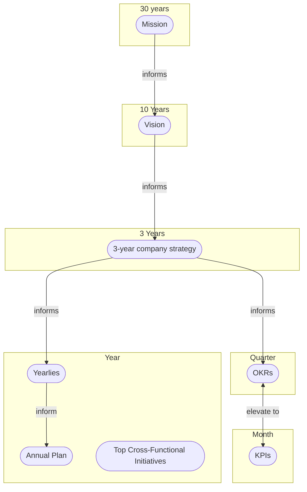

## On this page
{:.no_toc .hidden-md .hidden-lg}

- TOC
{:toc .hidden-md .hidden-lg}

## Overview

Everything in a company happens in a certain cadence.
The period of each cadence differs.
The timescale between periods are about 4x, varying from 3x to 5x.
Below are the cadences we have at GitLab:

1. Mission (30 years, 3x)
1. Vision (10 years, 3.3x)
1. Strategy (3 years)
1. Year (4 quarters)
1. Quarter (3 months)
1. Month (4.3 weeks)
1. Week (5 workdays)
1. Day

Items on this page are grouped into a cadence based on the underlying period of time that the item pertains to, not based on when the item is updated. For example, our [strategy](/company/strategy/#three-year-strategy) looks three years out but is reviewed [annually by E-Group](/company/offsite/#offsite-topic-calendar) and may be updated more frequently if the need arises.

### Cadence Hierarchy

How elements of our cadence fit together.

1. [Mission](/company/mission) is the 30 year purpose of the company and answers "why" GitLab exists. Our mission is to make it so that **everyone can contribute**.
1. [Vision](/company/vision) defines the destination for our product, company, and market and answers "where" GitLab is heading in order to make progress towards our mission. Our current vision is to become the **AllOps** solution - a single application for all innovation and transformation. 
1. [Strategy](/company/strategy/) answers "what" we will accomplish to make progress towards our vision and mission. Strategy is composed of "strategic pillars" that are high level goals we plan to achieve over the next 3 years. Strategic pillars contain the big themes of work we will pursue to accomplish our strategy. Our current strategy is to be the leading, complete DevSecOps Platform and our three strategic pillars for accomplishing this strategy are Customer Results, Mature the Platform, and Grow Careers.
1. [Yearlies](/company/yearlies/) are annual goals to make progress for three year strategy by breaking strategic pillars into aspirational milestones. Our current Yearlies can be summarized as 
        1. Improve customers results through ultimate enablement, increasing sales efficiency, and increasing user awareness.
        1. Mature the Platform by closing BIC gap, GitLab Dedicated GA, and scaling GitLab.com
        1. Career Building Platform through a faster pace, increasing team member diversity, and enabling People Managers through Elevate.
1. [OKRs](/company/okrs) are composed of Objectives and Key Results that we use to improve something in a given quarter beyond maintaining the status quo. Objectives are what we are focusing on accomplishing in a quarter, and Key Results measure progress for an Objective over the same quarter. 
1. [Top Cross-Functional Initiatives](/company/top-cross-functional-initiatives/) are some of the activities that we undertake to achieve Yearlies and/or OKRs. Yearlies and OKRs define outcomes and not activity required to achieve those outcomes.     
1. [Key Performance Indicators (KPIs)](/company/kpis/) are measures of performance for important things we do as a company all the time (Business as Usual). KPIs are not OKRs because OKRs do not deal with business as usual, but KPIs can be elevated to OKRs if a KPI has slipped far enough to become a priority to improve in a given quarter.

[Values](/handbook/values/) are the principles we follow in pursuing the items on this Cadence page but are not part of any cadence.



## Mission

**30 years**

- Time to realize [our mission](/company/mission/#mission){:data-ga-name="mission"}{:data-ga-location="body"}
- [BHAG](/company/mission/#big-hairy-audacious-goal){:data-ga-name="BHAG"}{:data-ga-location="body"}
- [Lifespan of the average company](https://www.bbc.com/news/business-16611040), 10 years to get into the S&P500, then 15 in it, and 5 of decline for a total of 30
- [Lifespan of Amazon](https://www.forbes.com/sites/richardkestenbaum/2018/11/16/amazon-is-not-too-big-to-fail-bezos/#65fba0621626) "Amazon is not too big to fail...In fact, I predict one day Amazon will fail. Amazon will go bankrupt. If you look at large companies, their lifespans tend to be 30-plus years, not a hundred-plus years."
- [Generation is also 30 years](https://www.ncbi.nlm.nih.gov/pubmed/10677323)

## Vision

**10 years**

- [Vision](/company/vision/){:data-ga-name="vision"}{:data-ga-location="body"}
- [Product vision](/direction/#vision){:data-ga-name="product vision"}{:data-ga-location="body"}
- Time needed for category creation
- Commitment of DZ

## Strategy

**3 years**

1. Most of [3-year company strategy](/company/strategy/){:data-ga-name="strategy"}{:data-ga-location="body"}
1. [3-year product direction strategy](/direction/#3-year-strategy){:data-ga-name="3 year strategy"}{:data-ga-location="body"}
1. [Long range outlook](/handbook/finance/financial-planning-and-analysis/#long-range-outlook)
1. [Restricted stock unit vesting](/handbook/stock-options/#vesting){:data-ga-name="vesting"}{:data-ga-location="body"} after cliff of six months is passed
1. Average retention of team members is around 3 years, with reduced [turnover](/handbook/people-group/people-operations-metrics/#team-member-turnover){:data-ga-name="turnover"}{:data-ga-location="body"} (<16%). See [actual reports](/handbook/people-group/people-operations-metrics/#reporting){:data-ga-name="reports"}{:data-ga-location="body"}


## Year

1. [4 quarter rolling forecast](/handbook/finance/financial-planning-and-analysis/#quarterly-forecast-rolling-four-quarters){:data-ga-name="forecast"}{:data-ga-location="body"}
1. [Annual plan](/handbook/finance/financial-planning-and-analysis/#plan){:data-ga-name="annual plan"}{:data-ga-location="body"}
1. Most of [Direction](/direction/){:data-ga-name="direction"}{:data-ga-location="body"}
1. [Fiscal Year Product Investment Themes](/direction/#fiscal-year-product-investment-themes)
1. [Yearlies](/company/yearlies/) for setting annual company goals 
1. [Top Cross-Functional Initiatives](/company/top-cross-functional-initiatives/)

## Quarter

1. [OKRs](/company/okrs/){:data-ga-name="OKRs"}{:data-ga-location="body"}
1. [Board meeting](/handbook/board-meetings/#board-meeting-process){:data-ga-name="board meeting"}{:data-ga-location="body"}
1. Sales targets (in [Clari](/handbook/business-technology/tech-stack/#clari){:data-ga-name="clari"}{:data-ga-location="body"})
1. [E-group offsite](/company/offsite/){:data-ga-name="e-group offsite"}{:data-ga-location="body"}
1. [GitLab Assembly](/company/gitlab-assembly/)
1. [Quarterly Kickoff](/handbook/ceo/chief-of-staff-team/#quarterly-kickoff)
1. [Earnings activities](/handbook/finance/investor-relations/)

## Month

1. [Key Reviews](/handbook/key-review/){:data-ga-name="key reviews"}{:data-ga-location="body"}
1. [Release](/releases/){:data-ga-name="releases"}{:data-ga-location="body"}
1. [Retrospective](/handbook/communication/#kickoffs){:data-ga-name="retrospective"}{:data-ga-location="body"}
1. [Most KPIs](/company/kpis/){:data-ga-name="metrics"}{:data-ga-location="body"}

## Week

1. [1-1 cadence with reports](/handbook/leadership/1-1/){:data-ga-name="1-1 cadence"}{:data-ga-location="body"}
1. [E-Group Weekly](/handbook/e-group-weekly/){:data-ga-name="e-group weekly"}{:data-ga-location="body"}

## Day

1. [Group conversation](/handbook/group-conversations/){:data-ga-name="group conversation"}{:data-ga-location="body"}


```mermaid
gantt
    title Year Overview
    dateFormat  YYYY-MM-DD

    section Fiscal Year at a Glance
    FY starts                   :2021-02-01, 1d
    End of Q1                   :2021-04-30, 1d
    End of Q2                   :2021-07-31, 1d
    End of Q3                   :2021-10-31, 1d
    End of Q4                   :2022-01-31, 1d

    section Major Events
    SKO                         :2021-02-08, 5d

    section E Group Offsite
    January                    :2021-01-11, 4d
    April                       :2021-04-12, 4d
    June                        :2021-06-28, 4d
    November (date estimated)   :2021-10-12, 4d

    section Board Meeting
    Prep led by CFO             :2021-02-14, 21d
    March                       :2021-03-18, 1d
    Prep led by CFO             :2021-05-14, 21d
    June (date estimated)       :2021-06-17, 1d
    Prep led by CFO             :2021-08-14, 21d
    September (date estimated)  :2021-09-30, 1d
    Prep led by CFO             :2021-11-14, 21d
    December (date estimated)   :2021-12-14, 1d

    section Monthly Releases
    13.7                        :2021-01-22, 1d
    13.8                        :2021-02-22, 1d
    13.9                        :2021-03-22, 1d
    13.10                       :2021-04-22, 1d
    13.11                       :2021-05-22, 1d
    14.0                        :2021-06-22, 1d
    14.1                        :2021-07-22, 1d
    14.2                        :2021-08-22, 1d
    14.3                        :2021-09-22, 1d
    14.4                        :2021-10-22, 1d
    14.5                        :2021-11-22, 1d
    14.6                        :2021-12-22, 1d

    section OKR
    OKR prep                    :2021-03-30, 31d
    next FQ starts              :2021-05-01, 1d
    OKR prep                    :2021-06-30, 31d
    next FQ starts              :2021-08-01, 1d
    OKR prep                    :2021-08-30, 31d
    next FQ starts              :2021-10-01, 1d

    section Sales Key Dates
    Q2 QBRs                     :2021-05-05, 5d
    Q3 QBRs                     :2021-08-04, 4d
    Q4 QBRs                     :2021-11-03, 3d

    section Compensation Review Cycle
    Audit FY 2021 Annual Compensation Review :2021-02-01
    Canada Benefits Implementation :2021-02-01
    Job Family Alignment         :2021-03-01
    Compensation Philosophy Training :2021-04-01
    Benefits Survey Released FY21 :2021-06-01
    Benefits Survey Results FY21 Analyzed :2021-07-01
    Catch-up Compensation Review Manager Review :2021-08-01
    Catch-up Compensation Review  :2021-09-01
    Compensation Training         :2021-10-01
    Performance Factor Review            :2021-11-01
    Annual Comp Review Inputs Evaluated/Proposed to Compensation Group for FY22 :2021-12-01


    section People Dates
    DIB Survey                      :2021-04-08, 14d
    Code of Conduct Acknowledgement :2021-02-01, 30d
    360s                            :2021-Q2, 30d
    Engagement Survey(estimated)    :2021-10-26, 14d
```
