## On this page
{:.no_toc .hidden-md .hidden-lg}

- TOC
{:toc .hidden-md .hidden-lg}

## Overview

Everything in a company happens in a certain cadence.
The period of each cadence differs.
The timescale between periods are about 4x, varying from 3x to 5x.
Below are the cadences we have at GitLab:

1. [30 years](#30-years) (3x 10 years)
1. [10 years](#10-years) (3.3x 3-years)
1. [3 years](#3-years) (3x year)
1. [Year](#year) (4x quarter)
1. [Quarter](#quarter) (3x month)
1. [Month](#month) (4.3x week)
1. [Week](#week)

Items on this page are grouped into a cadence based on the underlying period of time that the item pertains to, not based on when the item is updated. For example, our [strategy](/company/strategy/#three-year-strategy) looks three years out but is reviewed [annually by E-Group](/company/offsite/#offsite-topic-calendar) and may be updated more frequently if the need arises.

### Cadence Examples

How elements of our cadence fit together over time:

1. [Our Mission](/company/mission) is to make it so that **everyone can contribute** by using our product, to our product, and to our company.
1. [Our Vision](/company/vision) is what we want the product to evolve into in the next 10 years, **AllOps** - a single application for DevSecOps, ModelOps, and a Servicedesk.
1. [Our Strategy](/company/strategy/) is what we'll focus on over the next 3 years in order to make progress towards our vision. Our strategy is to be the leading **DevSecOps Platform** by focusing on our three strategic pillars: Customer Results, Maturing the Platform, and Growing Careers.
1. [Our Yearlies](/company/yearlies/) are annual goals to make progress to our three year strategy. We have 3 goals per strategic pillar, for **9 goals** in total.
1. [Our OKRs](/company/okrs) are **quarterly objectives** to make progress towards the yearly goals. They have a hierarchy in them with which they flow from the CEO level to the level of teams.

How other elements relate to our cadence:

1. [Top Cross-Functional Initiatives](/company/top-cross-functional-initiatives/) typically last a year and should be closely aligned to the yearlies.
1. [Key Performance Indicators (KPIs)](/company/kpis/) are measures of performance for important things we do as a company all the time. If you want to change a KPI in a quarter this typically will be an OKR.
1. [Our Values](/handbook/values/) are the principles we follow in pursuing the items on this Cadence page but are not part of any cadence.

### Cadence Flow

Below is an example of how we will accomplish our longer term cadence goals by successfully completing our shorter term goals. 

1. Our mission is to do that by making sure **everyone can contribute to our product** and our company. Part of the achievement of this will depend on our product driving results for a larger audience of users.
1. Because our **users contribute to our product** GitLab has a high rate of innovation and we can have an ambitious scope for the product. The vision for the scope of our product is an **AllOps** solution – a single application for DevSecOps, ModelOps, and a Servicedesk. A **Value Stream Delivery overview** will be a key part of this platform. 
1. Our strategy supports our AllOps vision. One of our strategic pillars is [Customer Results](/strategy/#1-customer-results). This includes extending **[Value Stream Management](https://about.gitlab.com/solutions/value-stream-management/)** to provide more value to more users.
1. Our yearlies are how we're going to execute our strategy. One of [our FY24 Yearlies](/company/yearlies/) is to `increase NetARR from Ultimate up-tiers` which we'll accomplish in part by providing more value to business users with features like **[Value Stream Dashboards for Executives](https://gitlab.com/groups/gitlab-org/-/epics/9317)**.
1. Our OKRs are how we're going to make progress on our yearly goals. A CEO key result is to launch **Value Stream Dashboards** MVC 1 Beta in FY24-Q1.

Successfully achieving our KR of a beta value stream means progress against our Yearly value stream dashboard goal, strategic goal of extending value stream management to more users, vision of an AllOps solution, and mission of everyone contributing. While the KR is a single building block, our successful completion within the quarter leads to progress against our longer term goals. 

## 30 years

- [Our mission](/company/mission/)
- [Our purpose](/company/purpose/)
- [Lifespan of the average company](https://www.bbc.com/news/business-16611040), 10 years to get into the S&P500, then 15 in it, and 5 of decline for a total of 30
- [Lifespan of Amazon](https://www.forbes.com/sites/richardkestenbaum/2018/11/16/amazon-is-not-too-big-to-fail-bezos/#65fba0621626) "Amazon is not too big to fail...In fact, I predict one day Amazon will fail. Amazon will go bankrupt. If you look at large companies, their lifespans tend to be 30-plus years, not a hundred-plus years."
- [Generation is also 30 years](https://www.ncbi.nlm.nih.gov/pubmed/10677323)

## 10 years

- [Vision](/company/vision/){:data-ga-name="vision"}{:data-ga-location="body"}
- [Product vision](/direction/#vision){:data-ga-name="product vision"}{:data-ga-location="body"}
- [Commitment of DZ](https://about.gitlab.com/blog/2021/11/10/a-special-farewell-from-gitlab-dmitriy-zaporozhets/)
- Time needed for category creation

## 3 years

1. [Our strategy](/company/strategy/){:data-ga-name="strategy"}{:data-ga-location="body"}
1. [3-year product direction strategy](/direction/#3-year-strategy){:data-ga-name="3 year strategy"}{:data-ga-location="body"}
1. [Long range outlook](/handbook/finance/financial-planning-and-analysis/#long-range-outlook-lro)
1. [Restricted stock unit vesting](/handbook/stock-options/#vesting){:data-ga-name="vesting"}{:data-ga-location="body"} after cliff of six months is passed
1. Average retention of team members is around 3 years, with reduced [turnover](/handbook/people-group/people-group-metrics/#team-member-turnover){:data-ga-name="turnover"}{:data-ga-location="body"} (<16%). See [actual reports](/handbook/people-group/people-group-metrics/#reporting){:data-ga-name="reports"}{:data-ga-location="body"}

## Year 

1. [Yearlies](/company/yearlies/) for setting annual company goals 
1. [Annual plan](/handbook/finance/financial-planning-and-analysis/#plan){:data-ga-name="annual plan"}{:data-ga-location="body"}
1. [4 quarter rolling forecast](/handbook/finance/financial-planning-and-analysis/#quarterly-forecast-rolling-four-quarters){:data-ga-name="forecast"}{:data-ga-location="body"}
1. Most of [Direction](/direction/){:data-ga-name="direction"}{:data-ga-location="body"}
1. [Fiscal Year Product Investment Themes](/direction/#fiscal-year-product-investment-themes)
1. [Top Cross-Functional Initiatives](/company/top-cross-functional-initiatives/)

## Quarter

1. [OKRs](/company/okrs/){:data-ga-name="OKRs"}{:data-ga-location="body"}
1. [Board meeting](/handbook/board-meetings/#board-meeting-process){:data-ga-name="board meeting"}{:data-ga-location="body"}
1. Sales targets (in [Clari](/handbook/business-technology/tech-stack/#clari){:data-ga-name="clari"}{:data-ga-location="body"})
1. [E-group offsite](/company/offsite/){:data-ga-name="e-group offsite"}{:data-ga-location="body"}
1. [GitLab Assembly](/company/gitlab-assembly/)
1. [Quarterly Kickoff](/handbook/ceo/chief-of-staff-team/#quarterly-kickoff)
1. [Earnings activities](/handbook/finance/investor-relations/)

## Month

1. [Key Reviews](/handbook/key-review/){:data-ga-name="key reviews"}{:data-ga-location="body"}
1. [Release](/releases/){:data-ga-name="releases"}{:data-ga-location="body"}
1. [Retrospective](/handbook/communication/#kickoffs){:data-ga-name="retrospective"}{:data-ga-location="body"}
1. [Most KPIs](/company/kpis/){:data-ga-name="metrics"}{:data-ga-location="body"}

## Week

1. [1-1 cadence with reports](/handbook/leadership/1-1/){:data-ga-name="1-1 cadence"}{:data-ga-location="body"}
1. [E-Group Weekly](/handbook/e-group-weekly/){:data-ga-name="e-group weekly"}{:data-ga-location="body"}

## Gantt Chart

Below is a visual example of our cadence and is subject to change based on company and team schedules. Dates are approximate.

```mermaid
gantt
    title Year Overview
    dateFormat MM-DD 
    axisFormat %b

    section Fiscal Year at a Glance
    FY starts                   :milestone, m1, 02-01, 1d
    Q1 Quarter Kickoff          :02-20, 1d
    GitLab Assembly             :03-15, 1d
    End of Q1                   :milestone, m2,04-30, 1d
    Q2 Quarter Kickoff          :05-15, 1d
    GitLab Assembly             :06-15, 1d
    End of Q2                   :milestone, m3,07-31, 1d
    Q3 Quarter Kickoff          :08-15, 1d
    GitLab Assembly             :09-15, 1d
    End of Q3                   :milestone, m4,10-31, 1d
    Q4 Quarter Kickoff          :11-15, 1d
    GitLab Assembly             :12-15, 1d
    End of Q4                   :milestone, m5,01-31, 1d

    section Finance Activities
    Start Q4 Earnings Prep      :01-26, 1d
    Long Range Outlook planning exercise :04-15, 90d
    Start Q1 Earnings Prep      :04-25, 1d
    Start Q2 Earnings Prep      :07-25, 1d
    Annual Plan Prep            :09-15, 135d
    Start Q3 Earnings Prep      :10-25, 1d
        
    section E Group Offsite
    January                     :01-05, 4d
    April                       :04-04, 4d
    June                        :06-04, 4d
    October                     :10-04, 4d

    section Board Meeting
    Prep led by CFO             :02-14, 21d
    March                       :03-18, 1d
    Prep led by CFO             :05-14, 21d
    June                        :06-17, 1d
    Prep led by CFO             :08-14, 21d
    September                   :09-15, 1d
    Prep led by CFO             :11-14, 21d
    December                    :12-14, 1d

    section Monthly Releases
    Release                     :milestone, m12,01-22, 1d
    Release                     :milestone, m1,02-22, 1d
    Release                     :milestone, m2,03-22, 1d
    Release                     :milestone, m3,04-22, 1d
    Major Release               :milestone, m4,05-22, 1d
    Release                     :milestone, m5,06-22, 1d
    Release                     :milestone, m6,07-22, 1d
    Release                     :milestone, m7,08-22, 1d
    Release                     :milestone, m8,09-22, 1d
    Release                     :milestone, m9,10-22, 1d
    Release                     :milestone, m10,11-22, 1d
    Release                     :milestone, m11,12-22, 1d

    section OKR
    OKR prep                    :01-01, 31d
    next FQ starts              :02-01, 1d
    OKR prep                    :03-15, 46d
    next FQ starts              :05-01, 1d
    OKR prep                    :06-15, 46d
    next FQ starts              :08-01, 1d
    OKR prep                    :08-15, 46d
    next FQ starts              :10-01, 1d
    OKR prep                    :12-15, 16d

    section Sales Key Dates
    SKO                         :02-13, 4d
    Q1 QBRs                     :02-04 5d
    Q2 QBRs                     :05-05, 5d
    Q3 QBRs                     :08-04, 5d
    Q4 QBRs                     :11-03, 5d

    section Compensation Review Cycle
    Audit Annual Compensation Review :02-01
    Canada Benefits Implementation :02-01
    Job Family Alignment         :03-01
    Compensation Philosophy Training :04-01
    Benefits Survey Released  :06-01
    Benefits Survey Results Analyzed :07-01
    Catch-up Compensation Review Manager Review :08-01
    Catch-up Compensation Review  :09-01
    Compensation Training         :10-01
    Performance Factor Review            :11-01
    Annual Comp Review Inputs Evaluated/Proposed to Compensation Group for next FY :12-01

    section People Dates
    DIB Survey                      :05-02, 14d
    Code of Conduct Acknowledgement :04-01, 30d
    360s                            :07-25, 60d
    Engagement Survey(estimated)    :05-16, 14d

    section Annual Mandated Compliance Reports
    California Pay Data Report      :01-03, 24d
    EEO-1 Report                    :01-03, 32d
    AAP                             :01-03, 116d
    Australia WGEA                  :03-13, 80d
    VETS-4212                       :05-01, 25d
```

