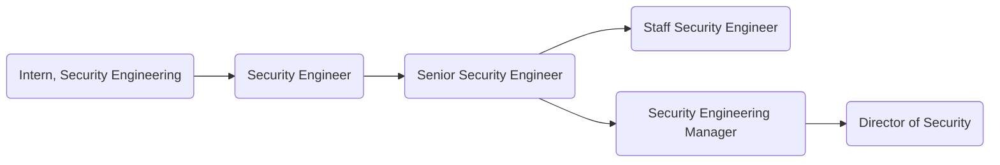
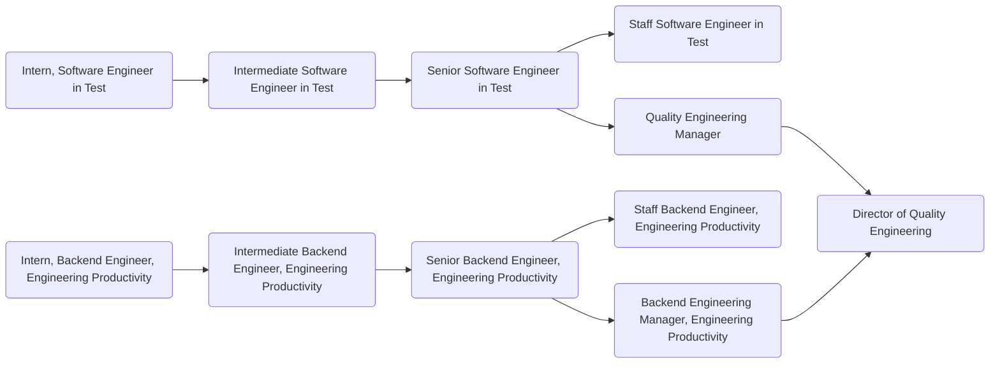
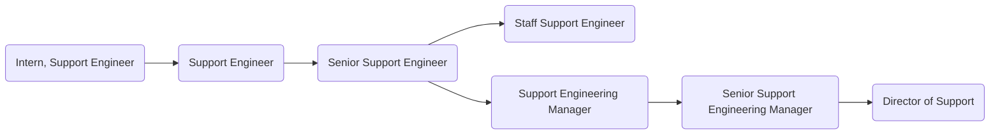
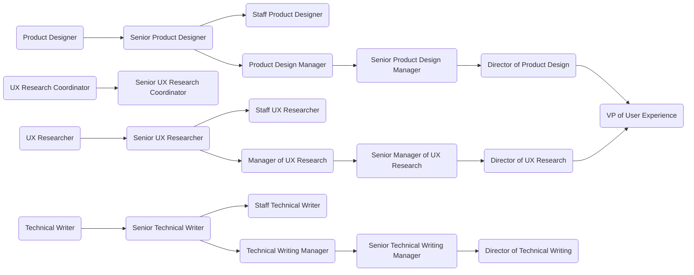

## On this page
{:.no_toc .hidden-md .hidden-lg}

- TOC
{:toc .hidden-md .hidden-lg}

## The Three Components of Career Development

There are three important components of developing one's career:

### Structure

Team members who are (or want to be) on track for promotion should be engaged in
a career coaching conversation with their manager. Some basic information about
this process can be found in the [People Ops
handbook](/handbook/people-group/learning-and-development/career-development/#career-mapping-and-development).
Specific coaching plan templates are listed here to help start the conversation:

- [Senior
  Engineer](https://docs.google.com/document/d/11xZpY2RuTldp1g6bHRFYKwwlQjNjYaPquLPo5uD6hrg/edit#)
- (Others to come)

We want to build these documents around the career matrix for Engineering. Since this career
matrix is still being developed, these documents are currently based on the [job family requirements](/job-families/engineering/).

The first career matrix being developed is for [Individual Contributors in Engineering](career-matrix.html).

When a team member is deemed ready for promotion, their manager should follow
the [promotion process outlined by People
Ops](/handbook/people-group/promotions-transfers/).

Remember that the coaching process helps team members understand what they need
to do in order to prepare for a more senior position on the team. The promotion
process documents what an engineer has already done to deserve a more senior
position on the team. The two processes are related, but they are not
substitutes for each other.

### Individual Initiative

Most career opportunities involve stepping into a position of informal or formal leadership. As such, the initiative
of the individual is a necessary component, as well as a qualification. However, for the sake of inclusion we do ask that
managers periodically bring up the possibilities for advancement so that individuals know the avenues available to them
and receive encouragement to pursue them.  Managers and team members should strive to have a career development
conversation at least once a quarter.

### Opportunity

GitLab is a fast-growing startup. As such, there is no shortage of opportunity for advancement along either the
individual contributor or management tracks. We're fortunate that this is the easiest component. And internal
promotions are generally our first option.

Sometimes a position must become available on the management track before a promotion can occur. But at our
rate of growth in 2017 and 2018, it is usually only a matter of 6 months or less before something opens up for a prepared candidate.

## Individual Contribution vs. Management

Most important is the fork between purely technical work and managing teams. It's important that Engineering Managers self-select into that track and don't feel pressured. We believe that management is a craft like any other and requires dedication. We also believe that everyone deserves a manager that is passionate about their craft.

Once someone reaches a Senior-level role, and wants to progress, they will need to decide whether they want to remain purely technical or pursue managing technical teams. Their manager can provide opportunities to try tasks from both tracks if they wish. Staff-level roles and Engineering Manager roles are equivalent in terms of base compensation and prestige. Learn more about what it means to be a Staff-level engineer at GitLab in a [Engineering IC Leadership page](/handbook/engineering/ic-leadership).

### Trying the Management Track

It's important that team members interested in the people management track have opportunities to try it out prior to committing themselves. Managers can provide multiple opportunities to Senior and Staff Engineers who want to consider moving into an available or upcoming manager role. Examples include hosting a Group Conversation, acting as the hiring manager for an intern position, or running a series of demo meetings for an important deliverable. These occasions for trying out management functions are useful and can provide good coaching opportunities for the individual looking to move to management. Some engineers may find through these experiences that they are better suited to remain on the technical path, and this gives them the ability to decide before investing a significant amount of time in the transition.

In order to facilitate the transition, we recommend any person moving from an Individual Contributor role to a Engineering Manager role work with their manager to create a focused transition plan. The goal is to provide a concentrated look into the responsibilities and challenges of people management with the understanding that, if the role is not for them, they can return to the IC track. A good example of how to build such a plan can be found in [this article](http://firstround.com/review/this-90-day-plan-turns-engineers-into-remarkable-managers/). Another good resource for when you are ready for the critical career path conversation is [this 30 mins video](https://www.youtube.com/watch?reload=9&v=hMz6QDURQOM&list=PLBzScQzZ83I8H8_0Qete6Bs5EcW3p0kZF&index=6).

### Temporary Management Positions
We create temporary management positions when there is organizational need, and we imprint these in our company org chart. These may be filled by someone who is transitioning into the role, experimenting with the role as they work on determining their career path or, someone who is just filling in while we hire and who is not interested in pursuing an Engineering Manager role long term. This difference should be made explicit with the individual and team members before the temporary role is created. See the [types of temporary roles](#types-of-interim-roles) for more information on this distinction.

When someone fills a temporary role they are providing a service to the company, and perhaps getting a valuable career development opportunity for themself; so, poor performance against those duties would not result in termination. At worst, the person would return to their prior responsibilities. That does not mean, however, that an individual is immune to termination of their employment, for example if they commit a breach of their prior responsibilities or of the company's Code of Business Conduct & Ethics while in an temporary position.

Once you have been designated as filling a temporary management role, the current manager should update all reports to in BambooHR with a job information change request and create an access level request to grant interim manager access in BambooHR.

Those interested in these roles must:
- show managerial interest
- have experience in the individual contributor role for which they would be managing
- have been employed at GitLab for at least 6 months and thriving in our remote-only context
- exemplify [GitLab Values](/handbook/values)
- be subject to a talent review depending on the length of appointment

Process for selection:
- Upcoming Interim roles will be discussed over the Engineering and Development Staff meetings.
- Leadership can gather interest from their team members for the upcoming interim roles.
- Based on the above criteria the assessment will take place and most suitable team member will be selected for the interim role.

#### Types of Interim Roles
##### Acting Manager
An Acting Manager is someone who occupies a role temporarily and will move back to their original role after a set amount of time or other conditions. An Acting Manager may be experimenting with the role as a part of determining their career development path, or may be filling in for a vacant role while we hire.

##### Interim Manager
Interim Manager positions are for individuals who are pursuing the role long term: the requirement is that, before moving into the role full time, they will make at least one successful hire. The official promotion will not occur before 30 days after that person's hire, so that we can assess whether the hire was truly successful. If the new hire's success is indeterminate at the 30-day mark, then we will continue to review until a firm decision is made. If the new hire is not successful, that does not mean that the Interim Manager cannot eventually move into the full-time role.

In some cases it may not be practical or headcount planning might not allow for the Interim Manager to make a new hire. In this case the Interim Manager and the interim manager's manager should agree on success criteria based on the requirements of the role. Examples of other success criteria are (multiselect):
- Successfully pass an interview(s) with the Leader(s) of the department(s) around team management competencies/scorecard for Manager;
- Successfully pass team member relations case role play with the [People Business Partner](/handbook/people-group/#people-business-partner-alignment-to-division);
- Performing career development conversations with direct reports successfully;
- Perform a [Talent Assessment](/handbook/people-group/performance-assessments-and-succession-planning/#talent-assessment-options) with the manager's manager to determine readiness for the role;
- Gather 360 feedback via Culture Amp for the manager.

Once the Interim Manager's first new hire has been at GitLab for 30 days, or other agreed success criteria has been met, the Interim Manager can submit a [promotion document](/handbook/people-group/promotions-transfers/#for-managers-requesting-a-promotion-or-compensation-change) to their manager. The goal of this process is to have a determination made by the interim manager's manager about the promotion to a permanent manager role after the agreed success criteria has been satisfied. Generally we aim to have the interim period not to exceed 4 months before turning into a fulltime role.

## Roles

#### Development Department

```mermaid
  graph LR;
  %% frontend roles
  eng:jfe(Intern Frontend Engineering);
  click eng:jfe "/job-families/engineering/development/frontend#junior-frontend-engineer";

  eng:ife(Intermediate Frontend Engineer);
  click eng:ife "/job-families/engineering/development/frontend/#intermediate-frontend-engineer";

  eng:sfe(Senior Frontend Engineer);
  click eng:sfe "/job-families/engineering/development/frontend/#senior-frontend-engineer";

  eng:stf(Staff Frontend Engineer);
  click eng:stf "/job-families/engineering/development/frontend/#staff-frontend-engineer";

  eng:fem(Frontend Engineering Manager);
  click eng:fem "/job-families/engineering/development/frontend/manager";

  %% backend roles
  eng:jbe(Intern, Backend Engineering);
  click eng:jbe "/job-families/engineering/development/backend/#junior-backend-engineer";

  eng:ibe(Intermediate Backend Engineer);
  click eng:ibe "/job-families/engineering/development/backend/#backend-engineer";

  eng:sbe(Senior Backend Engineer);
  click eng:sbe "/job-families/engineering/development/backend/#senior-backend-engineer";

  eng:stb(Staff Backend Engineer);
  click eng:stb "/job-families/engineering/development/backend/#staff-backend-engineer";

  eng:bem(Backend Engineering Manager);
  click eng:bem "/job-families/engineering/development/backend/manager";


  %% engineering leadership
  eng:sme(Senior Manager, Engineering);
  click eng:sme "/job-families/engineering/engineering-management/#senior-manager-development";

  eng:dir(Director of Engineering);
  click eng:dir "/job-families/engineering/engineering-management/#director-development";

  eng:dis(Distinguished Engineer);
  click eng:dis "/job-families/engineering/engineering-management/#distinguished-engineer";

  eng:sde(Senior Director of Engineering);
  click eng:sde "/job-families/engineering/engineering-management/#senior-director-development";

  eng:vpd(VP of Development);
  click eng:vpd "/job-families/engineering/engineering-management/#vp-of-development";

  eng:fel(Engineering Fellow);
  click eng:fel "/job-families/engineering/engineering-management/#engineering-fellow";

  %% career progression
  eng:jfe-->eng:ife-->eng:sfe-->eng:stf & eng:fem;
  eng:jbe-->eng:ibe-->eng:sbe-->eng:stb & eng:bem;
  eng:bem & eng:fem-->eng:sme-->eng:dir-->eng:sde-->eng:vpd;
  eng:stb & eng:stf-->eng:dis-->eng:fel;

```

#### Security Department

#### Quality Department

#### Support Department

#### UX Department

#### Infrastructure Department

```mermaid
  graph LR;

  %% Backend Engineers
  eng:abe(Intern, Backend Engineer)-->eng:be(Senior Backend Engineer);
  eng:be(Backend Engineer)-->eng:sbe(Senior Backend Engineer);
  eng:sbe(Senior Backend Engineer)-->eng:stbe(Staff Backend Engineer);
  eng:stbe(Staff Backend Engineer)-->eng:dei(Distinguished Engineer Infrastructure);
  eng:dei(Distinguished Engineer Infrastructure)-->eng:efi(Engineering Fellow Infrastructure);

  %% Site Reliability Engineer
  eng:asre(Intern, Site Reliability Engineer)-->eng:sre(Site Reliability Engineer);
  eng:sre(Site Reliability Engineer)-->eng:srsre(Senior Site Reliability Engineer);
  eng:srsre(Senior Site Reliability Engineer)-->eng:stsre(Staff Site Reliability Engineer);
  eng:stsre(Staff Site Reliability Engineer)-->eng:dei(Distinguished Engineer Infrastructure);

  %% Database Reliability Engineer track
  eng:adbre(Intern, Database Reliability Engineer)-->eng:dbre(Database Reliability Engineer);
  eng:dbre(Database Reliability Engineer)-->eng:srdbre(Senior Database Reliability Engineer);
  eng:srdbre(Senior Database Reliability Engineer)-->eng:stdbre(Staff Database Reliability Engineer);
  eng:stdbre(Staff Database Reliability Engineer)-->eng:dei(Distinguished Engineer Infrastructure);

  %% Management
  eng:sbe(Senior Backend Engineer)-->eng:em(Engineering Manager);
  eng:srsre(Senior Site Reliability Engineer)-->eng:em(Engineering Manager);
  eng:srdbre(Senior Database Reliability Engineer)-->eng:em(Engineering Manager);
  eng:em(Engineering Manager)-->eng:sem(Senior Engineering Manager);
  eng:sem(Senior Engineering Manager)-->eng:di(Director of Infrastructure);
  eng:di(Director of Infrastructure)-->eng:vpi(VP of Infrastructure);

  %% Infrastructure Analyst
  eng:ia(Infrastructure Analyst)-->eng:vpi(VP of Infrastructure);

  %% Backend engineer
  click eng:abe "/job-families/engineering/infrastructure/backend-engineer/";
  click eng:be "/job-families/engineering/infrastructure/backend-engineer/";
  click eng:sbe "/job-families/engineering/infrastructure/backend-engineer/";
  click eng:stbe "/job-families/engineering/infrastructure/backend-engineer/";

  %% Site Reliability Engineer
  click eng:asre "/job-families/engineering/infrastructure/site-reliability-engineer/";
  click eng:sre "/job-families/engineering/infrastructure/site-reliability-engineer/";
  click eng:srsre "/job-families/engineering/infrastructure/site-reliability-engineer/";
  click eng:stsre "/job-families/engineering/infrastructure/site-reliability-engineer/";

  %% Database Reliability Engineer
  click eng:adbre "/job-families/engineering/infrastructure/database-reliability-engineer/";
  click eng:dbre "/job-families/engineering/infrastructure/database-reliability-engineer/";
  click eng:srdbre "/job-families/engineering/infrastructure/database-reliability-engineer/";
  click eng:stdbre "/job-families/engineering/infrastructure/database-reliability-engineer/";

  %% Infrastructure Management
  click eng:em "/job-families/engineering/infrastructure-management/";
  click eng:sem "/job-families/engineering/infrastructure-management/";
  click eng:di "/job-families/engineering/infrastructure-management/";
  click eng:vpi "/job-families/engineering/infrastructure-management/";

  %% Individual contributors
  click eng:ia "/job-families/engineering/infrastructure/analyst";
  click eng:dei "/job-families/engineering/infrastructure/distinguished-engineer/";
  click eng:efi "/job-families/engineering/infrastructure/engineering-fellow/";
```

## Apprenticeship for Learning

Typically, an apprenticeship provides an individual with an overview of a position or field over a short period of time. It’s surface-level learning geared towards team members who are still exploring their interests and deciding what options they’d like to pursue. If the field of interest, it's subject matter experts and the department they want to learn more about can support this effort, then this offers a good opportunity for an internship. For more information on the process please review this handbook section on [Internship for Learning](https://about.gitlab.com/handbook/people-group/promotions-transfers/#internship-for-learning). 

Eligibility criteria:
* You are excelling in your role (no performance issues)
* You have been working full time with GitLab for at least 6 months

The apprentice agrees to:

* Continue to support their current role and report to their current manager
* Dedicate a pre-determined percentage of their time to the apprenticeship role
* Have clear timelines and deliverables throughout the apprenticeship
* Communicate their assignments and availability clearly to both departments

In return, the department with which they are interning agrees to:

* Provide guidance and support to the apprentice
* Offer meaningful projects for the apprentice to work on
* Be flexible, so that the apprentice can continue to support their primary team and carry an appropriate workload

By default, apprenticeships last for 6 months. At the end of 6 months, both the intern and the department will determine whether it makes sense to extend the timeframe further.

If you wish to apprentice with an Engineering team, start by speaking with your manager.

**Important**: The Apprenticeship for Learning program should differ from any situations where there is actual temporary or permanent [realignment/redeployment/secondment](/handbook/people-group/promotions-transfers/#realignment-of-resources-impacting-multiple-team-members) as a result of changing business needs. If you are unsure whether your situation is aligned with the Apprenticeship for learning program or falls into a resources realignment, please discuss with your aligned [People Business Partner](/handbook/people-group/#people-business-partner-alignment-to-division).

## Internships in Engineering

An internship is a position meant for someone who has decided on a career path and is looking to gain in-depth experience in a specific field. At GitLab this is the entry level of roles in Engineering. 

In May 2020 we launched an internship pilot program as part of a [Working Group](/company/team/structure/working-groups/internship-pilot/). [The pilot internship program](/handbook/engineering/internships/) has proven to be a great mechanism for hiring as well as offered great opportunities for our team members to gain mentoring expereince. Due to the program's success currently we have decided to roll out internships on a continuous basis in Engineering. 

With the roll out of the intern level in Engineering we have decided to deprecate what previously has been called the junior level (former entry level). Going forward all teams within Engineering can open an intern requisition when there's an organizational need. All information on Internships in Engineering can be found on [this page](/handbook/engineering/internships/). 

## Senior Engineers

Note that we have a specific section for [Senior Engineer](/job-families/engineering/backend-engineer/#senior-backend-engineer) because it's an important step in the technical development for every engineer. But "Senior" can optionally be applied to any role here indicating superior performance. However, it's not required to pass through "senior" for roles other than Engineer.

Senior engineers typically receive fewer trivial comments on their merge requests. Attention to detail is very important to us. They also receive fewer _major_ comments because they understand the application architecture and select from proven patterns. We also expect senior engineers to come up with simpler solutions to complex problems. Managing complexity is key to their work. [Staff](/job-families/engineering/backend-engineer/#staff-backend-engineer) and [Distinguished](/job-families/engineering/backend-engineer/#distinguished-backend-engineer) positions extend the Senior Engineer role.

## Promotion

We strive to set the clearest possible expectations with regard to performance and [promotions](/handbook/people-group/promotions-transfers/). Nevertheless, some aspects are qualitative. Examples of attributes that are hard to quantify are communication skills, mentorship ability, accountability, and positive contributions to company culture and the sense of psychological safety on teams. For these attributes we primarily rely on the experience of our managers and the [360 feedback](/handbook/people-group/360-feedback/) process (especially peer reviews). It's our belief that while a manager provides feedback and opportunities for improvement or development, that it's actually the team that elevates individuals.

#### Transfer Options

The following table outlines some of the possible lateral transfer options at any level of the role, but don't feel limited by this table. Compa Ratio might differ per individual to determine leveling for each of the positions listed.

| Starting Role       | Lateral Options           |
|---------------------|---------------------------|
| Frontend Engineer   | Product Designer          |
| Product Designer    | Frontend Engineer         |
| Backend Engineer    | Production Engineer       |
| Production Engineer | Backend Engineer          |
| Backend Engineer    | Support Engineer          |
| Support Engineer    | Backend Engineer          |
| Support Engineer    | Solutions Architect       |
| Support Engineer    | Technical Account Manager |
| Support Engineer    | Implementation Specialist |
| Automation Engineer | Backend Engineer          |
| Backend Engineer    | Automation Engineer       |

Lateral transfers among backend teams are also an option. Those teams include Distribution, Create, Verify, Release, Geo, Monitoring, Gitaly, etc.

## Team members on loan to another team

A team member may be "on loan" to another team for various reasons. This is less formal and handled differently than [interim](#types-of-interim-roles) roles. When this occurs it is recommended to:

* Invite the team member to all Slack channels used by the team. (Don't worry about Slack channel overload. The team member can unsubscribe if they don't find it useful.)
* Invite the team member to any standup activities used by the team. To avoid task overload, the team member can choose to stop participating in their home team standup.
* The manager of the team should schedule weekly 1-1 meetings with the on-loan team member. The team member can choose to stop having weekly 1-1s with their home team manager.

Team members who were on loan to another team documented these best practices in a retrospective.
