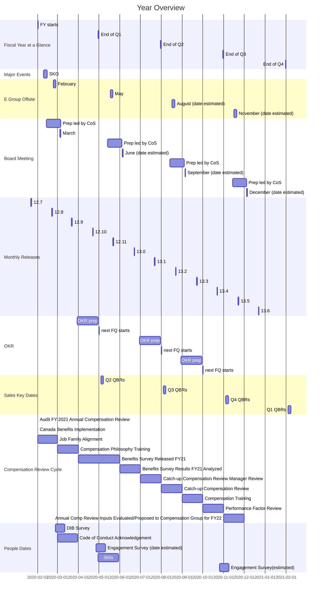

## On this page
{:.no_toc .hidden-md .hidden-lg}

- TOC
{:toc .hidden-md .hidden-lg}

## Overview

Everything in a company happens in a certain cadence.
The period of each cadence differs.
The timescale between periods are about 4x, varying from 3x to 5x.
Below are the cadences we have at GitLab:

1. Day
1. Week (5 workdays)
1. Month (4.3 weeks)
1. Quarter (3 months)
1. Year (4 quarters)
1. Strategy (3 years)
1. Vision (10 years, 3.3x)
1. Mission (30 years, 3x)

## Year at a Glance

## Day

- [Group conversation](/handbook/people-group/group-conversations/)
- [Company call](/handbook/communication/#company-call)
- [Breakout call](/handbook/communication/#breakout-call)

## Week

- [1-1 cadence with reports](/handbook/leadership/1-1/)
- [Measure growth of early startup, 10% WoW](https://about.gitlab.com/blog/2020/05/05/wow-rule/)
- E-group call

## Month

- [Key Meetings](/handbook/finance/key-meetings/)
- [Release](/releases/)
- [Retrospective](/handbook/communication/#kickoffs)
- [Most KPIs](/handbook/business-ops/data-team/metrics/)

## Quarter

- [OKRs](/company/okrs/)
- [Board meeting](/handbook/board-meetings/#board-meeting-process)
- Sales targets (in [Clari](/handbook/business-ops/tech-stack/#clari))
- [E-group offsite](/handbook/ceo/offsite/)

## Year

- [4 quarter rolling forecast](/handbook/finance/financial-planning-and-analysis/#quarterly-forecast-rolling-four-quarters)
- [Annual plan](/handbook/finance/financial-planning-and-analysis/#planning-process--gitlab)
- Most of [Direction](/direction/)

## Strategy

3 years

- Most of [strategy](/company/strategy/)
- Some of [Direction](/direction/)
- [Option vesting](/handbook/stock-options/#vesting) after cliff of 1 year is passed
- Average retention of team members is around 3 years, with reduced [turnover](/handbook/people-group/people-operations-metrics/#team-member-turnover) (<16%). See [actual reports](/handbook/people-group/people-operations-metrics/#reporting)

## Vision

10 years

- [Product vision](/direction/#vision)
- Time needed for category creation
- [Investor fund time limit](https://www.strictlybusinesslawblog.com/2017/06/29/the-life-cycle-of-a-private-equity-or-venture-capital-fund/)
- Commitment of DZ

## Mission

30 years

- Time to realize [our mission](/company/strategy/#mission)
- [BHAG](/company/strategy/#big-hairy-audacious-goal)
- [Lifespan of the average company](https://www.bbc.com/news/business-16611040), 10 years to get into the S&P500, then 15 in it, and 5 of decline for a total of 30
- [Lifespan of Amazon](https://www.forbes.com/sites/richardkestenbaum/2018/11/16/amazon-is-not-too-big-to-fail-bezos/#65fba0621626) "Amazon is not too big to fail...In fact, I predict one day Amazon will fail. Amazon will go bankrupt. If you look at large companies, their lifespans tend to be 30-plus years, not a hundred-plus years."
- [Generation is also 30 years](https://www.ncbi.nlm.nih.gov/pubmed/10677323)
