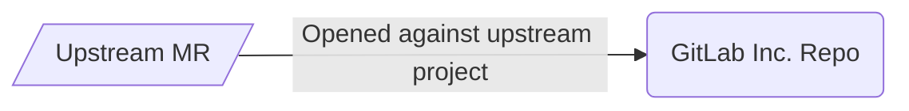

## On this page
{:.no_toc .hidden-md .hidden-lg}

- TOC
{:toc .toc-list-icons .hidden-md .hidden-lg}

{::options parse_block_html="true" /}

----

## Overview

As announced in the blog post [GitLab licensed its technology to new independent Chinese company](https://about.gitlab.com/blog/2021/03/18/gitlab-licensed-technology-to-new-independent-chinese-company/), GitLab Inc. has licensed its technology to JiHu. This page is outlines how the GitLab Inc. team provides support to JiHu.

## Brand

Please refer to our [guidelines](https://docs.google.com/document/d/1oJd_3SMHlTod6j3ThqhjpeCyyw8rqBM4WUeOfy7vYKs/edit?usp=sharing)

## Communications

Please refer to our [guidelines](https://docs.google.com/document/d/1SEBkJp0R-yjN654KTJjcSI55VGwWPHN2xTKLW5FNvUM/edit?usp=sharing)

## Sales

Please refer to our [guidelines](https://docs.google.com/document/d/1JigQn7g8KUrY8N6WHuf248ARWHzCpIGhE2yXriuhI5c/edit?usp=sharing).

## Professional Services

Please refer to our guidelines (link to be added).

## Customer Support

Process to be added below.

## Engineering

### Projects

| GitLab Inc Project                                      | JiHu Project                                               |
|---------------------------------------------------------|------------------------------------------------------------|
| https://gitlab.com/gitlab-org/gitlab                    | https://gitlab.com/gitlab-jh/gitlab                        |
| https://gitlab.com/gitlab-org/license-gitlab-com        | https://gitlab.com/gitlab-jh/license-gitlab-cn             |
| https://gitlab.com/gitlab-org/customers-gitlab-com      | https://gitlab.com/gitlab-jh/customers-gitlab-cn           |
|                                                         | https://gitlab.com/gitlab-jh/cookbook-customers-gitlab-com |
| https://gitlab.com/gitlab-services/version-gitlab-com   | https://gitlab.com/gitlab-jh/version-gitlab-cn             |
| https://gitlab.com/gitlab-org/omnibus-gitlab            | https://gitlab.com/gitlab-jh/omnibus-gitlab                |
| https://gitlab.com/gitlab-org/quality/gitlab-environment-toolkit | https://gitlab.com/gitlab-jh/gitlab-environment-toolkit    |
| https://gitlab.com/gitlab-org/build/CNG                 | https://gitlab.com/gitlab-jh/cng-images                    |
| https://gitlab.com/gitlab-org/charts/gitlab             | https://gitlab.com/gitlab-jh/jh-team/gitlab                |
| https://gitlab.com/gitlab-com/www-gitlab-com            | https://gitlab.com/gitlab-jh/jh-team/www-gitlab-com        |
| https://gitlab.com/gitlab-org/gitlab-docs               | https://gitlab.com/gitlab-jh/jh-team/gitlab-docs           |
| https://gitlab.com/gitlab-org/gitlab-runner             | https://gitlab.com/gitlab-jh/jh-team/gitlab-runner         |

### Merge Request Process

Contributions from the JiHu team will follow two methods depending on whether they have JiHu proprietary changes or not.

* Upstream method - start with a merge request in the GitLab Inc. repository.
* Proprietary and upstream method - start with a merge request with all changes against the GitLab JiHu project and a merge request with all non-proprietary changes against the upstream project.

To identify contributions from JiHu, the `~"JiHu Contribution"` label is automatically applied to all upstream contributions coming from the JiHu team. To ensure the label is accurately applied, the `gitlab-jh` team must keep the direct members of [`gitlab-jh/jh-team`](https://gitlab.com/groups/gitlab-jh/jh-team/-/group_members?with_inherited_permissions=exclude) updated with current team members.

#### Guidelines for upstream contributions

Contributions that do not involve JiHu proprietary content will be opened against the upstream project.

#### Guidelines for proprietary and upstream contributions

Contributions in projects that have proprietary and upstream contributions will use the following guidelines to have a streamlined review.

1. The `gitlab-jh` Engineering team will open two MRs:
   1. JH MR with all changes against `gitlab-jh/gitlab`
   1. Inc MR with all non-`jh/` changes against the default branch in `gitlab-org/gitlab`
1. The GitLab Inc MR will be reviewed by the `gitlab-org/gitlab` team members
1. After merging, the updates will be mirrored to `gitlab-jh/gitlab` via pull mirroring and synced to the `main-jh` `gitlab-jh/gitlab` branch with a [code sync](https://gitlab.com/gitlab-jh/gitlab-jh-enablement/-/issues/107).
1. The `gitlab-jh` Engineering team will remove all non-`jh/` changes from the JH MR.
1. The `gitlab-jh` Engineering team will review and merge the JH MR against the `gitlab-jh/gitlab` default branch

#### MR escalation

Please refer to our [guidelines](https://docs.google.com/document/d/1zEiPBZ1D90LJdxBJDl45B4N-umqtR0VGt3803OgHjMo/edit?usp=sharing).

#### Application Security Reviews

The Application Security team reviews each JiHu contribution into GitLab repositories. Please see [this documentation](./jihu-contribution-review-process.html) for more information about this process.

#### Release Certification Process

The Application Security team performs a certification of each release that includes JiHu contributions. Please see [this documentation](./release-certification.html) for more information about this process.

Certification issues containing a report can be found in the [issue tracker](https://gitlab.com/gitlab-org/jh-upstream-report/-/issues/) of the [jh-upstream-report repository](https://gitlab.com/gitlab-org/jh-upstream-report).

### Security Release Process

JiHu is responsible for building and releasing the JiHu Edition each month including all patch and security releases. For security releases, GitLab Inc will continue to follow our existing [security release process](https://gitlab.com/gitlab-org/release/docs/blob/master/general/security/process.md) to publish our [security releases](https://about.gitlab.com/releases/categories/releases/). To enable JiHu to build their security releases in a timely manner, GitLab Inc will notify JiHu when a security release is in progress along so that their teams can be on stand by. GitLab Inc will not notify JiHu of the contents of the security release or of the vulnerability.

To notify JiHu of an upcoming security release, please simply post a comment in: https://gitlab.com/gitlab-jh/gitlab-jh-enablement/-/issues/112

## Product

### Differentiating Proprietary JiHu Features
We differentiate proprietary features for JiHu distributions by including them in the `/jh` [directory](https://gitlab.com/gitlab-jh/gitlab/-/tree/main-jh/jh). However, the majority of contributions from JiHu team members should be outside of the `/jh` directory signaling the expectation that most contributions are to GitLab Core and only certain specific features are exclusive to the /jh offering.

## Design

Process to be added below.

## Links

- [GitLab licensed its technology to new independent Chinese company](https://about.gitlab.com/blog/2021/03/18/gitlab-licensed-technology-to-new-independent-chinese-company/)
- [GitLab licensing technology to independent Chinese company FAQ](https://about.gitlab.com/handbook/faq-gitlab-licensing-technology-to-independent-chinese-company/)
- [China Service Working Group](https://about.gitlab.com/company/team/structure/working-groups/china-service/)
