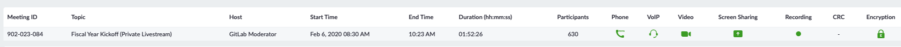

---
layout: handbook-page-toc
title: "Fiscal Year Kickoff"
---  

## On this page
{:.no_toc .hidden-md .hidden-lg}

- TOC
{:toc .hidden-md .hidden-lg}

## Fiscal Year Kickoff

In the first week of every Fiscal Year (first week of February), the E-Group hosts a Fiscal Year Kickoff.
The call is 80 minutes long and takes place over Zoom.
The doc is circulated early so that all time zones can submit questions.

The goal of the Kickoff is to discuss the strategy and plans for the next fiscal year.
Each member of the [e-group](/company/team/structure/#e-group) has 5 minutes to discuss their part of the business.

The call concludes with an AMA with all executives.
Team members can ask questions of any particular executive or the execs may choose amongst themselves who responds.

The [Chief of Staff](/job-families/chief-executive-officer/chief-of-staff/) facilitates the call, noting especially to keep people on time. 
The meeting is scheduled by the [EBA to the CEO](/job-families/people-ops/executive-business-administrator/).
The call is recorded and posted to GitLab Unfiltered.

### FY21 Kickoff

The FY21 Kickoff call was the first of its sort. 
The recording is on [GitLab Unfiltered](https://youtu.be/XlYsmj5fCcI) (GitLab Internal).
The recording is internal because we talk about financial metrics which are not public. 
The slides can be found in the Drive under the title "2020-02-06 FY21 Kickoff".

We collected feedback in [cos-team#15](https://gitlab.com/gitlab-com/cos-team/issues/15).

The structure was roughly as follows:
* 5 minutes: Countdown, Intro, Welcome, Overview
* 5 minutes: CEO Overview- Accomplishments, Values, Upcoming, Key Focus
* 5 minutes: Sales
* 5 minutes: Product
* 5 minutes: Product Strategy
* 5 minutes: Engineering
* 5 minutes: People
* 5 minutes: Marketing (Standup break)
* 5 minutes: Finance
* 5 minutes: Legal
* Remaining time: AMA with all execs

Feedback on the event was overall positive, with over 600 team members attending.

#### Improvements to be made
There were a number of problems that presented themselves. Below is a list of the problems and some proposed solutions to be solved for the FY22 Kickoff

| Problem | Possible Solution |
|---------|-------------------|
| People were locked out of the doc. |* We have 1-5 people designated as "typers" and everyone else gets view-only access of the doc. Questions are submitted via the Zoom chat. * Could use a slack channel and threaded responses.  * GitLab Issues|
| People were locked out of the slides. | Share a PDF of the slides in #companyannouncements before the call, so that people who are locked out can still follow along. |
| Because this was a last minute idea that we executed on, we were only able to coordinate for one time. | We should have this at least twice, once in EMEA friendly time zones and one in APAC friendly time zones. Earlier scheduling will make this possible. |
| There were a lot of acronyms and concepts where it would be helpful to have a primer ahead of time so I could track better — things like ARR or TAM come to mind. | Make sure all acronyms are defined upfront. |
| The slide presenter dance | The "next slide please" dance? Something else? |
| Kickoff felt a bit like an extended GC and not visionary enough | Tailor content more appropriately to inspirational/visionary, especially at the beginning |

