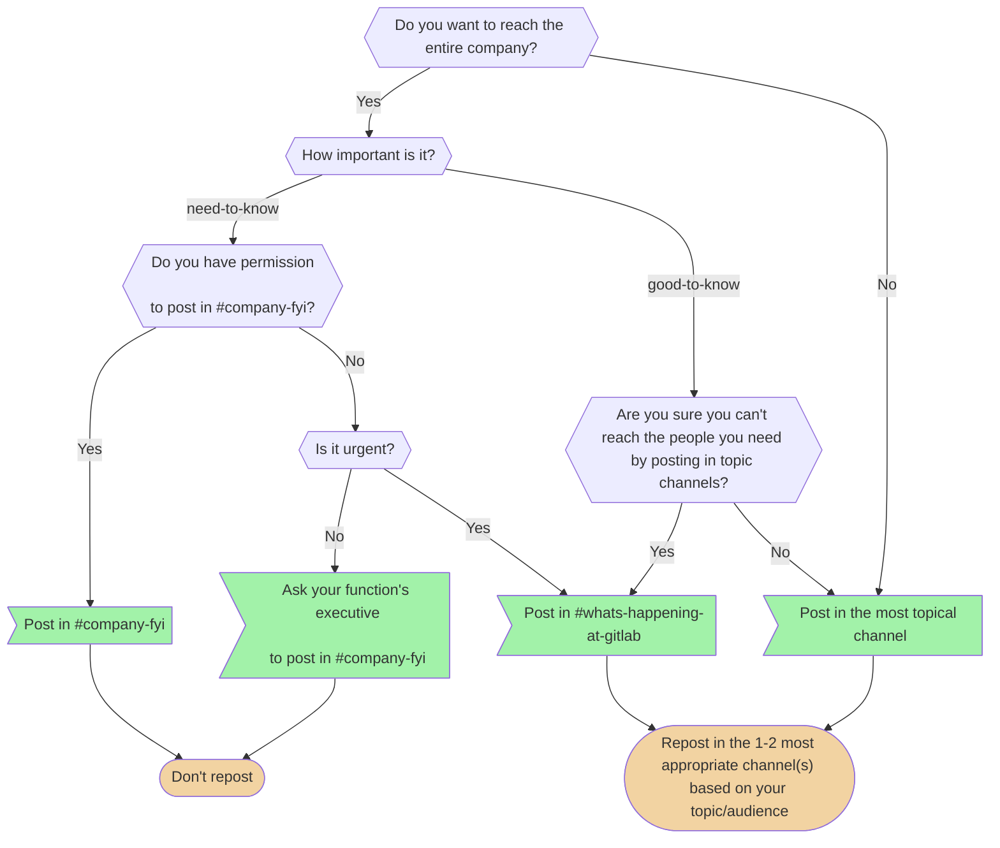

## On this page
{:.no_toc .hidden-md .hidden-lg}

- TOC
{:toc .hidden-md .hidden-lg}

We're an [all-remote](/company/culture/all-remote/#advantages-for-organizations) company that allows people to work from [almost anywhere in the world](/jobs/faq/#country-hiring-guidelines). We hire great people regardless of where they live, but with GitLab team members across [more than 60 countries](/company/team/), it's important for us to practice clear communication in ways that help us stay connected and work more efficiently.

To accomplish this, we use <b>[asynchronous communication](/company/culture/all-remote/asynchronous/) as a starting point</b> and stay as open and transparent as we can by communicating through public issues, [merge requests](#everything-starts-with-a-merge-request), and [Slack channels](/handbook/communication/chat/).

We also place an emphasis on ensuring that conclusions of offline conversations are written down.
When we go **back and forth three times,** we jump on a [synchronous video call](/handbook/communication/#video-calls).

We communicate respectfully and professionally at all times.

## Effective & Responsible Communication Guidelines

1. **Assume [Positive Intent](/handbook/values/#collaboration).** Always begin with a position of positivity and grace.
1. **Kindness Matters.** You are looking at a screen, but you are really talking to a person. If you wouldn't say it to a person's face, don't send it to them in a text message.
1. **Express Your Thoughts.** We live in different locations and often have very different perspectives. We want to know your thoughts, opinions, and feelings on things.
1. **Own It.** If you say it or type it, own it. If it hurts the company or an individual, even unintentionally, we encourage you to look at things from other points of view and apologize easily.
1. **Be a Role Model of our [Values](/handbook/values/).**
1. **Feedback is Essential.** It is difficult to know what is appropriate in every one of our team members 60+ countries. We encourage team members to give feedback and receive feedback in a considerate way.
1. **Don't Underestimate a 1:1.** Asynchronous communication (e.g., via text) is helpful and necessary. In some cases (e.g., to clarify misunderstandings) it can be much more effective to jump on a Zoom video call.
1. **Always Adhere to our [Anti-Harassment Policy](/handbook/anti-harassment/) and [Code of Conduct](/handbook/legal/gitlab-code-of-business-conduct-and-ethics/).** Everyone should be comfortable in their work environment.
1. **Focus on what we can directly influence.** There are many factors we can't directly influence and we should avoid spending time discussing those things. For example, we don't talk about our [market capitalization](/handbook/being-a-public-company/#market-capitalization) because aspects of this are out of our control. Instead, we should focus on our KPIs and growing [annual recurring revenue](/handbook/sales/sales-term-glossary/arr-in-practice/).

Embracing asynchronous communication and learning to use it effectively requires a mental shift. This can feel unusual or even uncomfortable for those who come from a colocated environment, where in-person meetings and communiques are the norm. Learn more about [mastering the use of the written word in an all-remote setting](/company/culture/all-remote/effective-communication/).

## Everyone is a Moderator

If you see something that concerns you in Slack, Issues, Merge Requests, Video, Emails or any other forum, we encourage you to respectfully say something directly to the individual in a 1:1 format. If you are not comfortable reaching out to the individual directly, please reach out to your direct manager or People Business Partner to discuss.

## External Communication

Key practices to consider during any meeting are listed below.

1. Video Calls - If this is your first time meeting a customer/prospect/partner/etc., turn on your camera when you login to Zoom. This will help to make the customer/prospect feel more comfortable as they are certain your undivided attention is geared towards them.
1. Agenda - Always have an agenda prepped and ready to go. Share this with your audience. Make sure that everything on the agenda is accurate and ask if there’s anything missing that needs to be addressed during this call or for the future. When there is no agenda, it translates to you not caring. When sharing agendas with customers and partners it should be called "GitLab + Name Shared Collaboration & Agenda", not "External Agenda" as that implies there is something the parties are not seeing.
1. 70/30 Rule - Ask open ended questions that leave the audience talking 70% of the time, while you are talking 30% of the time. Please note that this varies based on the type of meeting that you are conducting. Be conscious of what questions need to be asked and to capture those items.
1. Take Notes - Effective note-taking is a valuable skill that will help you retain and recall any important details. Be the person who remembers all the details of your audience's needs.
1. Adapt to Audience Tone - Before going into the business portion of your meeting, evaluate first the tone of the audience. Adapt your tone accordingly in order to appeal to various types of personalities.
1. Mid-call - Half-way through the meeting, check in with your audience. Ask them what their thoughts are on the progression of this meeting and if what you're presenting is on the right track. This helps both you and the audience by re-aligning expectations and making sure the meeting is going the right direction.
1. Pre-Close Summary - 10 Minutes (1-hour meetings) or 5 minutes (30 minute meetings) prior to ending the call, ask the audience to build out an agenda for the next step or meeting. This helps to secure next steps and to ensure there are no balls dropped.
1. Post Meeting Action - Immediately write down notes and next steps and input into the proper directory (Google Drive, Salesforce, etc.).
1. Two Block Rule - For in person meetings with external parties you should wait until you're more than two blocks from the meeting before discussing the results of the meeting. Nobody wants to hear themselves being discussed in the bathroom.

### Communicating with Media and Industry Analysts

GitLab employees and contractors are not authorized to speak with the media or analysts on behalf of our company unless authorized by our Marketing department. Unless authorized, do not give the impression that you are speaking on behalf of GitLab in any communication that may become public. This includes posts to online forums, social media sites, blogs, chat rooms, and bulletin boards. This policy also applies to comments to journalists about specific matters that relate to our businesses, as well as letters to the editor and endorsements of products or services.

For more, please visit the [Corporate Communications handbook section](/handbook/marketing/corporate-marketing/#corporate-communications-and-pr-public-relations).

### Paid external speaking requests

GitLab as the leader in all remote work creates opportunities for our team members to receive requests from external 3rd parties to participate on panels, blogs or news publication or articles. Recently our team members have been approached by external 3rd parties looking to pay or compensate GitLab team members for their time to discuss GitLab remote practice to help them guide a client. Other third parties may contact GitLab team members to provide subject matter expertise that they may have by virtue of their role at GitLab. As in any request we ask that team members verify who they are speaking with to make sure the source is indeed a valid and legitimate request. Always remember that you represent GitLab and if any question makes you uncomfortable or gives you a pause on whether you should answer then we recommend that you do not answer. A third party's questions regarding GitLab financials, sales, compliance, executives or specifically where the company is heading should be treated with the most caution. We want and encourage all team members to be remote evangelists and this can be done without giving very specific information about GitLab. If you have any concern about a request please reach out on slack to [#external-comms](https://gitlab.slack.com/archives/CB274TZRR)

### Social Media

Please see our [team member social media policy](/handbook/marketing/team-member-social-media-policy/).

## Everything Starts with a Merge Request

It's best practice to start a discussion where possible with a [Merge Request (MR)](https://docs.gitlab.com/ee/user/project/merge_requests/) instead of an issue. An MR is associated with a specific change that is proposed and transparent for everyone to review and openly discuss. The nature of MRs facilitate discussions around a proposed solution to a problem that is actionable. An MR is actionable, while an issue will take longer to take action on.

1. Always **open** an MR for things you are suggesting and/or proposing. Whether something is not working right or we are iterating on a new internal process, it is worth opening a merge request with the minimal viable change instead of opening an issue encouraging open feedback on the problem without proposing any specific change directly. Remember, an MR also invites discussion, but it's specific to the proposed change which facilitates focused decision.
1. Never ask someone to create an issue when they can default to the merge request.
1. Starting with a Merge Request is part of [Handbook First](/handbook/handbook-usage/#why-handbook-first) and helps ensure the handbook is up-to-date when a decision is made. It is also how we make it possible for [Everyone to Contribute](/company/mission/#mission). This is true, not just for updating the handbook but for updating all things.
1. Merge Requests, by default, are **non-confidential**. However, for [things that are not public by default](/handbook/communication/#not-public) please open a confidential issue with suggestions to specific changes that you are proposing. The ability to create [Confidential Merge Requests](https://docs.gitlab.com/ee/user/project/issues/confidential_issues.html#merge-requests-for-confidential-issues) is also available. When possible, consider not including sensitive information so the wider community can contribute.
1. Not every solution will solve the problem at hand. Keep discussions focused by **defining the problem first** and **explaining your rationale** behind the [Minimal Viable Change (MVC)](/handbook/values/#minimal-viable-change-mvc) proposed in the MR.
1. Be proactive and consistent with communication on discussions that have external stakeholders such as customers. It's important to keep communication flowing to keep everyone up to date. MRs can appear stale if there aren't recent discussions and no clear definition on when another update will be provided, based on feedback. This leaves those subscribed in the dark, causing unnecessary surprise if something ends up delayed and suddenly jumps to the next milestone. It is important that MRs are closed in a timely manner through approving or rejecting the open requests.
1. Have a **bias for action** and [don't aim for consensus](/handbook/leadership/#making-decisions). Every MR is a [proposal](/handbook/values/#make-a-proposal), if an MRs author isn't responsive take ownership of it and complete it. Some improvement is better than none.
1. **Cross link** issues or other MRs with related conversations. E.g. if there’s a Zendesk ticket that caused you to create a GitLab.com MR, make sure to document the MR link in the Zendesk ticket and vice versa. And when approving or rejecting the MR, include reason or response from Zendesk. Put the link at the top of each MR's description with a short mention of the relationship (Report, Dependency, etc.) and use one as the central one and ideally close the alternate if duplicate.
   1. When providing links to specific lines of code relevant to the MR, **always use a permalink** (a link to a specific commit for the file). This ensures that the reference is still valid if the file changes. For more information, see [Link to specific lines of code](https://docs.gitlab.com/ee/development/documentation/styleguide/index.html#link-to-specific-lines-of-code).
1. If submitting a change for a feature, **update the description with the final conclusions** (Why an MR was rejected or why it was approved). This makes it much easier to see the current state of an issue for everyone involved in the implementation and prevents confusion and discussion later on.
1. Submit the **smallest** item of work that makes sense. When proposing a change, submit the smallest reasonable commit, put suggestions for other enhancements in separate issues/MRs and link them. An MR can start off as only a [problem description and TODO comments](https://gitlab.com/gitlab-org/gitlab/-/merge_requests/35239/diffs?diff_id=97449459). If you're new to GitLab and are writing documentation or instructions, submit your first merge request for at most 20 lines.
1. Do not leave MRs open for a long time. MRs should be **actionable** -- stakeholders should have a clear understanding of what changed and what they are ultimately approving or rejecting.
1. Make a conscious effort to **prioritize** your work. The priority of items depends on multiple factors: Is someone waiting for the answer? What is the impact if you delay it? How many people does it affect, etc.? This is detailed in [Engineering Work flow](/handbook/engineering/workflow/).
1. When submitting a MVC, **ask for feedback** from your peers. For example, if you're a designer and you propose a design, ping a fellow designer to review your work. If they suggest changes, you get the opportunity to improve your design and propose an alternative MR. This promotes collaboration and advances everyone's skills.
1. Respond to comments within a **threaded discussion**. If there isn't a discussion thread yet, you can use the [Reply to comment](https://docs.gitlab.com/ee/user/discussions/#start-a-discussion-by-replying-to-a-standard-comment) button from the comments to create one. This will prevent comments from containing many interweaved discussions with responses that are hard to follow.
1. If your comment or answer contains separate topics, write separate comments for each, so others can address topics independently using the [Reply to comment](https://docs.gitlab.com/ee/user/discussions/#start-a-discussion-by-replying-to-a-standard-comment) button.
1. If you have received any feedback or questions on your MR, try to acknowledge comments as [that's how we ensure we create an environment of belonging for all team members](/company/culture/inclusion/#gitlabs-definition-of-diversity-inclusion--belonging). Merging your MR as-is without giving an answer or any response makes the commenters feel their opinions are unheard. If you are the DRI who does not have to make a fast decision, you can choose not to change your MR, but you should acknowledge the comments or feedback, consider if they warrant a change to your MR, and [say why, not just what](/handbook/values/#say-why-not-just-what).
   If there are many comments, you can choose to summarize key feedback areas and share your response at a high level. We appreciate that [if you force a DRI to explain too much, you'll create incentives to ship projects under the radar. The fear of falling into a perpetual loop of explaining can derail a DRI, and cause people to defer rather than working with a bias for action](/handbook/people-group/directly-responsible-individuals/#empowering-dris). This is something we want to avoid.
   When fast decisions are needed, [we'll have to accept that people listened to us but don't owe us an explanation to have fast decisions based on everyone's input](/handbook/leadership/#making-decisions). The goals are to be transparent and collaborative--not to lose efficiency. Not everyone will agree, but we expect all people to [disagree, commit, and disagree](/handbook/values/#disagree-commit-and-disagree).
1. For GitLab, the product merge request guidelines are in the [Contribution
   guide](https://docs.gitlab.com/ee/development/contributing/merge_request_workflow.html#merge-request-guidelines) and code review guidelines for reviewers and maintainers are described in our [Code Review Guidelines](https://docs.gitlab.com/ee/development/code_review.html).
1. Even when something is not done, share it internally so people can comment early and prevent rework.
1. Create a <b>[Work In Progress (WIP)](/blog/2016/01/08/feature-highlight-wip/)</b> merge request to prevent an accidental early merge. Only use WIP when merging it would **make things worse**, which should rarely be the case when contributing to the handbook. Most merge requests that are in progress don't make things worse. In this case, don't use WIP; if someone merges it earlier than you expected just create a new merge request for additional items. Never ask someone to do a final review or merge something that still has WIP status. At that point you should be convinced it is good enough to go out.
1. If any follow-up actions are required on the issue after the merge request is merged (like reporting back to any customers or writing documentation), avoid auto-closing the issue.
1. If a project requires multiple approvals to accept your MR, feel free to assign multiple reviewers concurrently. This way the earliest available reviewer can start right away rather than being blocked by the preceding reviewer.
1. If the MR involved gets a lot of comments, you can turn it into a [Manager Mention MR](/handbook/communication/index.html#scaling-merge-requests-through-manager-mention-mrs-formerly-consolidated-mrs).
1. Consider recording a concise video or audio file outlining the merge request and uploading it to the GitLab [Unfiltered channel](https://about.gitlab.com/handbook/marketing/marketing-operations/youtube/#channels) on YouTube. This will make content more accessible, prevent future confusion, allow for multitasking (e.g. cooking dinner and listening to the video), and increase participation for folks who digest audio information better than visual.

### Scaling Merge Requests through "Manager Mention MRs" (formerly Consolidated MRs)

Some merge requests that involve a big decision or change tend to collect a large amount of feedback. As GitLab grows in size, it is unrealistic for a single person to respond to potentially hundreds of comments. To remain efficient in these MRs and to make it scalable, it is important for the DRI to receive a clear signal of input that is shared on the merge request. Some MRs may be marked as "Manager Mention MRs" by clearly designating them as such at the beginning of the MR description with the following code block:

```
## Manager Mention MR

This MR is a Manager Mention MR.  Contributors should tag their manager when adding a comment.  If managers are tagged they should either respond to the question or summarize and tag their manager.
```

Additionally, add the `~"Manager Mention MR"` label to the merge request. This will make future analytics on Manager Mention merge requests more easily identifiable. It also enables managers to subscribe to the label to be notified when an MR has elected the Manager Mention MR designation.

We tried Manager Mention MR’s for the first time in a recent announcement (2021-03-03) but this did not work well and we are working on making it better. We're starting with a more thoughtful and transparent process in our communications cadence and approach going forward, including all directs and people managers getting a few days’ notice before important company-wide changes are announced to all team members. This will allow all directs and people managers to feel more enabled and better understand the why behind big changes in order to scale communication to team members.

**For all managers:** It is important to ground yourself in the contents of the changes before the announcement goes live to all team members. If a team member tags you in a Manager Mention MR, it is your role to respond candidly and thoughtfully to their question or comment. If the line of questioning in the Manager Mention MR gets out of your depth, ask the DRI to help answer. If a team member comments without a manager tagged, the comment will be closed with a link to this handbook section or closed without comment. In a situation where a team member leaves a wildly inappropriate comment in the Manager Mention MR, you should feel empowered to delete comment and talk to your team member 1:1. Consider subscribing to the label `~"Manager Mention MR"` to be notified when MRs transition to this designation.

- **What not to do:** Not communicate to team members about company-wide changes. Ignoring team member questions, whether that’s in a 1:1 or Manager Mention MR.
- **What to do:** If one of your team members has a suggestion, solution or sees an issue, see if talking through the communication will answer any of their questions. Team members are also allowed to bring forward their ideas in the Manager Mention MR addressed to you, we want everyone to contribute. As a manager, you will be expected to communicate changes to your teams and also be present to answer any team member questions, whether that’s in a 1:1 or Manager Mention MR. As a manager, it is part of your role to understand and own change management for your team and properly triage the process and expectations. Consider a synchronous call with the team member for further context, make a suggestion, link to additional context, delete any unnecessary comments from their team, or escalate to the author of the MR. Ensure that the comments of your reports you interact with were made after the Manager Mention label was added.

**For team members:** Check if the MR you are about to comment on has the `~"Manager Mention MR"` label. Check each time as the label may have been added since you last commented. When leaving a comment in a Manager Mention MR, frame the comment as a question or suggestion to your manager directly, and not anyone else, including the DRI. We do this to scale communication, as it is unsustainable for the DRI to answer every question.

- **What not to do:** Leaving a comment and CC’ing your manager at the end of your post, but not addressing your manager directly.
- **What to do:** Address your manager directly at the beginning of your message as your comments should be addressed to your manager. If you have a suggestion, solution or see an issue with a big change, you can also bring it up directly to your manager. The MR is not a poll. Give suggestions on how to improve and try to find data that helps support your argument or change in the MR.

MRs should not start out as a Manager Mention MR as we prefer [communication to be direct](/handbook/leadership/#communication-should-be-direct-not-hierarchical). They should only be designated as such after the number of comments on them grows to a level that is unsustainable for the DRI. An exception to this is compensation changes and other company-wide announcements that can be sensitive/contentious in nature since they have historically generated many comments.

When an MR is changed to be `Manager Mention`, the person making this change should add a comment stating this so that everyone tracking the MR can be informed.

## Issues

Issues are useful when there isn't a specific code change that is being proposed or needed. For example, you may want to start an issue for tracking progress or for project management purposes that do not pertain to code commits. This can be particularly useful when tracking team tasks and creating issue boards. However it is still important to maintain focus when opening issues by defining a single specific topic of discussion as well as defining the desired outcome that would result in the resolution of the issue. The point is to not keep issues open-ended and to prevent issues from going stale due to lack of resolution. For example, a team member may open an issue to track the progress of a blog post with associated to-do items that need to be completed by a certain date (e.g. first draft, peer review, publish). Once the specific items are completed, the issue can successfully be closed. Below are a few things to remember when creating issues:

1. When **closing** an issue leave a comment explaining why you are closing the issue and what the MVC outcome was of the discussion (if it was implemented or not).
1. We keep our **promises** and do not make external promises without internal agreement.
1. Be proactive and consistent with communication on discussions that have external stakeholders such as customers. It's important to keep communication flowing to keep everyone up to date. Issues can appear stale if there aren't recent discussions and no clear definition on when another update will be provided, based on feedback. This leaves those subscribed in the dark, causing unnecessary surprise if something ends up delayed and suddenly jumps to the next milestone. It is important that issues are closed in a timely manner. One way of doing this is having the current assignee set a due date for when they will provide another update. This can be days or weeks ahead depending on the situation, prioritization, and available capacity that we may have.

<i>**Pro Tip:**</i> When creating a Merge Request you can add `closes: #[insert issue number here]` and when the Merge Request is merged, the issue will automatically close. You can see an example of this [here](https://gitlab.com/gitlab-com/people-group/peopleops-eng/employment-automation/-/merge_requests/60).

1. If a user suggests an enhancement, try and find an existing issue that addresses their concern, or create a new one. Ask if they'd like to elaborate on their idea in an issue to help define the first MVC via a subsequent MR.
1. **Cross link** issues or MRs with related conversations. Another example is to add "Report: " lines to the issue description with links to relevant issues and feature requests. When done, add a comment to relevant issues (and close them if you are responsible for reporting back, or reassign if you are not). This prevents internal confusion and us failing to report back to the reporters.
1. When cross-linking issues or MRs, include a preview of the content you are linking, to facilitate [low-context communication](/company/culture/all-remote/effective-communication/#understanding-low-context-communication):
1. Good: `this would cause performance issue similar to #123456`. The reader has full information on first read and can refer to the link for more.
1. Avoid: `this would cause issue similar to #123456`. The reader needs to click the link and find the relevant information among other discussion threads, before switching back to the original discussion.
1. When providing links to specific lines of code relevant to the issue, **always use a permalink** (a link to a specific commit for the file). This ensures that the reference is still valid if the file changes. For more information, see [Link to specific lines of code](https://docs.gitlab.com/ee/development/documentation/styleguide.html#link-to-specific-lines-of-code).
1. Prioritize your work on issues in the current [milestone](https://gitlab.com/groups/gitlab-org/-/milestones).
1. Use the public issue trackers on GitLab.com for everything since [we work out in the open](/blog/2015/08/03/almost-everything-we-do-is-now-open/). Issue trackers that can be found on the relevant page in the handbook and in the projects under [the gitlab-com group](https://gitlab.com/gitlab-com/).
1. Assign an issue to yourself as soon as you start to work on it, but not before that time. If you complete part of an issue and need someone else to take the next step, **re-assign** the issue to that person.
1. Ensure the issue **title** states what the desired outcome should be. For instance, for bugs make sure the issue states the desired result, not the current behavior.
1. **Regularly update** the issue description with the latest information and its current status, especially when important decisions were made during the discussion. The issue description should be the **single source of truth**.
1. If you want someone to review an issue, do not assign them to it. Instead, @-mention them in an issue comment. Being assigned to an issue is a signal that the assignee should or intends to work on it. So you should not assign someone to an issue and mis-represent this with a false signal.
1. If you'd like to inform someone about an issue, or assign a task to them - do so via an issue comment not just adding them to the description. Here's why - the To Do generated when mentioning someone in an issue description provides little context to the action requested, explicitly informing them of the action via a comment ensures when they read the To Do they have more context without reading the entire issue.
1. Do not close an issue until it is [**done**](https://docs.gitlab.com/ee/development/contributing/merge_request_workflow.html#definition-of-done). It's okay to explicitly ask if everyone is on board and in agreement on how to move forward, whether to iterate, close the open issue, or create a subsequent MR to implement a MVC.
1. Once a feature is [**done**](https://docs.gitlab.com/ee/development/contributing/merge_request_workflow.html#definition-of-done), update the description to add a link to the corresponding documentation. When using a Search Engine, issues often appear before documentation pages, which makes it harder to find the relevant information about the feature.
1. Write issues so that they exclude private information. This way, the issue can be public. Only use confidential issues, if the issue must contain [non-public information](/handbook/communication/#not-public). **Note:** Confidential issues are [accessible to all members of the project with Reporter access and above](https://docs.gitlab.com/ee/user/project/issues/confidential_issues.html#permissions-and-access-to-confidential-issues). You may consider using a Google Doc for items that require a stricter level of confidentiality.
1. If the content within a public issue transitions to become what is deemed confidential [non-public information](/handbook/communication/#not-public), the issue may be made confidential.
1. If the content of a public issue draws comments that are deemed in violation of our [code of conduct](/community/contribute/code-of-conduct/) the issue may be locked and may [undergo moderation](/handbook/marketing/community-relations/community-operations/workflows/code-of-conduct-enforcement/#overview).

## Internal Communication

Internal communication is any work related communication at a company.
Internal Communication includes conversations between team members, wider team discussions, or internal announcements.
At GitLab, everyone can contribute to the effectiveness of Internal Communications to support aspects of GitLab culture, such as intentional transparency and engaging people in open dialogue.

Since we believe that all team members must be [Managers of One](/handbook/leadership/#managers-of-one), most communication is handled by the relevant group, but we know that some communications are more sensitive and contentious than others.
In those cases, the DRIs may want to engage the [Internal Communications function](/handbook/communication/internal-communications/).

## Asynchronous communication

In an [all-remote setting](/company/culture/all-remote/terminology/), where team members are empowered to live and work where they're most fulfilled, mastering asynchronous workflows is vital to avoiding [dysfunction](/handbook/values/#five-dysfunctions) and enjoying outsized efficiencies and lifestyle flexibility. Asynchronous communication is the art of communicating and moving projects forward _without_ the need for additional stakeholders to be available at the same time your communique is sent.

To learn more on when to use asynchronous and synchronous communication, examples of async workflows in practice at GitLab, core async behaviors, and to take an async knowledge assessment, visit [GitLab's guide to embracing asynchronous communication](/company/culture/all-remote/asynchronous/).

## Top Tips and Best Practices

1. All written communication happens in English, even when sent one on one, because sometimes you need to forward an email or chat.
1. Use **asynchronous communication** when possible: merge requests (preferred) or issues. Announcements happen on the appropriate Slack channels and [people should be able to do their work without getting interrupted by chat](https://m.signalvnoise.com/is-group-chat-making-you-sweat-744659addf7d#.21t7089jk).
1. Discussion in issues or Merge Requests is preferred over everything else. If you need a response urgently, you can Slack someone with a link to your comment on an issue or merge request, asking them to respond there, however be aware that they still may not see it straight away. See [Slack](/handbook/communication#slack) for more.
1. If you choose to email instead of chat it is OK to send an _internal_ email that contains only a short message, similar as you would use in chat.
1. You are not expected to be available all the time. There is no expectation to respond to messages outside of your planned working hours.
1. Sometimes synchronous communication is the better option, but do not default to it. For example, a video call can clear things up quickly when you are blocked. See the [guidelines on video chats](#video-calls) for more detail.
1. It is very OK to ask as many questions as you have. Please ask them so many people can answer them and many people see the answer. Use issues or public chat channels (like #questions) instead of direct messages or one-on-one emails. If you have researched in the handbook and could not find the answer or need clarity, include the handbook link you were reviewing and state "while looking in the handbook I could not find x,y,z".
1. If someone sends you a handbook link they are proud that we have the answer documented, they don't mean that you should have found that yourself or that this is the complete answer, feel free to ask for clarification.
1. If the answer to a question isn't documented, please immediately make a merge request to add it to the handbook in a place you have looked for it. It is great for the person who answered the question to see you leading by example to ensure that question only needs to be answered once. A merge request is the best way to say thanks for help.
1. If you mention something (a merge request, issue, commit, webpage, comment, etc.) please include a link to it.
1. All company data should be **shareable** by default. Don't use a local text file, but rather leave comments on an issue.
1. When someone asks something, give back a deadline or that you did it. Answers like: 'will do', 'OK', 'it is on my todo list' are not helpful. If it is small it's better to spend 2 minutes and do the tasks so the other person can mentally forget about it. If it is large you need to figure out when you'll do it, by returning that information the other person might decide to solve it in another way if it takes too long.
1. It is OK to bring an issue to someone's attention with a CC ("cc @user"), but CCs alone are not enough if specific action is needed from someone. The mentioned user may read the issue and take no further action. If you need something, please explicitly communicate your need along with @ mentioning who you need it from.
1. Avoid creating private groups for internal discussions:
   1. It's disturbing (all users in the group get notified for each message).
   1. It's not searchable.
   1. It's not shareable: there is no way to add people in the group (and this often leads to multiple groups creation).
   1. They don't have a subject, so everyone has to remember the topic of each private group based on the participants, or open the group again to read the content.
   1. History is lost when leaving the group or [after 90 days](https://about.gitlab.com/handbook/communication/#slack).
1. It is perfectly fine to create a channel, even for a single customer meeting. These channels should be named "a\_<customer-name>-internal" to indicate their "internal" nature (not shared with customers).
1. Use [low-context communications](https://en.wikipedia.org/wiki/High-context_and_low-context_cultures) by being explicit in your communications. We are a remote-only company, located all over the world. Provide as much context as possible to avoid confusion. Relatedly, we use [ubiquitous language](#ubiquitous-language) for communication efficiency.
1. When discussing concepts, be careful not to lean too much into hypotheticals. There is a tipping point in which it decreases value and no longer becomes constructive at helping everyone come into a unified decision.

### How to make a Company wide Announcement

1. Consider the subject and the audience.
   Questions you might want to ask yourself: Is this relevant to all team members globally?
   Is this something important, urgent and high priority? Is there a better place for this communication, such as a more informal Slack channel?
1. Keep it simple, brief and summarize what is important. Cover the 5 W's. What, Why, Who, When, Where (you can also add How, if required as a call to action). The majority of information should still be in the Handbook which you include links to.
1. Common company wide announcements include (but are not limited to): organization changes, policy iterations, requests to participate in a company survey, unveiling the next GitLab Contribute location, codebase migrations, process improvement and security/safety announcements.
1. Remember Handbook First.
   When you announce anything, include links to the respective Handbook pages for more information. Consider adding link to an Issue if the information is not public yet.
1. Optional AMA.
   If desired and appropriate, offer a company wide Zoom call to host an AMA (Ask Me Anything). Oftentimes, questions can be managed within the Discussion tab of a GitLab Issue or Merge Request. For broad announcements, such as registration opening for GitLab Contribute, an AMA may be better suited for a large volume of inquiries. To schedule a company wide call, please make a request in the #people-connect Slack channel, and include a Google Doc in the invite for questions.

### Ask Me Anything Meetings

[Ask Me Anything meetings](/handbook/communication/ask-me-anything/) can be a useful opportunity for team members to meet a new leader, learn more about an existing team member, or gain clarity on a recent change.

### Posting in #company-fyi



#### Posting in #company-fyi

Our companywide announcements channel is **#company-fyi**.
It is an **announcement only** channel, meaning that communications need to be approved before they can be posted. To minimize noise, announcements made in `#company-fyi` should not be duplicated in `#whats-happening-at-gitlab`. Be mindful of the [attention economy](https://en.wikipedia.org/wiki/Attention_economy).

In order to post or have a message posted in `#company-fyi`, please reach out to [the internal communications team](/handbook/communication/internal-communications/) or your function's executive who can approve the message and post it.

1. Examples of what **should not** go in **#company-fyi** (as per new group guidelines):
   1. Competition prize winner announcements.
   1. Org change or new team member announcements (unless they are E-group).
   1. Promotion of an optional non-companywide internal event.
   1. Announcement that directly impacts less than 75% of team members
   1. Actions required from team members is not critical or timely

**The above should all go in the new #whats-happening-at-GitLab channel** (formerly the `#company-announcement` channel).

#### Posting in #whats-happening-at-gitlab

Due to the volume of posts in the Slack channel, we recommend that you do not use #whats-happening-at-gitlab as a sole location for important announcements as information might get lost or muted. Examples of important items include but are not limited to:

1. Anything involving GitLab team member policy, such as changes in benefits, laws, review cycles, etc.
1. Urgent matters that can't wait for #company-fyi but still need to be communicated to everyone such as service outages or last minute event changes.

### Top misused terms

Please see our [Top misused terms page](/handbook/communication/top-misused-terms/).

### Asking "is this known"

1. If something is behaving strangely on [https://gitlab.com](https://gitlab.com), it might be a bug.
   It could also mean that something was changed intentionally.
1. Please search if the issue has already [been reported][issue-list].
   1. If it has not been reported, please [file an issue](#issues).
1. If you are unsure whether the behavior you experience is a bug, you may ask in the Slack channel [#is-this-known][is-this-known-slack].
   1. Make sure that no-one has experienced this issue before, by checking the channel for previous messages
   1. If you know which stage of the DevOps lifecycle is affected, it is also okay to ask in #s\_{stage}, for example [#s_manage][s_manage-slack].
   1. Describe the behavior you are experiencing, this makes it searchable and easier to understand.
      Different people might look for different things in the same screenshots.
   1. Asking in a single channel helps discoverability, duplicated efforts and reduces noise in other channels.
      Please refrain from asking in general purpose channels like [#frontend][fe-slack], [#backend][be-slack], [#development][dev-slack] or [#questions][q-slack].

[issue-list]: https://gitlab.com/groups/gitlab-org/-/issues
[is-this-known-slack]: https://gitlab.slack.com/messages/CETG54GQ0/
[s_manage-slack]: https://gitlab.slack.com/messages/CBFCUM0RX
[fe-slack]: https://gitlab.slack.com/messages/C0GQHHPGW/
[be-slack]: https://gitlab.slack.com/messages/C8HG8D9MY/
[dev-slack]: https://gitlab.slack.com/messages/C02PF508L/
[q-slack]: https://gitlab.slack.com/messages/C0AR2KW4B/

### Multimodal communication

Employ multimodal communication to broadcast important decisions. To reach our distributed organization, announce important decisions in the company announcements Slack channel, email the appropriate team email lists, Slack the appropriate channels, and target 1:1s or other important meetings on the same day, with the same information.

When doing this, create and link to a [single source of truth](/company/culture/all-remote/handbook-first-documentation/): ideally the [handbook](/handbook/handbook-usage/#why-handbook-first), otherwise an epic, issue, or Google Doc. The email or Slack message should not be the source of truth.

When referring to email that recipients should have received, reference the sender and subject of the email so its easy to find. For example, "You should have received an email from Jane Smith with the subject 'Training Seminar Details'"

## Not Public

We make things public by default because [transparency is one of our values](/handbook/values/#transparency).
Some things can't be made public and are either [internal](#internal) to the company or have [limited access](#limited-access) even within the company.
If something isn't listed in the sections below we should make it available externally.

### Internal

Some things are **internal**, available internally but not externally. The following items are internal:

1. Security and [abuse](/handbook/engineering/security/security-operations/trustandsafety/#what-is-abuse) vulnerabilities are not public since they would allow attackers to compromise GitLab installations. We do make them public after we remediated a vulnerability. Issues that discuss how to improve upon the security posture of an implementation that is working as intended can be made public, and are often labeled as feature proposals. Security and abuse implementations that detect malicious activities cannot be made public because doing so would undermine our operations.
1. Financial information, including revenue and costs for the company, is confidential because we plan to be a public company and, as such, need to limit both the timing and content of financial information as investors will use and rely on it as they trade in GitLab stock. As the guideline, if it is a first step to constructing a profit, we need to keep it confidential. Examples include:
   1. the specific [IACV](/handbook/sales/sales-term-glossary/arr-in-practice/) of an opportunity;
   1. total monthly cash inflow/outflow for GitLab.com;
   1. spend of more than 10%;
   1. a department's cost;
   1. team member retention (analysts may make business assumptions based on this);
   1. the Sales pipeline (but the Marketing pipeline can be public);
   1. net and gross retention KPIs (only the actual numbers can't be public. Everything else- the goal, their calculation, etc- can be.); and,
   1. forward-looking statements, including the timing and plans for [becoming a public company](/handbook/being-a-public-company/). The going-public date is too sensitive to share broadly internally. The press is very eager to report on it. If it leaks, having reports out there is a big problem because it reduces our flexibility. Therefore, it will be on a need-to-know basis, even inside the company. Everyone will find out when the [S1](https://en.wikipedia.org/wiki/Form_S-1) becomes public, 21 days before going public.
1. Deals with external parties like contracts and [approving and paying invoices](/handbook/finance/accounting/#procure-to-pay).
1. Content that would compromise a GitLab team member, customer, or user's personal data as defined by [GDPR](https://gdpr.eu/article-4-definitions/), unless explicit consent provided by the data owner, such as a name, an identification number, location data, an online identifier or to one or more factors specific to the physical, physiological, genetic, mental, economic, cultural or social identity of that natural person
1. Legal discussions are not public due to the purpose of Attorney-Client Privilege
1. Acquisition offers for us are not public since informing people of an acquisition that might not happen can be very disruptive.
1. Acquisition offers we give are not public since the organization being acquired frequently prefers to have them stay private.
1. Customer information is not public since customers are not comfortable with that, and it would make it easier for competitors to approach our customers. If an issue needs to contain _any_ specific information about a customer, including but not limited to company name, employee names, number of users, the issue should be made confidential. Try to avoid putting customer information in an issue by describing them instead of naming them and linking to their SalesForce account. When we discuss a customer by name that is not public unless we're sure the customer is OK with that. When we discuss a competitor (for example in a sales call) this can be public as our competitive advantages are public.
1. Competitive sales and marketing campaign planning is confidential since we want to minimize the time the competition has to respond to it.
1. Discussions that involve decisions related to country of residence are not public as countries are a core part of people's identity and any communication should have complete context. The output of such decisions, such as [country hiring guidelines](/jobs/faq/#country-hiring-guidelines) will be public.
1. If public information compromises the physical safety of one or more team members, it will be made not public because creating a safe, inclusive environment for team members is important to how we work. Information that might compromise the physical safety of a team member includes doxxing or threats made against a team member.
1. Information related to a press embargo, or related to an upcoming publication where the response will be managed by our external communications team
1. Information that relies on someone else's copyrighted IP. Our [compensation calculator](/handbook/total-rewards/compensation/compensation-calculator/), for example, relies on private sources of information and can't be made completely public.
1. Information related to early exploratory initiatives in which premature sharing of information could slow down purchases.

### Limited Access

The items below are not shared with all team members. Limited access is a more severe restriction than [internal](#internal).

1. Deals with external parties like contracts and [approving and paying invoices](/handbook/finance/accounting/#procure-to-pay).
1. Content that would violate confidentiality for a GitLab team-member, customer, or user.
1. Customer lists and other customer information are not public since many customers are not comfortable with that and it would make it easier for competitors to approach our customers. If an issue needs to contain _any_ specific information about a customer, including but not limited to company name, employee names, and/or number of users, the issue should be made confidential. Avoid putting customer information in an issue by describing them instead of naming them and by linking to their Salesforce account.
1. Plans for reorganizations. Reorganizations cause disruption and the plans tend to change a lot before being finalized, so being public about them prolongs the disruption. We will keep relevant team members informed whenever possible.
1. Planned pricing changes. Much like reorganizations, plans around pricing changes are subject to shift manage time before being finalized. Thus, pricing changes are limited access while in development. Team members will be consulted before any pricing changes are rolled out.
1. Legal discussions are restricted to the purpose of Attorney-Client Privilege.
1. Some information is kept confidential by the People Group to protect the privacy, safety, and security of team members and applicants, including: job applications, background check reports, reference checks, compensation, terminations details, demographic information (age and date of birth, family or marital status, national identification such as passport details or tax ID, required accommodations), home address. Whistleblower identity is likewise confidential. Performance improvement plans, disciplinary actions, as well as individual feedback are restricted as they may contain negative feedback and [negative feedback is 1-1](/handbook/values/#collaboration) between you and your manager. However, People Group policies and processes are public (for example, [Job families](/handbook/hiring/job-families/) and our [Compensation Calculator](/handbook/total-rewards/compensation/compensation-calculator/calculator/)), along with information that team members choose to share on the [Team](/company/team/) page.
1. Performance improvement plans, disciplinary actions, as well as individual feedback, are confidential as they contain private negative feedback and [negative feedback is 1-1](https://about.gitlab.com/handbook/people-group/guidance-on-feedback/#all-feedback) between team members and managers
1. GitLab's Risk Register, is maintained by the [Risk & Field Security Team](/handbook/engineering/security/security-assurance/risk-field-security/). Access to GitLab’s Risk Register is limited to the Security Compliance Team, VP of Security, Executive Leadership and individually identified employees on a need to know basis. This document is not publicly or internally available as there may be risks on the risk register that explicitly call out the mechanisms available for external actors or internal GitLab team members to access content that would violate confidentiality for a GitLab team-member, customer, or user, and may include Personally Identifiable Information (PII).
1. Acquisition offers for us are not public since informing people of an acquisition that might not happen can be very disruptive
1. Acquisition offers we give are not public since the organization being acquired frequently prefers to have them stay private.
1. Compensation Changes: GitLab will communicate and train team members on the output of iterations to the Total Rewards offerings (Compensation, Equity, Benefits), but team members will not have visibility into the inputs and decision making of compensation changes.

#### Project Names

Some projects require limited access internally due to the confidential or sensitive nature of the project, including but not limited to projects related to the items listed above. Often, in order to maintain the necessary confidentiality of these types of initiatives, we assign a code name for the project. For consistency and to make it easier to identify the genesis of these projects and their organizational affiliations, we've established the following naming conventions.

| Team                  | Theme                                                                                          |
| --------------------- | ---------------------------------------------------------------------------------------------- |
| CEO                   | Pets / Animals                                                                                 |
| Corporate Development | [Greek mythological figures](https://en.wikipedia.org/wiki/List_of_Greek_mythological_figures) |
| Engineering           | [Hex color names](https://htmlcolorcodes.com/color-names/)                                     |
| Finance               | Sports team names                                                                              |
| Legal                 | TV Shows / Movies                                                                              |
| Marketing             | One name famous people                                                                         |
| People                | Trees                                                                                          |
| Product               | [Famous Mountain Peaks](https://en.wikipedia.org/wiki/List_of_mountain_peaks_by_prominence)    |
| Sales                 | Car model names                                                                                |

## Effective Communication Competency

[Competencies](/handbook/competencies/) are the Single Source of Truth (SSoT) framework for things we need team members to learn.

In an all-remote organization effective communication is key to exchanging knowledge, ideas, and information. Effective communication at GitLab is: Using [asynchronous](/company/culture/all-remote/asynchronous/) communication as the starting point and staying as open and transparent as we can by [communicating via text](/handbook/communication/#writing-style-guidelines) through public issues, merge requests, and Slack channels (over DMs). Placing an emphasis on ensuring that conclusions of offline conversations are written down ensuring a [Single Source of Truth](/handbook/documentation/#documentation-is-the-single-source-of-truth-ssot) and [producing Video](/handbook/marketing/marketing-operations/youtube/) when necessary.

If you would like to improve your skills or expand your knowledge on topics relating to Communication at GitLab, check out our resources:

- [Communicating effectively and responsibly through text](/company/culture/all-remote/effective-communication/)
- [Embracing asynchronous communication](/company/culture/all-remote/asynchronous/)

**Skills and behavior of applying effective communication as a Team Member**:

- Effectively practices communication via text.
- Uses asynchronous communication when possible: merge requests (preferred) or issues.
- Directs all communication to the appropriate channels (Slack, GitLab, email).
- Recognises when synchronous communication is the more appropriate option.
- Directs all decisions and discussions to the Handbook as a single source of truth.
- Records videos to communicate information when that is the most efficient and effective way to consume the content.
- Employs multimodal communication to broadcast important decisions.
- Practices low context communication and provides as much background as possible when communicating via text to avoid confusion.

**Skills and behavior of applying effective communication as a People Manager**:

- Implements working asynchronously across teams, departments or across the company. Drives communication where possible to asynchronous channels.
- Holds team members accountable for effectively communicating via text.
- Fosters an environment across teams, departments or divisions where asynchronous communication is the starting point.
- Guides team members on when producing video is appropriate. Implements interactive communication tools across their team, department or the company depending on level.
- Drives and funnels conversations to the right channels across teams, divisions and the company.

## Numbering is for Reference, not as a Signal

When taking notes in an agenda, in the handbook, or on our [OKRs](/company/okrs/), keep items numbered so we can refer to Item 3 or 4a.
The number is not a signal of the importance or rank of the subject unless explicitly stated to be such.
It is just for ease of reference.

## Cross-Link

Linking should not be in one direction. We should go beyond deep-linking to create a richer web of links that can surface content and ensure people consider all pages when making updates. When linking one page to another, try to link back as well. Instead of only linking from Page A to Page B, both link Page A to Page B and link Page B back to Page A. For example, the [Live Doc Meeting](/company/culture/all-remote/meetings/#live-doc-meetings) section of the All Remote Guide links to the [Live Docs Meetings page](/company/culture/all-remote/live-doc-meetings/). The [Live Docs Meetings page](/company/culture/all-remote/live-doc-meetings/) links back to the [Live Doc Meeting](/company/culture/all-remote/meetings/#live-doc-meetings) section of the All Remote Guide.

## Acknowledgement Receipts (ACK)

In order to effectively communicate an important change to hundreds of distributed employees, we occasionally use an ACK process:

1. To prevent overuse, this should only be used by a member of the exec team (but anyone may ask an exec to sponsor one).
1. As a guideline, we'd expect no more than one per quarter to be sent out (too many ACKs lose power).
1. Clone the form from this [template](https://docs.google.com/forms/d/1BPllKiwhOpvgdRbV_SYTCWevJLWMCAQJyegbVvJ1L6Q/edit) and fill it out.
   1. Link to MRs and Handbook pages instead of duplicating your content in the form. [Why handbook first?](/handbook/handbook-usage/#why-handbook-first)
1. Ask PeopleOps to pull a spreadsheet of email addresses from BambooHR with the column headers First Name, Last Name, Job Title, Department, Manager, and Work Email. Double check it and turn the emails into a comma-delimited string with an excel formula like this: `=TEXTJOIN(", ", true, Sheet1!E2:E432)`
1. Send the form and expect to get 50% of the responses in the first 24 hours. To get the rest:
   1. Post in common Slack channels.
   1. Add to staff meeting agendas.
   1. Suggest to team managers to post to their team Slack channels, ask for explicit `:ack:` and pin to the channel until everyone responds.
   1. Lastly, reach out 1-on-1 to stragglers while being respectful of vacation time.

In informal acknowledgement scenarios, such as on Slack or on issue comments, it is common practice to use the following:

1. Eyes 👀 => I’ll check this out or seen and will do
1. Thumbs up 👍 => good idea
1. White checkmark ✅ => task is complete or done
1. Heart ❤ ️= expression of gratitude or appreciation
1. cc @mentions => if someone needs to see a message

## Presentations

1. All presentations are made in Google Slides using [our templates](/handbook/tools-and-tips/#updating-your-slide-deck-theme).
1. Please allow anyone at GitLab to edit the presentation (preferred) or at least comment on the presentation.
1. If the content can be public use File > Publish to the web > Publish to get a URL and paste that in the speaker notes of the first slide (commonly the title slide).
1. The title of every slide should be the message you want the audience to take away, not the subject matter. So use 'Our revenue more than doubled' instead of 'Revenue growth'.
1. If there are introductions being performed please make sure that nobody is presenting. We remember people better and have more empathy when we clearly see peoples faces and expressions.
1. At the end of the presentation when you go to Q&A stop presenting in Zoom. This way the other people can see the person who is speaking much better.
1. All presentations at GitLab should be based on screenshots of the handbook, issues, merge requests, review apps, and data from GitLab Insights and Sisense charts. In most cases it shouldn't be needed to make content uniquely for the presentation. If you need something that doesn't exist yet add it to the place it belongs and then copy it into the presentation. This way we can have a [Single Source of Truth](/company/culture/all-remote/handbook-first-documentation/#creating-a-home-for-a-single-source-of-truth-ssot) for everything we do. By using screenshots you indicate to people you did the right thing and they can find the canonical source in the appropriate place. Having to find information by digging through old presentations doesn't scale. Consider linking the screenshot to the original source.
1. Do not use cumulative graphs internally. For example total ARR, total user, total contributors, or total Merge Requests. Instead use IACV per dollar spend, users added per month, contributions per month, or [MR rate](/handbook/engineering/development/performance-indicators/#development-department-member-mr-rate). Cumulative graphs can [hide trends](https://heap.io/blog/data-stories/how-to-lie-with-data-visualization) and are [far more likely to be misinterpreted](https://measuringu.com/cumulative-graphs/). The only acceptable use of cumulative graphs is for external presentations where they are expected by the audience and commonly used.
1. When your presentation includes graphs or other data, make sure your graphs have clear titles and dimensions. Make sure your data has significant figures and labels. For example, use 'January: 1.95M projects' instead of 'January: 1.95M'. Keep in mind that your audience may not have the full context, especially if they are reading the presentation asynchronously.

## Say Thanks

As we continue to build on [inclusion](https://about.gitlab.com/handbook/values/#diversity-inclusion), recognition is a key and transformative tactic. Thanking team members provides an opportunity for them to be recognized for their contributions, influences engagement behavior, and acknowledges to team members their work is seen. By saying thanks, you are contributing to and supporting the value of [DIB](https://about.gitlab.com/handbook/values/#diversity-inclusion).

1. Thank people that did a great job in our `#thanks` Slack channel. Almost [everyone in the company is active in this channel](https://twitter.com/sytses/status/1100071442576633856) so please don't be shy.
1. Consider other channels where recognition can be acknowledged: team meetings, issues, company calls, 1-1 meetings, etc.
1. If someone is a team member just `@`-mention them, if multiple people were working on something try `@`-mentioning each person.
1. When announcing a completed project, list the key contributors.
1. Please be as timely as possible with your recognition.
1. If possible please include a link with your thanks that points to the subject matter that you are giving thanks for, for example a link to a merge request.
1. Please do not mention working outside of working hours, we want to minimize the pressure to do so.
1. Please do not celebrate GitLab contribution graphs that include working for uninterrupted weeklong cycles, as this does not foster healthy [work/life harmony](/company/culture/all-remote/people/#worklife-harmony) for all team members. While GitLab team members are free to time-shift and work weekends in place of weekdays, we discourage celebrating the absence of time away from work.
1. Don't thank the CEO or other executives for something that the company paid for, thank GitLab instead.
1. To thank someone who is not a team member, you can [nominate them for community swag](/handbook/marketing/community-relations/code-contributor-program/community-appreciation/).
1. Understand that everyone doesn't need or want recognition. Once this is advised, please respect when they don't.

## Values emoji

Add Values emoji reactions to thank you messages in the [`#thanks` slack channel](/handbook/communication/#say-thanks)
or feel free to use them in GitLab.com, other slack channels and
social media, when you see alignment to our values: [GitLab's values](/handbook/values/).

- `:handshake:` = Collaboration
- `:chart_with_upwards_trend:` = Results
- `:stopwatch:` = Efficiency
- `:globe_with_meridians:` = Diversity
- `:footprints:` = Iteration
- `:eye:` = Transparency


As a second iteration, we will begin tracking the number of emoji reactions for each value through the Reacji API and update this page with our findings!

## Communicate directly

When working on a problem or issue, communicate directly with the people you need support from rather than working through reporting lines. Direct communication with the people you need to collaborate with is more efficient than working through your manager, their manager, or another intermediary.
Escalate to management if you are not getting the support you need. Remember that everyone is a [manager of one](/handbook/values/#managers-of-one) and they might have to complete their own assignments and inform the reporting lines.

## Effective Listening

It is estimated that listeners will filter out or change the intended meaning of what is heard in 70% of all communications. [Source](https://1personalcareercoach.com/art-listening-good-leader).

**Myths about Listening**

- Everybody knows how to listen.
- Sending messages is more important than receiving them.
- Listening is easy and passive.
- Hearing and listening are the same thing.
- An effective speaker commands audience attention.
- Communication is the sender’s responsibility.
- Listening is done with our ears.
- Listening skills are practiced and not learned.
- Listening ability comes from maturity.

**Tips for Effective Listening**

- Concentrate.
- Give unequivocal attention to the speaker.
- Don’t anticipate what the speaker means.
- Test the message not the messenger.
- Respect cultural difference and boundaries.
- Develop the fine art of empathy.
- Try not to interrupt.
- Focus on feelings and not grammar or vocabulary.
- Silence is the golden rule.

**Being Assertive**

There is a delicate balance between being confident enough to be assertive of personal rights and boundaries while respectful of others.

- Know the distinction between being assertive and being aggressive or arrogant.
- Establish clear boundaries when dealing with others.
- Politely but directly let people know your position.
- Know what you want.
- Avoid being timid.
- Be willing to clearly say either yes or no and stand by your answer.
- Avoid arrogance.
- When opinions are in question give yourself permission to disclose yours.

## Not sure where to go?

If there is something that you want to discuss, but you do not feel that it is
a reasonable option to discuss with either your manager or CEO, then you can reach
out to any of the other [C-level GitLab team members](/company/team/org-chart/) or our board member Bruce Armstrong.

## Social Call

At GitLab, social calls are considered an important way to foster culture while organically creating connections between team members with similar interests or hobbies.

These calls happen six times a week at varying times to ensure that team members in all timezones are able to take part. We currently have one open or random topic room along with three topic specific ones based on the most popular channels within Slack i.e. `#gaming`, `#fitlab` and `#intheparenthood` which team members need not be a part of to join in.

Previously social calls never had a set agenda however participants are now encouraged to document discussion points or questions in the relevant Google Doc - this is to ensure those considering attending have an overview of what to expect along with offering those who were unable to attend an opportunity to scroll back review points of interest.

The use of a document also serves to ensure that everyone gets a chance to contribute to the conversation.

Social call attendance is not mandatory however the sessions do serve as a great way to get to know fellow team members, take a break or (depending on your region) start the day on a fun note.

#### Weekly Call Cycle

| Social Call   | Day(s)               | Time       |
| ------------- | -------------------- | ---------- |
| **APAC/EMEA** | Tuesday and Thursday | 11:00PM PT |
| **EMEA/AMER** | Tuesday and Thursday | 06:00AM PT |
| **AMER/APAC** | Tuesday and Thursday | 15:00PM PT |

All social calls are in the Team Meetings Calendar - the sessions are titled GitLab Social Call: Multi-Topic and once you have opened the invite you will see a brief introduction followed by the three topics all of which have unique links for both Zoom and the respective Google Doc.

Being mindful of those who will be taking part, team members are asked to join on time and mute their microphones when they are not speaking. Social calls are not moderated and with this in mind all those who take part play this role and should feel free to chime in if and when necessary.

If you have any questions around the Social Call schedule please be sure to engage with the People Experience Team via the #people-connect channel. Feedback and suggestions are welcome and can be documented in the comments section of [this issue](https://gitlab.com/gitlab-com/people-group/General/-/issues/969).

_Using call attendance data along with feedback and suggestions provided by team members call topics will be reviewed and if necessary adjusted on a quarterly basis._

## Mindfulness Call

1. The Mindfulness Call is a new call at GitLab. To start it will be led three times a week:,
   - Mindfulness Call 1: EMEA/ APAC: Tuesdays 1:00AM PT for 15 minutes
   - Mindfulness Call 2: AMER/ EMEA: Wednesdays 9:30AM PT for 15 minutes
   - Mindfulness Call 3: AMER/ EMEA: Thursdays 7:30AM PT for 15 minutes
1. The call is a short time for GitLab team members to spend time together in a guided meditation of centering and refocusing. There is [evidence that meditating together has additional benefits over meditating alone](https://www.mindful.org/benefit-meditating-alone-together/).
1. The call will be led by either @mlebeau, @haileyrae or @scull to start, but we are looking for other volunteers, especially in other time zones, so that this can be offered multiple times in a week for all GitLab team members to benefit.
1. The call will start promptly. The call will not be recorded. There is no intent to have discussion or Q&A around the call.
1. No previous experience is necessary, nothing extra is needed other than a comfortable seat and 15 minutes.

## Walk and Talk Calls

A Walk and Talk call is when team members step away from their computers and get outside for a meeting. The difference between a [coffee chat](https://about.gitlab.com/company/culture/all-remote/informal-communication/#coffee-chats) and a Walk and Talk call is that a Walk and Talk call be held with people that you interact with frequently at GitLab. It could be social in nature or focused on a specific problem/topic that needs to be discussed. If it's a problem-solving focused discussion, the outcome should be captured in a merge request. It should not be used if the problem being discussed requires screen sharing or detailed note taking. There are great physical and mental health benefits to a walk and talk call. There are also benefits with [increased focus and creativity](https://www.quora.com/What-are-the-advantages-of-a-walking-1-1-meeting). A Walk and Talk can also help prevent [Zoom fatigue](https://news.northeastern.edu/2020/05/11/zoom-fatigue-is-real-heres-why-youre-feeling-it-and-what-you-can-do-about-it/).

The team members can use Zoom on their mobile device with the audio only function, or call one another from their preferred mobile device. A walk and talk call should be agreed to in advance to ensure that the local weather is compatible for a walk in both locations and that the walk and talk call fits into both team members’ schedules. We’ve created a Slack channel #walk-and-talk-meetings where, if you'd like, you can share pictures from your walking meetings.

## Release Retrospectives and Kickoffs

{: #kickoffs}

After GitLab releases a new version on the 22nd of each month, we have a
30-minute call a few days later reflecting on what could have been
better:

1. What went well this month?
1. What went wrong this month?
1. What could we have done better?

We spend the first part of the retrospective meeting reviewing the action
items from the previous month.

On the 8th of each month (or the next business day), we have a kickoff meeting
for the version that will be released in the following month. The product team and other leads will have already had
discussions on what should be prioritized for that release. The purpose of this kickoff is
to get everyone on the same page and to invite comments.

Both the retrospectives and kickoffs are [live streamed to our GitLab Unfiltered YouTube channel](/handbook/marketing/marketing-operations/youtube/)
and posted to our [Unfiltered YouTube channel](https://www.youtube.com/channel/UCMtZ0sc1HHNtGGWZFDRTh5A).

## Random

{: #random-room}

1. The [#random](https://gitlab.slack.com/archives/random) Slack channel is your go-to place to share random ideas, pictures, articles, and more. It's a great channel to check out when you need a mental break.

## Scheduling Meetings

1. If you want to ask GitLab team members if they are available for an event please send a calendar invite with Google Calendar using your Google GitLab account to their Google GitLab account. When you add a GitLab team member as a “Guest” in Google Calendar, you can click the See Guest Availability button to check availability and find a time on their calendar. These calendar invites will automatically show up on all parties calendars even when the email is not opened. It is an easier way to ensure everyone has visibility to the meeting and member’s status. Please respond quickly to invites so people can make necessary plans.
1. Every scheduled meeting should either have a Google Presentation (for example for functional updates that don't require participation) or a Google Doc (for most meetings) linked. If it is a Google Doc it should have an agenda, including any preparation materials (can be a presentation). Put the agenda in a Google Doc that has edits rights for all participants (including people not part of GitLab Inc.). Link the Google Doc from the meeting invite. Take notes of the points and todos during the meeting. Nobody wants to write up a meeting after the fact and this helps to structure the thought process and everyone can contribute. Being able to structure conclusions and follow up actions in real-time makes a video call more effective than an in-person meeting. If it is important enough to schedule a meeting it is important enough to have a Doc linked. If we want to be on the same page we should be looking at that page.
   - No agenda is required for [coffee chats](/company/culture/all-remote/informal-communication/#coffee-chats). Note that only meetings that are primarily social in nature should be labeled as a coffee chat in the calendar invite.
   - A suggested format for team meetings agendas is: `New hire announcements, bonuses, promotions, and other celebrations`, `READ-ONLY`, and `Discussion items`, with numbered agenda items beneath each header.
   - A suggested format for 1:1 agendas can be found on the [1:1 leadership page](/handbook/leadership/1-1/).
1. If you want to check if a team member is available for an outside meeting, create a calendar appointment and invite the team member only after they respond yes. Then invite outside people.
1. When scheduling a call with multiple people, invite them using a Google Calendar that is your own, or one specific to the people joining, so the calendar item doesn't unnecessarily appear on other people's calendars.
1. If you want to move a meeting just move the calendar appointment instead of reaching out via other channels. Note the change at the top of the description.
1. Please click 'Guests can modify event' so people can update the time in the calendar instead of having to reach out via other channels. You can configure this to be checked by default under [Event Settings](https://calendar.google.com/calendar/r/settings).)
1. When scheduling a meeting we value people's time and prefer the "speedy meetings" [setting in our Google Calendar](https://calendar.google.com/calendar/r/settings).
   This gives us meetings of, for example, 25 or 50 minutes leaving some time to: 1. Write notes and reflect 1. Respond to urgent messages 1. Take a [bio break](https://www.merriam-webster.com/words-at-play/bio-break-meaning-and-origin) 1. Stretch your legs 1. Grab a snack
1. When scheduling a meeting, please try to have it start at :00 (hour) or :30 (mid-hour) to leave common start times available for other meetings on your attendees' calendars. Meetings should be for the time needed, so if you need 15 minutes just book that.
1. When creating a calendar event that will be used company wide, [please place it on the GitLab Team Meetings Calendar](https://about.gitlab.com/handbook/tools-and-tips/#gitlab-team-meetings-calendar). That way the event is easily located by all individuals.
1. When you need to cancel a meeting, make sure to delete/decline the meeting and choose the option **Delete & update guests** to make sure everyone knows you can't attend and don't wait for you.
1. If you want to schedule a meeting with a person not on the team please use [Calendly](/handbook/tools-and-tips/other-apps/#calendly). Use Google Calendar directly if scheduling with a GitLab team member.
1. **Materials Review** are scheduled as all day not busy events as a reminder three days before the scheduled call.

### Guidelines for Vendor meetings

1. We request external vendor meetings to use our video conferencing tool so we can quickly join the call and record the session if we need to. Confirm with vendor that they agree we can record the call. The DRI for the vendor meeting will generate the zoom link and share with the vendor.
1. Decide ahead of the meeting who should be invited, i.e. those likely to get the most out of it.
1. Ahead of the meeting, we should agree internal agenda items/requirements/priorities and provide to the external provider.
1. In order to make the best use of time, we wish to avoid team introductions on the call, particularly where there are a number of us attending. We can include a list of attendees with the agenda and give it to the vendor before or after the meeting.
1. When a question or issue is raised on the agenda, if the person who raised it is present they will verbalize it live on the call; or if they are not present, then someone will raise it for them. This is a common GitLab practice.
1. Where possible, we request that the vendor provides their slides / presentation materials and any other related information after the meeting.
1. Do not demo your tool live, create a pre-recorded walk-through of the tool and make it available to GitLab before the meeting so we can ask questions if needed.
1. Be cognizant of using inclusive language.
1. We respectfully request that everyone is mindful of the time available, to help manage the call objectives effectively.

### Focus Fridays

The goal of Focus Fridays is to maximize efficiency by creating designated meeting-free space within our weeks for focused work, which also aligns with our push to [operate asynchronously](https://about.gitlab.com/company/culture/all-remote/asynchronous/). Other benefits include reducing potential burnout, and being more thoughtful both in and about the meetings on the other days of the week. Guidance for Focus Fridays includes:

- Cancel or move any standing meetings occurring on Fridays
- Customer, prospect, partner and other external meetings are exceptions. You should not decline an external meeting citing Focus Fridays as the reason
- Urgent and important one-off internal meetings might not be avoidable, but we should aim to minimize them as much as possible and defer to async work where we can
- Consider blocking off your calendar as "busy" on Fridays to block your work time
- Consider looking into apps like [Clockwise](https://www.getclockwise.com/) that can provide recommendations on how to refactor your calendar for focused work
- Consider using Fridays to dedicate time to your [learning and development](/handbook/people-group/learning-and-development/)

You are encouraged to talk to your manager for guidance on how best to embrace Focus Fridays on your team and with your individual schedule.

Consider joining #focus-fridays in slack and share how you spent your Friday including what has worked for you and what has not worked. Managers are encouraged to provide coaching and guidance.

Focus Fridays began as an experiment in the Northern Hemisphere Summer/Southern Hemisphere Winter of 2020 which ran through 2020-09-07, at which time E-Group evaluated the effectiveness on productivity and morale. They found the impact to be a positive one and extended the program until 2021-04-30. On 2021-04-26, the E-Group met and reviewed the [feedback issue](https://gitlab.com/gitlab-com/eba-team/-/issues/19) and found the overall sentiment from the team is that Focus Fridays are instrumental in helping folks concentrate and give space for creative thinking, encourage asynchronous work, and nurture team member well-being. E-Group decided to keep Focus Fridays permanently.

### Meeting Cleanup Day

On February 14, or the Tuesday after if this day falls over the weekend or on Monday, we have an annual calendar cleanup day. This is a day when all team members are encouraged to look at their calendars and reassess the value and frequency of recurring meetings. The goals are to increase team member [efficiency](/handbook/values/#efficiency) as team members stop attending low value meetings and reassess how to make continuing meetings more productive. Team members should be empowered to:

1. Cancel meetings or change the frequency if they feel that the current cadence does not add sufficient value
1. Remove themselves as meeting attendees if they don't feel that they are contributing or that participation supports business results
1. Ask other team members to reexamine how existing meetings are managed

When cancelling a meeting, a team member can copy and paste this message to send to attendees:
_I evaluated the need for this meeting as part of [Meeting Cleanup Day](/handbook/communication/#meeting-cleanup-day). I have determined that the meeting is no longer needed. Please get in touch if you have any concerns._

When changing the cadence of a meeting, a team member can copy and paste this message to send to attendees:

_I reassessed this meeting as part of [Meeting Cleanup Day](/handbook/communication/#meeting-cleanup-day). I have determined that the meeting no longer needs to happen as frequently. Please look for an updated meeting invite and get in touch if you have any concerns._

If you are a team member who intends to decline a meeting, the [asynchronous communication](/company/culture/all-remote/asynchronous/#how-to-decline-meetings-in-favor-of-async) section of the handbook has some good suggestions for what to say when you decline.

Meeting Cleanup Day is intentionally a few weeks after the start of the new fiscal year. The CoS will launch this initiative annually a week in advance through posting in the #company-fyi Slack channel.

### Common Meeting Problems

Meetings are incredibly expensive since they require synchronous time.
The most common meeting problems can all be addressed by following the above guidelines around scheduling meetings.
Some of the most common meetings problems are outlined below:

| Problem                                                                             | Solution                                                                                                 |
| ----------------------------------------------------------------------------------- | -------------------------------------------------------------------------------------------------------- |
| Present instead of Q&A                                                              | Pre-record presentations on YouTube, so meetings are only Q&A                                            |
| Meetings set up for or default to brainstorming                                     | People should default to making thoughtful proposals async and building upon them in meetings, if needed |
| No agenda with edit rights for everyone                                             | Ensure that every meeting has an agenda and is available for everyone to edit                            |
| People are late to meetings or don't have time to use the restroom between meetings | Use Speedy Meetings to give people breathing space before their next meeting                             |

### No Presenting in Meetings

If you are hosting a meeting, it's okay not to have a presentation or have a pre-recorded presentation. What's not okay is [doing the presentation](/handbook/communication/#common-meeting-problems) during the session because you are taking valuable synchronous time away from the attendees, which could be asynchronous. It is easier to watch YouTube in more locations than joining a Zoom call. A recording makes content more accessible, prevents confusion, and increases participation for team members that prefer consuming content [asynchronously](/handbook/values/#bias-towards-asynchronous-communication). Meetings take up valuable time and resources for the company. They are expensive since they require synchronous time. In the video below, GitLab CEO Sid Sijbrandij explains why there are no presentations in meetings.

<figure class="video_container">
  <iframe src="https://www.youtube.com/embed/32GJ2ehUBhs" frameborder="0" allowfullscreen="true"> </iframe>
</figure>

Make a pre-recorded video presentation on our [Unfiltered YouTube channel](https://www.youtube.com/channel/UCMtZ0sc1HHNtGGWZFDRTh5A), and attach it to the meeting agenda. At least 24 hours in advance of the meeting, announce in Slack Channels that the meeting has a pre-recorded video, and all attendees are advised to watch beforehand. Use the meeting time for Q&A versus presenting information to the audience with slides.

**Pre-recorded presentations enable the following:**

1. Pre-recording the presentation allows the time to be used for back and forth Q&A (as seen in [Group Conversations](/handbook/group-conversations/#presentation), which enables meeting attendees to have their questions answered on the topic without running out of time.
2. Reinforces GitLab's [Bias Towards Asynchronous Communication](/handbook/values/#bias-towards-asynchronous-communication) because it helps team members in different timezones to consume the presentation material async versus spending time in a meeting.
3. Strengthens [self-service and self-learning](/handbook/values/#self-service-and-self-learning) by maximizing the meeting time's efficiency to ensure that team members have their voices heard during the Q&A.
4. Standardizes the approach to meetings across the organization.
5. Pre-recorded meetings have transcripts that can boost content value, help team members focus, and increase accessibility.
6. Recordings can be sped up and rewound by team members watching on their own time.
7. Encourages and enables greater participation from [neurodiverse team members](/handbook/values/#embracing-neurodiversity) who might take added time to process the presentation and reflect on their questions before asking them.
8. Allows for selective watching of presentation material for a certain period.

There are times when presenting during a meeting is needed. This may occur when adding more context to a specific topic on slides. If this is the case, consider the following:

1. A presentation, with optional attendance and mandatory recording. This will allow clarifying questions to be asked and answered efficently and enables team members to watch async.
1. Include an async Q&A doc for team members who did not attend the presentation.
1. Ensure the async Q&A doc is linked in the YouTube description.

## Indicating Availability

Indicate your availability by updating your own calendar using Google's ["out of office"](https://www.theverge.com/2018/6/27/17510656/google-calendar-out-of-office-option) feature and include the dates you plan to be away in your automated response. Note that this feature will automatically decline any meeting invitations during the time frame you select.

1. Put your planned away time including holidays, vacation, travel time, and other leave in your own calendar. Please see [Communicating your time off](/handbook/paid-time-off/#communicating-your-time-off) for more.
1. Set your working hours in your Google Calendar settings.
1. Utilize [PTO by Roots](/handbook/paid-time-off/#pto-by-roots) to keep other GitLab team members aware of your planned time away within Slack.

## Video Calls

1. Use video calls if you find yourself going back and forth in an issue/via email
   or over chat. Guideline: if you have gone **back and forth 3 times**, it's time
   for a video call.
1. Sometimes it's better to _not_ have a video call. Consider these tradeoffs:
   1. It is difficult (or impossible) to multi-task in a video call.
   1. It may be more efficient to have an async conversation in an issue, depending on the topic.
   1. A video call is limited in time: A conversation in an issue can start or stop at any time, whenever there's interest. It is async.
   1. A video call is limited in people: You can invite anybody into an async conversation at any time in an issue. You don't have to know who the relevant parties are ahead of time. Everyone can contribute at any time. A video call is limited to invited attendees (and those who have accepted).
   1. You can easily "promote" an async conversation from an issue to a video call, as needed. The reverse is harder. So there is lower risk to start with an async conversation.
   1. For a newcomer to the conversation, it's easier and more efficient to parse an issue, than read a video transcript or watch it.
   1. Conversations in issues are easily searchable. Video calls are not.
1. Try to have your video on at all times because it's much more engaging for participants
   1. Don't worry if you [can't pay attention at the meeting](/handbook/communication/#paying-attention-in-meetings) because you're doing something else, you are the manager of your attention. The flip-side of being the manager of your own attention is that others should not hesitate to request your attention when it is needed.
   1. During internal calls, it's okay to eat on video if you're hungry or the call is during your lunch time (please turn your mic off). To maintain professionalism, if you are presenting or facilitating a customer call please try to avoid eating. If eating during a customer call is unavoidable, please turn off your video and mute your mic.
   1. You should ensure that you are properly dressed for all video calls. Properly dressed means that you are wearing clothing that covers the top and bottom parts of your body. We do not have a strict dress code policy, but want to make sure that all participants on video calls feel comfortable. If you cannot be properly dressed for the entirety of the call, you should not join, but watch the recording at a later time.
   1. Having pets, children, significant others, friends, and family visible during video chats is encouraged. If they are human, ask them to wave at your remote team member to say ["Hi in your native language"](https://www.araioflight.com/hello-in-different-languages-world/).
   1. Do not feel forced to have your video on, use your best judgement.
1. Additional points for video calls with customers or partners
   1. Results come first. Your appearance, location and background is less important than making customers successful so don't wait for the perfect time / place when you can engage a customer right away.
   1. Communicating that GitLab is an enterprise grade product and service provider is supported by the way you present yourself. Most of the time, if you would not wear something or present yourself in a certain way at a customer's office, candidate interview, or partner meeting in person then it's probably not the right choice on a video call with them either.
   1. Green screens are a great background solution. It's great to work in your garage or basement! Just get a green screen behind you and put up a professional background image to present well externally and still use the rest of the room how you want!
1. We prefer [Zoom](https://gitlab.zoom.us/).
1. Google Calendar also has a [Zoom plugin](https://chrome.google.com/webstore/detail/zoom-scheduler/kgjfgplpablkjnlkjmjdecgdpfankdle?hl=en-US) where you can easily add a Zoom link for a video call to the invite
1. For meetings that are scheduled with Zoom:
   1. If you need more privileges on Zoom (longer meeting times, more people in the meeting, etc.), please contact People Operations Specialist as described [specifically for Zoom](/handbook/tools-and-tips/other-apps/#shush).
   1. Note that if you select to record meetings to the cloud (setting within Zoom), you must include the text `[REC]` in the meeting title if you want them to be automatically placed in the `GitLab Videos Recorded` folder in Google Drive on an hourly basis via a [scheduled pipeline](https://gitlab.com/gitlab-com/zoom-sync/pipelines).
   1. You can find these videos in Google Drive by looking under `Shared drives` and `GitLab Videos Recorded`. If you do not have access to this drive, contact [IT Ops](https://gitlab.com/gitlab-com/business-ops/team-member-enablement/issue-tracker/issues).
   1. The [script for syncing the files is here](https://gitlab.com/gitlab-com/zoom-sync).
   1. Note also that after a meeting ends, Zoom may take some time to process the recording before it is actually available. The sync to Google Drive happens on the hour mark, so if the recording is not available, it may take another hour to be transferred.
1. As a remote company we are always striving to have the highest fidelity, collaborative conversations. Use of a headset with a microphone, is strongly suggested.
   1. If other people are using headphones then no-headphones works fine. But if multiple people aren't using headphones you get distractions.
   1. Reasons to use headphones:
   1. Computer speakers can cause an echo and accentuate background noise.
   1. Using headphones decreases the likelihood of talking over one another, enabling a more lively conversation.
   1. Better sound quality, avoiding dynamic volume suppression due to echo cancellation.
   1. Leave the no headphones to:
   1. People who don't have them handy at that time
   1. People from outside the company
   1. Suggested headphone models can be found in the handbook under [spending company money](/handbook/finance/expenses/#headphones-and-earbuds).
   1. If you want to use your [Bose headphones](https://www.bose.com/en_us/products/headphones/noise_cancelling_headphones.html) that is fine but please ensure the microphone is active.
1. Consider using a utility to easily mute/unmute yourself, see [Shush](/handbook/tools-and-tips/other-apps/#shush) in the tools section.
1. [Hybrid calls are horrible](#hybrid-calls-are-horrible)
1. Always be sure to advise participants to mute their mics if there is unnecessary background noise to ensure the speaker is able to be heard by all attendees.
1. We start on time and do not wait for people. People are expected to join no later than the scheduled minute of the meeting (before :01 if it is scheduled for :00). The question 'is everyone here' is not needed.
1. It feels rude in video calls to interrupt people. This is because the latency causes you to talk over the speaker for longer than during an in-person meeting. We should not be discouraged by this, the questions and context provided by interruptions are valuable.
   This is a situation where we have to do something counter intuitive to make all-remote meetings work. In GitLab, everyone is encouraged to interrupt the speaker in a video call to ask a question or offer context. We want everyone to contribute instead of a monologue.
   Just like in-person meetings be cognizant of when, who, and how you interrupt, we don't want [manterrupting](http://time.com/3666135/sheryl-sandberg-talking-while-female-manterruptions/).
1. We end on the scheduled time. It might feel rude to end a meeting, but you're actually allowing all attendees to be on time for their next meeting.
1. Do not use the chat of products like Zoom to communicate during the call, use the linked document instead. This allows everyone to contribute additional questions, answers, and links in the relevant place. It also makes it easier for people in conflicting timezones to contribute questions before the call and makes it easier to review questions and answers after the call, which can be before watching the recording.
1. You do not need to remind other people to vocalize their questions. Just say their name and a keyword of the question. 'Jay about credit-cards'
1. Every comment is document worthy, even small support comments such as `+1` or `Very Cool!`.
1. We encourage the recording and [sharing of everything to our YouTube Unfiltered channel](/handbook/marketing/marketing-operations/youtube/)
1. It is unusual to smoke in an open office or video conference, vaping is associated with this. For this reason we ask that you don't vape during calls, and if you absolutely have to, kindly switch your camera off.
1. Speak up when you notice something is not working. If you notice someone's microphone, web cam or latency is causing issues for them it is good to speak up. On a video call it can be harder for the speaker to notice that they aren't being understood compared to a face to face conversation. As such you will be doing them a favour by speaking up early to let them know that they are having a problem. Also see [Hear nothing say something](https://www.youtube.com/watch?v=LZ5spXU5HbU) for further explanation.

### Note taking

1. [Write down your questions](/handbook/values/#write-things-down) in the agenda before vocalizing. Always ask people to vocalize their questions to provide the most detailed context and for any people that only use audio, for example listening to a recording of the call later while running.
1. If there isn’t a note taker listed in the document at the start of the meeting, people should self-note-take. If you're not talking in the meeting, at any given time, [help take notes](/company/culture/all-remote/live-doc-meetings/). 
1. Consider asking other people to write down the answers in real-time to allow the person who asked the question to focus on the answer. The person asking the question can touch up the answer when the conversation has moved on to something less relevant to them.

### You are the manager of your attention

{: #paying-attention-in-meetings}

You are the manager of your attention, and you decide when you do or don't pay attention in a meeting.

You will always have more work than time in your life.
If you get invited to a meeting you don't think you should go to, you should decline the meeting.
It is better to cancel than to show up and not pay attention.

On the other hand, not every part of a meeting is relevant, but it can sometimes be helpful to have more people in a call.
If you only have one discussion point, if possible, try to reorder the meeting agenda to have your point first and then drop from the call.
If you get asked a question when you're not paying attention, it is an okay use of time to repeat a question every now and then.
If training if required for one's role, team members should plan to give the training full attention--especially if engagement in discussions or breakout rooms is required. If training is 'nice to learn' or 'optional' for team members, multi-tasking can be done at the team members discretion.


We don't use the first 15 minutes of a meeting to read the materials like they [do at Amazon](https://www.forbes.com/sites/carminegallo/2019/06/18/how-the-first-15-minutes-of-amazons-leadership-meetings-sparks-great-ideas-and-better-conversations/#6be165bd54ca). You can use the start of a meeting to review the materials for the meeting if you need to, given you do not have to be paying attention, but that should not delay the start of the meeting for the people that already have questions based on the materials. [Meetings start on time at GitLab.](/handbook/communication/#scheduling-meetings)

Don't use your camera to signal you're not paying attention; [cameras should always be on](/handbook/communication/#video-calls).

### First Post is a badge of honor

You should take pride in being the first person to add a question to a
meeting agenda, however unlike [the First post](https://knowyourmeme.com/memes/first)
meme we do want the first post to be
more than just "First!". The meeting DRI will be happy to see there is a
question ready before to kick off the meeting. The Meeting DRI should remember
to thank the person for asking the first question.

## Hybrid calls are horrible

In calls that have remote participants everyone should use their own equipment (camera, headset, screen).

When multiple people share equipment the following **problems arise for remote participants**:

1. Can't hear the sharing people well.
1. Background noise since the microphone of the sharing people on all the time.
1. Can't clearly see facial expressions since each face takes up only a small part of the screen.
1. Can't easily see who is talking since the screen shows multiple people.
1. Hard getting a word in since their delay is longer than for the sharing people.

The **people sharing equipment also have problems** because they don't have their own equipment:

1. Can't easily screen share something themselves.
1. Trouble seeing details in screen sharing since the screen is further away from them.
1. Can't scroll through a slide deck at their own pace.
1. Sharing people can't easily participate (view or type) in a shared document with the agenda and meeting notes.

The disadvantages for remote people are much greater than for the sharing people and hard to notice for the sharing people.
The disadvantages cause previously remote participants to travel to the meeting to be in person for a better experience.
The extra travel is inefficient since it is time consuming, expensive, bad for the environment, and unhealthy.

Theoretically you can have multiple people in a room with their own equipment but in practice it is much better to be in separate rooms:

1. It is annoying to first hear someone talk in the room and then hear it over audio with a delay.
1. It is hard to consistently mute yourself when not talking to prevent someone else's voice coming through your microphone as well.

## User Communication Guidelines

1. Keep conversations positive, friendly, real, and productive while adding value.
1. If you make a mistake, admit it. Be upfront and be quick with your correction. If you're posting to a blog, you may choose to modify an earlier post. Just make it clear that you have done so.
1. There can be a fine line between healthy debate and incendiary reaction. Try to frame what you write to invite differing points of view without inflaming others. You don’t need to respond to every criticism or barb. Be careful and considerate.

1. [Assume positive intent](/handbook/values/#assume-positive-intent) and explicitly state the strongest plausible interpretation of what someone says before you respond, not a weaker one that's easier to criticize. [Rapoport's Rules](https://rationalwiki.org/wiki/Rapoport%27s_Rules) also implores you to list points of agreement and mention anything you learned.
1. Answer questions, thank people even if it’s just a few words. Make it a two way conversation.
1. Appreciate suggestions and feedback.
1. Don't make promises that you can't keep.
1. Guide users who ask for help or give a suggestion and share links. [Improving Open Development for Everyone](/blog/2015/12/16/improving-open-development-for-everyone/), [Types of requests](/blog/2014/12/08/explaining-gitlab-bugs/).
1. When facing negative comments, respond patiently and treat every user as an individual, people with the strongest opinions can turn into [the strongest supporters](/blog/2015/05/20/gitlab-gitorious-free-software/).
1. By default, discussions in issues and MRs are public and could include participation of wider community members. It is important to make the wider community members feel welcome participating in discussions and sharing their view. Wider community members also submit [MRs to help improve our website/handbook](https://gitlab.com/gitlab-com/www-gitlab-com/merge_requests?scope=all&utf8=%E2%9C%93&state=merged&label_name[]=Community%20Contribution) and this is often their first contribution to GitLab. We want to make sure that we are responsive to their contributions and thank them for helping improve GitLab.
1. Adhere to the [Code of Conduct](/community/contribute/code-of-conduct/) in all communication. Similarly, expect users to adhere to the same code when communicating with the GitLab team and the rest of the GitLab community. No one should accept being mistreated.

## Writing Style Guidelines

1. {: #american-english} At GitLab, we use American English as the standard written language.
1. Do not use rich text, it makes it hard to copy/paste. Use [Markdown](/handbook/markdown-guide/) to format text that is stored in a Git repository. In Google Docs use "Normal text" using the style/heading/formatting dropdown and paste without formatting.
1. Don't use ALL CAPS because it [feels like shouting](https://en.wikipedia.org/wiki/All_caps#Association_with_shouting). However, there is the [`#all-caps` Slack channel](https://gitlab.slack.com/archives/C01BC085AVB) for your good-natured shouting needs.
1. We use Unix style (lf) line endings, not Windows style (crlf), please ensure `*.md text eol=lf` is set in the repository's `.gitattributes` and run `git config --global core.autocrlf input` on your client.
1. Always write a paragraph on a single line. Use soft breaks ("word wrap") for readability. Don't put in a hard return at a certain character limit (e.g., 80 characters) and don't set your IDE to automatically insert hard breaks. Merge requests for the blog and handbook are very difficult to edit when hard breaks are inserted.
1. Do not create links like "here" or "click here". All links should have relevant anchor text that describes what they link to, such as: "GitLab CI source installation documentation". Using [meaningful links](https://www.futurehosting.com/blog/links-should-have-meaningful-anchor-text-heres-why/){:rel="nofollow noindex"} is important to both search engine crawlers (SEO) and accessibility for people with learning differences and/or physical disabilities.
   This guidance should be followed in all places links are provided, whether in the handbook, website, GoogleDocs, or any other content.
   Avoid writing GoogleDocs content which states - `Zoom Link [Link]`.
   Rather, paste the full link directly following the word `Zoom`.
   This makes the link more prominent and makes it easier to follow while viewing the document.
1. {: #iso-dates} Always use [ISO dates](https://en.wikipedia.org/wiki/ISO_8601#Calendar_dates) in all writing and legal documents since other formats [lead to online confusion](http://xkcd.com/1179/). Use `yyyy-mm-dd`, for example 2015-04-13, and never 04-13-2015, 13-04-2015, 2015/04/13, 20150413, 2015.04.13, nor April 13, 2015. Even if you use an unambiguous alternative format it is still harder to search for a date, sort on a date, and for other team members to know we use the ISO standard. For months use `yyyy-mm`, so 2018-01 for January. Refer to a year with CY18 (never with 2018) and a quarter with CY18-Q1 to prevent confusion with fiscal years and quarters. If the year is obvious from the context it is OK to use Dec 4, but not 12/4, since the ordering isn't obvious when using two numbers but when naming the month it is clear that the number of the day of the month.
1. GitLab operates on a [Fiscal Year](/handbook/finance/#fiscal-year) offset from the calendar year. When referring to a fiscal year or quarter, please use the following abbreviations:
   1. "FY20" is the preferred format and means: Fiscal Year 2020, the period running from February 1, 2019 through January 31, 2020
   1. "Q1" = the first quarter of the current Fiscal Year, so on Feb 1, 2020, "Q1" is the period from Feb. 1, 2020 through April 30, 2020. Note that Epics in GitLab follow Calendar Years and Quarters.
   1. When referring to a quarter in a future or past year, combine the two above: "FY21-Q1"
   1. When financial data is presented include a note to indicate fiscal year (e.g. "Fiscal Year ending January, 31 'yy")
1. Remember that not everyone is working in the same timezone; what may be morning for you is evening for someone else. Try to say 3 hours ago or 4 hours from now, or use a timestamp, including a timezone reference.
1. We use UTC as the timezone for engineering (for example production postmortems) and all cross-functional activities related to the monthly release. We use Pacific Time (PT) for all other uses since we are a San Francisco-based company. Please refer to time as "9:00 Pacific" or `9:00 PT`. It isn't often necessary to specify whether a timezone is currently observing Daylight Saving Time, and such references are often incorrect, so prefer "PT" to "PDT" or "PST" unless you have a specific need to differentiate between PDT and PST.
1. When specifying measurements, please include both Metric and Imperial equivalents.
1. Although we're a San Francisco based company we're also an internationally diverse one. Please do not refer to team members outside the US as international, instead use non-US. Please also avoid the use of offshore/overseas to refer to non-American continents.
1. If you have multiple points in a comment or email, please number them. Numbered lists are easier to reference during a discussion over bulleted lists.
1. When you reference an issue, merge request, comment, commit, page, doc, etc. and you have the URL available please paste that in.
1. In making URLs, always prefer hyphens to underscores, and always use lowercase.
1. The community includes users, contributors, core team members, customers, people working for GitLab Inc., and friends of GitLab. If you want to refer to "people not working for GitLab Inc." just say that and don't use the word community. If you want to refer to people working for GitLab Inc. you can also use "the GitLab Inc. team" but don't use the "GitLab Inc. employees".
1. When we refer to the GitLab community excluding GitLab team members please say "wider community" instead of "community".
1. All people working for GitLab (the company) are the [GitLab team](/company/team/). We also have the [Core team](/community/core-team/) that consists of volunteers.
1. Please always refer to GitLab Inc. people as GitLab team members, not employees.
1. Use [inclusive and gender-neutral language](https://techwhirl.com/gender-neutral-technical-writing/) in all writing.
1. Always write "GitLab" with "G" and "L" capitalized, even when writing "GitLab.com", except within URLs. When "gitlab.com" is part of a URL it should be lowercase.
1. Refer to products by tier name only on Marketing pages: Our tier names are Ultimate, Premium, and Free. When both deployment models are being referred to (SaaS and self-managed), use the tier name only. When only one of the deployment models is being referred to, prefix the tier name with the deployment model. E.g., SaaS-Premium, Self-Managed-Ultimate.
1. Correct capitalization of self-managed: The term `self-managed` should not be capitalized unless it's in a title or unless you are writing the full product name ("Self-Managed-Ultimate"). If it is used at the beginning of a sentence, then the first word only is capitalized: "Self-managed".
1. Refer to environments that are installed and run by the end-user as "self-managed."
1. Write a [group](/handbook/product/categories/#hierarchy) name as ["Stage:Group"](/handbook/product/categories/#naming) when you want to include the stage name for extra context.
1. Do not use a hyphen when writing the term "open source" except where doing so eliminates ambiguity or clumsiness.
1. Monetary amounts shouldn't have one digit, so prefer $19.90 to $19.9.
1. If an email needs a response, write the answer at the top of it.
1. Use the future version of words, just like we don't write internet with a capital letter anymore. We write frontend and webhook without a hyphen or space.
1. Our homepage is https://about.gitlab.com/ (with the `about.` and with `https`).
1. Try to use the [active voice](https://writing.wisc.edu/Handbook/CCS_activevoice.html) whenever possible.
1. If you use headers, properly format them (`##` in Markdown, "Heading 2" in Google Docs); start at the second header level because header level 1 is for titles. Do not end headers with a colon. Do not use emoji in headers as these cause links to have strange characters.
1. Always use a [serial comma](https://en.wikipedia.org/wiki/Serial_comma) (a.k.a. an "Oxford comma") before the coordinating conjunction in a list of three, four, or more items.
1. Always use a single space between sentences rather than two.
1. Read our [Documentation Styleguide](https://docs.gitlab.com/ee/development/documentation/styleguide.html) for more information when writing documentation.
1. Do not use acronyms when you can avoid them. Acronyms have the effect of excluding people from the conversation if they are not familiar with a particular term. Example: instead of `MR`, write `merge request (MR)`.
   1. If acronyms are used, expand them at least once in the conversation or document and define them in the document using [Kramdown abbreviation syntax](https://kramdown.gettalong.org/syntax.html#abbreviations). Alternatively, link to the definition.
1. We segment our customers/prospects into 4 segments [Strategic, Large, Mid-Market, and Small Medium Business (SMB)](/handbook/sales/field-operations/gtm-resources/#segmentation).

## Visuals

Many times an explanation can be aided by a visual.
Whenever presenting a diagram, we should still allow everyone to contribute.
Where possible, take advantage of the handbook's support for [Mermaid](https://docs.gitlab.com/ee/user/markdown.html#mermaid). If you are new to using Mermaid or need help troubleshooting errors in your Mermaid code, the [Mermaid Live Editor](https://mermaid-js.github.io/mermaid-live-editor/) can be a helpful tool.
Where taking advantage of Mermaid isn't possible, link to the original in our Google Drive so that the diagram can be edited by anyone.

## Situation-Complication-Implication-Position-Action-Benefit (SCI-PAB®)

[Mandel Communications refers to SCI-PAB®](https://www.mandel.com/why-mandel/SCI-PAB-how-to-start-a-presentation) at the "surefire, six-step method for starting any conversation or presentation." When you only have a few minutes to present your case or grab your listener's attention, this six-step process can help you communicate better and faster.

1. Situation - Expresses the current state for discussion.
1. Complication - Summarizes the critical issues, challenges, or opportunities.
1. Implication - Provides insight into the consequences that will be a result of if the Complications are not addressed.
1. Position - Notes the presenter's opinion on the necessary changes which should be made.
1. Action - Defines the expectations of the target audience/listeners.
1. Benefit - Clearly concludes how the Position and Action sections will address the Complications.
   This method can be used in presentations, emails, and everyday conversations.

Example - The Management team asking for time to resolve a problem

1. S - The failure rate last year for product X1 was an acceptable 1.5%.
1. C - Because of supply shortages in the current fiscal year we are forced to change the material of a key component.
1. I - Unfortunately, that resulted in the failure rate doubling this year.
1. P - It is critical we address this problem immediately.
1. A - Please approve the team 5 days to investigate the specific causes of the increase and establish the necessary next steps.
1. B - By doing this we will reduce the failure rate to an acceptable level and develop guidelines for preventing such problems in the future.

Some examples can be found at [SCI-PAB - Six Steps To Reach Your Audience](https://dzone.com/articles/scipab-six-steps-to-reach-your-audience).

## Company phone number

{: #phone-number}

If you need to provide the details of GitLab's contact information you can take the [address from the visiting page](/company/visiting/) for reference; or the [mailing address](/handbook/people-group/#addresses) of the office in the Netherlands if that is more applicable.

If a phone number is required, leave this field empty by default. If that is not possible, then use
the general number (+1-415-761-1791), but be aware that this number simply guides to a voice message that refers the caller back to contacting us via email.

## Organization code names

1. Listed in Google Sheet under 'Organization code names'
1. To make it easier to recognize code names we base them on classic car models.

There are two types of code names:

1. **Don't mention publicly** We can use code names anywhere we regularly share items in that medium with people outside the company: issue trackers, Group Conversations, etc. For these we don't have to use code names in things that are never published: SalesForce, Zuora, Zendesk, and verbal conversations.
1. **Don't write down** there are organizations that we shouldn't write down anywhere.

## Ubiquitous language

At GitLab we use [ubiquitous language](https://martinfowler.com/bliki/UbiquitousLanguage.html) to increase communication efficiency.

This is defined in [Domain-driven design](https://en.wikipedia.org/wiki/Domain-driven_design) as: "A language structured around the domain model and used by all team members to connect all the activities of the team with the software."

We use it for activities in GitLab, even ones not implemented in software.

By having ubiquitous words to identify concepts we prevent confusion over what is meant, for example we refer to [parts of our organization](/company/team/structure/) as a function, department, or group depending on exactly what is meant.

Make sure that domains don't overlap, for example [organization size](/handbook/sales/#organization-size) and [deal size](//handbook/sales/sales-term-glossary/) don't reuse words to prevent overlap.

If a term is ambiguous don't use it, for example our [hiring definitions](/handbook/hiring/vacancies/#definitions) have roles and vacancies but avoid the ambiguous word job.

Make sure that projects and working groups have clear and direct names. Prefer "CI Spend Reduction Working Group" to "Project Raven Working Group".

Make sure that people can infer as much as possible from the word, for example our [subscription options](/handbook/marketing/strategic-marketing/tiers/) allow you to know if someone is using self-managed or GitLab.com.

Make sure terms don't overlap without clearly defining how and why, for example see our [tier definitions](/handbook/marketing/strategic-marketing/tiers/#definitions).

Keep terms to one or at most two words to prevent people from introducing ambiguity by shortening a term. When using two words make the first word unique because people tend to drop the second word more often.

## MECEFU terms

MECEFU is an acronym for Mutually Exclusive Collectively Exhaustive Few words Ubiquitous-language.

You pronounce it: MessiFu. Think of the great soccer player Lionel Messi and his [kung fu](https://en.wikipedia.org/wiki/Chinese_martial_arts) or soccer fu skills.

We want to use MECEFU terms to describe a domain to ensure efficient communication. MECEFU terms have 4 characteristics that help with efficiency:

1. Mutually Exclusive: nothing is referenced by more than one term
1. Collectively Exhaustive: everything is covered by one of the terms
1. Few words: the longer terms are the more likely it is people will not use all of them and cause confusion, therfore consider two words as the upper limit for a single term. Avoid acronyms because they are hard to remember (we're open to a few words to replace MECEFU as an acronym :)
1. Ubiquitous language: [defined above](#ubiquitous-language)

An example of a MECEFU term is our [sales segmentation](/handbook/sales/field-operations/gtm-resources/#segmentation):

1. Mutually Exclusive: There is no overlap between the numbers and there is a single dimension.
1. Collectively Exhaustive: Everything for 0 to infinite employees is covered.
1. Few words: Mid-market is a natural combination and SMB is abbreviated.
1. Ubiquitous language: We're not using the word 'Enterprise' which already can refer to our Enterprise Edition distribution.

One nit-pick is that the Medium of SMB and Mid of Mid-Market sound very similar.

## Simple Language

{: #simple-language}

Simple Language is meant to encourage everyone at GitLab to simplify the language we use.
We should always use the most clear, straightforward, and meaningful words possible in every conversation.
Avoid using "fluff" words, jargon, or "corporate-speak" phrases that don't add value.

When you **don't** use Simple Language, you:

- Confuse people and create a barrier for participants of your conversation.
- Cause others to not speak up in a meeting because they don't understand what you're saying.
- Are not inclusive of those whose first language is not English.
- Do not add value with your words.

When you **do** use Simple Language, you:

- Get work done more efficiently.
- Build credibility with your audience (your team, coworker, customer, etc.).
- Keep people's attention while you're speaking.
- Come across more confident and knowledgeable.

**Here's an example:**

_Original sentence_

> We're now launching an optimization of our approach leveraging key learnings from the project's postmortem.

_A Simple Language sentence_

> We're creating a new plan based on what we learned from this project.

Simple Language is important both when we're speaking to other team members and when we're representing GitLab to people outside the company.

Be sure to use Simple Language in written communications as well.
Our handbook, website, docs, marketing materials, and candidate or customer emails should be clear, concise, and effective.
Corporate marketing maintains guidelines on [GitLab's tone of voice](/handbook/marketing/corporate-marketing/#tone-of-voice-1).

| Instead of...                       | Try...                                        |
| ----------------------------------- | --------------------------------------------- |
| Getting buy-in/Getting alignment    | Asking for feedback since DRIs make decisions |
| Synergy                             | Effective Collaboration                       |
| Get all your ducks in a row         | Be organized                                  |
| Don't let the grass grow too long   | Work quickly                                  |
| Leverage                            | Use more explicit phrasing- debt, etc.        |
| Send it over the wall               | Share it with a customer                      |
| Boil the ocean                      | Waste time                                    |
| Punt                                | Make less of a priority                       |
| Helicopter view/100 foot view       | A broad view of the business                  |
| Turtles all the way down            | Cascade through the organization              |
| When someone has spare/extra cycles | When someone is available                     |

### Inefficient things shouldn't sound positive

For example, do not suggest that you're "working in real-time" when a matter is in disarray. Convey that a lack of organization is hampering a result, and provide feedback and clear steps on resolving.

Do not use a cool term such as "tiger team" when the [existing term of "working group"](/company/team/structure/working-groups/) is more exact. While cool terms such as these may be useful for persuading colleagues to join you in working towards a solution, the right way isn't to use flowery language.

The last example is when we used 'Prioritizing for Global Optimization' for what we now call a [headcount reset](/handbook/product/product-processes/#headcount-resets). When we [renamed it](https://gitlab.com/gitlab-com/www-gitlab-com/-/merge_requests/31101/diffs) we saw a good reduction in the use of this disruptive practice of moving people around.

## Deep Dives

As GitLab continues to grow, sharing knowledge across the community becomes even more important.
The [Deep Dives page](/handbook/communication/deep-dives/) describes initiatives we are trying to encourage.
This aligns with how we work since everything at GitLab is [public by default](/handbook/values/#public-by-default).

-- specific comms tools

## Email

We have a low internal email culture, as we see greater efficiency in other forms of communication (e.g. slack). If you are emailing, please use the following guidelines:

1. Send one email per subject as multiple items in one email will cause delays (have to respond to everything) or misses (forgot one of the items).
1. Always reply to emails by replying to all, even when no action is needed. This lets the other person know that you received it. A thread is done when there is a single word reply, such as OK, thanks, or done.
1. If you're sending an email to a large group of people (or a distribution list), put those recipients in BCC (rather than in the "To" field) so that a reply all won't ping hundreds of people.
1. If you forward an email without other comments please add FYI (for your information), FYA (for your action), or FYC (for your consideration). If you forward an external request with FYC it just means the person who forwarded it will not follow up on the request and expects you to decide if you should follow up or not, the terms comes from [movie promotion to voters](<https://en.wikipedia.org/wiki/For_Your_Consideration_(advertising)>).
1. Email forwarding rules are specified in the shared [_Email, Slack, and GitLab Groups and Aliases_](https://docs.google.com/document/d/1rrVgD2QVixuAf07roYws7Z8rUF2gJKrrmTE4Z3vtENo/) Google Doc accessible only to people in the company. If you want to be added or removed from an internal alias, change a rule, or add a forwarding email alias, please [suggest an edit](https://support.google.com/docs/answer/6033474?hl=en) in the doc and [submit a new access request](https://gitlab.com/gitlab-com/team-member-epics/access-requests/-/issues/new?issuable_template=Individual_Bulk_Access_Request).
1. Only Google Workspace domain admins are allowed to provision Google Groups and email distributions.
1. Emails are asynchronous, for example, if your manager emails you on a weekend it is fine to reply during the workweek.
1. If an email is or has become **urgent** feel free to ping people via chat referencing the subject of the email.
1. If you or your team needs to send an email to a group of team members, not grouped in a current [Google email group](https://gitlab.com/gitlab-com/security-tools/report-gsuite-group-members), and specifically related to PII (location, state, country, etc) please contact a Total Rewards Analyst at total-rewards@gitlab who can create an email list from BambooHR data, with approval.
1. Where appropriate, consider using professional salutations including Hi or Hello and avoid colloquial expressions such as Hey, Oh, or Sup. Sometimes only the person's name is suitable. The level of formality should often mirror the formality from previous messages when communicating with internal team members as well as external persons.
1. Try to always use a person's name when starting or responding to a message, especially if there are multiple persons cc'd, so that the addressee knows you are addressing them.
1. Make sure all relevant letters and words that need capitalization are capitalized, such as the start of sentences or the word "I".
1. Proofread your messages so that sentences are punctuated correctly, typos are fixed, and grammar is corrected. Consider using the really helpful [Grammarly](https://app.grammarly.com/) tool - this tool is great for both native English speakers and for those who use English as an additional language.
1. All messages and replies are signed with a professional send-off (ex. Best regards), your name, and your signature block.

## Slack

Slack is to be used for informal communication only. Only 90 days of activity will be retained. Accordingly, Slack should specifically NOT be used for:

1. obtaining approvals;
1. documenting decisions;
1. storing official company records or documents; or
1. sharing personal or sensitive information regarding any individuals

Internal slack messages between team members are still considered professional communication. Please do not use or add emoji's to slack that are of a political, religious or of a sexual nature. You can refer to the [Religion and politics at work](/handbook/values/#religion-and-politics-at-work) section of the handbook. When in doubt do not use or add the emoji. If you have any concerns about an emoji that was used, please reach out to the author or if you are not comfortable doing so please reach out to your [People Business Partner](/handbook/people-group/#people-business-partner-alignment-to-division).

### Avoid Direct messages

**Note:** We don't use the term _private message_, because these _direct messages_ are not inherently _private_ like a phone call or private letter. The messages are potentially accessible by Workspace admins or via Backups. Slack refers to these types of messages as [direct messages themselves](https://slack.com/intl/en-de/help/articles/212281468-What-is-a-direct-message).

1. When using Slack for work-related purposes, please avoid direct messages. [Direct messages discourage collaboration](http://blog.flowdock.com/2014/04/30/beware-of-private-conversations/). You might actually be contacting the wrong person, and they cannot easily redirect you to the right person. If the person is unavailable at the moment, it is less efficient because other people cannot jump in and help. Use a public channel and mention the person or group you want to reach. This ensures it is easy for other people to chime in, involve other people if needed, and learn from whatever is discussed.
1. If someone sends you a work-related direct message, it is okay to let them know you'd like to take the conversation to a public channel, linking to this section of the handbook. The process might look something like:
   1. In the direct message: `Thanks for reaching out, that's a great question/idea I think the rest of the team could benefit from. I'm going to move this to #public-channel based on [our desire to avoid direct messages](/handbook/communication/#avoid-direct-messages)`
   1. In the appropriate public channel: `@Person asked "question" in a DM, pulling that out here if anyone else has input.`
   1. Answer the question in a thread on that channel message, allowing others to benefit.
1. If you find yourself getting a lot of direct messages that should go in a public channel, consider changing your Slack status to an attention grabbing emoji and set it to something like:
   1. `Please consider posting in a public channel before direct messaging`
   1. `Why direct message me when you can post in a public channel?`
1. If you must send a work-related direct message, don't start a conversation with "Hi" or "Hey" as that interrupts their work without communicating anything. If you have a quick question, just ask the question directly, and the person will respond asynchronously. If you truly need to have a synchronous communication, then start by asking for that explicitly, while mentioning the subject. e.g., "I'm having trouble understanding issue #x, can we talk about it quickly?".

#### Do not use group direct messages

Use private channels instead of group direct messages. Group direct messages are very hard to maintain, track, and respond to. They also have a key limitation in that you can't add people to the conversation. This is a hindrance to collaboration and transparency.

Consider whether the conversation can take place in a public channel. If not, please use a private channel instead. This channel may have a short-term purpose. It is acceptable to leave the channel and/or archive it if you are no longer an active participant or the channel is no longer in use.

#### Why we track % of messages that are not DMs

For all the same reasons that we want to [avoid direct messages](/handbook/communication/#avoid-direct-messages), [use public channels](/handbook/communication/#use-public-channels), and be [handbook-first](/company/culture/all-remote/handbook-first-documentation/), we track the % of messages that are not DMs.
As we grow headcount, we exponentially increase the lines of communication- 3 people have 3 communication lines, 4 have 6, and 41 have 820.
As a result, there is a natural tendency for people to prefer private channels of communication.
The intentions are good, as people are looking to reduce noise for others, but this can lead to the same problems as described elsewhere on this page, notably:

1. communication is siloed
1. as we grow, people may be reaching out to the wrong person
1. if you have a question, other people might have it too

Slack is our primary source of chat communication and is where many personal interactions happen.
We want to continue to encourage folks to build personal relationships with one another which will often happen over DMs.

We know that DMs will always exist.
We don't want to eliminate them.
We set a target of Slack messages that are not DMs being at least 25% of messages.
At the time that we set this target, it was <20% of communications.

Everything at GitLab is a work in progress, so if we see a culture shift where Slack is _not_ where work is occurring, thus inflating the amount of communication that is personal that is occurring, we can always change this KPI, but the steady growth of Slack messages paralleling the number of team members does not seem to suggest that is the case.

The previous KPI (% of messages sent in public channels) was about public channels but since some necessary parts of the business occur in private channels (discussions around comp, hiring, talent acquisition- and we do A LOT of hiring), this version of the KPI makes more sense.
Earlier in our history, 50% of all communication _was_ in public channels.

<iframe class="dashboard-embed" src="https://app.periscopedata.com/shared/770f45e7-ca4d-417f-a3db-9dfc4403e24d?embed=true" height="700"> </iframe>

### Use Public Channels

1. If you use Slack and plan to message 3 or more people, we recommend a channel for customer/issue/project/problem/partnership.
1. Learn about [common channels and channel-naming conventions](/handbook/communication/chat/).
1. If something is important but not urgent - like complimenting or encouraging the entire team - use email or post in the channel without `@`-mentioning the team.
1. It's not rude to leave a channel. When you've had your questions answered or are no longer interested, feel free to leave the channel so it won't distract you anymore.
1. The usage of ChatBots for integrations can sometimes depend upon the name of the channel. You should consult the channel about such integrations before changing the name of commonly used/popular channels to avoid inadvertently breaking integrations.

### Be respectful of your own time

1. You should try to avoid information overload in order to be productive and efficient with your time. While it can be tempting to read every message in every Slack channel you subscribe to, it’s very challenging, not expected, and not necessary.
1. One method for avoiding Slack overload is to focus your Slack reading on [Starred channels](https://slack.com/intl/en-nl/help/articles/201331016-Star-channels-and-direct-messages) and [Threads](https://slack.com/help/articles/115000769927-Use-threads-to-organize-discussions-). Starred channels are like "favorites" and allow you to follow messages from those channels easily. Threads consist of any conversation in which you are mentioned and allow you to easily track conversations in which you have direct involvement.
1. Use your notification settings liberally. Depending on how you use Slack this could range from limiting notifications to critical messages outside of your working hours to turning off Slack notifications entirely. Find the right balance for you and stick to it.

### Be respectful of others' time

1. Start by understanding what we mean by respecting time. We should err toward putting material into channels over DMs and public channels over private channels even though we understand that this will generate more messages that can be read by more people. Respecting time is not about reducing the overall volume of channel messages that team members receive. It's about making sure that messages are targeted, expectations for asynchronous responses are clear, and we are communicating with consideration. The following tips provide ways to work respectfully with others given this context.
1. If you're only referring to someone, but don't actually need their attention, and want to spare them from getting notified, spell out their name normally without `@` mentioning them.
1. Slack messages should be considered asynchronous communication, and you should not expect an instantaneous response; you have no idea what the other person is doing.
1. Because we work globally, you may receive Slack mentions at any time of day. Please consider enabling [Slack's Do not disturb functionality](https://slack.com/intl/en-ie/help/articles/214908388-Pause-notifications-with-Do-Not-Disturb) so you don't get interrupted, for example, in your offtime. You can also use Slack's Notification schedule tool, this can be found in Slack's Preferences tab. To access this, open Slack, hover your cursor at the top of your screen, click Slack, then preferences, under the notifications tab you will see notification schedule. This tool allows you to pick what days / times you get notifications.
1. Do not feel obligated to respond to Slack messages when you are not working.
1. Feel free to send a colleague a link to these guidelines if the communication in Slack should be done **asynchronously**.
1. **Please avoid using @here or @channel unless this is about something urgent and important.** In chat, try to keep the use of keywords that mention the whole channel to a minimum. They should only be used for pings that are both urgent and important, not just important. By overusing channel mentions, you make it harder to respond to personal mentions promptly since people get pinged too frequently. Additionally, if you are planning to `@mention` a specific team ([Slack User Group](https://get.slack.help/hc/en-us/articles/212906697-Create-a-user-group#browse-user-groups-and-view-members)), consider the size of the group you are mentioning ([see group membership](https://gitlab.com/gitlab-com/security-tools/report-slack-group-members)) and the impact of pinging all of these people for the particular situation. If something is urgent and important:
   1. Use `@here` to notify all currently _active_ members in the room. Please only use `@here` if the message is important _and_ urgent.
   1. Use `@channel` to notify _ALL_ members in the room, irrespective of away status. Please only use `@channel` if the message is important _and_ urgent.
1. If you are aware that your teammate is on vacation, avoid mentioning them in a high volume channel. It will be difficult to find the information or question when they return. If you need to ensure they refer back to the thread, ensure to send them a link to the relevant Slack message through a direct message.

### Managing noise and creating focus in Slack

Slack can be a disorderly place in its default state. Consider implementing the below to add structure and focus, but remember that there will likely be more useful information shared on Slack than you are able to ingest and process on a daily basis, regardless of your approach.

While an intentional effort to organize is important, remember that [it's impossible to know everything](/handbook/values/#its-impossible-to-know-everything). As a team, we may spot information that is missed by others, and we should surface that information when pertinent as we strive to [see others succeed](/handbook/values/#see-others-succeed). For managing Slack channels, consider blocking a set period of time to review certain channels that makes the most sense for you (i.e. multiple times a day, daily, weekly).

#### Organizing your Slack sidebar by priority

Consider using Slack's <b>[Starred channel](https://slack.com/help/articles/201331016-Star-channels-and-direct-messages)</b> function to spotlight three categories of channels, its <b>[Mute function](https://slack.com/help/articles/204411433-Mute-channels-and-direct-messages)</b> to quiet channels which are pulling your focus away too often, and most importantly, its **Mark all messages as read** function (easily toggled by pressing `Shift` and `Esc` simultaneously while on a desktop) to achieve an instantly clear slate.

An example of three spotlight channels approach is below. Slack allows you to organize your sidebar of starred channels with <b>[custom sections](https://slack.com/help/articles/360043207674-Organize-your-sidebar-with-custom-sections)</b> to visibly raise or lower their priority level, giving you control over what you see first.

1. Channels important to my job (e.g. a team member in Corporate Marketing may star `#marketing`, `#corp-mktg`, `#newswire`, `#external-comms`, `#website`, `#handbook`)
1. Channels important to GitLab (e.g. `#company-fyi`, `#whats-happening-at-gitlab`, `#team-member-updates`, `#e-group`, `#ceo`, `#new-vacancies`)
1. Channels important to my interests (e.g. `#travel`, `#remote`, `#daily-gratitude`, `#mental_health_aware`, `#intheparenthood`, `#women`, `#diversity_inclusion_and_belonging`)

#### Manage your Slack notifications

Below are helpful links to best practices and tips on managing your notifications and reducing noise in Slack. We encourage you to regularly check your notification settings to ensure you get more notifications of what _is_ important/relevant to you, and less of what _isn't_.

- [Reduce noise in Slack](https://slack.com/intl/en-gb/help/articles/218551977-Reduce-noise-in-Slack)
- [Configure Your Notifications](https://slack.com/intl/en-gb/help/articles/201355156-Guide-to-desktop-notifications#configure-your-notifications)
- [Guide to Desktop Notifications](https://slack.com/intl/en-gb/help/articles/201355156-Guide-to-desktop-notifications#channel-specific-and-group-dm-notifications)
- [Channel-specific and group DM Notifications](https://slack.com/intl/en-gb/help/articles/201355156-Guide-to-desktop-notifications#channel-specific-and-group-dm-notifications)
- [Display only unread conversations](https://slack.com/help/articles/360043207674-Organize-your-sidebar-with-custom-sections-Organize-your-sidebar-with-custom-sections-Organize-your-sidebar-with-custom-sections#manage-conversation-display)
- [GitLab team member Brendan O'leary on how he uses Slack](https://boleary.dev/blog/2020-05-27-how-i-slack.html)

#### Set aside time to work through notifications

Building dedicated time into your day can help minimize the distractions that Slack can create. Consider using a 15 or 30 minute block in your morning or afternoon to enjoy a cup of coffee and catch up on messages you might have missed. When the time you set comes to an end, close out of the Slack app and move on to your next project. Having a set end time can help you feel more in control, and serves as a reminder that [it's impossible to know everything](/handbook/values/#its-impossible-to-know-everything)

### General Guidelines

1. Everyone can contribute, and while opinions are important to provide perspective, we value [proposals](https://about.gitlab.com/handbook/values/#make-a-proposal) and [iteration](https://about.gitlab.com/handbook/values/#iteration). If the subject is of value to the wider community, consider commenting on an existing issue or opening a new [merge request](#everything-starts-with-a-merge-request) instead.
1. Use the `:white_check_mark:` emoji or similar to indicate an inquiry has been answered. Anyone can add the emoji. If you're not sure, then feel free to leave it up to the person who asked. An emoji indicator is particularly helpful in channels where lots of questions are posted, such as `#questions`, and `#git-help`.
1. In general, you can think of emoji reactions as equivalent to body-language responses we use in real-life conversations, such as nodding your head as encouragement when a verbal (or in Slack, written) response might be too much.
1. In public channels, [threads](https://get.slack.help/hc/en-us/articles/115000769927-Message-threads) are valuable for keeping conversations together. If you want to respond to a question or comment in a channel, please start a thread instead of responding below them in the channel. This helps to keep the discussion in one place where it is easy to follow, and reduces noise as each message in a thread does not result in an unread message for everyone in the channel.
1. Unless you're in an active chat, don't break up a topic into multiple messages as each one will result in a notification which can be disruptive. Use [threads](https://get.slack.help/hc/en-us/articles/115000769927-Message-threads) if you want to provide extra info to the question/comment you posted.
1. If you are having a hard time keeping up with messages, you can update your preferences to have Slack email you all notifications. To change the setting, go to `Preferences > Notifications > When I'm not active on desktop...` and "send me email notifications."
1. If you agree in a message to start a video call (typically by asking "Call?") the person that didn't leave the last comment starts the call. So either respond to the "Call?" request with a video link or say "Yes" and let the other person start it. Don't say "Yes" and start a call 5 seconds later since it is likely you'll both be creating a video call link at the same time.
1. As an admin of the Slack workspace, if given the option to _"Disable future attachments from this website"_ when removing an attachment from a message **this will block the link/domain from [unfurling](/handbook/tools-and-tips/#unfurling-links-in-messages) in the entire Slack workspace**. Be careful and deliberate when choosing this option as it will impact every user in the workspace.
1. When referencing a Slack thread in a GitLab.com issue, don't _only_ link to the thread. Not only will people outside of the GitLab organization be unable to access the content, but the link will expire after the Slack retention period expires. Instead:
   1. **Review the contents** for confidentiality of users, customers, or any other sensitive information before posting.
   1. Copy and paste the relevant parts of the thread into the issue using blockquote formatting.
   1. Link to the Slack thread and include `(internal)` after the link. For example: https://gitlab.slack.com/archives/C0AR2KW4B/p1555347101079800 (internal)
   1. Post a link to the issue note in the Slack thread to let others know that discussion has moved to the issue.
1. When sharing Slack messages _within_ Slack, prefer using the 'Share' function rather than copying the link and pasting that into another channel. With 'Share', the original message will be displayed in the destination allowing recipients to read it directly, as compared to a link which they must at least hover-over to get a brief snippet, and click on to read the entire message (taking them to the other channel).
   1. To 'Share message', hover over the message and in the tooltip box that appears on the right of the window, click on the right-facing arrow icon.
1. When selecting your Slack display name, please do not have your name in all capital letters as this is often [associated as shouting](https://en.wikipedia.org/wiki/All_caps#Association_with_shouting) in written communications.

### Getting in touch with the e-group

To get in touch with the [e-group](/company/team/?department=executive) on Slack, you can use the following channels. When in doubt, you can use the general `#e-group` channel to reach out to the entire group.

| Member | Channel      |
| ------ | ------------ |
| CEO    | `#ceo`       |
| CFO    | `#finance`   |
| CProdO | `#product`   |
| CTO    | `#cto`       |
| CRO    | `#cro`       |
| CMO    | `#marketing` |
| CPO    | `#people-connect` |
| CLO    | `#legal`     |

### Key Slack channels

The alphabetically sorted starter list below spotlights a few of GitLab's [many Slack channels](/handbook/communication/chat/) in an effort to provide guidance to team members regarding the best places to ask specific questions and/or engage in discussion on a variety of topics. See Slack's [Help Center](https://slack.com/help/articles/205239967-Join-a-channel) for instructions on browsing all available channels.

<b>Learn more in our [Chat handbook section](/handbook/communication/chat/)</b>.

| Channel                              | Purpose                                                                                                                                                                                                                              |
| ------------------------------------ | ------------------------------------------------------------------------------------------------------------------------------------------------------------------------------------------------------------------------------------ |
| `#company-fyi`                       | Official company announcements, [restricted permission levels](#posting-in-company-fyi) to ensure high-signal; all GitLab team members are automatically added to this channel.                                                      |
| `#whats-happening-at-gitlab`         | Open to all team members for unofficial updates which are important and/or useful to **most or all** of GitLab, including reminders, events, project updates, etc.; all GitLab team members are automatically added to this channel. |
| `#diversity_inclusion_and_belonging` | Stay up to date on GitLab’s latest [Diversity, Inclusion and Belonging](/company/culture/inclusion/) initiatives and share feedback and thoughts about how we can make our environment even more inclusive.                          |
| `#expense-reporting-inquiries`       | For questions pertaining to [expenses](/handbook/spending-company-money/) (e.g. Expensify).                                                                                                                                          |
| `#git-help`                          | Specific questions about using Git in the terminal.                                                                                                                                                                                  |
| `#intheparenthood`                   | Cute kid photos, tips on getting your children ready for school, etc.                                                                                                                                                                |
| `#is-this-known`                     | Get help in finding existing issues for existing problems.                                                                                                                                                                           |
| `#it_help`                           | Create a Help Request in this channel should you have any IT general questions or trouble with setup (e.g. 2FA, accounts, etc.).                                                                                                     |
| `#loc-specific channels`             | Search loc\__insert your location_ to connect with GitLab team members in your location (e.g `#loc_italy`, `#loc_chicagoland`, `#loc_mexico`, etc.).                                                                                 |
| `#mr-buddies`                        | For any questions regarding merge requests.                                                                                                                                                                                          |
| `#new_team_members`                  | For new GitLab team members to introduce themselves to the company and for existing team members to share updates with new hires.                                                                                                    |
| `#new-vacancies`                  | For all GitLab team members to be aware of internal opportunities, as well as all job openings as they are listed. Please review the [referral process](/handbook/hiring/referral-process/) page to find out more about referring someone for a role.                                                                                                   |
| `#office-today`                      | GitLab is an [all-remote](/company/culture/all-remote/) organization. Where’s your office today? Share a photo or use words to describe it.                                                                                          |
| `#payroll`                           | For questions pertaining to [payroll](/handbook/finance/payroll/) and [contractor invoices](/handbook/finance/payroll/#non-us) (e.g. ADP, etc.).                                                                                     |
| `#people-connect`                         | For general People Ops questions (e.g. [onboarding](/handbook/people-group/general-onboarding/), [offboarding](/handbook/people-group/offboarding/), [team meetings](/company/culture/all-remote/meetings/), etc.).                  |
| `#questions`                         | For any general help with anything, really, and Git. If you have a question but you're not sure in which channel you should ask it, questions is always a great place!                                                               |
| `#random`                            | Anything and everything from photos, news, food, music, etc.                                                                                                                                                                         |
| `#talent acquisition`                | For questions about [referrals](/handbook/hiring/referral-process/), the [hiring process](/handbook/hiring/), and/or candidate status.                                                                                               |
| `#remote`                            | To share news, thoughts, feedback and anything else pertaining to remote work! Learn more about [GitLab's approach to remote work](/company/culture/all-remote/).                                                                    |
| `#team-member-updates`               | To stay updated on transitions/promotions, new GitLab team members joining, work anniversaries, etc.                                                                                                                                 |
| `#thanks`                            | Recognition is an [important part of GitLab's culture](/handbook/communication/#say-thanks); give a public "thanks" to your teammates here!                                                                                          |
| `#total-rewards`                     | For anything related to compensation, benefits, or equity. You can also check out the Total Rewards [issue tracker](https://gitlab.com/gitlab-com/people-group/total-rewards/issues) and [handbook page](/handbook/total-rewards/)!  |
| `#travel`                            | A place to discuss all things [travel](/company/culture/all-remote/people/#travelers)!                                                                                                                                               |
| `#women`                             | Employee resource group for members and allies.                                                                                                                                                                                      |

### Slackbots

We have a few slackbots to help us with frequently asked questions and other slackbot's that directly help us to remain inclusive in our language and align closely with our [Diversity, Inclusion and Belonging Value](/handbook/values/#diversity-inclusion).
The following list is reflective of the ones we use for Diversity, Inclusion and Belonging and the suggested changes to use. We iterate on this list, as a GitLab Team Member, to view active slackbots that we use, kindly view them in Slack, under: GitLab > Customize Your Workspace > Slackbot.

| `you guys` | Are you including people of multiple genders? Please consider using "everyone," "team," "y'all," or similar instead. You can read [more about inclusive language in our handbook](/handbook/values/#inclusive-language--pronouns) |
| `hey guys, hi guys, you guys, salesman, salesmen, businessman, businessmen` | Are you including people of multiple genders? Please consider using "everyone," "team," "y'all," or similar instead. You can read [more about inclusive language in our handbook](/handbook/values/#inclusive-language--pronouns) |
| `on your toes, on anybody's toes` | It's probably okay.

As companies grow, their speed of decision making goes down since there are more people involved. We should counteract that [by having short toes](/handbook/values/#short-toes) and feel comfortable letting others contribute to our domain. |

| `aggressive` | Did you mean ambitious? |
| `gitlabber, gitlabbers` | The term `gitlabber` is a commonly misused term. Please use "GitLab team member" instead. You can [read more about this in our handbook](/handbook/communication/top-misused-terms/) |

### Why are we upgraded to the Plus tier?

We upgraded tiers to improve efficiency and security with the ability to use Okta to login into Slack. This will help us scale by improving provisioning and deprovisioning of our corporate systems. This upgrade will also allow us to improve the auditing requirements where identity management is in scope. The Plus tier also includes announcement only channels, 99.99% guaranteed up time, 24x7 support with guaranteed response in four hours or less, and the ability of [Corporate Export.](https://slack.com/help/articles/204897248)

#### When would GitLab use Corporate Export?

The times this feature would be used would be to comply with certain obligations. Corporate Export must be enabled by Slack in accordance with Slack’s policy, which can be found [here](https://slack.com/help/articles/204897248-Guide-to-Slack-import-and-export-tools).

Examples of instances where GitLab may need to use this feature may include, but are not limited to, those situations listed in [Slack’s documentation](https://slack.com/help/articles/204897248-Guide-to-Slack-import-and-export-tools).

#### Are my direct messages and private channel conversations completely private?

Slack is the business-provided internal communications tool to use for collaboration and connecting with team members.
Please keep [GitLab values](/handbook/values/) in mind when communicating directly with other team members.
If you have a confidential personal issue that you do not feel comfortable discussing via a business-provided internal communications tool, it is recommended to use a personal form of communication such as a text message or phone call.
For additional questions, please address in the [issue](https://gitlab.com/gitlab-com/business-ops/change-management/issues/3).

#### Need to add a new app to Slack

GitLab has chosen to restrict the ability to install apps, and we have a process to approve or restrict certain apps for our workspace. In order to add a new app to Slack, you need to create a [vendor approval issue](https://gitlab.com/gitlab-com/Finance-Division/procurement-team/procurement/-/issues/new?issuable_template=app_integrations). Once that's approved by all parties, please request approval to add the app to Slack following the steps below:

1. Make sure the app hasn't been pre-approved by our team by clicking on Apps in the left sidebar and find Available Apps. To find pre-approved apps in the App Directory, click Pre-Approved below Categories in the left column.
1. If the app isn't pre-approved, you can click on Add to Slack.
1. Add a custom message with more context about your request and also link the vendor approval issue.
1. Click Submit. You'll receive a direct message from Slackbot when your request has been reviewed by the team.

**Please note that this is only required for new apps that have not been reviewed or approved.** If your request is to add a new process or update an existing process for how an application works in slack, please refer to our [Business Technology Change Management](/handbook/business-technology/change-management/) process.

### Emergency Chat

#### Slack is down

{:.no_toc}

Use the "Slack Down!" group chat on Zoom.

1. In the Zoom desktop app go to the _Contacts_ tab
1. Click `+`
1. Click "Join a Channel"
1. Search "Slack down!"
1. Click "Join"

Once service is restored, go back to Slack.

#### Zoom is down

{:.no_toc}

Use Slack calls.

1. Navigate to the appropriate Slack channel or direct message.
1. Use `/call` to trigger a call.
1. You may need to give permissions if it's the first time you are using Slack calls.

Once service is restored, go back to Zoom.

#### Slack and Zoom are down

{:.no_toc}

Join the [Slack Down!](https://chat.google.com/preview/room/AAAAGAd_BaQ) room on Hangouts Chat.
Once service is restored, go back to Slack and Zoom.

## Google Docs

Never use a Google Doc / Presentations for something non-confidential that has to end up on the website or the **handbook**. Work on these edits via commits to a merge request. Then link to the merge request or diff to present the change to people. This prevents a duplication of effort and/or an out of date handbook.

### Link Sharing

If you _do_ need a Google Doc, create one with your company Google Workspace (formerly G Suite)
account and set the visibility and access controls according to the following guidelines.

The recommended defaults when sharing a document for GitLab internal purposes is setting visibility to **On - GitLab** and access to **Can Edit** to ensure everyone can contribute!

**Note:** 
To our knowledge, it is not possible to set the default to **Can Edit** and you have to change the permissions from **View** manually. We hope that Google adds this capability in the future.

| **Visibility Setting**                | **Use Cases**                                                                                                                                                                                             |
| ------------------------------------- | --------------------------------------------------------------------------------------------------------------------------------------------------------------------------------------------------------- |
| On - Public on the web                | If you want the document to be discoverable by anyone on the internet.                                                                                                                                    |
| On - Anyone with the link             | Avoid this setting. Instead, choose **On - GitLab**, then explicitly share the document with desired external individuals. Only use this if you want the document to be public but not indexed by Google. |
| **On - GitLab (Recommended Default)** | This is the recommended default as it allows anyone within GitLab to easily discover documents via searching for their name within Drive.                                                                 |
| On - Anyone at GitLab with the link   | Avoid this option as it limits discoverability by others at GitLab.                                                                                                                                       |
| Off - Specific people                 | When the document contains highly sensitive or private information such as 1:1s with direct reports                                                                                                       |
| **Access Setting**                    | **Use Cases**                                                                                                                                                                                             |
| --------------                        | ---------                                                                                                                                                                                                 |
| Can Edit                              | Anyone that can view the document can edit it. This is the recommended setting when **On - GitLab** is enabled for the document                                                                           |
| Can Comment                           | Anyone that can view the document can add a comment but cannot edit the document. This is ideal if you want to provide visibility but retain more fine-grained control of document editing.               |
| View                                  | Individuals with access to the document will only be able to view it.                                                                                                                                     |

Reference Google's [documentation](https://support.google.com/drive/answer/2494822?visit_id=637102981721473693-3129607436&p=link_sharing_options&hl=en&rd=1#link_sharing) on Link Sharing to learn more.

### Good Practices & Helpful Tips

1.  If you have content in a Google Doc that is later moved to the website or handbook, [deprecate the Google Doc](#how-to-deprecate-a-google-doc).
1.  When referring to a Google Doc or folder on the Google Drive in the
    handbook, refrain from directly linking it. Instead, indicate the name of
    the doc. If you link the URL people from outside the organization can
    request access, creating workload and the potential for mistakes. (In the
    past, linking a Google Doc has led to inadvertently opening the sharing
    settings beyond what was intended.) This also helps prevent spam from people
    outside GitLab requesting access to a doc when clicking its link. To save
    people time you can also [link to the search results
    page](https://drive.google.com/drive/search?q=%22this%20is%20a%20link%20to%20the%20search%20results%20page%22)
    which allows people to quickly get to the doc without anyone being able to

        request access. If there are multiple documents showing up in the search, you may filter your [search link by adding the owner.](https://drive.google.com/drive/search?q=%22this%20is%20a%20link%20to%20the%20search%20results%20page%22%20owner:email%40gitlab.com)

1.  If you are having trouble finding a shared Google Doc, make sure you [Search &lt;your domain&gt;](https://support.google.com/a/answer/3187967?hl=en) in Google Drive.
1.  In our handbook, if you find yourself wondering whether it is better to provide a public link to a Google Doc vs. writing out the content on the website, use the following guideline: Is this document frequently adapted / customized? If yes, then provide a link, making sure that the document can be _commented on_ by _anyone_ with the link. For instance, this is how we share our employment [contracts](/handbook/contracts/). If the document is rarely customized, then provide the content directly on the site and deprecate the Google Doc.
1.  If you want to quickly find where a team member's cursor is in a Google Doc, click their icon at the top of the document and the app will jump you to the current location. This works in Sheets and Presentations as well.
1.  You can set the notifications on a Google Doc so you only get emailed when someone tags you directly instead of getting emails for every comment. Click on "notifications" and select "Only yours". By the way, when you create the doc, it defaults to All, but when you are just shared with it, it defaults to Only yours. There is [no global default](https://productforums.google.com/forum/#!msg/docs/1C3PZX1AY7Q/6EXXQKQSPCMJ).
    .
1.  You can find a template of the [GitLab letterhead](https://docs.google.com/document/d/1gN1Z2FHPIfPk7QLIey1KF9dR1yTl0R7QrMSb5_Iqfh4/edit) on the shared Google Drive. Please be sure to make a copy of the document to your Google Drive before customizing the template for your use.
1.  If you want to have the Google Doc be readable to the public, do not change the sharing settings from 'Editable by Everyone at GitLab', [publish the document](#how-to-publish-a-google-doc) instead.
1.  In all cases, the sharing settings (who a document is shared with, if it is visible to the whole company, etc.) on a Google Doc should be the single source of truth for the confidentiality of the document.
1.  Avoid using your initials when adding content to Google Docs or referring to someone else. Use your full name, as Google Docs [Smart Compose](https://support.google.com/docs/answer/9643962?hl=en) will auto-complete names for you, and display information about the GitLab team member on hover. It makes documents more readable and consumable, especially for people outside your team/department.

### How to publish a Google Doc

1. Under the 'File' menu, go to 'Publish to the web'.
1. A new pop-up 'Publish to the web' will appear, click 'Publish'.
1. A confirmation will appear on the top of the doc, click 'OK'.
1. Back in the pop-up 'Publish to the web', a link to share will appear.
1. Add the link to the top of the document after the text: "Publicly shared via"
1. Use this link to share to your audience.

### How to deprecate a Google Doc

1. Add 'Deprecated: ' to the start of the title.
1. Remove the content you moved.
1. Add a link to the new location at the beginning of the doc/first slide/first tab.
1. Add a link to the merge request or commit that moved it (if applicable).

## Zoom

GitLab uses [Zoom](https://zoom.us/) as the primary video collaboration platform for internal and external communications. Some of our customers and partners have different preferred tools and to facilitate the communication with those parties, GitLab provides licenses for WebEx and MS Teams. This service is only provided to team members that have a business need to host meetings and where Zoom is not accepted. It is not efficient for GitLab to use multiple video conferencing tools, however we encourage the use of the most popular ones among our customers and partners when needed. E.g.; Zoom, WebEx, MS Teams, Skype, etc.

To request access to those tools, create an [access request](https://gitlab.com/gitlab-com/team-member-epics/access-requests/-/issues/new?issuable_template=Individual_Bulk_Access_Request) and provide a justification for access.

### Usage guidelines

Please visit the [Tools and Tips handbook](/handbook/tools-and-tips/#zoom) for Zoom usage guidelines.

### Using Zoom for personal connection

[COVID-19](/handbook/total-rewards/benefits/covid-19/) is impacting how team members connect and communicate with family.

Due to school closures, parents are tasked with being responsible for their children while at home. [Family and friends first, work second](/handbook/values/#family-and-friends-first-work-second) is an important Diversity, Inclusion & Belonging sub-value. To that end, we are encouraging GitLab team members to allow their children to connect with other children around the world.

You can arrange these by [joining the `#kid-juicebox-chats` Slack channel](/company/culture/all-remote/informal-communication/#juice-box-chats) — a spin on our usual [Coffee Chats](/company/culture/all-remote/informal-communication/#coffee-chats).

During this time of physical distancing, GitLab team members are welcome to use Zoom to connect with family if other options like FaceTime, etc. are not an option. Please ensure that attendees who are not GitLab team members have their own Zoom account. To ensure GitLab does not incur toll charges, please use Internet-based voice when possible.

### Zoom webinars

Please visit a detailed guide covering [everything you need to know about hosting or participating in a GitLab webinar](/handbook/communication/zoom/webinars/).

## Google Calendar

We recommend you set your Google Calendar access permissions to 'Make available for GitLab - See all event details'. Consider marking the following appointments as 'Private':

1. Personal appointments.
1. Confidential & sensitive meetings with third-parties outside of GitLab.
1. 1-1 performance or evaluation meetings.
1. Meetings on organizational changes.

There are several benefits and reasons to sharing your calendar with everyone at GitLab:

1. Transparency is one of our values and sharing what you work on is in line with our message of "be open about as many things as possible".
1. Due to our timezone differences, there are small windows of time when our availabilities overlap. If other members need to schedule a new meeting, seeing the details of recurring meetings (such as 1-1s) will allow for more flexibility in scheduling without needing to wait for a confirmation from the team member. This speaks to our value to be more efficient.


If you add blocks of time spent on recurring tasks to your Google Calendar to remind yourself to do things (e.g. "Check Google Analytics"), consider marking yourself "Free" for those events so that coworkers know they may schedule a meeting during that time if they can't find another convenient time.

## Posting or Streaming to YouTube

See the [YouTube page](/handbook/marketing/marketing-operations/youtube/) for options and instructions for posting recordings and live streaming to our YouTube channels.

## GitLab Communication Knowledge Assessment

Anyone can test their knowledge on GitLab Communication. To obtain a certificate, you will need to complete this [knowledge assessment](https://docs.google.com/forms/d/e/1FAIpQLScyyIQDdC3oN-H6-IJJM1QlZNHaGPI0jESb9ogAfkQlMzKgwQ/viewform) and earn at least an 80%. Once the quiz has been passed, you will receive an email with your certificate that you can share on your personal LinkedIn or Twitter pages. If you have questions, please reach out to our L&D team at `learning@gitlab.com`.
