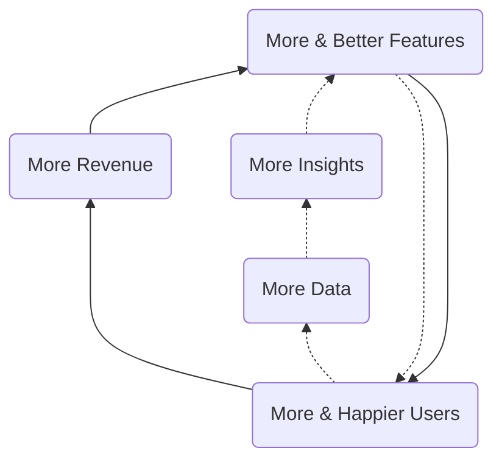
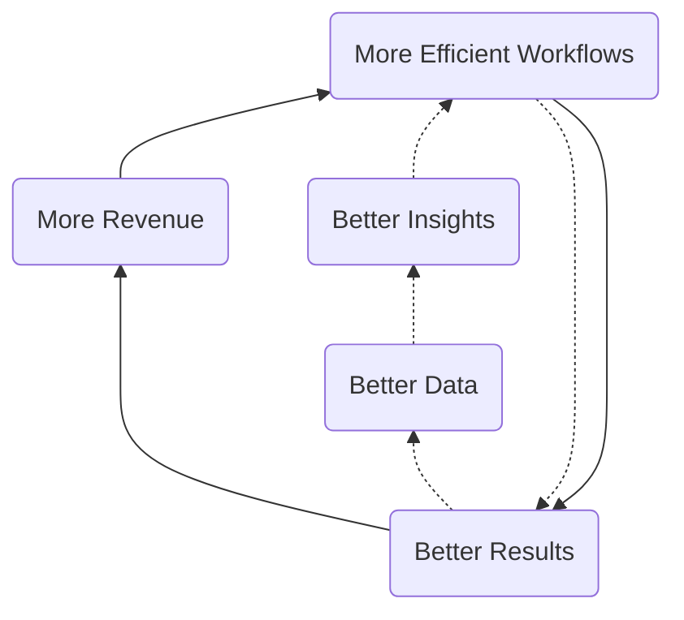
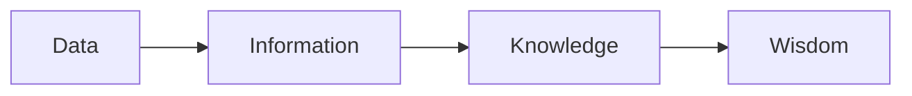

---

title: "Data Team Direction"
---

---

`This page contains forward-looking content and may not accurately reflect current-state or planned feature sets or capabilities.`

## Data Development Timeline

**How did we get here?** The [Data Development Timeline](/handbook/business-technology/data-team/direction/timeline) page provides coverage of the Data Team's accomplishments and the path we have taken to create today's team, technology platform, and programs.

## FY24 Data Strategy

In November-2022 we held several cross-team sessions to help align on the GitLab data strategy for FY24. Participants included Finance, Marketing, Sales Strategy, and Customer Success.

- [FY24 X-Functional Data & Analytics Agenda](https://docs.google.com/document/d/1mHpP2m8Af5Qr7t9RkGBtVVCjYBs6bM-GsjI23jWyJzc/edit#heading=h.roi3bqp13662)
- [FY24 X-Functional Data & Analytics Planning Deck](https://docs.google.com/presentation/d/1UXIKCir35b9ReHBN0rpLaYAshih5gIktgr1JahUedoY/edit#slide=id.g15464c2a8e6_0_0)

Outcomes of the strategy workshops include:
- [360 Customer IQ](https://docs.google.com/presentation/d/1hazljtcmgkhOYaOVTXLhVFzA5IhQxWdee_ocIBRndMs/edit#slide=id.g123a13deda8_0_405)
- [Customer Journey](https://docs.google.com/presentation/d/1YUpb-6mhKz-Z20cx0wrycjmPqHMNSdPGzAJSyFBITFM/edit)
- [Analytics Platform](https://docs.google.com/presentation/d/1dR7FYFWIvNa2mfLkG2TsJbyVQ7UGJAyWdwMknKbAU5w)
- [Data Customer Zero](https://docs.google.com/presentation/d/1PjaFAEaePZgz2BgB_pgLAY3zy81ugvo0a1gj0en-h54/edit#slide=id.g15464c2a8e6_0_0)
- [FY24 X-Functional Analytics Projects](https://docs.google.com/spreadsheets/d/10QwZQG3PLSuaKt3hfe2gqq9pFEMQb8s0goOgiMzyH1I/edit#gid=0)
- [FY24 UCID Roadmap](https://docs.google.com/spreadsheets/d/1wddU5apO3a2VBuulofSFaKUPFKW8jW4OVQrbOiCfLz0/edit#gid=0)

## FY23 Data Strategy

In November-2021 we held several cross-team sessions to help align on the GitLab data strategy for FY23. Participants included Growth, Finance, Marketing, Sales Strategy, and Customer Success.

- [Strategy Worksheet](https://docs.google.com/spreadsheets/d/11fkA6hAGcZGrVj7Ho2LIzHk9JGukG-x77KbC9Unsj0Q/edit#gid=0)
- [Project Team Issue (internal link)](https://gitlab.com/gitlab-data/analytics/-/issues/10588)

We are in progress of running the exercise for Q4.

## Strategy

As an important step towards achieving our [mission](/handbook/business-technology/data-team/#mission), meeting our [responsibilities](/handbook/business-technology/data-team/#responsibilities), and helping GitLab [become a successful public company](/handbook/being-a-public-company/), we are creating an Enterprise Data Platform (EDP), a single unified data and analytics stack, along with a broad suite of Data Programs such as Self-Serve Data and Data Quality. The EDP will power GitLab's KPIs, cross-functional reporting and analysis, and in general, allow all team members to make better decisions with trusted data. Over time, the EDP will further accelerate GitLab's analytics capabilities with features such as data publishing and products - enriched and aggregated data integrated into business systems or into the GitLab product for use by our customers. This acceleration happens through the development of "Data Flywheels", much like GitLab's [Open Core and Development Spend](/handbook/company/strategy/#dual-flywheels) flywheels.

### 1) Customer Centricity

KPI: Revenue/Efficiency gains from Data Products
Definition:
1. Visibility and deep understanding of how our customers use our product and interact with our teams
1. Focus on the Customer Journey Lifecycle & Related Analytics
1. Build a Better GitLab for our Customers. Be customer zero.

### 2) Data Community

KPI: Data Engagement measured by MAU
Definition:
1. Create a community where everyone can make their best decisions with data built on SSOT Data Architecture and One Data Warehouse
1. Best-in Class Talent, Tenure, and Growth

### 3) GitLab Culture of Data First

KPI: % of Top cross functional & LRO Projects with Measurement plans
Definition:
1. All product features logged for analysis in a centrally governed way
1. Iteration and experimentation to drive business value
1. Strong visibility into key business results, business processes, product behavior and programs
1. Data Governance across business systems, product, and warehouse so we all speak the same language
1. Be customer zero for ML Ops

### 4) World class data and analytics capabilities

KPI: % Analytics Time on Level 1 / 2 work
Definition:
1. Scalable data platform, data collection, modeling, and visualization
1. Master data management
1. Create unified data models with robust governance
1. Cutting-edge data and analytics tools available to team members
1. Integrate advanced analytics with our business processes

## Data Capability Model

The Data Capability Model lists five levels (1-5) that correspond to the data & analytics maturity of a company.

It is used to identify target state requirements to support [GitLab's Company Strategy](/handbook/company/strategy).

**To help GitLab become a public company, we need our lead-to-cash and public-facing metrics to reach Level 2 of the capability model.**

| Level                                                                                   | Characteristics                                                                                                                                                                        | Benefits                                                                                              |
| --------------------------------------------------------------------------------------- | -------------------------------------------------------------------------------------------------------------------------------------------------------------------------------------- | ----------------------------------------------------------------------------------------------------- |
| (5)Optimized                                                                         | Real-time complex analysis embedded in products, shape actions and perceptions; data analytics is a strategic differentiator.                                                           | New data products, improved decision ROI, data driven recommendations embedded in the experiences of customers.                                                              |
| (4)Managed                                                                           | Data influencing all aspects of the business, data science” insight into what is likely to happen, widespread and effortless analytics production, enterprise data quality and governance is a critical enabler.                                            | Reliable customer lifetime value, expansion & churn prediction, product embedded analytics.            |
| (3)Proactive                                                                            | Widespread & effortless drillable analysis, Drillable cross-functional scorecards, dashboards, enterprise data ecosystem.                                                               | Customer 360 & health score, predictable & trusted data reporting, robust self-service & data @ scale, enterprise data quality and governance established. |
| **(2)Reactive** | Operational automated reports and dashboards, reliable and validated data with automated tests, mixture of manual and automated integration, core integrated data with some data silos. | Trusted data, self-service data, key performance indicators, stable platform for expansion, implementation of some data quality initiatives [Reference Solution](/handbook/business-technology/data-team/direction/reference/).            |
| (1)Aware                                                                         | Static lists and reports, highly focused on history/lagging - last 30/90/365 days, unpredictable velocity, no systematic approach to data analysis and data management, data silos, very basic data quality controls.                             | Historical tabular reports, data visualization.                                                        |

## Quarterly Objectives

### Data Flywheels

#### Customer & Analytics Instrumentation Flywheel

The Customer & Analytics Instrumentation Flywheel is focused on improving the Customer Experience and encompasses the data and analytics involved in user-product interactions, customer use cases, product development, product adoption, and most aspects of the [Customer Journey](/handbook/customer-success/vision/).

#### Corporate Intelligence

The Corporate Intelligence Flywheel is focused on improving (internal) Business Efficiency and this is accomplished by instrumenting, monitoring, and improving business workflows. Common outputs of Corporate Intelligence teams include performance dashboards, balanced scorecards, KPIs, MBOs, and related data-enabled frameworks.

### Long-Term Direction

Measured in Years, our long-term direction is to extend the EDP with features found in a mature [Enterprise Data Platform](/handbook/business-technology/data-team/direction/#a-complete-enterprise-data-platform) such as master data management, a data lake, and advanced analytics. Also, once we have reached Level 2, we:

- want to find more ways to contribute to open-source data projects
- would like to work with [Meltano](https://meltano.com/) as a data pipeline and processing component
- want to integrate aspects of the EDP with GitLab.com to provide deep analytic capabilities to GitLab's customers
- provide DevOps Industry Benchmark Reports along the lines of [Okta's Business @ Work](https://www.okta.com/businesses-at-work/)
- revisit our overall data tech stack to ensure we have the required elements to reach Level 3

### Measuring Success

We will measure progress towards our short-term direction in the following ways:

1. [Data Team KPIs](/handbook/business-technology/data-team/direction/#data-team-kpis)
1. The business impact of our results as they align to the [Data Value Pyramid](/handbook/business-technology/data-team/direction/#data-value-pyramid)
1. The data features we provide as they map to the [Data Capability Model](/handbook/business-technology/data-team/direction/#data-capability-model)
1. The Data Team Quarterly Report Card

We have not yet defined criteria for measuring long-term progress.

#### Data Team KPIs

1. `All-Time` Number of Self-Service Data Customers Enabled
1. `Monthly` Number of active Self-Service Dashboard Developers
1. `Monthly` Number of active Self-Service SQL Developers
1. `Monthly` % of Dashboard Traffic From User Generated Content

## A Visionary Data Platform
These ambitions are set to be a guiding vision for GitLab's data platform. 

### Makes it Easier to Contribute
Contributing to GitLab's Data Platform is easy and using the platform is intuitive

* Documentation is complete and relevant for users and contributors
* All data transformations are implemented in dbt
* CI/CD is seamless, intuitive, automated for constributors and reviewers

### Is Reliable 
The data plaform along with the data it delivers is consitent in availability and accuracy

<!-- data in the warehouse is derivative and is maintained and updated through idempotent operations -->
<!-- business critical assets should be supported by adequate testing -->
<!-- The platform should be defined in code -->
<!-- > Everything can and should be defined in code and version controlled -->
<!-- > Automated tests are the best tests and we implement tests at every step of the data delivery process -->
<!-- > Data implementations should integrate best practices from DevOps into their workflow -->

### Is Secure
The Data Platform doesn't put people at risk

<!-- sensitive data is only available to those with authorized use -->

### Benefits a Larger Community
GitLab's Data Platform is relevant to a community larger than GitLab's

<!-- we prefer specifications and standards to idiosyncratic custom development -->
<!-- We are not the only data team and are part of a larger community of engineers and analysts -->
<!-- > Open source our code, keeping data security and data sensitivity in mind -->

### Data Platform FY25 initiatives

The following sections describe the Data Platform FY25 initiatives.

_coming soon_

## Data Value Pyramid

We want to help all GitLab teams move up (or left-to-right in the diagram below) the [Data Value Pyramid](https://en.wikipedia.org/wiki/DIKW_pyramid) and turn basic metrics and counts into wisdom that helps them create better products for our customers, run our business more efficiently, and add new capabilities to our business model. Relative to the Data Value Pyramid, we are currently working primarily within the Data and Information stages.

