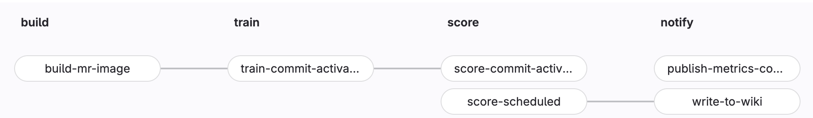
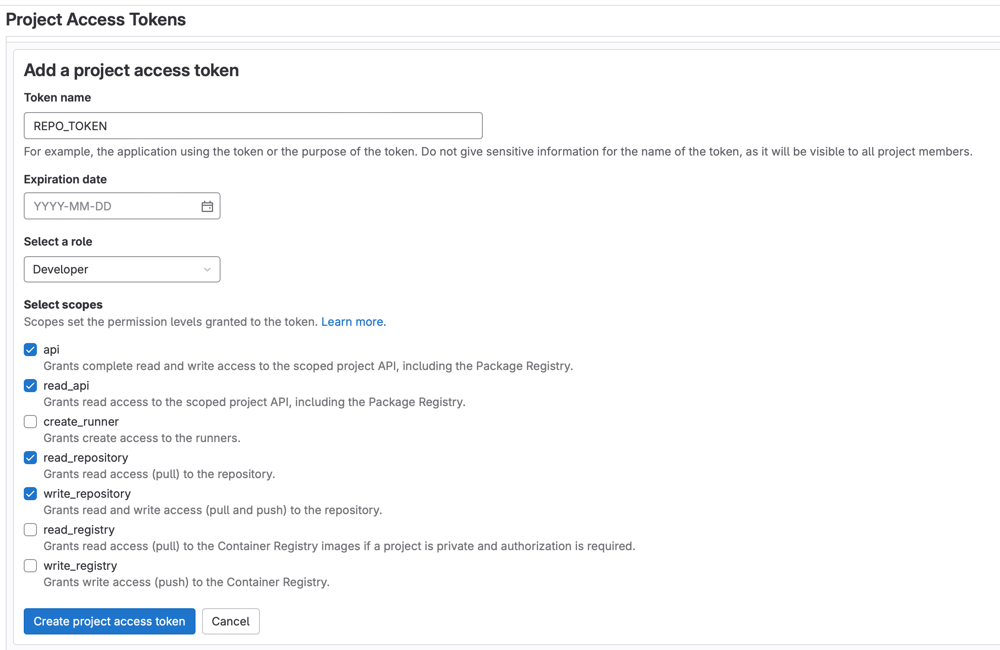
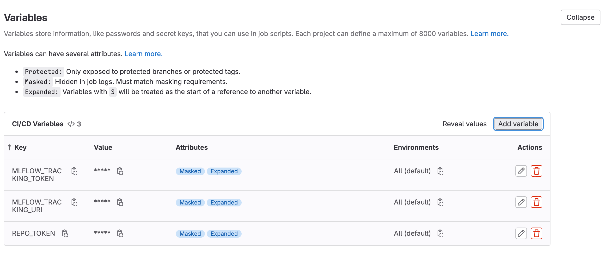
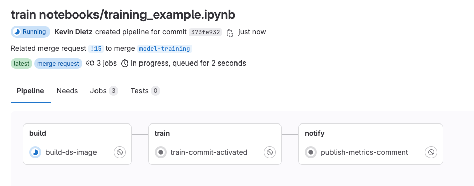
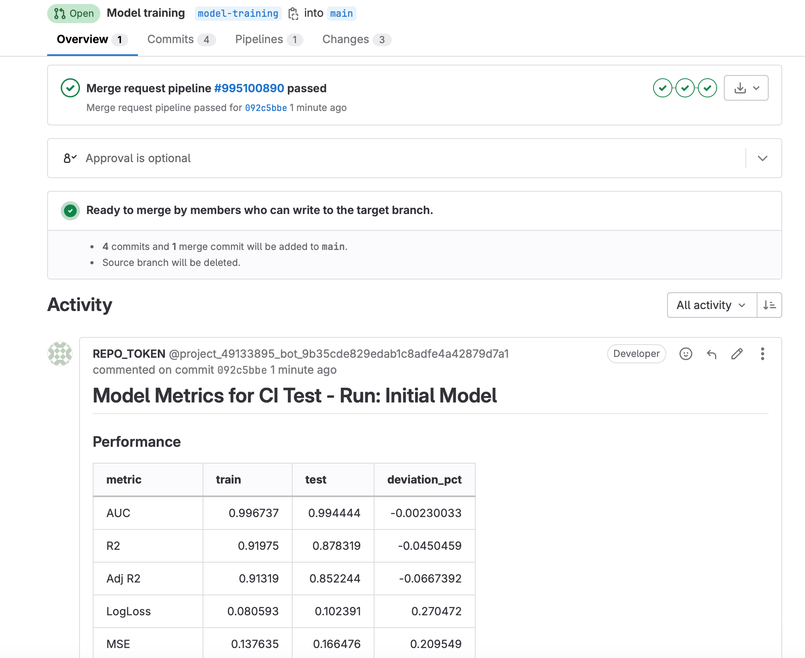
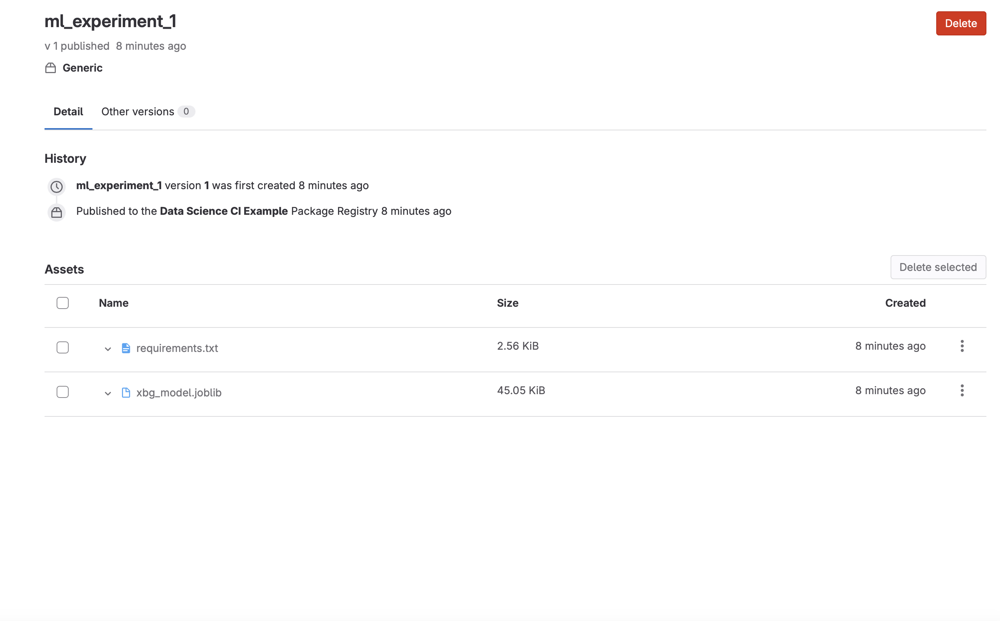
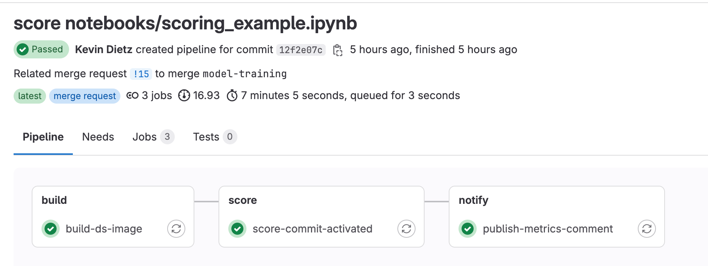
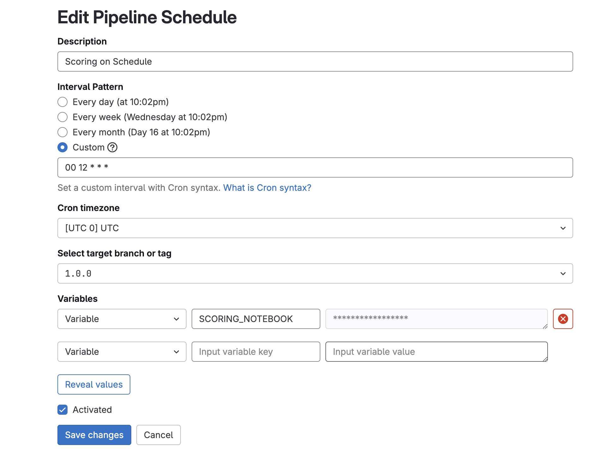
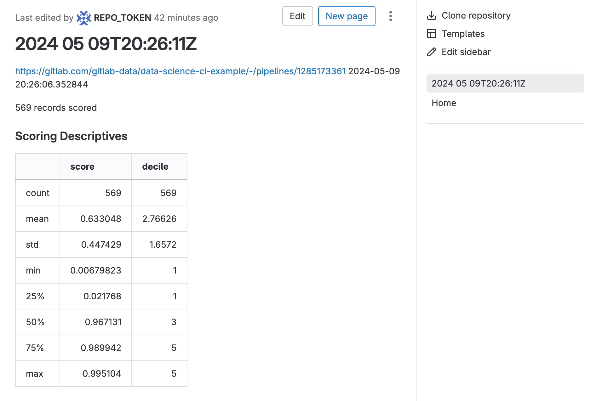

---

## Our Approach to Using CI/CD For Data Science

When it comes to training, scoring, and deploying machine learning models, there are trade-offs to using your local machine vs. CI. Our approach is flexible to allow users to do both.

- When executing training or scoring runs on your local machine, users will be able to:
  - Execute training or scoring code using local resources and python builds specific to the machine
  - Log, view, and retrieve experiments in your preferred experiment tracker
  - Upload and download model artifacts to your preferred model/package registry
  - Commit changes to the repository that will ***not*** trigger a CI pipeline

- When executing training or scoring runs remotely using GitLab CI/CD, users will be able to:
  - Select CPU or GPU runners based on the size and needs of the model
  - Automatically detect and rebuild the model image based on changes to **Dockerfile** or **requirements.txt**
  - Use different containers for different models in development, staging, and production
  - Log, view, and retrieve experiments in your preferred experiment tracker
  - Upload and download model artifacts directly to the GitLab model registry
  - Automatically report model metrics and performance in the merge request for review by others.
  - Commit changes to the repository and automatically trigger CI pipelines based on a specific commit message
    - Training CI pipelines only execute with the following commit message: `train <path/to/notebook/your_notebook.ipynb>`
    - Scoring CI pipeline only executes with the following commit message: `score <path/to/notebook/your_notebook.ipynb>`
    - Allows the pipeline to execute just the desired notebook
  - Allow training and scoring CI pipelines to run at set dates and times using [Scheduled pipelines](https://docs.gitlab.com/ee/ci/pipelines/schedules.html)
  - Log results to [Project wiki](https://docs.gitlab.com/ee/user/project/wiki/)
  - Use [GitLab for Slack](https://docs.gitlab.com/ee/user/project/integrations/gitlab_slack_application.html) integration to monitor pipeline status

### Advantages of Using CI for Training Data Science Models

- Reproducibility
- Automation
- Speed
- Separate development, staging, and production environments
- Logging results directly to Merge Request and Project Wiki
- Scalable GPU and CPU resources
- Scheduling
- Slack notifications for monitoring CI pipelines

## Getting Started

This section covers, in detail, the mechanisms behind how these pipelines are created and configured. **If you are just interested in getting your data science CI training pipeline up and running, skip directly to the [Model Training Step-by-Step Instructions](/handbook/business-technology/data-team/platform/ci-for-ds-pipelines#step-by-step-instructions). If you are just interested in getting your data science CI scoring pipeline up and running, skip directly to the [Scoring Step-by-Step Instructions](/handbook/business-technology/data-team/platform/ci-for-ds-pipelines#scoring-setup) and [Model Deployment with CI/CD](/handbook/business-technology/data-team/platform/ci-for-ds-pipelines#model-deployment-with-cicd) sections**

### Key Repository Files

Within our public **[GitLab Data Science CI Example](https://gitlab.com/gitlab-data/data-science-ci-example)** repository are the following key files:

- **.gitlab-ci.yml**: This is the CI/CD configuration file that defines the jobs that will be run for each pipeline. The actual pipelines are pulled from the [CI/CD Component Catalog](https://gitlab.com/explore/catalog/gitlab-data/ds-component-pipeline), with only the variables that need specified are set in this .yml.
- **Dockerfile**: Instructions for creating the docker image used in the Container Registry. Here we are using python 3.9 running on Ubuntu 22.04 with CUDA drivers for GPU
- **requirements.txt**: The python packages to install in the container
- **training_config.yaml**: Configuration for training notebook
- **scoring_config.yaml**: Configuration for scoring notebook
- **notebooks/training_example.ipynb**: training notebook used for this example
- **notebooks/scoring_example.ipynb**: scoring code notebook used for this example
- **xgb_model.json**: The saved model from training that will be used for scoring (Note: in future iterations this will be pulled directly from the [Model Registry](https://docs.gitlab.com/ee/user/project/ml/model_registry/))

## Model Training with CI/CD

### Training Pipeline

1. **Build**
   - **build-new-image**: activated whenever changes are made to the **Dockerfile** or **requirements.txt** files. This will rebuild the image used in the MR to train the model
   - **build-mr-image**: Checks if a image exists in the Container Registry for the MR. If not, one will be built.
2. **Train**
   - **train-commit-activated**: To execute a training pipeline. Activated by using the `train <path/to/notebook/your_notebook.ipynb>` commit message
3. **Notify** (optional)
   - **publish-metrics-comment**: Write model metrics as a comment to the merge request. This is executed after a training or scoring run is performed through the commit message method.
4. **Test** (optional)
   - **secret_detection**: [Pipeline secret detection](https://docs.gitlab.com/ee/user/application_security/secret_detection/) to scan for potential exposed secrets in your pipeline

### Training Setup

Let's take a detailed look at the repository (**Code -> Repository**):

- In the **notebooks** directory, open [training_example.ipynb](https://gitlab.com/gitlab-data/data-science-ci-example/-/blob/main/notebooks/training_example.ipynb). We do not need to change anything in here, but note the first cell of the notebook. [Papermill](https://papermill.readthedocs.io/en/latest/#) will be used to execute this notebook in the CI pipeline and this cell has been tagged as `parameters` to allow Papermill to change these values. There are 3 variables with preset values:
  - `is_local_development = True`: The default assumption is that the notebook is being run locally. The CI pipeline will modify this value to `False` automatically so the notebook can be optimized to run in CI
  - `tree_method = 'auto'`: The default value for xgboost. The CI pipeline changes this value to `gpu_hist` when using a GPU runner in CI to take advantage certain performance enhancements. The assumption that is the model will train with CPU when run locally due to lack of a compatible local GPU.
  - `notebook_dir = 'notebooks'`: The directory of the training notebooks. This value is the same locally as it is the CI pipeline.
- To see exactly how the CI pipeline changes these values, let's view [.gitlab-ci.yml](https://gitlab.com/gitlab-data/data-science-ci-example/-/blob/main/.gitlab-ci.yml). Because we are using a component from the [CI/CD catalog](https://gitlab.com/explore/catalog), we actually want to look at the [Data Science ML Component Pipeline](https://gitlab.com/gitlab-data/ds-component-pipeline/-/blob/main/templates/ds-pipeline/template.yml?ref_type=heads). In this file, search for `train-commit-activated`. This is the most important stage in the CI pipeline. A few things to note:
  - `image: $CONTAINER_IMAGE:$IMAGE_TAG`: The training job will use the container created in the build job (as defined in `build-mr-image`), using the [Dockerfile](https://gitlab.com/gitlab-data/data-science-ci-example/-/blob/main/Dockerfile) and [requirements.txt](https://gitlab.com/gitlab-data/data-science-ci-example/-/blob/main/requirements.txt) files in the repository.
  - `tags`: Determines which runner to use. We want to be able to change the runner based on the project needs. This gets specified by `TRAIN_RUNNER` in [.gitlab-ci.yml](https://gitlab.com/gitlab-data/data-science-ci-example/-/blob/main/.gitlab-ci.yml) located back in our project repository
  - `script`:
        ...
        - `papermill -p is_local_development False -p tree_method 'gpu_hist' $notebookName -`: Tells Papermill to override the variable values defined in the first cell of the notebook with the values shown when utilizing a the GPU runner.
- Finally, let's look at the [training_config.yaml](https://gitlab.com/gitlab-data/data-science-ci-example/-/blob/main/training_config.yaml). Here we can configure certain variables for training our model:
  - `outcome`: Our outcome/target/dv variable. The example notebook is using the breast cancer dataset from scikit-learn and the outcome field in that dataset is named `target`
  - `optuna` configurations: The example notebook runs an xgboost model with [Optuna](https://optuna.org/). There are *a lot* of customizations possible with this setup, but to keep it simple we have only included:
    - `n_trials`: Number of trails to run in the Optuna study
    - `model_file_name`: The output name of the model file
  - `mlflow`: There are a few configurations you can make here if you like, but the defaults will also work fine for this example
    - `experiment_name`: Name of your MLFlow Experiment
    - `run_name`: ID or name of the MLFlow Experiment Run

### Step-by-Step Instructions

1. [Fork](https://docs.gitlab.com/ee/user/project/repository/forking_workflow.html) the public [GitLab Data Science CI Example](https://gitlab.com/gitlab-data/data-science-ci-example) repository. Forking will allow you to further customize the code to meet your own needs.
1. Optional (but recommended) Configurations:
   - Experiment Tracker: This will allow you to log your experiments in the native [Experiment Tracker](https://docs.gitlab.com/ee/user/project/ml/experiment_tracking/) (or MLFlow instance) and log the model artifacts to the [package registry](https://docs.gitlab.com/ee/user/packages/package_registry/).
      - Review the [MLflow Client Compatibility Instructions](https://docs.gitlab.com/ee/user/project/ml/experiment_tracking/mlflow_client.html) to set up the `MLFLOW_TRACKING_URI` and `MLFLOW_TRACKING_TOKEN` CI/CI in your project.
      - Create a project access token (**Settings -> Access Tokens -> Add New Token**) named `REPO_TOKEN` with a `Developer` role and the following scopes: `api, read_api, read_repository, write_repository`. Be sure to copy this token.
          - ***Note***: Enabling group access tokens is a not available for SaaS Free accounts.  If using a Free account, you will need to fork the project into a personal (instead of a group) namespace 
      - Create the following new CI Variables (**Settings -> CI/CD -> Variables -> Add New Variable**):
         - `MLFLOW_TRACKING_TOKEN`: For the value, enter the project access token value created above.
         - `MLFLOW_TRACKING_URI`: For the value, use the GitLab API MLFlow endpoint as outlined in the MLFlow instructions above. It should look something like: `https://gitlab.com/api/v4/projects/<your_project_id>/ml/mlflow`. Project ID can be found in **Settings -> General**
         - ***Note:*** For all variables, deselect the "Protect Variable" flag to enable experiment tracking on unprotected branches. Tick "Mask variable" to prevent the value from showing in the logs.
   - Write Model Metrics to Merge Request
      - Create the following new CI/CD Variable (**Settings -> CI/CD -> Variables -> Add New Variable**):
         - `REPO_TOKEN`: For the value, enter the project access token value created above.
         - ***Note:*** De-select the "Protect Variable" flag to enable experiment tracking on unprotected branches. Tick "Mask variable" to prevent the value from showing in the logs. 
1. Now, let's make some changes to activate our training pipeline:
1. Create a new branch (**Code -> Branches -> New Branch**)
     - 
1. (Optional) Configure your runners:
     - GPU runners are available for Premium and Ultimate users. If enabled, edit `.gitlab-ci.yml` and change the value of `TRAIN_RUNNER` to a GPU runner (e.g. `saas-linux-medium-amd64-gpu-standard`).
     - The default value `saas-linux-small-amd64` will work for all account types.
1. Edit **training_config.yaml**
     - Let's make a change so that we have something to commit. Change `n_trials` to a new value between `10` and `20`.
     - For the commit message enter `train notebooks/training_example.ipynb`. This will tell the GitLab that you want to execute the training CI pipeline on the **training_example.ipynb** notebook found in the notebooks directory. Commit the change. 
1. Click "**Create merge request**". Make sure you are merging into your local fork and click "**Create merge request**" once again. This should activate the training CI pipeline for the newly created MR.
1. Click on "**Pipelines**" and you should see the training pipeline running. Click into the pipeline to see which stage the pipeline is in.
   - ***Note:*** If you did not set up the step above "Write Model Metrics to Merge Request", then the `publish-metrics-comment` job will fail. The pipeline will still pass with warnings 
1. Once the pipeline has finished, you will see a new comment posted on the merge request that contains some model metrics from the run (assuming you set up Write Model Metrics to Merge Request).
   - 
1. Now let's look at the experiment run we just completed with our CI pipeline (**Analyze -> Model Experiments**)
   - Click on your experiment name.
   - You should see a new run logged from the CI Pipeline. Click into that run.
   - Run details are displayed, including a link to the CI job, the merge request, various parameters and metrics, and model artifacts. 
   - Click on "Artifacts". This will take you to the Package Registry, where all the artifacts associated with that particular model run are stored. You should see the .json model file, a .yaml configuration file, and a requirements.txt. These can be used later to deploy your model. 
1. Finally, let's look at the container that was used to train the model (**Deploy -> Container Registry**)
   - By default, the container `datascience-images` is used (this can be change this in [.gitlab-ci.yml](https://gitlab.com/gitlab-data/data-science-ci-example/-/blob/main/.gitlab-ci.yml) through the `DS_CONTAINER_IMAGE` optional input)
   - Click into `datascience-images` and you should see a new tag that was used to score the model in the merge requests. This tag was created by the CI pipeline, and each MR and model release will have it's own container tag.

## Model Scoring with CI/CD

### Scoring Pipeline

1. **Build**
   - **build-new-image**: activated whenever changes are made to the **Dockerfile** or **requirements.txt** files. This will rebuild the image used in the MR to score the model
   - **build-mr-image**: Checks if a image exists in the Container Registry for the MR. If not, one will be built.
2. **Score**
   - **score-commit-activated**: To manually execute a scoring pipeline. Activated by using `score <path/to/notebook/your_notebook.ipynb>` in the commit message
   - **score-scheduled**: To execute a scoring pipeline based on a defined schedule using [Scheduled pipelines](https://docs.gitlab.com/ee/ci/pipelines/schedules.html)
3. **Notify** (Optional)
   - **publish-metrics-comment**: Write model performance metrics as a comment on the merge request. This is executed after a scoring run is performed through the commit message method.
   - **write-to-wiki**: Write model performance metrics and job details to the project wiki. The CI configuration it set up to only execute for scheduled jobs that use the `score-scheduled` job

### Scoring Setup

Let's take a detailed look at the repository (**Code -> Repository**):

- In the **notebooks** directory, open [scoring_example.ipynb](https://gitlab.com/gitlab-data/data-science-ci-example/-/blob/main/notebooks/scoring_example.ipynb). We do not need to change anything in here, but note the first cell of the notebook. [Papermill](https://papermill.readthedocs.io/en/latest/#) will be used to execute this notebook in the CI pipeline and this cell has been tagged as `parameters` to allow Papermill to change these values. There are 3 variables with preset values:
  - `is_local_development = True`: The default assumption is that the notebook is being run locally. The CI pipeline will modify this value to `False` automatically so the notebook can be optimized to run in CI
  - `ci_pipeline_source = ""`: This passes the [pipeline source variable value](https://docs.gitlab.com/ee/ci/jobs/job_rules.html#ci_pipeline_source-predefined-variable) to the notebook. In our example, we only want scores to be uploaded to a SQL table when the pipeline is triggered by a schedule (i.e. `ci_pipeline_source == 'schedule'`). This allows us to differentiate between manual scoring runs and scheduled production scoring runs.
- To see exactly how the CI pipeline changes these values, now let's view [.gitlab-ci.yml](https://gitlab.com/gitlab-data/data-science-ci-example/-/blob/main/.gitlab-ci.yml). Because we are using a component from the CI/CD catalog
  - `notebook_dir = 'notebooks'`: The directory of the scoring notebook (can be the same directory as the training notebooks). This value is the same locally as it is the CI pipeline.
- To see exactly how the CI pipeline changes these values, now let's view [.gitlab-ci.yml](https://gitlab.com/gitlab-data/data-science-ci-example/-/blob/main/.gitlab-ci.yml). Because we are using a component from the CI/CD catalog, we actually want to look at the [Data Science ML Component Pipeline](https://gitlab.com/gitlab-data/ds-component-pipeline/-/blob/main/templates/ds-pipeline/template.yml?ref_type=heads). In this file, search for `score-commit-activated`. A few things to note:
  - This job will manually trigger when `score <path/to/notebook/your_notebook.ipynb>` is passed in the commit message.
  - `image: $CONTAINER_IMAGE:$IMAGE_TAG`: The training job will use the container created in the build job (as defined in `build-mr-image`), using the [Dockerfile](https://gitlab.com/gitlab-data/data-science-ci-example/-/blob/main/Dockerfile) and [requirements.txt](https://gitlab.com/gitlab-data/data-science-ci-example/-/blob/main/requirements.txt) files in the repository.
  - `tags`: Determines which runner to use. We want to be able to change the runner based on the project needs. This gets specified by `SCORE_RUNNER` in [.gitlab-ci.yml](https://gitlab.com/gitlab-data/data-science-ci-example/-/blob/main/.gitlab-ci.yml) located back in our project repository
  - `script`:
        ...
        - `papermill -p is_local_development False $notebookName -`: Tells Papermill to override the variable values defined in the first cell of the notebook with the values shown when running in CI.
- There is also a `score-scheduled` job, which we cover in more detail in Model Deployment
  - This will trigger the scoring notebook at a set time, using [Scheduled pipelines](https://docs.gitlab.com/ee/ci/pipelines/schedules.html)
  - This job will also trigger the `write-to-wiki` job, which will publish model metrics to the project wiki
- Finally, let's look at the [scoring_config.yaml](https://gitlab.com/gitlab-data/data-science-ci-example/-/blob/main/scoring_config.yaml). Here we can configure certain variables for training our model:
  - **model_file**: The model file created during training that will be used to score the model. This could also be pulled directly from the Model Registry, but for simplicity, we are including it directly in the repository
  - **fields**: List of the model fields. This is useful if the model is using only a subset of fields in a dataframe. In this example, all the fields in the dataframe are being used.
  - **decile_cuts**: Sometimes it's useful to include decile cuts from the validation dataset used during training. In this example, we included quintile cuts to illustrate how they can be used.

### Step-by-Step Instructions

1. Optional (but recommended) Wiki Configurations:
   - This allows you to log your scheduled runs to the GitLab [Project Wiki](https://docs.gitlab.com/ee/user/project/wiki/).
   - Create a new CI/CD Variable (**Settings -> CI/CD -> Variables -> Add New Variable**):
      - `API_ENDPOINT`: For the value, use the GitLab API endpoint (will be similar to the `MLFLOW_TRACKING_URI` set up during training) using the following format: `https://gitlab.com/api/v4/projects/<your_project_id>`. Project ID can be found in **Settings -> General**.
      - **Note:** De-select the "Protect Variable" flag to enable experiment tracking on unprotected branches
1. Configure your runner:
     - GPU runners are available for Premium and Ultimate users. If enabled, edit `.gitlab-ci.yml` and change the value of `SCORE_RUNNER` to a GPU runner (e.g. `saas-linux-medium-amd64-gpu-standard`).
     - The default value `saas-linux-small-amd64` will work for all account types.
1. Now lets score our model using CI/CD
   - You can either create a new branch of the repository or use the same one as used above for training the model.
   - Make a change to `notebooks/scoring_example.ipynb` so that we have something to commit. This could be as simple as adding a line to one of the cells.
   - For the commit message enter `score notebooks/scoring_example.ipynb`. This will tell the GitLab that you want to execute the `score-commit-activated`` CI pipeline on the **scoring_example.ipynb** notebook found in the notebooks directory. Commit the change.
   - Click "**Create merge request**". Make sure you are merging into your local fork and click "**Create merge request**" once again. This should activate the scoring CI pipeline for the newly created MR.
   - Click on "**Pipelines**" and you should see the scoring pipeline running. Click into the pipeline to see which stage the pipeline is in.
   - **Note:** If you did not set up the step above "Write Model Metrics to Merge Request", then the `publish-metrics-comment` job will fail. The pipeline will still pass with warnings 
   - Once the pipeline has finished, you will see a new comment posted on the merge request that contains some model metrics from the run (assuming you set up Write Model Metrics to Merge Request). This is the same process you would have seen during training, except it is now writting out descriptives about the scored dataset.

## Model Deployment With CI/CD

Now that we have our model trained and scoring pipeline set up, we can focus on deploying our model. Here we are going to focus on batch scoring so that the model scores are updated in batch once a day.

### Advantages of Model Deployment in GitLab

- **Centralized Model Management:** GitLab's Experiment Tracker and Model Registry provides a centralized location for storing, versioning, and managing machine learning models.
- **Automated Deployment:** Use GitLab CI/CD to automate the deployment process, ensuring consistent and repeatable deployments across environments.
- **Scalability:** GitLab's infrastructure allows for easy scaling of your model serving capabilities as demand grows. As the model grows, the size of the runner can be increased.
- **Reproducibility:** By using GitLab's version control and CI/CD pipelines, you can ensure that your model training, scoring, and deployment processes are reproducible.
- **Documentation and Logging:** Monitor model pipelines, receive slack notifications when failures occur, and log key metrics directly to the project wiki.
- **Security:** Leverage GitLab's security features to ensure your models and data are protected throughout the deployment process.
- **Continuous Improvement:** Models can be fine-tuned, retrained, and tested without disrupting models in production.
- **Cost-Effective:** Resources are only consumed when the model runs, reducing the cost of running your models.

### Step-by-Step Instructions

1. Create a new tagged release
   - Creating a tag will allow us to capture the state of the model at a specific point in time. Doing so will build a version of the model that will be deployed to production that won't be affected by changes to the repository after that point in time.
   - Navigate to **Code -> Tag -> New Tag**
   - Create a new tag (something like `1.0.0`) and click **Create Tag*
   - This will trigger the deployment pipeline, which is build a new container tagged with a `production-` prefix (e.g. `production-1.0.0`)
1. Setup a pipeline schedule
   - Navigate to **Build -> Pipeline schedules -> New schedule**
   - Give your pipeline a description
   - Set when you want it to run. In the example below, the pipeline is scheduled to run every day at noon.
   - Set target tag to `1.0.0`. This is the tag we just created.
   - We need to setup one variable, `SCORING_NOTEBOOK` with the location of the notebook we want to schedule `notebooks/scoring_example.ipynb`
   - Tick "Activated" and save the changes.
   - 
1. Test out your schedule by manually triggering it
   - Should see the pipeline start to run
   - It will use the production container than was created when you created the `1.0.0` tag, named `production-1.0.0`
1. View the logs and model metrics
   - Navigate to **Plan -> Wiki** and you will see a list by timestamp of all the times the scheduled pipeline has run, with links to the job logs and model metrics.
   - 
1. Configure Slack notifications (optional):
   - In your GitLab project, go to **Settings -> Integrations -> GitLab for Slack**
   - Follow the instructions in the [GitLab For Slack app documentation](https://docs.gitlab.com/ee/user/project/integrations/gitlab_slack_application.html)
   - We've setup our slack notifications so that notifications are sent to our #data-science-pipelines channel only when a pipeline fails. If a pipeline succeeds, a notification is not sent.
   - 
   - Save your changes

**And that's it! By following these steps, you've successfully set up a production-ready data science pipeline using GitLab CI/CD. Feel free to modify these pipelines and notebooks to fit the needs our your models and tech stack. And be sure to check out all the other great data science resources on our [Data Science Handbook Page](/handbook/business-technology/data-team/organization/data-science/). If you are experiencing any difficulty or if you have any suggestions to improve these pipelines, feel free to [open an issue with us](https://gitlab.com/gitlab-data/data-science-ci-example/-/issues/new). Happy pipelining!**
