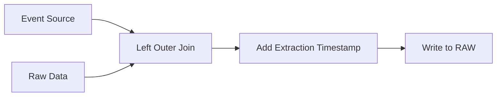
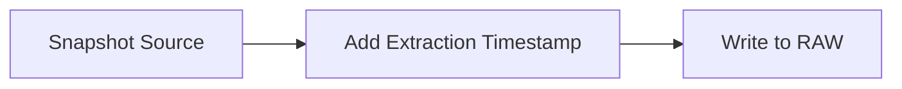

# Source system / application / data pipeline name

Source system: Tableau Cloud
Specific Site: https://10az.online.tableau.com/#/site/gitlab/home
Pipeline: [Extract Admin Insights Data](https://10az.online.tableau.com/#/site/gitlab/flows/269529/overview)

## Business Use Case (Please explain what this data will be used for):

The data extracted in the this pipeline is used to monitor and report on Tableau adoption and activity.  Specifically using the event logs to determine the monthly active users for the Tableau Cloud BI tool.  Additionally the data data extracted is used to report on and monitor the content that users have access to.
 
## Data Categorization

| Data Classification | MNPI | Sensitive data | 
| ------------------- | ---- | -------------- |
| `Yellow` | `No` | `No` |

### Data information 

* How often does the data need to be refreshed? 
  - Data is extracted one a day
* SLA Description: 
  - 24 hours to Snowflake
* Severity in case of an incident
  - [ ] Critical - S1
  - [ ] High - S2
  - [ ] Medium - S3
  - [x] Low - S4
* Who will be using this data, and where (dashboards, snowflake UI, etc.)?
  - Data team will use the data for reporting in dashboards
* Label used: Tableau
* Relevant issues:
  - 
 
## People matrix

| Role | Name | Gitlab Handle |
| ---- | ---- | ------------- |
| System owner | Israel Weeks | `iweeks` | 
| Technical contact for data related questions | Peter Empey | `pempey` |
| Technical contact for infrastructural related questions | Peter Empey | `pempey` |
| Data access approval* | N/A | N/A |
| Business users who need to be informed in case of data outage | Amie Bright | `amiebright` |
 
* Data access approval will be involved in the Access Request process and need to give approval if a GitLab team member applies for raw data access.
 
## Data pipeline (technical) description

The data from a Tableau Cloud site is extracted using a Flow on the site itself.  The Flow is a UI based sequence of sources and transformations followed by a write step to write the date to the Snowflake RAW database.  The flow can be managed with a the Tableau Cloud service account and specific role Snowflake credentials.

## Accessing the Pipeline

Access to the Tableau Cloud and the pipeline is through the service account set up through the `Tableau` credentials found in 1Password.  If the user already has a Tableau role based license they may need to login using an incognito window to have the option to use the service account credentials.  When using the service account the Flow should be accessed through the [Tableau Cloud site](https://10az.online.tableau.com/#/site/gitlab/home).  The Flow can be found in the [Resources/General](https://10az.online.tableau.com/#/site/gitlab/projects/367720) project or by searching for the name of the Flow.

After navigating to the Flow the steps of the flow can be observed or triggered from the `Overview` tab.  Tasks can be scheduled or updated on the `Schedule Task` tab and the history if the scheduled tasks can be observed on the `Run History` tab.  To edit the Flow in Tableau Cloud select the `Edit Flow` button top open the editor in a new tab.

Flows are construed through steps and actions added to the canvas.  Selecting an existing step will show actions taken in that step and a sample of what the data looks like as a result of the step.  New steps can be added by selecting the `+` icon next to an existing step or connection. More information on how to use Flows can be found on the [Tableau Prep Getting Started](https://www.tableau.com/learn/get-started/prep) page.

### Source Data Types

There are two general types of data extracted from the source system and each are processes slightly differently.  The first is a rolling event log that contains historical events for a fixed number of days, 90 days with our current licensing with Tableau, and the second is a snapshot of the current state of the site.  An extraction date should be added to each source for tracking and consistency.  The event log data should be loaded incrementally to the RAW database using the excising table as a reference for what should be loaded:

And the snapshot data should be loaded into the RAW database replacing the any data that already excising in the database.

In order to select the correct output tables the schema and table must already exists on the database.

### Scheduling

The scheduling of the extract is performed on the Tableau Cloud site by creating a scheduled task as part of the flow and can be selected from any of the available schedules.

### Monitoring

The data team is notified of successful extractions and errors though the analyitcsapi@gitlab.com service account.