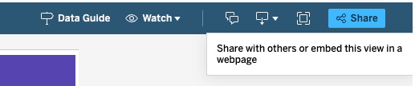
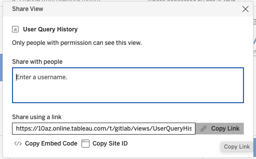

---
title: Handbook Embedding Demonstration Page
type: docs
---

This is our Tableau embed demo page.  It is used to demonstrate how we can embed Tableau visualizations into the handbook and provide the URL for views that are available to be embedded publicly.  To facilitate uniform experience and presentation we use a [shortcode](https://handbook.gitlab.com/docs/shortcodes/#tableau-embeds) to embed Tableau charts and dashboards.

## Embed Demonstration

### Viz from Public Tableau site

The source url for a view from the public Tableau site can be found by looking at a list of [views available for embedding](/handbook/business-technology/data-team/platform/tableau/embed-demo/#views-availble-for-public-embedding). 

[A short video demonstrating how to do the embed.](https://youtu.be/Vry_yqUP2C8)

{}
Charts from the public Tableau site should only be embedded in the public Handbook.
{}

This chart should be visible to anyone who loads the page.




### Viz from Internal Tableau site

The source url for a view from the internal Tableau site can be found by navigating to the view and selecting the `Share` option at the top of the screen and then selecting the `Copy Link` option.

This chart should only require a log in to the Tableau site and only be visible to those that have a Tableau license. 




### Viz with Parameters and Filters and Height

This chart should be filtered to a pre-selected Severity and Subtype. The ability to use parameters and filters means that we can more flexibly use a single chart to display different cuts in different embeds if needed.


  
  


## Views Availble for Public Embedding




