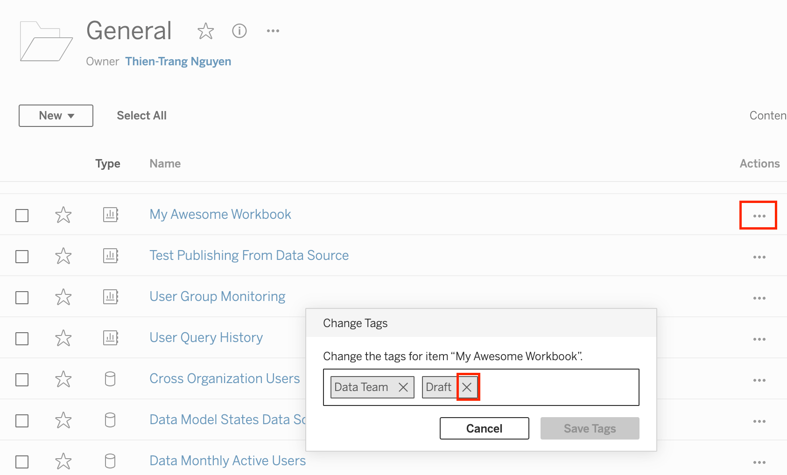
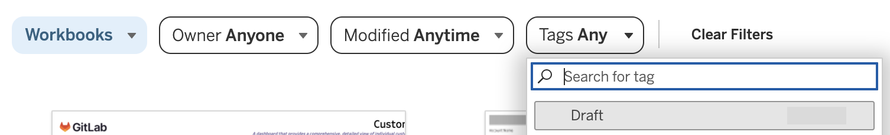
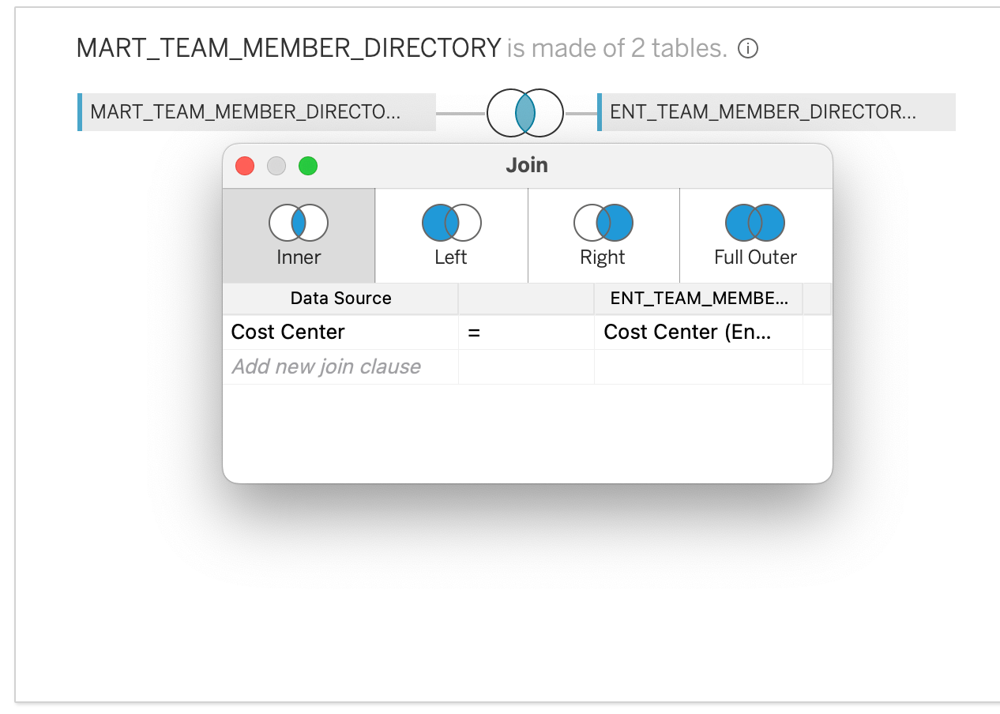

---

title: "Tableau Developer Guide"
description: "Giltab's Tableau Developer guide"
---


## Date Handling in Production Dashboards

Due to the unique challenges of having a fiscal year start date in February and missing fiscal year date calculations in Tableau, we have developed simple date handling guidelines that can expedite and simplify the process of date filtering and creating date axes for charts. We have created a workbook that contains all of the following calculations and joins and some sample data. This can be found in the [Resources](https://10az.online.tableau.com/#/site/gitlab/projects/367720) folder, under the name `Developers Guide Example Workbook`.

### Date Unification

If you have more than one data source in your workbook, the first thing to do is to unify the dates around a date spine. This means using a calendar table. If you are at GitLab, you can find the dim_date table in the common schema of the prod database. Join each of the tables that you need to use to the dim_date table on the date you want to use for the date spine using `dim_date.date_actual = your_table.your_date`. [Click here](https://dbt.gitlabdata.com/#!/model/model.gitlab_snowflake.dim_date) to see documentation on the dim_date table. 

Even if you are not using multiple tables/ dates, it is still recommended to use the dim_date table, because it contains useful information about dates which can be used for filters and controls. For example, if you wanted to use a standard filtering method of comparing the quarter of a date with today's date to filter out any data from a previous quarter, you might use:
`Current Period: DATETRUNC('quarter',Date Actual) = DATETRUNC('quarter',TODAY())`.

However, this will truncate your data down to the non-fiscal quarter, such as truncating 11/11/23 down to 10/1/2023. This will lead to incorrect fiscal sorting and filtering of data. Using the dim_date table, however, allows you to use the following calculation:

**Current Period:** `[First Day of Fiscal Quarter] = [Current First Day of Fiscal Quarter]`. This is far simpler than the alternative without a date table, which would include a series of `DATEADD` and `DATETRUNC` calculations thoughtfully stacked on top of each other.


### Adding a Report Date

Many times, end-users would appreciate being able to change "today" in their reports. For example, they may want to be able to view a report as of the last day of the previous quarter. The addition of a date parameter called `report date` can improve your user experience in this area. However, this creates issues when you need to compare your report date to your `date_actual` from the calendar table, because you do not have the built in date information for your report date that you do for the `date_actual` field. Here is what the parameter creation looks like: 

There is a simple fix to this issue, which is similar to how Row Level Security works (which can be found later in thie guide). To add date information such as `Fiscal_quarter_name` and `First_day_of_fiscal_quarter` for the `Report Date parameter`, follow the following steps to re-join and then filter a second iteration of the `dim_date` table onto the regular data model. 

#### Create a New Dim_Date Table

1. First, open up your Data Source pane in your workbook and in the left-hand connections bar and navigate to the `dim_date` table. 

2. Add `dim_date` to the data model, you can use a relationship, but make sure to join it to the same table that contains your primary date information (such as `date_actual`). Tableau will automatically name the new table `DIM_DATE1`. You need to create a relationship (or join if you choose to use a physical join) that will evaluate as true all the time. Since you are working with a limited number of date fields, one option is to use your `First_Day_of_Year` and `Last_Day_of_Year` fields. 

3. To create a custom relationship calculation, click on the noodle that connects the two tables, and in the dropdown where you would normally select the field, click on the bottom where it says "Create Relationship Calculation" 

4. Use the calculation `MONTH([First Day Of Year]) <= MONTH([Last Day Of Year (Dim Date1)])`. Anecdotally, you may experience slightly better performance if you add a second line that is just 1 = 1. Without creating a new column in the source tables, you cannot just use a custom calculation of 1 = 1 on its own. It should look like this: 
***Be very careful that you use the first and last days of the year in this calculation, not the first and last days of the fiscal year.***

The purpose of the `MONTH([First Day Of Year]) <= MONTH([Last Day Of Year (Dim Date1)])` calculation is that it will evaluate as true every time, no matter what filters are applied. This is true of the additional 1=1 methodology. This ensures that the report date information you are creating will be added to every row of data in the dataset, allowing you to access the Report Date parameter information at any time. It works similarly to a cross-join in SQL.

5. You now have two `dim_date` tables, but you only want one row of information from the second table. Next, we will create a filter that will filter the `DIM_DATE1` table down to just one row of data- the data the corresponds to the Report Date which you (and your end-user) have selected.

6. Click out of the Data Source pane and into a blank sheet of the workbook. Create a new calculation that you can use later to filter your table and call it **Report Date Filter**: `[Date Actual (Dim Date1)] = [Report Date]`. Do not apply it to your worksheet - you will use it elsewhere.

7. Return to your Data Source Pane, and find the "Add" button under the "Filters" heading, in the top right corner. 

8. Select "Add" and "Add" again, and a pop-up will give you your choice of field to select. Search for the "Report Date Filter" field and select it. On the next window, select "True" and hit "ok". You should now see this filter in your Data Source Filters list. Hit ok. 

9. Open a sheet of the workbook, and test to see if your filter worked. If it worked, you should see that for every `Date Actual` in the data set, there should be just one value for the `Date_actual1` from the `DIM_DATE1` table. 

10. If you are using a live connection, you are ready to go. You and your end-user can switch the date of the reprort date as needed, and the dim_date1 table will update accordingly each time.

11. If you are using an extracted data connection, there is one more important step. Before publishing these changes, you need to make sure that the data extract will include the information that you and your end-user would need if you changed the report date. Referring to [Tableau's order of operations](https://help.tableau.com/current/pro/desktop/en-us/order_of_operations.htm), the filter on the data needs to come after the Extract Filter, or the extract will not include any data for dates other than the one selected when it extracts. This means that the filter needs to be a Data Source filter only. By default, Tableau may add your Data Source filter to the Extract Filters list.

12. In the Data Source Pane, in the area where you select between a Live and Extracted connection, select "Edit". You will see that under the filter list, `Report Date Filter` is selected and keeping only true. Click on that, and select Remove. Then hit ok. 

13. Notice that your extract will contain all data, but under "Filters", it has the number 1. This means that you have removed the extract filter, but kept the data source filter. 

You can now leverage the full `dim_date` table for filtering and sorting your data! You may wish to rename fields from the `Dim_Date1` table to make it more clear that these fields are specific to the Report Date. You can also optionally hide any unneeded columns, such as anything from the `Dim_date1` table relating to the "Current Date".

### Axis Dates

In Tableau, you can customize your Fiscal Year Start Date of any date field. 

However, this is not a foolproof solution. There are many instances where using a string date on the axis of bar and line charts will be much more effective than using native date fields. For example, if you want to create a simple discrete bar chart but allow your end-user to switch between monthly, quarterly, and yearly data, there is no straightforward way to do that in the same sheet. Normally you would need to create a "sheet swapper" on your dashboard, and selectively show or hide certain sheets based on which date granularity is desired.

Instead, you can create one date axis which automatically updates depending on your date granularity. Assuming you have already joined `dim_date` to your data model, take the following steps.

1. Create the Select Time Period Parameter. 
2. Use the following code in a calculated field called **Axis Dates**: 

<details markdown=1>

<summary><b>Axis Dates</b></summary>
  
```
IF [Select Time Period] = 'year' THEN
    "FY " + STR([Fiscal Year])
    
ELSEIF [Select Time Period] = 'quarter'
    THEN [Fiscal Quarter Name Fy]

ELSEIF [Select Time Period] = 'week'
    THEN STR([Fiscal Year]) + "- " + STR([Week Of Fiscal Quarter Normalised])

ELSE //STR([Fiscal Year]) + "- "+
STR([Fiscal Month Name])
END
```

</details>

3. You now have a simple date axis which you can use with bar charts and line charts. 
4. One issue you may encounter, however, is that the dates will sort themselves alphabetically. If you are using the `dim_date` table, there is a simple solution to this as well. There is a field called `date_id` in the dim_date table which gives every day a unique id, counting upwards. So the date_id of tomorrow will always be one greater than today.
5. Bring the `Axis Dates` field out onto Rows or Columns, and then access the Sort option by right clicking on the field and finding "Sort...". Then change the default to sort "By Field", find "Date id", and then use an aggregation such as "Average". 


Now you have a date axis which will dynamically allow you and your end-user to switch between date granularities on the same worksheet, while maintaining maximal control over the way the view looks and functions. 


### Date Filtering 

The addition of a `Dim_Date` table and consideration of a dynamic date axis creates an opportunity to use dynamic date filtering. A date filter can be created by leveraging the dim_date table with the Select Time Period parameter.

To create this date filter, you will need to create one more parameter for end-user input, or simply decide on a date range that you want the fix the filter to. If you create a `Date Interval` parameter which can be placed on the dashboard, then the end-user has control on how many periods they want to see at a time on time series graphs, such as bar and line charts. 

Once you have done so, the following dynamic date filter will work to filter the data:

<details markdown=1>

<summary><b>Date Filter - Dynamic</b></summary>

```
IF [Select Time Period] = 'month' THEN 
    DATETRUNC('day',[Date Actual]) <= DATETRUNC('day',[Report Date])
        AND  DATETRUNC('month',[Date Actual]) > DATEADD('month', -[Date Interval], DATETRUNC('month',[Report Date]))

ELSEIF  [Select Time Period] = 'quarter' THEN 
    DATETRUNC('day',[Date Actual]) <= DATETRUNC('day',[Report Date]) // earlier than report date
        AND
    DATETRUNC('month',[First Day Of Fiscal Quarter] ) > DATEADD('month', (-[Date Interval]*3), DATETRUNC('month',[First Day Of Fiscal Quarter (Dim Date1)]))

ELSE 
    DATETRUNC('day',[Date Actual]) <= DATETRUNC('day',[Report Date])
        AND
    [First Day Of Fiscal Year] > DATEADD('month', -[Date Interval]*12, [First Day Of Fiscal Year (Dim Date1)])
END
```

</details>

#### Current and Previous Period Calculations

To add onto the date filter, if you create T/F fields called `Current Period` and `Previous Period`, then you can use these in conjunction with measures and dimensions to create fields such as `Current Period Sales`. This can then be used in Tooltips, Big Numbers, to create fixed Period over Period fields, and for analytics lines. 

There are two ways to create these calculations. The first option is to cut the data off at the current day of the fiscal period (month/quarter/year), so that you are comparing the time periods evenly. For example, comparing the first 13 days of this quarter to only the first 13 days of lasrt quarter. This is what these calculations would look like:

<details markdown=1>

<summary><b>Fiscal Date Filters</b></summary>

**Is Fiscal Period to Date Dynamic**

```
IF [Select Time Period] = 'year' THEN 
 [Day Of Fiscal Year] <= [Day Of Fiscal Year (Dim Date1)] // Cuts data off at the day of the report date


ELSEIF [Select Time Period] = 'quarter' THEN 
    [Day Of Fiscal Quarter] <= [Day Of Fiscal Quarter (Dim Date1)] // Cuts data off at the day of the report date

ELSE 
[Day Of Month] <= [Day Of Month (Dim Date1)] // Cuts data off at the day of the report date

END
```

**Current Period**

```
IF [Select Time Period] = 'year' THEN 
    [First Day Of Fiscal Year] = [First Day Of Fiscal Year (Dim Date1)] // in the same year
            AND DATETRUNC('day',[Date Actual]) <= DATETRUNC('day',[Report Date])  // Cuts data off at the day of the report date

ELSEIF [Select Time Period] = 'quarter' THEN 
    [First Day Of Fiscal Quarter] = [First Day Of Fiscal Quarter (Dim Date1)] // in the same quarter
            AND DATETRUNC('day',[Date Actual]) <= DATETRUNC('day',[Report Date])  // Cuts data off at the day of the report date

ELSE 
DATETRUNC('month',[Date Actual]) = DATETRUNC('month',[Report Date]) // in the same month
            AND DATETRUNC('day',[Date Actual]) <= DATETRUNC('day',[Report Date])  // Cuts data off at the day of the report date

END
```

**Previous Period**

```
IF [Select Time Period] = 'year' THEN 
    [First Day Of Fiscal Year] = DATEADD('year',-1,[First Day Of Fiscal Year (Dim Date1)])
            AND [Is Fiscal Period To Date Dynamic]


ELSEIF [Select Time Period] = 'quarter' THEN 
    [First Day Of Fiscal Quarter] = DATEADD('month',-3,[First Day Of Fiscal Quarter (Dim Date1)])
            AND [Is Fiscal Period To Date Dynamic]

ELSE 
DATETRUNC('month',[Date Actual]) = DATEADD('month',-1,DATETRUNC('month',[Report Date]))            
AND [Is Fiscal Period To Date Dynamic]// Cuts data off at the day of the report date

END
```

The other option is to take the total current and previous periods. These calculations will look like the following:

**Current Period (Total)**

```
IF [Select Time Period] = 'year' THEN 
    [First Day Of Fiscal Year] = [First Day Of Fiscal Year (Dim Date1)] // in the same year

ELSEIF [Select Time Period] = 'quarter' THEN 
    [First Day Of Fiscal Quarter] = [First Day Of Fiscal Quarter (Dim Date1)] // in the same quarter

ELSE 
DATETRUNC('month',[Date Actual]) = DATETRUNC('month',[Report Date]) // in the same month

END
```

**Previous Period (Total)**

```
IF [Select Time Period] = 'year' THEN 
    [First Day Of Fiscal Year] = DATEADD('year',-1,[First Day Of Fiscal Year (Dim Date1)])


ELSEIF [Select Time Period] = 'quarter' THEN 
    [First Day Of Fiscal Quarter] = DATEADD('month',-3,[First Day Of Fiscal Quarter (Dim Date1)])
    

ELSE 
DATETRUNC('month',[Date Actual]) = DATEADD('month',-1,DATETRUNC('month',[Report Date]))            


END
```

</details>

A use-case you may find for using each of these on the same sheet is when you want to get information about your `Actual Sales` up until the `Report Date` this quarter, but you want to compare those to the `Total Sales Target` for the quarter - so filtering all of the data to stop at the `report date` would result in an incomplete target.

### Additional Tricks

These tricks are non-essential to this method of date handling, but might help you improve the UI of the workbook, or at least save time with creating filters. 

#### Non-additive or Semi-additive Data

This tip is less straight-forward, but has been tested carefully. Please contribute with updates if you have a simpler method. Filtering non-additive data can be challenging, especially because at GitLab we often want to see data from a "final" month only most of the time, but if we are in a non-final month for a quarter or year (such as March), we still want to see the live data for that time period. To further complicate this, if we change our report date to be February, we would not want to show the March data any longer, because then Tableau would add February + March's numbers together, which would be an error for non-additive data.

The following calculation will circumnavigate those issues.

<details markdown=1>

<summary><b>m/q/y filters for KPI's</b></summary>

**m/q/y filters for KPI's**

```
IF [Select Time Period] = 'quarter' THEN
( [Month Of Fiscal Year] % 3 = 0// last month of quarter
        AND [First Day Of Fiscal Quarter] < [First Day Of Fiscal Quarter (Dim Date1)] // Earlier than this quarter
) // For all previous quarters, it is the last month of the quarter.

    OR ([Fiscal Year] = [Fiscal Year (Dim Date1)] AND [Month Of Fiscal Year] = [Month Of Fiscal Year (Dim Date1)] ) 
// For this quarter, it is the same month as the report date

ELSEIF 
 [Select Time Period] = 'year' THEN 
   [Month Of Fiscal Year] = 12 OR (YEAR([Date Actual]) = YEAR([Report Date]) AND [Month Of Fiscal Year] = [Month Of Fiscal Year (Dim Date1)])

ELSEIF [Select Time Period] = 'month' THEN TRUE

END
```

</details>

Then, create another field for your non-additive KPI, such as ARR. Use the following code:

<details markdown=1>

<summary><b>KPI - m/q/y</b></summary>

```
IF [m/q/y Filters for KPI's]
     THEN [ARR] END
```

</details>

This can be used for every non-additive KPI, which will make creating and maintaing them simpler.


#### Enabling Year Over Year Table Calculations for a Full Date Range

If you would like to create a table or chart with Period over Period calculations involved, then Tableau will only be able to use the data that is in the view (on the worksheet) to perform those table calculations. For further documentation on table calculations, check [here](https://help.tableau.com/current/pro/desktop/en-us/calculations_tablecalculations.htm) ***This means that your leading values in the table will not have any data available to them to create the table calculations. ***

Let's say you wanted to make a bar chart of `Sales`, but you wanted to embed the `Period over Period` information into the tooltips. If you only include one year's worth of data in the filter, then Tableau will not be able to calculate ***any*** year over year calculations, because it cannot "see" the prior year's data. There are ways to hard code around this, but there is a simple solution that you can use to "trick" Tableau into allowing the period over period calculations you want, at any date granularity.

The solution is to create a date filter that effectively doubles the date range that you are looking for in the workbook, and then use another table calculation to filter out the leading values. Using a second table calculation to show the correct number of time periods in the view will retain the underlying data that Tableau needs to create year over year calculations, while keeping the view looking as intended.

1. First, create a dynamic date filter that doubles the date range. Apply this as "True". There are two options to modify the filter from ealier, you can filter the data to cut off at the day of the report date, or you can filter the data to cut off at the same period as the report date. For example, if you filter the data to cut off at the day of the report date it might stop on November 13th, 2023. However, filtering the data to cut off at the same period as the report date, then if the report date is November 13th and the date granularity is set to quarter, then any data in the dataset for November 1- January 31st will show in the view (with a fiscal year start date in February).

<details markdown=1>

<summary><b>Date Filters</b></summary>

**Dynamic Date Filter for PoP (to report date)**

```
IF [Select Time Period] = 'month' THEN (
    DATETRUNC('day',[Date Actual]) <= DATETRUNC('day',[Report Date]) //sooner than the day of report date and
        AND  DATETRUNC('month',[Date Actual]) > DATEADD('month', (-[Date Interval]*2), DATETRUNC('month',[Report Date])) //after the month of the date interval * 2 back in time
   
    )

ELSEIF [Select Time Period] = 'quarter' THEN
   ( DATETRUNC('day',[Date Actual]) <= DATETRUNC('day',[Report Date]) AND  // earlier than the report date
         DATETRUNC('month',[First Day Of Fiscal Quarter] ) > DATEADD('month', ((-[Date Interval]-4)*3), DATETRUNC('month',[First Day Of Fiscal Quarter (Dim Date1)])) // sooner than the number of quarters back (months *3 because of fiscal quarters)
          
    )

ELSEIF [Select Time Period] = 'year' THEN
   ( DATETRUNC('day',[Date Actual]) <= DATETRUNC('day',[Report Date]) AND  // earlier than the report date
         [First Day Of Fiscal Year] > DATEADD('month',-[Date Interval]*12,[First Day Of Fiscal Year (Dim Date1)]) // the same year or sooner than the report date * -interval (12mos)
            
    )

END

```

**Dynamic Date Filter for PoP (total periods)**

```
IF [Select Time Period] = 'month' THEN (
    DATETRUNC('month',[Date Actual]) <= DATETRUNC('month',[Report Date]) //sooner than or = to the month of the report date
        AND  DATETRUNC('month',[Date Actual]) > DATEADD('month', (-[Date Interval]*2), DATETRUNC('month',[Report Date])) //after the month of the date interval * 2 back in time
   
    )

ELSEIF [Select Time Period] = 'quarter' THEN
   ( [First Day Of Fiscal Quarter] <= [First Day Of Fiscal Quarter (Dim Date1)] AND  // sooner than or = to the quarter of the report dateearlier than the report date
         DATETRUNC('month',[First Day Of Fiscal Quarter] ) > DATEADD('month', ((-[Date Interval]-4)*3), DATETRUNC('month',[First Day Of Fiscal Quarter (Dim Date1)])) // sooner than the number of quarters back (months *3 because of fiscal quarters)
          
    )

ELSEIF [Select Time Period] = 'year' THEN
   ([First Day Of Fiscal Year] <= [First Day Of Fiscal Year (Dim Date1)] AND // sooner than or = to the year of the report date
         [First Day Of Fiscal Year] > DATEADD('month',-[Date Interval]*12,[First Day Of Fiscal Year (Dim Date1)]) // the same year or sooner than the report date * -interval (12mos)
            
    )

END
```

</details>

2. Next, create the filter that will adjust the view to only show the date range that you selected originally.

<details markdown=1>

<summary><b>View Filter</b></summary>

**Don't Show Leading Values Filter**

```
IF [Select Time Period] = 'quarter' THEN  
FIRST() <= -4
ELSEIF [Select Time Period] = 'month' THEN FIRST() <= -12
ELSE FIRST() <= -1
END
```

</details>

3. Now you can use table calculations to create each of your date granularities' table calculations. To allow these to change dynamically based on your selected date granularity, you can use the following calculations, using `Sales` as an example KPI.
   1. First create your table calculations to offset by 1 time period, 4 time periods, and 12 time periods:

<details markdown=1>

<summary><b>Time Period Table Calculations</b></summary>

**Sales -1**
```
(ZN(SUM([Sales])) - LOOKUP(ZN(SUM([Sales])), -1)) / ABS(LOOKUP(ZN(SUM([Sales])), -1))
```

**Sales -4**
```
(ZN(SUM([Sales])) - LOOKUP(ZN(SUM([Sales])), -4)) / ABS(LOOKUP(ZN(SUM([Sales])), -4))
```

**Sales -12**
```
(ZN(SUM([Sales])) - LOOKUP(ZN(SUM([Sales])), -12)) / ABS(LOOKUP(ZN(SUM([Sales])), -12))
```

   2. Now create the Period over Period calculations:

**Sales MoM**
```
IF [Select Time Period] = 'month' THEN [Sales -1] END
```

**Sales QoQ**
```
IF [Select Time Period] = 'month' THEN [Sales -4]
ELSEIF [Select Time Period] = 'quarter' THEN [Sales -1]
END
```


**Sales YoY**
```
IF [Select Time Period] = 'month' THEN [Sales -12]
ELSEIF [Select Time Period] = 'quarter' THEN [Sales -4]
ELSEIF [Select Time Period] = 'year' THEN [Sales -1]
END
```

</details>

4. As a bonus, if you want to include each of these in a tooltip and be able to include a "month over month" label that disappears when the date granularity is quarter or year, here are the labels you can create labels.

<details markdown=1>

<summary><b>Labels</b></summary>

**MoM Label**
```
IF [Select Time Period] = 'month'  THEN ", and the month over month change was: " // "MoM change: "
END
```

**QoQ Label**
```
IF [Select Time Period] = 'month' OR [Select Time Period] = 'quarter' THEN ", the quarter over quarter change was: " // "QoQ Change: "
END
```

5. To put those together, the tooltip would have the following code, centered and formatted:
``` 
In <Axis Dates> the Sales were <SUM(Sales)>.
The Year over Year change was <AGG(Sales YoY)><ATTR(QoQ Label)><AGG(Sales QoQ)><ATTR(MoM label)><AGG(Sales MoM)>.
```

</details>

The output of this tooltip would look like this: 

## Embedding in the Handbook

In order for views from workbooks to be embedded and viewable in the handbook, public or internal, the workbook and their data sources must be prepared in a specific way. To be embedded in the public handbook the workbook and relevant datasource must be copied from the [internal GitLab Tableau](https://10az.online.tableau.com/#/site/gitlab) site to the [public GitLab Tableau](https://us-west-2b.online.tableau.com/#/site/gitlabpublic) site. To facilitate correct viewing of embedded views and the synchronization of content to the public site, workbooks must be set up in a specific way and given a specific tag.  Views that are meant to be embedded on the internal site do not need to be in a specific project, but should still meet the set up guidelines.

Instructions for how to embed a Tableau chart can be found on the [Handbook Embedding Demonstration](/handbook/business-technology/data-team/platform/tableau/embed-demo/) page.

### Workbook Set Up

For embedding in the handbook, views will embed better than dashboards will, so each view that is meant to be embedded should be designed to function without user selected inputs.  Filters and parameters can be preset during the embedding process, but will not be changeable by the viewer. Additionally, the view must meet the following criteria:

  - The view cannot be hidden
  - For embedding in the public handbook each datasource must connect to Snowflake with a Data Team Service Account username and password or use an extract
  - For embedding in the public handbook each workbook must have the `Public` tag.

#### Data Source
If you are not using an extract, like when your extract is going to be over 10 million rows, then you will need to use the Data Team Service Account's credentials. Reach out to the data team to get set up with those credentials. 

Be mindful when you are embedding your credentials in the data source while publishing either internal or external views. Using an extract with your role embedded will be the clearest way to make sure that users can always view the data and will not experience an authorization expiration error. 

Make sure that if you do use the Data Team's credentials to publish the workbook, when you make any changes to the workbook it retains those credentials. You will need to embed passwords in the data source for the views to show correctly. This box may come unchecked when you are making changes. 

#### Public Tag
If your view is public and embedded in the public handbook (aka, people do not need to sign-in to view it), then it needs to be on the Public GitLab Tableau Cloud site due to the viewer license agreements. To tag a workbook as public, click on the workbook. On the main page for the workbook where you can see each of the views, next to the name, there is a "more settings" option '...'. Select that, and find "Tag...". Here, you can add "Public" as a tag. 

It will take about a day for the URL to show up in [this list](https://handbook.gitlab.com/handbook/business-technology/data-team/platform/tableau/embed-demo/#views-availble-for-public-embedding). Once it does, copy that URL and use it in the embedding information. If your view has not shown up after a day or so, it is likely because one of your data sources is not following the guidelines of A) being an extracted connection or B) using the data team's service account's credentials.


### Workbook Synchronization

Each workbook with views that are meant to be embedded in the public handbook must be tagged with the `Public` tag. This will ensure that the workbook, and their datasources are copied to the public GitLab Tableau site.  Only Creators and Explorers who can access the workbook can tag the workbook, see the Tableau [documentation](https://help.tableau.com/current/pro/desktop/en-us/tags.htm#add-tags) for more information.  The individual tagging must understand if the data should be shared publicly and if there is any question please work with the BI team to check and apply the tag.  Removing this tag from a workbook will delete the workbook from the public GitLab Tableau site, this will cause handbook pages trying to load a view from that workbook to display an error. It should be noted that it can currently take up to 48 hours for the synchronized workbook to show up in the list of [views available for embedding](/handbook/business-technology/data-team/platform/tableau/embed-demo/#views-availble-for-public-embedding).

### Workbook Naming Convention

When publishing workbooks to our Tableau Cloud site for the first time please name the workbook with their intended / official title, so that the resulting URL will capture just this title (this will allow us to keep the same URL when the workbook is published to the Ad-hoc or Production spaces):


Publishing to the [Development](https://10az.online.tableau.com/#/site/gitlab/projects/300844) project:

All workbooks published to the Development project will be attached the _Draft_ and their department tags to indicate that they are in development mode and not a workbook that has been peer reviewed and intended to serve as the single source of truth (SSOT) for a use case. The BI team will leverage the Tags functionality available in Tableau Cloud to better organize workbooks by department and publishing status. For example, this workbook below is assigned the _Draft_ and _Data Team_ tags:


To add tags to the workbook select on the ellipse symbol to the right of that workbook and click on _Tag..._:


Once in the Tag window, add in the _Draft_ and department tags for the workbook:


Publishing to the [Ad-hoc](https://10az.online.tableau.com/#/site/gitlab/projects/361929) or [Production](https://10az.online.tableau.com/#/site/gitlab/projects/361859) project:

When publishing workbooks to the Ad-hoc or Production project, if the workbook is being published for the first time, please select **Move** and then remove the _Draft_ by navigating to the ellipse to the right of the workbook, select _Tag..._ and then clicking on the _X_ within the tag label. If publishing over / updating a workbook that is already in Ad-hoc or Production with a newer version from Development in Tableau Cloud, then select **Edit Workbook**, click on **Publish As**. Please make sure to name the workbook JUST AS it is currently named:



Applying tags allows us to provide more information on the workbook, so that we can easily discern them by their business function / department and distinguish draft content that is still in development. To filter workbooks by their tags, please click on the search box in the upper right-hand corner of the project. Under **Content types** select **Workbooks**:


Once in the Workbooks section, click on the **Tags** dropdown to filter content by tags:




### Performance Indicators 

The full code for embedding performance indicators into the handbook is typcially not found on the same page as where the actual indicators are displayed. Instead, you might find something like this: 
```Performance Indicator Shortcode
{{/% performance-indicators "developer_relations_department" /%}}
```

In order to update the performance indicator, you need to find the yml file which is associated with the performance indicators seen, and you can update from there. In order to locate the yml file, look at the name of the file that you see in the shortcode. In the example above, you would be looking for developer_relations_department, which is the title contained within " ". 

To find this file, you are going to go to the GitLab-com repository, which is a repo "for the public-facing marketing website of GitLab, including improvements to the docs and the handbook". From [the repository](https://gitlab.com/gitlab-com/www-gitlab-com), find "Find File" and then paste in the name of the file you are looking for. In this example, you would paste developer_relations_department.

This will bring you to the yml file which you are looking for. From here, you can follow the instructions below to modify the file to include the Tableau view (dashboard or sheet) which you are looking for. Be sure to follow the [Embedding Instructions](https://handbook.gitlab.com/handbook/business-technology/data-team/platform/tableau/tableau-developer-guide/#embedding-in-the-handbook) when embedding views. 

Two reminders, first - _make sure that any public views (does not need login access) that are embedded into the public handbook are coming from the public Tableau site_. This means that the workbook they come from has been tagged "Public", and you are getting the URL from the [views available for embedding](https://handbook.gitlab.com/handbook/business-technology/data-team/platform/tableau/embed-demo/#views-availble-for-public-embedding) page. More information on this process can be found on the [Handbook Embedding Demonstration Page](https://handbook.gitlab.com/handbook/business-technology/data-team/platform/tableau/embed-demo/).

Second, _if you are embedding a non-public view (requires login), make sure to copy the URL from the "share" button on the top right of the view, not the URL at the top of the page_.

#### YML

The `data/performance_indicators.yml` file in the handbook repositories is the basis for a system that automatically generates handbook pages with performance indicator content on them.  The structure can take a list of charts and each chart can take a list of filters and parameters.  Only charts not tagged as public should be included on internal handbook pages. The following is an example of how to add the needed information to the data file:

```yml
- name: MR Rate
  description: MR Rate is a monthly evaluation of how MRs on average an Development engineer performs.
  tableau_data:
    charts:
      - url: https://us-west-2b.online.tableau.com/t/gitlabpublic/views/OKR4_7EngKPITest/PastDueSecurityIssues
        height: 300px
        toolbar: hidden
        hide_tabs: true
        filters:
          - field: Subtype Label
            value: bug::vulnerability
        parameters:
          - name: Severity Select
            value: S2
  is_key: true
```

For additional clarity, the exact syntax of this code block is very important so that it can be read like JSON data. Sometimes you might be updating an existing handbook yml file with everything filled out, except the chart is currently a Sisense chart. To replace the Sisense chart, replace the lines of code which point to the Sisense chart. You can leave everything else in the file as-is.

If you just want to embed a chart without any height, filter, or parameter specifications you would use the following:
```yml
  tableau_data:
    charts:
      - url:
```


Which, in plain English, is:

```yml
(tab)tableau_data:
(tab)(tab)charts:
(tab)(tab)(tab)-(space)url:
```

Please note, a tab is two spaces.

## Row Level Security

To use Row Level Security within Tableau the developer will need to use an entitlement table, found in `prod.entitlement`.  The entitlement table will be joined with the appropriate source table using the Tableau Data Modeling interface; this ensures that the tables can be properly filtered at query time and will allow for extracts to properly implement row level security.  Once the entitlement table is joined to its corresponding source table, a data source filter needs to be added to ensure the rows are correctly filtered to the current user.

### Example

Find the correct entitlement table for the table you are using.  The entitlement table should be named similar to the table you wish to join it to.


Perform a direct inner join, not a relationship, between the source table and the entitlement table.





Create a Data Source filter using the `USERNAME()` function and the `tableau_user` field in the entitlement table.  This is the step that will ensure that only rows visible to the current user will be retrieved.


## Guidelines for Publishing Extracts to Production and Ad-Hoc Projects

1. ~1 GB Storage Limit per published extract. This is ~10 million rows of data.  
2. Scheduled extract refreshes should run between 18:00 and 05:00 UTC
3. Extracts are a performance management tool and should not be used by default. Live Connections should be the default selection and Extracts should only be considered when dashboard performance becomes an issue (i.e. most visualizations still aren't loading after one minute and performance optimizers have been applied)
4. We currently have 200 GBs of storage on the Tableau Online site and have dedicated 100 GBs of that storage space for extracts
5. After an extract is published to the Production or Ad-Hoc Project, the extract in the development folder should be deleted
6. Extracts built directly from tables or marts can be published as a Datasource
7. Extracts built with Custom SQL must be embedded in a workbook.

## Improving Local Connection Timeouts

To reduce the number of times Tableau Desktop will ask to reconnect, the developer can set their local snowflake
driver to keep their session alive.
To do this the developer needs to edit the `odbc.ini` file
and set the `CLIENT_SESSION_KEEP_ALIVE` flag to `True`. Typical locations for the file can be found in the [Snowflake documentation](https://docs.snowflake.com/en/developer-guide/odbc/odbc-mac#step-2-configure-the-odbc-driver)


## Replacing Datasource in Tableau Desktop

The steps are as follows:
1. Edit the workbook in Tableau Desktop (this is needed for a specific tool that is used)
1. Add the datasource to swap to as a new datasource in the workbook.
1. Navigate to a sheet that uses datasource to be replaced.
1. Right click on datasource to be replaced and select `Replace Data Source...`
1. In the dialog box ensure that datasource to be replaced is selected as
Current and select new datasource for the Replacement and select ok
1. Check that the all of the fields swapped over to the new datasource are working and not showing an error- some may have a `!` next to them and require replacing.  Any manual field aliases may also need to be reapplied.
1. Right click on the datasource to be replaced and select close (to reduce un-needed clutter).
1. Publish the workbook.
