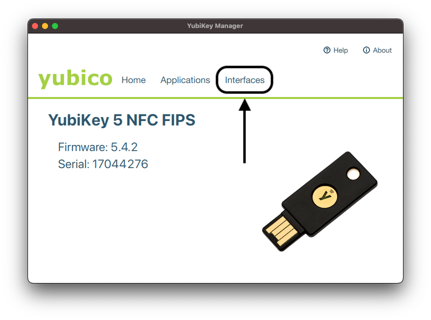
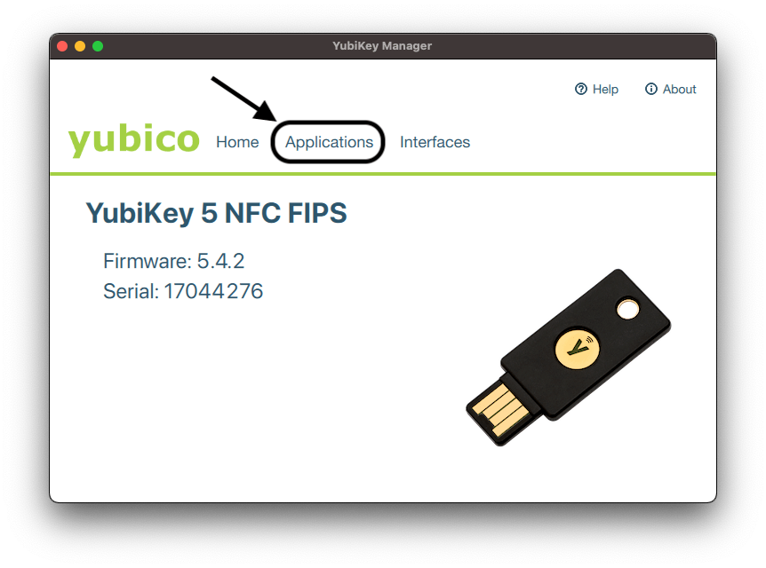
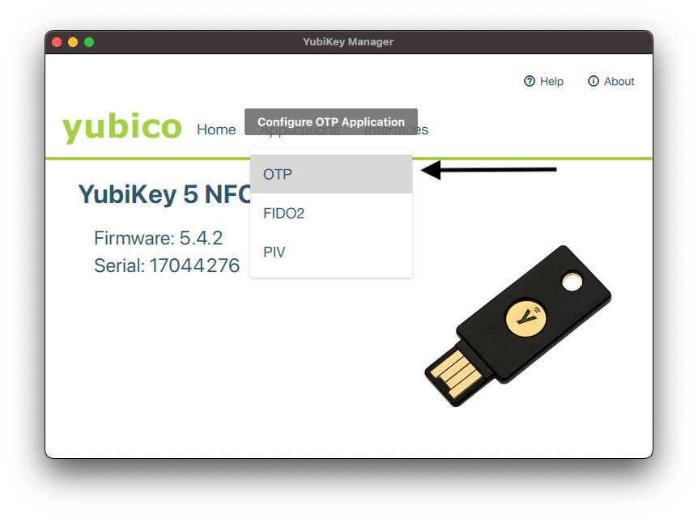
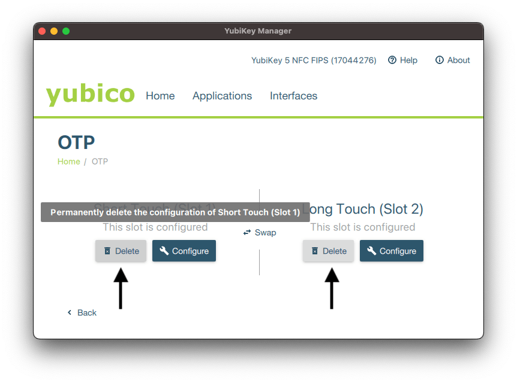

---

title: "Self help and troubleshooting"
description: "Frequently asked questions for GitLab team members regarding 2FA, technical issues, and Mac troubleshooting tips."
---

<link rel="stylesheet" type="text/css" href="/stylesheets/biztech.css" />

**This is a Controlled Document**
{: .panel-heading}

Inline with GitLab's regulatory obligations, changes to [controlled documents](/handbook/security/controlled-document-procedure.html) must be approved or merged by a code owner. All contributions are welcome and encouraged.

## Purpose

Please read through this page to find the common troubleshooting questions GitLab Team Members encounter. If you cannot find an answer to your question, please find more information on how to contact us at the [bottom of the page](#cant-find-what-you-are-looking-for).

### <i class="fas fa-question-circle" id="biz-tech-icons"></i> Frequently Asked Questions

## Troubleshooting Guides

## Two-factor Authenticators

### I can't get into Okta or GitLab with my authenticators

#### Gitlab

- Please check any authenticator apps (Google Authenticator, Duo Mobile, Okta Verify, etc.) on your phone that has an entry of gitlab.com:name@gitlab.com.
- There may be recovery codes in your Downloads folder titled gitlab-recovery-codes.txt, you can enter one of those codes to regain access.
- If you are locked out completely reach out in **#it_help** Slack channel, an IT Analyst will require a Zoom call to verify that it is you before doing the reset, this is required for security purposes.

#### Okta

WebAuthn is now required for all Okta users. Refer [to these instructions](/handbook/business-technology/okta/#i-want-to-add-touch-id--face-id--face-authentication--yubikey-to-okta) on how to configure this.

- If your TouchID, Yubikey or Mobile Authentication is not working make sure your OS and phone is updated to the latest version
- Try to login with different browsers (Chrome and Safari)
- If you are locked out completely reach out in **#it_help** Slack channel, an IT Analyst will require a Zoom call to verify that it is you before doing the reset, this is required for security purposes.

#### Clearing Browsing Data in Advanced Settings Below Will Cause Issues With Your WebAuthN (Biometrics/Touch ID)

Do **not do** the following when clearing cache and cookies in Google Chrome as this will clear WebAuthN (Biometrics/Touch ID) browsing data and cause issues logging in:

- In Chrome ⇒ Click on 3 dots on top right corner
- Go to More Tools ⇒ Clear browsing data
- Under advanced ⇒  DO NOT Check box below
- This will clear your WebAuthN (Biometrics/Touch ID) and will need to be reset and configured again

If you cleared your cache and got locked out please do the following:

- Use Yubikey to login to Okta and reset WebAuthN (Biometrics/Touch ID) and configure again.
- If your phone is set up with a passkey, you may use your phone to get into OKTA and reset your WebAuthN (Biometrics/Touch ID)
- If you do not have a Yubi key or your phone set up; you will need to contact #it-help to reset your WebAuthN (Biometrics/Touch ID) in OKTA

Please check out the [following page](/handbook/business-technology/okta/#i-want-to-add-touch-id--face-id--face-authentication--yubikey-to-okta) for information and assistance on setting up WebAuthN (Biometrics/Touch ID)/Phone passkey and Yubikey

#### My YubiKey is Entering Codes Into Slack and Sending Them (OTP Touch Options, "Getting Yubikey'd")

This is because the OTP function is enabled on your YubiKey. You can avoid this by:

- Removing OTP from your YubiKey Manager software by selecting Interfaces > Deselecting OTP checkboxes.

- Deleting "Short Press" options from your YubiKey Manager software by selecting Applications > OTP > Delete the touch options.

## I Forgot My Password

If you require IT to reset your password and it requires immediate access, please reach out on the Slack **#it_help** channel and provide as much information as possible. Password resets to sensitive systems such as your Google Workspace account and Okta will require a Zoom call with an IT Analyst to verify that it is you before doing the reset, this is required for security purposes.

## MacBook Guides

### New to Mac?

Several people have joined GitLab with not a lot of experience with macOS and that's totally okay! Here are some guides from Apple that we found useful.

- [Mac tips for Windows switchers](https://support.apple.com/en-us/HT204216)
- [Mac Keyboard Shortcuts](https://support.apple.com/en-us/HT201236) - great to help your productivity!
- [macOS : Ventura New Features](https://www.apple.com/au/macos/ventura/features/) - Apple's newest OS features
- [Got an iPad? - Check out Sidecar!](https://support.apple.com/en-afri/HT210380) - Apple iPad Sidecar
- [How to use multiple workspaces on Mac](https://support.apple.com/guide/mac-help/work-in-multiple-spaces-mh14112/mac)

#### Transferring of data to New Mac

- We prohibit the use of Migration Assistant to transfer your data to your new Mac as this will break the connectivity of JAMF
- Please use GitLab's Google Drive function to back up what is needed and then you're able to download this onto your new Mac

### Built-In MacBook Troubleshooting Commands

MacBooks are wonderful laptops, but no laptop is without faults. You may come across a "wonky" situation with your Mac, so below are some pointers that may help fix common issues.

**Before** kicking off the reset, find out if your MacBook is using an Intel or Apple Silicon chip by following this [guide](https://support.apple.com/en-ca/HT211814#:~:text=To%20open%20About%20This%20Mac,as%20an%20Intel%2Dbased%20Mac.)

- **Apple Silicon M Chips**: Reset your [NVRAM and PRAM](https://support.apple.com/en-us/HT204063) - non-volatile random access memory and parameter RAM stores small amount of information on your Mac, if you experience issues related to what's in the Apple article resetting this might help out.

<iframe width="560" height="315" src="https://www.youtube.com/embed/LoUO1RwMg1w" title="YouTube video player" frameborder="0" allow="accelerometer; autoplay; clipboard-write; encrypted-media; gyroscope; picture-in-picture" allowfullscreen></iframe>

- **Intel Chips**: Reset the [SMC](https://support.apple.com/en-us/HT201295) - System Management Controller handles some low-level functions like battery management and if you experience issues with fans or internal ports this could help resolve those issues.
    (Note: different models have different reset methods)

    <iframe width="560" height="315" src="https://www.youtube.com/embed/wlkGh2flbvI" title="YouTube video player" frameborder="0" allow="accelerometer; autoplay; clipboard-write; encrypted-media; gyroscope; picture-in-picture" allowfullscreen></iframe>

- Apple Diagnostics [Hardware Diagnostics](https://support.apple.com/en-us/HT202731)

### Password Reset for Your MacBook

Here are some troubleshooting guides if you forgot your password or if your password is not working for your MacBook.

- [Boot to receovery mode](https://support.apple.com/en-ie/guide/mac-help/mchl46d531d6/mac). Once you get to receovery and have unlocked using your password, restart the laptop. This often fixes the issue.
- [Use the Reset Password assistant](https://support.apple.com/en-ca/HT212190#:~:text=Use%20the%20Reset%20Password%20assistant,-You%20should%20now&text=From%20the%20Utilities%20menu%20in,open%20the%20Reset%20Password%20assistant.)
- [Reset your Mac login password](https://support.apple.com/en-ca/guide/mac-help/mh35902/mac)

### Repair a Disk or Mac Storage Drive

Apple's Disk Utility tool can fix some problems such as applications unexpectedly quitting or crashing, corrupted files, and external drives not working. You can also format drives with Disk Utility.

This is a quick walkthrough on how to check your MacBook's disk and run First Aid, you can follow the guide [here](https://support.apple.com/en-ca/guide/disk-utility/dskutl1040/mac)

### How long is my MacBook covered by warranty?

- Review your Apple Warranty Status [Service and Support](https://checkcoverage.apple.com/)

### Apple Support

Please work with #it_help before reaching out to Apple Support or going to the Apple Genius Bar. For hardware issues, please see [laptop repair](/handbook/business-technology/end-user-services/onboarding-access-requests/#laptop-repair) and [laptop replacement](/handbook/business-technology/end-user-services/onboarding-access-requests/#gitlab-laptop-replacement-program).

## Zoom

IT Ops are the tech stack owners of Zoom. If you are needing support with Zoom please contact us in the #it_help channel in Slack.

If you are requiring an application to be added to Zoom you'll need to first go through the [App Integrations Approval Process](https://gitlab.com/gitlab-com/Finance-Division/procurement-team/procurement/-/issues/new#) using the `app_integrations` template

Once that has been approved please then open a change management [request](https://gitlab.com/gitlab-com/business-technology/change-management/-/issues/new#) using the `it_general_change` template. Please follow the template instructions and if you have any questions please contact us in slack in the #it_help channel

## Okta

Want to know how as an organization we leverage Okta as a Single Sign On tool? Please click [here](/handbook/business-technology/okta/)

## Google

### I want to access my work Gmail on my phone

Please refer to our GitLab Acceptable Use Policy on [Personal Phones Mobile Phone and Tablet Usage](/handbook/people-group/acceptable-use-policy/#personal-mobile-phone-and-tablet-usage) prior to adding your GitLab Gmail account to your personal device.

- You will need to follow and complete [this guide](/handbook/business-technology/okta/#i-want-to-add-touch-id--face-id--face-authentication-to-okta-for-my-mobile-device-iphoneipad-or-android) before the next steps.
- Download the official Gmail app made by Google LLC to your phone
    - iOS: [here](https://apps.apple.com/us/app/gmail-email-by-google/id422689480)
    - Android: [here](https://play.google.com/store/apps/details?id=com.google.android.gm&hl=en_CA&gl=US&pli=1)
- Add Google account
- Input your GitLab email
- Google will redirect to Okta login.
- Input your email address and your password to your Okta account.
- Accept 2FA prompt on your phone
- All set!

### Want to add different profiles for your different GitLab accounts?

It is recommended that you create different profiles in Chrome so you can manage your different GitLab accounts (production, dev, staging, etc.). This way you can easily sign in without having to signout out of different accounts each time. You can follow this guide to create different Google Chrome [profiles](https://support.google.com/chrome/answer/2364824?hl=en&co=GENIE.Platform%3DDesktop)

### Is your Chrome browser acting a little weird?

If you are having issues that seemingly can't be explained the below steps might help resolve your issue.
Keep in mind this will reset chrome to default settings but its easy enough to restore and link data back. You can follow this [guide](https://support.google.com/chrome/answer/3296214?hl=en).

### Does your Gmail account keep getting suspended?

This usually occurs when the emails you send out get reported for spam. Collect too many reports and Google will automatically suspend your account. Here is some more info on Google's [page](https://support.google.com/a/topic/28609).

**How do I get access to my account after suspension?**

Someone from IT will need to unlock your account. Please submit a [Team Member Enablement request](https://gitlab.com/gitlab-com/business-technology/team-member-enablement/issue-tracker/-/issues/new?issuable_template=General%20HelpDesk%20Request) or reach out to us on the #it-help slack channel.

**How do I prevent this from happening?**

Please look into the following mailing applications which may prevent this from happening in the future due to a different mailing method.

- MailGun: <https://www.mailgun.com/>
- MailChimp: <https://mailchimp.com/>

Both of those applications are listed in GitLab's tech stack meaning they can be used.

## Laptop Wipes

### How to Erase a Disk for Mac

If you are keeping your GitLab machine [Laptop Buy Back Policy](/handbook/business-technology/team-member-enablement/onboarding-access-requests/#laptop-buy-back-policy) it is required that IT wipes the machine and restores it to base OS:

#### Jamf (macOS)

- Please schedule a time with an IT Analyst to have your laptop wiped. You can find their schedules [here](/handbook/business-technology/team-member-enablement/#laptop-wipe-schedules-for-it-analysts).
- Make sure all your data is backed up and laptop is powered on and connected to the internet
- Please refer to your refresh [issue](https://gitlab.com/gitlab-com/business-technology/team-member-enablement/issue-tracker/-/issues) which contains further instructions

#### Drivestrike (Linux)

- Please schedule a time with an IT Analyst to have your laptop wiped. You can find their schedules [here](/handbook/business-technology/team-member-enablement/#laptop-wipe-schedules-for-it-analysts).
- Please refer to your refresh [issue](https://gitlab.com/gitlab-com/business-technology/team-member-enablement/issue-tracker/-/issues) which contains further instructions

- We will send you an email which will contain install instructions for Drivestrike

### Tools and Tips

Check out the GitLab Tools and Tips pages for recommended software and applications - [Tools and Tips](/handbook/tools-and-tips/)

Our security team also did an amazing write-up for Linux installations - [Linux Setup](/handbook/tools-and-tips/linux/)

### Installing OS Ventura

**Pre-requisites**

Before you install, please be sure to have the following:

- 25 GBs of HD space
- The latest version of SentinelOne (22.2.3 or higher)

**Download and Installation**

The entire process will take a **minimum of an hour** depending on your internet speed. Please give yourself sufficient time to download and install the upgrade, avoid doing this upgrade before meetings. Once you are greeted with the login screen, the upgrade is complete. Be sure that you reboot a couple of times after the installation is complete.

There's 2 ways to upgrade to Ventura

**Self Service**

1. Search for the **Self Service** application on your MacBook.
3. In the search bar, look up **Ventura**.
4. Click on it to install. This will redirect you to the Apple Store where you can install the OS.
5. This can take upwards of an hour, so please factor in that time when you are updating

**Check for Updates**

1. You can follow this [guide](https://support.apple.com/en-us/HT201541)

### FAQ for issues with a new macOS update

**How can I tell if my MacBook is using an Intel or an Apple M1/M2 chip?**

- Please refer to this [guide](https://support.apple.com/en-ca/HT211814#:~:text=To%20open%20About%20This%20Mac,as%20an%20Intel%2Dbased%20Mac)

**My external monitor is not working properly after the update**

- Power cycle your [monitor](https://edu.gcfglobal.org/en/basic-computer-skills/how-to-power-cycle-a-device/1/)

- Try the troubleshooting steps from macOS User [guide](https://support.apple.com/en-nz/guide/mac-help/mchl7c7ebe08/mac)

- Reset your SMC if you’re using an Intel (i5, i7) [MacBook.](https://www.youtube.com/watch?v=wlkGh2flbvI)

Reset your NVRAM and PRAM if you’re using an Apple M1/M2 [MacBook](https://www.youtube.com/watch?v=LoUO1RwMg1w)

Replace your USB C hub for a Satechi Multi-Port Adapter, replace the cable that is connected from your monitor to your MacBook HDMI cable (higher end version)

**Zoom is not working after I updated to Ventura**

You will need to uninstall and install Zoom again. Please follow this [guide](https://support.zoom.us/hc/en-us/articles/201362983-Uninstalling-and-reinstalling-the-Zoom-application):

**Some of my applications are not working properly, what can I do?***

Reinstall your specific applications that are not working properly and reach out to #it_help if the problem persists.

### What is JAMF Self Service

With the installation of JAMF comes Self Service which can be found in Applications. Jamf Self Service for macOS allows users to browse and install applications, configuration profiles and update your OS easily.

### Jamf Wipe

If you need to wipe a macOS system because you have received a new (refreshed) system for GitLab work or are departing GitLab, please [schedule a time](/handbook/business-technology/team-member-enablement/#laptop-wipe-schedules-for-it-analysts) with an IT Analyst to perform the wipe and decommission from Jamf management.

### Reinstalling macOS after a Jamf wipe

We use Jamf to wipe Macs when you're either getting a new laptop, sending it back to our supplier, or retaining your laptop [after you have left the company](/handbook/business-technology/team-member-enablement/onboarding-access-requests/#laptop-buy-back-policy).

After we have initiated the wipe from our end, the Mac should restart several times and end up in the Setup Assistant window. If this is not the case then you will need to manually reinstall macOS by following [this guide](https://support.apple.com/en-ie/HT204904).

**Before you reinstall, DNS changes on your router can affect the connection to the Apple Servers. If you do have issues getting into recovery, or are stuck with selecting your network, please try defaulting back to your original DNS to fix this issue**

<!---
## Enrolling your Chromebook into GitLab Google Device Management

1. Turn on your Chromebook, connect it to a network and follow the on-screen instructions until you see the **Who's using this Chromebook** screen. Don't sign in yet. 
2. You should see an option at the bottom for **Enterprise Enrollment**: If you do not see this you can press **ctrl+alt+e** and it should bring you to the Enterprise Enrollment Screen. 
3. Enter the username and password from your Google admin welcome letter or for a Google Account that has eligibility to enroll. This is your GitLab username and password.
4. Once you successfully input your registered Gitlab email address a Okta prompt should appear. You should now enter the email address and password you use for Okta. Afterwards you should be prompted to input a 2FA code or verify a push notification
5. When you get a confirmation message that the device is successfully enrolled, click Done.
6. Lastly, you should be prompted one final time to **Sign in to your Chromebook**. Click next and repeat the steps above. (input Okta email and password + 2FA or push notification)
7. Congrats! You have now completed your sign in an enrollment.
--->

## Can't find what you are looking for?

There are several ways to reach the IT team:
1. You can reach out to us on Slack via #it_help
2. Email us at it-help@gitlab.com
3. Create an access request using the [Individual_Bulk_Access_Request template here](/handbook/business-technology/end-user-services/onboarding-access-requests/access-requests/)

### How to Contact Us or Escalate Priority Issues Outside of Standard Hours

We ask that all requests are made through an [IT Help Issue](/handbook/business-technology/end-user-services/onboarding-access-requests/access-requests/). We will triage and address them as soon as we can. All issues created in the queue are public by default. Privileged or private communications should be sent to #it_help on Slack or [it-help@gitlab.com](mailto:it-help@gitlab.com). Screenshots and videos are very helpful when experiencing an issue, especially if there is an error message.

As a distributed team, we have support around the clock with team members in AMER, EMEA, and APAC.
High volumes of issues being triaged can dictate the delay in response within that window. If the issue is extremely time sensitive and warrants escalation, use judgement on whether or not it can wait until ‘business hours’.
Escalated issues should be made through the #it_help slack channel.
All other request should have an issue created.

## Exceptions

Exceptions to this procedure will be tracked as per the [Information Security Policy Exception Management Process](/handbook/security/#information-security-policy-exception-management-process).

## References
- Parent Policy: [Information Security Policy](/handbook/security/)
