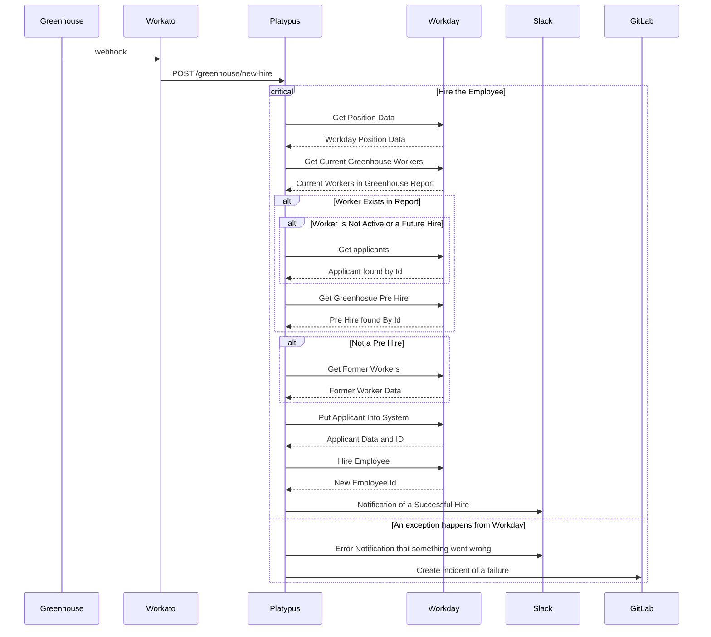
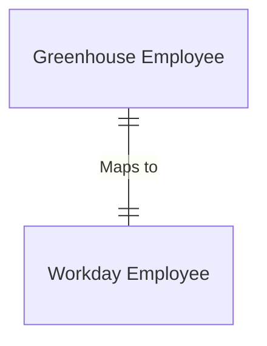

---

title: "GreenHouse to Workday"
---

{::options parse_block_html="true" /}

<link rel="stylesheet" type="text/css" href="/stylesheets/biztech.css" />

# Connected Systems

- Greenhouse (Source)
- Workato (Middleware)
- Platypus (Middleware)
- Slack (Notifications)
- GitLab (Error Handling)
- Workday (Destination)

# Summary

Sync newly hired employees from Greenhouse to Workday, taking care of any data
mapping that needs to happen and sending out slack notifiactions on success or
error.

For in depth information on this integration please view [the workato
documentation][1] and [the greenhouse controller documentation][2].

# Sequence

# Error Handling

When an exception happens during the sync hiring process, a notification is
sent to Slack on the `#peopleops-alerts-private` channel and to GitLab at the
[automated incidents](https://gitlab.com/gitlab-com/business-technology/enterprise-apps/integrations/integration-automated-incidents) project.

The following errors can be thrown inside the process and are handled
accordingly

- `InternalApplicantError`: thrown when the application's source is 'Internal
Applicant' meaning they should be updated manually
- `NotFoundPositionError`: thrown when the position ID we were given does not
exist. The position ID is the same as `P-candidate.id`
- `ExistingWorkerError`: thrown when we attempt to hire a worker that alrady
exists, which is either current or a future hire.
- `FormerWorkerError`: thrown when a new hire is a former worker from before
January 1 2022, tracked by candidate id and email
- `IncompleteHireError`: thrown when Workday returns a value that does not have
an employee ID

If any of the above errors are thrown, manual intervention is necessary inside
workday to help ease the process along.

If an error that is not an instance of the above errors is thrown, the message
to Slack mentions that an Integrations Engineer should look at the logs on both
sides of the process.

# Data Model

The below fields are written by their API names in dot notation.

| Greenhouse Field  | Workday Field |
| --- | --- |
| opening.finance_id.value | Hire_Employee_Data.Edit_Custom_IDs_Sub_Proccess.Custom_Identification_Data[].Custom_ID[].Custom_ID_Data.ID |
| opening.type.value | Hire_Employee_Data.Hire_Employee_Event_Data.Employee_Type_Reference |
| credited_to.email | Applicant_Data.Recruiting_Data.Applicant_Comments |
| credited_to.employee_id | Applicant_Data.Recruiting_Data.Referred_by_Worker_Reference[].ID[].$value |
| credited_to.employee_id | Applicant_Data.Recruiting_Data.Applicant_Comments |
| credited_to.name | Applicant_Data.Recruiting_Data.Applicant_Comments |
| candiate.id | Applicant_Data.Applicant_ID |
| candiate.id | Request_Reference.Position_Reference[].ID[].$value |
| candidate.first_name | Applicant_Data.Personal_Data.Legal_Name_Data.Name_Detail_Data.First_Name |
| candidate.last_name | Applicant_Data.Personal_Data.Legal_Name_Data.Name_Detail_Data.Last_Name |
| candidate.email_addresses[].value | Applicant_Data.Personal_Data.Contact_Data.Email_Address_Data |
| candidate.attachments[].filename | Worker_Document_Data.Filename |
| candidate.nickname.value | Applicant_Data.Personal_Data.Name_Data.Preferred_Name_Data.Name_Detail_Data.First_Name |
| candidate.preferred_last_name_surname.value | Applicant_Data.Personal_Data.Name_Data.Preferred_Name_Data.Name_Detail_Data.Last_Name |
| offer.starts_at | Hire_Employee_Data.Hire_Date |
| offer.starts_at | Hire_Employee_Data.Request_One_Time_Payment_Sub_Process.Effective_Date |
| offer.starts_at | Request_One_Time_Payment_Sub_Process.Request_One_Time_Payment_Data[].Scheduled_Payment_Date |
| offer.bonus_percent.value | Hire_Employee_Data.Propose_Compensation_for_Hire_Sub_Process.Propose_Compensation_for_Hire_Data.Bonus_Plan_Data.Bonus_Plan_Sub_Data[].Individual_Target_Percent |
| offer.bonus_type.type | Hire_Employee_Data.Propose_Compensation_for_Hire_Sub_Process.Propose_Compensation_for_Hire_Data.Bonus_Plan_Data.Bonus_Plan_Sub_Data[].Bonus_Plan_Reference.ID[].$value |
| offer.country.value | Hire_Employee_Data.Propose_Compensation_for_Hire_Sub_Process.Propose_Compensation_for_Hire_Data.Bonus_Plan_Data.Bonus_Plan_Sub_Data[].Bonus_Plan_Reference.ID[].$value |
| offer.country.external_id | Applicant_Data.Personal_Data.Name_Data.Legal_Name_Data.Name_Detail_Data.Country_Reference.ID[].$value |
| offer.country.external_id | Applicant_Data.Personal_Data.Name_Data.Legal_Name_Data.Name_Detail_Data.Country_Reference.ID[].$value |
| offer.currency.value.unit | Hire_Employee_Data.Propose_Compensatoin_for_Hire_Sub_Process.Propose_Compensation_for_Hire_Data.Pay_Plan_Data.Pay_Plan_Sub_Data[].Currency_Reference.ID[].$value |
| offer.currency.value.ammount | Hire_Employee_Data.Propose_Compensation_for_Hire_Sub_Process.Propose_Compensation_for_Hire_Data.Pay_Plan_Data.Pay_Plan_Sub_Data[].Amount |
| offer.cost_center.external_id |Hire_Employee_Data.Edit_Assign_Organization_Sub_Process.Position_Organization_Assignments_Data.Cost_Center_Assignments_Reference[].ID[].$value |
| offer.employment_type.type | Hire_Employee_Data.Edit_Assign_Organization_Sub_Process.Position_Organization_Assignments_Data.Cost_Center_Assignments_Reference[].ID[].$value |
| offer.entity.type | Hire_Employee_Data.Edit_Assign_Organization_Sub_Process.Position_Organization_Assignments_Data.Cost_Center_Assignments_Reference[].ID[].$value |
| offer.entity.external_id | Hire_Employee_Data.Edit_Assign_Organization_Sub_Process.Position_Organization_Assignments_Data.Company_assignments_Reference[].ID[].$value |
| offer.job_specialty.external_id | Hire_Employee_Data.Edit_Assign_Organization_Sub_Process.Position_Organization_Assignments_Data.Custom_Organization_Assignment_Data[].Custom_Organization_Assignment_Reference.ID[].$value |
| offer.locality.external_id | Hire_Employee_Data.Edit_Assign_Organization_Sub_Process.Position_Organization_Assignments_Data.Custom_Organization_Assignment_Data[].Custom_Organization_Assignment_Reference.ID[].$value |
| offer.per_year_or_per_hour.value | Hire_Employee_Data.Hire_Employee_Event_Data.Position_Details.Pay_Rate_Type_Reference |
| offer.per_year_or_per_hour.value | Hire_Employee_Data.Hire_Employee_Event_Data.Position_Details.Pay_Rate_Type_Reference |
| offer.per_year_or_per_hour.value | Hire_Employee_Data.Proposal_Compensation_for_HIre_Sub_Process.Propose_Compensation_for_Hire_Data.Pay_Plan_Data.Pay_Plan_Sub_Data[].Frequency_Reference.ID[].$value |
| offer.rsu__value.value | Hire_Employee_Data.Request_Stock_Grant_Sub_Process.Request_Stock_Grant_Data.Individual_Stock_Grant[].Grant_Amount |
| offer.sales_geo_differential.external_id | Hire_employee_data.Edit_Assign_Organization_Sub_Process.Position_Organization_Assignments_Data.Custom_Organization_Assignment_Data[].Custom_Organization_Assignment_Reference.ID[].$value |
| offer.signing_bonus.value.unit | Hire_Employee_Data.Request_One_Time_Payment_Sub_Process.Request_One_Time_Payment_Data[].Currency_Reference.ID[].$value |
| offer.signing_bonus.value.amount | Hire_Employee_Data.Request_One_Time_Payment_Sub_Process.Request_One_Time_Payment_Data[].Amount |
| offer.state_province.value | Hire_Employee_Data.Hire_Employee_Data.Position_Details.Location_Refernce |

# Secutity Components

1. Greenhouse use swebhooks with Workato via a secured channel
2. Workato calls to Platypus using OAuth credentials saved in Workato
3. Platypus calls to Workday via authenticated SOAP operations
4. Platypus calls to Slack via API credentials
5. Platypus calls to GitLab via GitLab Access Tokens and a Bot Account
6. All connections are made via HTTPS

# Data Classification

This integration handles and stores [Orange Data](https://about.gitlab.com/handbook/engineering/security/data-classification-standard.html#orange) (Personal data)

# Environments

| Environments | Greenhouse | Workato | Platypus | Workday | Slack | GitLab |
| --- | --- | --- | --- | --- | --- | --- |
| Production | Production | Production | Production | Production | Production | Production |
| Development | sandbox | Dev | Development | sandbox | dev-sandbox | prod |

[1]: https://gitlab.com/gitlab-com/business-technology/enterprise-apps/integrations/platypus/-/blob/master/docs/workato/greenhouse-workday-sync.md
[2]: https://gitlab.com/gitlab-com/business-technology/enterprise-apps/integrations/platypus/-/blob/master/docs/greenhouse/new-hire.md
