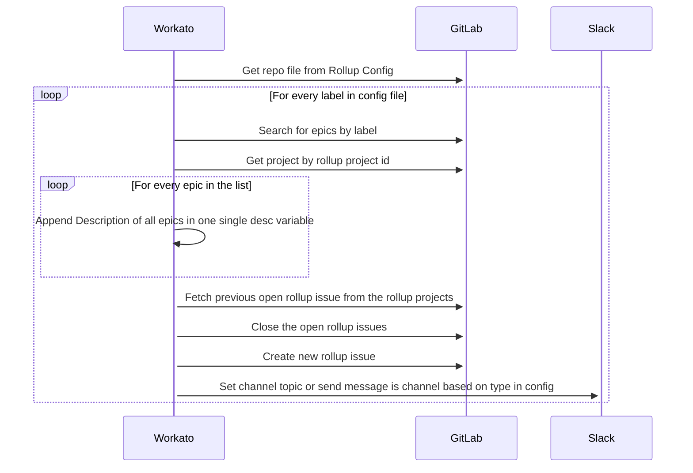

---

title: "Rolly Automation"
---

{::options parse_block_html="true" /}

<link rel="stylesheet" type="text/css" href="/stylesheets/biztech.css" />

# State and Ownership

- Current State: Up and working in Workato prod.

| Developer | Code owner | Business Owner
| ------ | ------ | ------ |
|   @Karuna16      |   @Karuna16      |   @broncato      |

# Connected Systems

- GitLab (Source)
- Workato (Middleware)
- GitLab (Destination)

# Summary

This automation runs every day creating weekly rollup issue in the projects listing out the epics from the groups mentioned in the `rollupconf.yml` in [Rollup Bot Configuration](https://gitlab.com/gitlab-com/business-technology/enterprise-apps/integrations/rollup-bot-configuration) project. The target projects where the rollup issues are created are also listed in the `rollupconf.yml`. Currently there're two projects in which these issues created - [Business Technology Operations](https://gitlab.com/gitlab-com/business-technology/business-technology-ops) and [GitLab Data Team](https://gitlab.com/gitlab-data/analytics)

# Sequence

# Data Model

Since its an automation there's no data mapping happens.

# Error Handling

On error, 3 retry attempts are made in the 2 seconds interval. If the actions still fail then, an error email is sent to the integration admin (currently @Karuna16) mentioning the job id and job url. if the env is prod, an additional error email is sent to the business stakeholders (listed in the `rollupconfig.yml`) mentioning the error message. If the email delivery fails, the error messages are complied in the list in Workato and the job stops.

# Security Components

1. Workato authenticates with GitLab using OAuth2 Client Credentials.
1. All connections are over HTTPS.

# Data Classification

This integration handles [Yellow Data](/handbook/security/data-classification-standard.html#orange)

# Environments

| Environment | GitLab | Workato | Slack |
| --- | --- | --- | --- |
| Production | Production | Production | Production |
| Staging | N/A | N/A | N/A |
| Development | Production | Dev | N/A |
