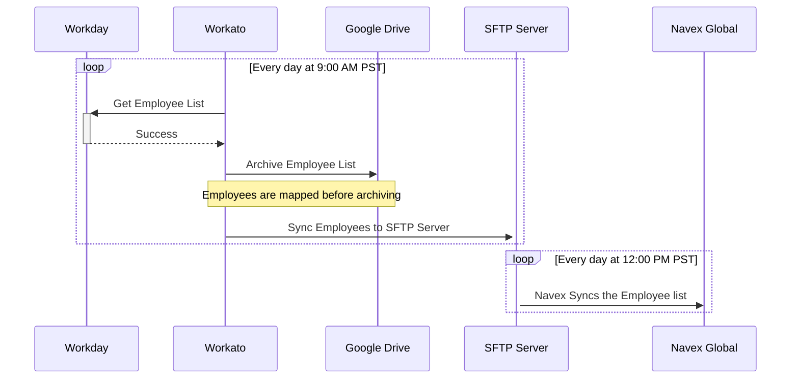
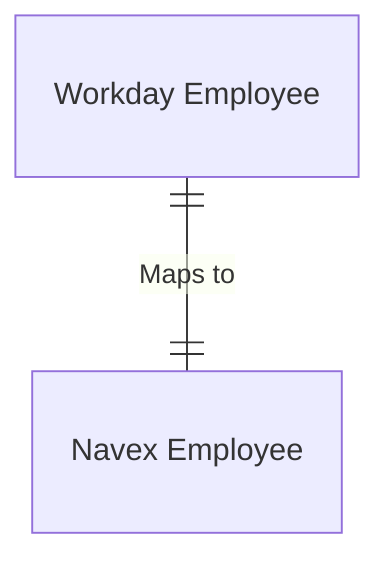

---

title: "Workday to Navex Global"
---

{::options parse_block_html="true" /}

<link rel="stylesheet" type="text/css" href="/stylesheets/biztech.css" />

# State and Ownership

- Current State: Up and working in Workato prod.

| Developer | Code owner | Business Owner
| ------ | ------ | ------ |
|   @Karuna16      |   @Karuna16      |   @ktesh      |

# Connected Systems

- Workday (Source)
- Workato (Middleware)
- Navex Global (Destination)

# Summary

This integration synchronizes the employees in Workday to Navex Global to help
with setting up trainings for the employees.

# Sequence

# Data Model

There's not too much data mapping that goes on inside of Workato to get the
employees to match Navex's system. Only a couple of fields with minimal logic.

|Workday Field | Navex Field | Conditional Logic |
| --- | --- | --- |
| FirstName | FirstName | |
| LastName | LastName | |
| | Password | Set via Wokrato |
| Email | Email | |
| JobTitle | JobTitle | |
| GroupCodes | GroupCodes | If `Navex.Department` is `Finance`, `Legal`, `Marketing`, or `Sales`, prepend `Commercial_` |
| CountryId | CountryId | |
| Division | Department | |
| Manager_Name | Manager_Name | |
| Manager_Email | Manager_Email | |

# Error Handling

Needs to be created

# Security Components

1. Workato access Workday data via an authenticated HTTP GET call
2. Workato sends the data to an OAuth authenticated Google Drive for backup
3. Workato sends the CSV file to the SFTP server with username and password authentication
4. Navex reads from the SFTP server using username and password authentication

# Data Classification

This integration handles [Orange Data](/handbook/security/data-classification-standard.html#orange)

# Environments

| Environment | Workday | Workato | Navex Global |
| --- | --- | --- | --- |
| Production | Production | Production | Production |
| Staging | N/A | N/A | N/A |
| Development | Dev | Dev | N/A |
