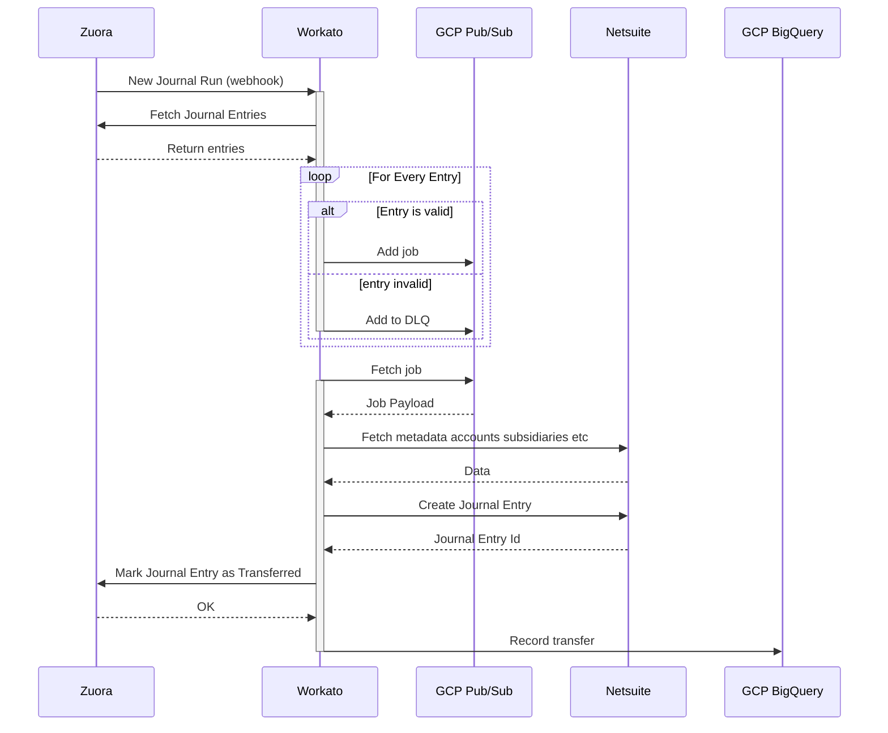

---

title: "Zuora Billing to NetSuite"
---

{::options parse_block_html="true" /}

<link rel="stylesheet" type="text/css" href="/stylesheets/biztech.css" />

# Links

# State and Ownership

- Current State: Up and working in Workato prod.

| Developer | Code owner | Business Owner
| ------ | ------ | ------ |
|   @Karuna16      |   @Karuna16      |   @jesssalcido      |

# Summary

This integration is used a the end of each month to synchronise Zuora Billing journal entries to Netsuite.

# Sequence

# Error handling

1. If journal entries are invalid, they are immediately put into the dead letter queue.
1. When journal entries fail to sync, the job in GCP Pub/Sub will be retried a few times and then put into the dead letter queue if it continues to fail.
2. For any other errors like connection timeout or error in connecting to GCP, a Slack notification will be sent to the #workato-finance-alerts-private slack channel.

Here's the detailed error-handling flow:

## Follow-up actions in case of failure

1. For invalid JEs, an issue will be created in the [Integration Automated Incidents](https://gitlab.com/gitlab-com/business-technology/enterprise-apps/integrations/integration-automated-incidents) project and the finance ops team will correct the JEs in Zuora and resend the journal batch run.
2. For valid JEs which failed to sync to NetSuite, the integrations team will look into the error. In case, NetSuite is down or API not working, contact NetSuite support (if needed).
3. For any other errors (usually the ones notified via Slack), the integration team will look into the errors and failed jobs.

# Data Model

## Journal Entry Model

| Field | Type | Description |
| ------ | ---- | ----------- |
| number | string | The journal entry ID in Zuora Billing |
| status | string | The status of the journal entry in Zuora Billing |
| journalEntryDate | string (date) | The date of the journal entry in Zuora Billing |
| currency | string (alpha 3 currency code) | The currency of the journal entry in Zuora Billing |
| homeCurrency | string (alpha 3 currency code) | The home currency of the journal entry in Zuora Billing |
| aggregateCurrency | boolean | Whether the journal entry is in aggregate currency |
| transactionType | string | The type of the journal entry in Zuora Billing |
| accountingPeriodName | string | The accounting period from which the journal entry was created |
| timePeriodStart | string (yyyy-mm-dd) | The start date of the accounting period |
| timePeriodEnd | string (yyyy-mm-dd) | The end date of the accounting period |
| transferredToAccounting | string (Yes/No) | Whether the journal entry has been transferred to accounting |
| notes | string | Any notes associated with the journal entry |
| journalEntryItems | [JournalEntryLine](#journal-entry-line-model) | The journal entry items |

## Journal Entry Line Model

| Field | Type | Description |
| ------ | ---- | ----------- |
| accountingCodeType | string | "AccountsReceivable", "SalesRevenue", "DeferredRevenue" etc. |
| accountingCodeName | string | Basically the same as above but with spaces |
| glAccountName | string | The name of the GL account |
| glAccountNumber | string | The number of the GL account |
| type | string | "Debit" or "Credit" |
| homeCurrencyAmount | string | The amount in home currency |
| amount | string | The amount in the currency of the journal entry |

# Security Components

All API calls are authenticated using API credentials which have been granted only the permissions needed for the integration to function. All connections are over HTTPS or SOAP using TLS encrypted connections.

# Data classification

This integration handles [Orange Data](/handbook/security/data-classification-standard.html#data-classification-levels). The data is stored in the queue and processed by the system.

# Environments

| Environment | Zuora | Workato | Netsuite |
| ----------- | ----- | ------ | ------ |
| Production  | Production   | Production | Production |
| Staging     | Central Sandbox | Test | Sandbox 2 |
| Development | API Sandbox 1/2 | Development | Sandbox 1 |

# Notes

- All GCP components are in the `entapps-integrations` GCP [project](https://console.cloud.google.com/welcome?project=entapps-integrations).
- In the future this integration should be moved into Nestjs to greatly simplify it.
