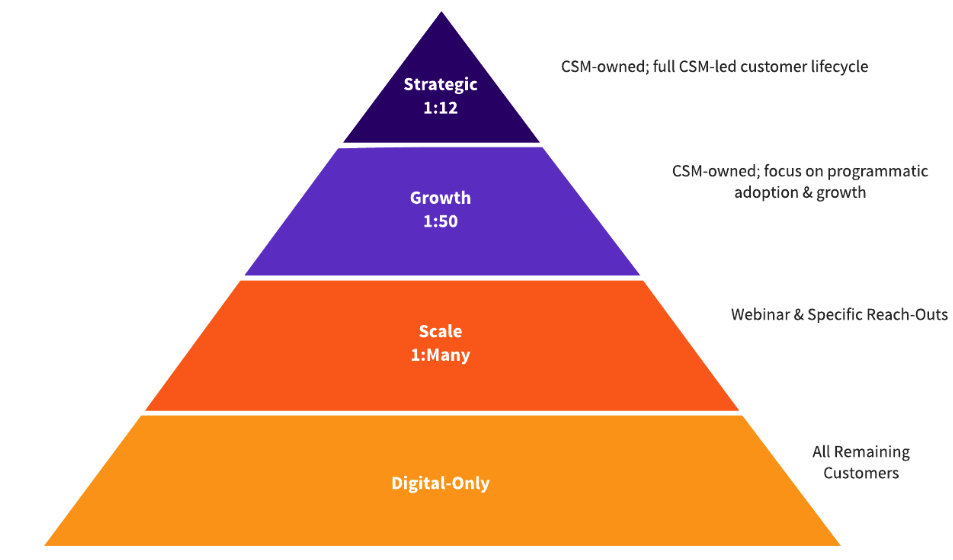

---

title: "Account Engagement"
---

View the [CSM Handbook homepage](/handbook/customer-success/csm/) for additional CSM-related handbook pages.

---

## Managing the Customer Engagement

Customer Success Managers will typically manage customer engagements via a GitLab project in the [`account-management` group](https://gitlab.com/gitlab-com/account-management/). This project will be based off the [Enterprise](https://gitlab.com/gitlab-com/account-management/customer-collaboration-project-template) or the [Commercial](https://gitlab.com/gitlab-com/account-management/commercial/templates/new-customer-project/) Customer Success Plan Template and customized to match the customer's needs as outlined above. The project is pre-loaded with milestones, issues, labels, and a README template to help kick off the project and outline a proof of concept, implementation, and customer onboarding. The following is a short [introduction video](https://youtu.be/b8D67EJjL9w) on GitLab's first iteration of the Customer Success Plan.

### Start a new customer engagement

1. Somewhere between step 3 and step 7 of the customer journey sequence, a Solutions Architect should create a project for the customer in GitLab and include a Professional Services Engineer and Customer Success Manager who are best aligned with the customer account. This typically only applies to Enterprise accounts.
2. After the Customer Success Manager has been aligned with the account, they will assign themselves to the “Customer Success Manager” field within Salesforce.
3. The Customer Success Manager confirms that a new customer project has been created based on the [Enterprise](https://gitlab.com/gitlab-com/account-management/customer-collaboration-project-template) or the [Commercial](https://gitlab.com/gitlab-com/account-management/commercial/templates/new-customer-project/) Customer Success Plan Template. If it hasn't, they need to create it and work with the Account Executive and/or Solutions Architect to complete it. This may have been done by the SA prior to CSM involvement, but if not the CSM needs to create one.
4. Follow the steps in the PLEASE-READ-THESE-INSTRUCTIONS.md file.

### Start a customer upgrade engagement

1. After the Customer Success Manager has been aligned with the account, they will assign themselves to the “Customer Success Manager” field within Salesforce.
1. Provided that the customer is part of the [CSM-Assigned segment](/handbook/customer-success/csm/segment/), confirm that the customer project has been created previously during the customer journey sequence, and if not available create a project for the customer in GitLab and include a Customer Success Manager who is best aligned with the customer account transition. For Commercial accounts, the CSM will determine if it is beneficial to have a customer project.
1. Verify that the project complies with the [Enterprise](https://gitlab.com/gitlab-com/account-management/customer-collaboration-project-template) or the [Commercial](https://gitlab.com/gitlab-com/account-management/commercial/templates/new-customer-project/) Customer Success Plan Template.
1. Follow the steps in the PLEASE-READ-THESE-INSTRUCTIONS.md file.

### Where does a Customer Success Manager fit in?

During the pre-sales process for Enterprise accounts, a Solutions Architect owns the project with assistance from the Account Executive and should include the Professional Services Engineer if there is one assigned. A Customer Success Manager is involved but only for visibility. Until the account becomes a paying customer the project remains in pre-sales. Once the customer has paid, the Account Executive will set up the "Welcome to GitLab" call along with the key GitLab employees (SAE, SA, PSE and Customer Success Manager) and the customer. There is a preloaded issue for this in the project template.

For Commercial accounts, the Account Executive owns the pre-sales process and [engages a Solutions Architect](/handbook/solutions-architects/#commercial-engagement-model) as needed. Once the account becomes a paying customer, the Customer Success Manager will create a customer project if it will be useful to their relationship with the customer, and the Account Executive will schedule a "Welcome to GitLab" call with the customer and the Customer Success Manager.

The "Welcome to GitLab" call will introduce the customer to the Customer Success Manager and begin the handover process. The Customer Success Manager will then lead the rest of the call and own the customer project. If the project was created in the pre-sales project under the [`pre-sales account-management` group](https://gitlab.com/gitlab-com/account-management/pre-sales), then it is moved to a post-sales project under [`account-management` group](https://gitlab.com/gitlab-com/account-management).

### Customer Engagement Tips

1. Make use of the [account management projects](https://gitlab.com/gitlab-com/account-management)  ([Template](https://gitlab.com/gitlab-com/account-management/templates/customer-collaboration-project-template))
1. Whenever a customer asks a question via email/Slack, kindly prompt them to open a Support ticket or an issue in the collaboration project
  - Examples of a Support issue: Reporting GitLab downtime, errors or accessibility problems
  - Examples of a Collaboration Project Issue: General questions about product usage, best practices or recommendations, adoption or integration questions
1. Show customers the power of GitLab by using GitLab with them (ex: related issues, tracking milestones, threaded conversations, ability to interact directly with GitLab’s product/engineering teams)
1. Make sure you are responding in a timely manner to customer's open issues. When you are prompt to respond, the customer is more likely to continue using the account management projects
1. Have discussions in the public issues as much as possible. If there is a question/discussion point that requires interaction with the GitLab Engineering and Product teams, post it in the public issue, as it most likely benefits everyone reading the public issue.
1. When adding a SFDC link to a public issue, remember to [provide feedback](/handbook/product/how-to-engage/#customer-feature-requests) to the product managers using the [feedback template](/handbook/product/how-to-engage/#feedback-template)
1. In-person meetings are some of the most impactful and productive engagements, but they are also the most expensive in terms of time and money. To make sure both parties get the most out of an in-person meeting have an agenda planned well in advance and send the agenda to all parties attending the meeting. Also, if a GitLab E-group member is attending the meeting, an [Executive Briefing Doc](https://docs.google.com/document/d/1hyA12EN5iEwApAr_g4_-vhUQZohKxm5xkX9xxZ1JNog/edit) (internal link) will also be required (see the next section for more details on engaging with an e-group member).

### E-Group Customer Calls

Occasionally, a GitLab e-group member (VP or C-level) will be meeting with a customer, for example, as part of an executive briefing, escalation, etc. Please review the [EBA handbook page](/handbook/eba/) on guidance on how to schedule with the E-Group, specifically the section on [customer, prospect, and partner meetings with an E-Group member](/handbook/eba/#customer-prospect-and-partner-meetings-with-an-e-group-member). There will be a prep call prior to the customer call (typically the day before), and there is an [Executive Briefing Document](https://docs.google.com/document/d/1hyA12EN5iEwApAr_g4_-vhUQZohKxm5xkX9xxZ1JNog/edit) (internal doc link) that must be prepared and shared with the EBA in advance of the prep call, in addition to any materials that will be used during the customer call. Below are some tips to ensure a positive experience:

1. Work on the prep doc and call resources with your account team.
1. Be as thorough as possible about your customer's details (e.g. ARR, # of users, tier, renewal date, stages in use)
1. Ensure you answer the 5 W's (who,what,where,when,why) of the meeting and what should be the outcome of the meeting.
    - Make sure that we detail both what GitLab wants out of the meeting and what the customer wants out of the meeting. This is a collaborative partnership that benefits both parties.
1. Be prepared in advance of what you want the E-Group member to do, say, and ask.
1. Have an agenda for the call and ensure everyone knows what they're supposed to do (who will speak when and about what).
1. Add any topics you think the customer may bring up (positive or negative) and advice on how to approach it.
1. Provide links wherever possible (e.g. documentation, feature requests, blockers, etc.).
1. To add a deep-link to the Gainsight Success Plan, go to the CSM Portfolio dashboard, scroll down to the "Success Plans by Account" widget, expand the report (click the square on the top bar of the report), then click the link under the "Success Plan" (not the link in the account name column to the C360); copy and paste this link to the document. It's typically recommended to use the Gainsight direct login, rather than the Salesforce login, for this purpose.

For an example of a prep doc and additional materials that received positive feedback, please visit this **internal only** [Google doc](https://docs.google.com/document/d/1Ym7DUw4jfol3QHy4TaiDXlB__u5-oev85WiYrs5apGg/edit).

### Disengaging with a customer

There are situations when a CSM needs to disengage with a customer. Examples include:

- A customer downgrades or churns and is [below the CSM alignment threshold](/handbook/customer-success/csm/services/#csm-alignment)
- A CSM has been engaged with a customer [below the CSM alignment threshold](/handbook/customer-success/csm/services/#csm-alignment) for a strategic purpose such as a tier upgrade that was unsuccessful

When this happens, it is important to manage the disengagement so that the customer understands the reason, and is clear on who they should communicate with going forward. Here are some recommendations for how to have this conversation:

- Do it in person (or face-to-face via Zoom), and include the SAE/AE since they will retain the relationship.
- Be honest about the reason. Each situation will be different, and it's a good idea to talk it over with your manager.
- Go over their options for assistance going forward (below).
- Send a follow-up that summarizes what was discussed, including their assistance options.

Recommended options to review with the customer include:

- Troubleshooting, errors, outages, and basic "how to" technical questions should go to Support.
- Complex "how to" and workflow advice should be sent *in writing* to the SAE/AE. Doing it in writing lets them work with the whole of Customer Success asynchronously to get the best solution.
- If disengagement is due to the customer downgrading/churning, identify the features they will lose access to with the [feature comparison](https://about.gitlab.com/pricing/feature-comparison/) page.
- Online resources such as the GitLab documentation, blog, YouTube channels, [community forum](https://forum.gitlab.com/) and other relevant materials that they can for self-serve guidance.

## Customer Personas

Customer Success Managers focus on helping customers achieve business outcomes by advising and enabling customers on usage of GitLab features. We are able to do this most effectively when we are engaged with customer personas who are responsible for the capabilities that GitLab provides.

We have defined two key personas that CSMs should regularly engage with and align on outcomes and use cases:

### Development Lead

A member of the customer's development or engineering department, in a leadership role. This person is aware of and/or responsible for delivering on customer business objectives related to the customer's software production. They are able to speak to development workflows, and SDLC and DevOps practices and challenges.

### Software Security Lead

Has responsibility for the security of the software the customer develops. This person is able to speak to business requirements, objectives, compliance frameworks, etc. that the customer has related to the software they produce. They have knowledge of (and possibly own) the customer's current security scanning & management tools.

### Persona Enablement

We have [role-play scenarios to practice identifying and gaining access to the defined personas](/handbook/customer-success/csm/roleplays/#customer-personas).

### Capturing customer personas in Gainsight

Customer personas are attributed to individual contacts in Gainsight when viewing an account. To capture a customer persona, use the following steps:

1. Inside of the account view, click the `Contacts` link on the left.
1. Switch to List View by clicking the button next to the word "Contacts" at the top of the screen.
1. Search for the contact you would like to update, and click on their name.
1. In their contact record, edit the `GitLab Role` field and select the persona(s) that apply to them, and then save the field by clicking the check button to the right.

## Customer Prioritization

On the Gainsight Attributes section, the CSM can set the priority level per customer with levels 1 or 2, with 1 being the highest. A new CSM-assigned customer coming on to GitLab will default to Pr1 until their onboarding enablement is complete. Pr3 is solely for unmanaged child accounts, and Pr4 is only for our digital customers and not for the CSM-assigned segment, with the exception of the Public Sector that is trialing a CSM-assigned digital customer. Priority definitions vary by CSM segment.

Why do we use a prioritization system?

- To enable focus on customers that have an imminent opportunity for growth or that require near-term risk mitigation
- To ensure that their book of business does not overburden the CSMs
- To give CSM Managers more visibility into the potential workload of their team via more context on the makeup of the overall portfolio
- Used to further segment customers, beyond the [Sales Segmentation](/handbook/sales/field-operations/gtm-resources/#segmentation)

The `CSM Portfolio` Dashboard is used to help highlight and review each client, including their priority level.

Different geos and teams may have different approaches to prioritization, for example:
- All AMER CSM customers are Priority 1.
- Scale CSE account prioritization model is TBA.

## Email Templates

The templates provided below can be used for certain outreach efforts to customers to drive engagement. Please note any points in each template that should be personalized and update accordingly.

### Initial customer engagement

**Subject: The Value of Working with a GitLab Customer Success Manager**

> Dear `[CUSTOMER]`,
>
> I hope this email finds you well. I am reaching out to you today as your dedicated Customer Success Manager (CSM) to discuss the value of working with a CSM and how it can benefit you and your business.
>
> As you may know, our primary goal is to help you achieve success with our product or service. As your CSM, I am here to be your trusted advisor and advocate, ensuring that you are getting the most out of our product and that you are satisfied with your overall experience.
>
> Working with a CSM can provide many benefits, including:
> - Strategic Guidance: I can provide you with insights and best practices to help you optimize your use of our product and get the most value out of it. We can work together to develop a plan to meet your business goals.
> - Continuous Improvement: I am constantly monitoring your account to ensure that we are delivering the best possible experience. If there are areas where we can improve, I will work with you to identify and address them.
> - Proactive Support: I am here to ensure that any issues or concerns you may have are addressed promptly and proactively. My goal is to minimize any disruptions and keep your business running smoothly.
> - Increased ROI: By working closely with me, you can maximize the value you get from our product or service, resulting in a better return on investment.
>
> I am committed to being your partner in success and ensuring that your experience with GitLab is a positive one. If you have any questions or concerns, please don't hesitate to reach out to me. I am always here to help.
>
> Thank you for choosing GitLab, and I look forward to working with you to achieve your business goals.
>
> Best regards,  
> `[YOUR NAME]`  
> Your GitLab Customer Success Manager
