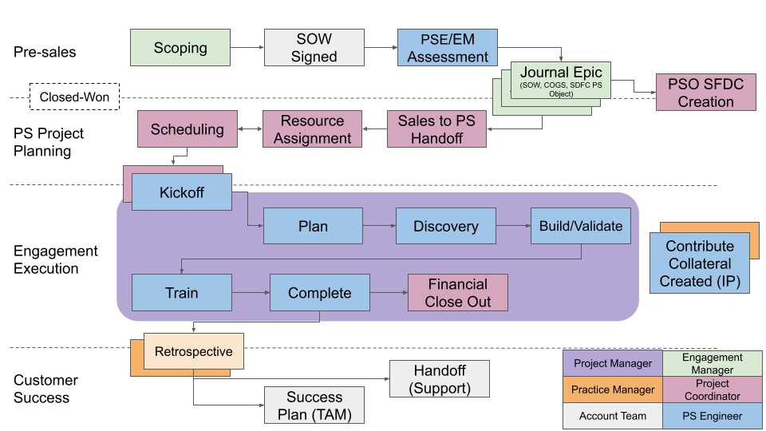

---

title: "Post-Sales"
description: "Describes the workflow governing delivery of GitLab professional service projects."
---

## Overview

The purpose of this page is to describe the workflow governing delivery of professional service projects. We will start by outlining the general workflow that is common across all service delivery categories. Then we will describe the differences for engagements that do not fit the general workflow shown below.

[Source](https://docs.google.com/presentation/d/1TOI2aoseBoyWYQC6-xpJVMknEncCNreSFfMvOHO7EBA/edit?usp=sharing),  internal only

<!---Update this below
GitLab professional services employs three different workflows that control projects for the following categories:  standard professional services, education, and dedicated engineers.  Each of these categories have unique attributes that warrant a different approach.--->

## 1. Pre-sales

_Note: for presales scoping and SOW signature, see the [pre-sales methodology page](https://about.gitlab.com/handbook/customer-success/professional-services-engineering/processes/pre-sales-methodology)*

### PS/EM Assessment

**TODO: Add content about what happens in this step**

## 2. PS Project Planning

### Resource Assignment

Resource assignment happens only after the SOW is received with Customer signature. The Sr. PS Operations team identifies delivery resources based on the needs of the engagement.

### Sales to PS Handoff

The Project Coordinator will schedule a handoff call with the account team (SAE/AE, SA, CSM), the EM who scoped the engagement, and the delivery team (PM, PSE, Trainer, Training Coordinator). The meeting will start with the EM and account team describing the customers high-level goals, current state, and desired business outcomes. The Account team should note what the growth potential is for this customer and their strategic plan to drive that growth. These topics give the context about the customer to the delivery team to understand where there might be follow on opportunities.

The EM will discuss in more detail the details of the engagement. The Delivery team will ask clarifying questions for what is in scope and what is out of scope. The PMs will review where the project definition document is stored, which is usually in the [Active Projects](https://drive.google.com/drive/u/0/folders/1ozPKiAlUzbKwpkscaYVTp9PVoi9hWm4U) folder under the Customer project.

**TODO: Add or link to content about what happens in this step. E.g. List link to the skills matrix,  Show example of skills requirements breakdown that come from a scoping issue, Link to the appropriate PS Operations handbook page to show the process in mavenlink**.

### Scheduling

The Professional Services (PS) team scheduling is processed through the Sr. PS Project Coordinator (PC).  Our PSA sytem calendar is our single source of truth for scheduing our customer and internal projects.  

Follow these steps to schedule a customer engagement.

Submit a Resource Request through Mavenlink with the following details:

- Role
- Dates to be worked
- Hours requested
- Soft or Hard allocation

The PC will review the master planning for availability and procecss the resource request.  If there is a schedule conflict the PC will provide another set of project dates.

Scheduling updates and changes follow this same process with a resource request in Mavenlink.

If a customer project has not booked, but planning/scheduling discussions need to take place, reach out to the PC to review.

#### How to schedule internal time

There are 2 project that track internal time, Creditable and Non Creditable.  If hours need to be scheduled for the projects, a comment in the project activity and mention the PC:

- Requested Dates
- Hours requested
- Task assignment
- Soft or Hard allocation

## 3. Engagement Execution

#### Kickoff

See the details in the Project workflow section of the [PS Project Management](https://about.gitlab.com/handbook/customer-success/professional-services-engineering/project-mgmt/) page.

### Plan

**TODO: Add content about what happens in this step**

### Discovery

During discovery or fact finding sessions with the customer, PSEs will often have a predefined list of questions that need to be answered to to ensure we're designing and building the appropriate solution given customer constraints and requirements. It is good practice to send these question to the customer prior to the discovery call so they can be prepared for the discussion.

During the call, take notes to ensure that things that have validated or invalidated your initial assumptions have been captured. At the end of the meeting, review the things you've learned to memorialize what will be designed and built. Reiterating back your understanding of the details of the agreement instills confidence in the customer representative that we understand their requirements and can deliver what was reviewed.

After the meeting, based on meeting notes, create issues in the gitlab.com customer collaboration project outlining the work. Include Consider using a simple template with `Overview`, `Open Questions`, `Tasks`, and `Acceptance Criteria`. These can be helpful in further memorializing the scope of work with the customer and getting asynchronous feedback to open questions. Make sure the `overview` is as detailed as possible, and the `tasks` section has build-to level tasks (e.g. update congregate list() function to include data from CI sources).

### Build/Validate

The build validation step is a bit vague on purpose because it depends on what was included in the scope of the engagement. The PSE can use the [delivery kits mapped to our service offerings](https://about.gitlab.com/handbook/customer-success/professional-services-engineering/framework/#service-offering-framework) which include templatized discovery documents, automation software to facilitate service delivery, and templatized deliverable documents. Most of the collateral will be modified and updated right from the delivery kits so this section is intentionally light on detail.

### Train

PSEs or Technical Instructors who deliver GitLab Education Services instructor-led courses can use the following workflow to ensure smooth interactions with customers. In addition, PSEs and Technical Instructors should complete these [GitLab Certified Trainer](https://about.gitlab.com/handbook/customer-success/professional-services-engineering/gitlab-certified-trainer-process/) steps for each course they are scheduled to deliver.

#### Preparation steps

1. The Project Coordinator will contact the customer with a "Welcome to Education Services Email" to initiate the training scheduling.  After the training dates and times are confirmed, the Project Coordinator will schedule a training session planning meeting. Trainer participation in this meeting is recommended -- please let the Project Coordinator know if you need the meeting to be rescheduled to ensure your attendance.

1. The Project Coordinator will use these [email communication templates](https://docs.google.com/document/d/1rJ9q9gEzsumRxDhoWEe45u70efmKA0eWNg69WONuCYs/edit?usp=sharing) to ensure communication of the key details with the customer and training participants.

1. During the training planning meeting, be sure to discuss and document all of the event logistics listed in the [Training Event Plan Template](https://docs.google.com/document/d/1huNauyfhFPvLCuo-9T7Ol3FtBDYowYxiP_T5ItP2FN4/edit?usp=sharing). The Project Coordinator will create a draft of the Training Event Plan prior to the meeting and update the document during the training planning meeting.  
   - During the training planning meeting, the course outline and system requirements pages below are useful to use to review training logistics, topics, teleconferencing, and system requirements.  
      - [GitLab with Git Basics course outline](https://about.gitlab.com/services/education/gitlab-basics/)  
      - [GitLab CI/CD course course outline](https://about.gitlab.com/services/education/gitlab-ci/)  
      - [GitLab for Project Managers course outline](https://about.gitlab.com/services/education/pm/)  
      - [GitLab Security Essentials course outline](https://about.gitlab.com/services/education/security-essentials/)  
      - [GitLab System Administration course outline](https://about.gitlab.com/services/education/admin/)  
      - [System Requirements](https://about.gitlab.com/services/education/prereq/)  

1. The Project Coordinator will set up a Zoom Meeting or Webinar session for each session using [these set up instructions](https://about.gitlab.com/handbook/customer-success/professional-services-engineering/remote-training-session-setup/) and add the registration link(s) to the issue. You will receive an email message with your unique link to join the Zoom Meeting or Webinar session. Make sure to locate the Zoom information within the email message and familiarize yourself with the Zoom functionality. Here is a useful Zoom article for [Managing Attendees and Panelists in a Webinar](https://support.zoom.us/hc/en-us/articles/115004834466-Managing-attendees-and-panelists-in-a-webinar). Depending on your Zoom set up, you may want to log into https://zoom.us, go to Join a Meeting, and enter the meeting ID/webinar ID to start the Zoom session.

1. At least 2 weeks prior to the training session, the Project Coordinator will email the session registration link(s) to the customer, asking them to send the link(s) to each of the employees whom they want to attend the session(s). When each person registers, they will receive an automated confirmation email with a Zoom Meeting or Webinar join link unique to each person, along with a link to add the session to their calendar.

1. The Project Coordinator will advise if a different teleconferencing system is being used for the training and provide additional details for accessing the teleconferencing meeting.

1. Contact the GitLab Education Services team to confirm you have the latest versions of course slides and other materials.

1. Review the train-the-trainer (T3) video for the course you are delivering.

1. Review and follow the [Instructor Pre-Training Checklist](https://about.gitlab.com/handbook/customer-success/professional-services-engineering/processes/delivery-checklists/) to ensure that you are properly prepared for your delivery.

1. Review, practice, and use these [PS Remote Training Tips and Tricks](https://about.gitlab.com/handbook/customer-success/professional-services-engineering/remote-training-tips/).

1. Complete the GitLab Training Lab set up steps below. Make sure that you review the lab exercises and ensure that the labs are working properly prior to the first day of class.

1. When it's time to join the teleconferencing as a presenter, use the provided information to join the session.

##### Training lab pre-course instructor workflow

PS uses the [GitLab Demo Cloud](http://gitlabdemo.com/) as the standard environment for hands-on course lab activities and hands-on certification assessments. Follow these steps to set up your course attendees for lab access.

**1. GitLab Demo System invitation codes**
1. The Project Coordinator will generate the invitation code for your class and provide the invitation code information approximately a week prior to your class start date as part of the instructor friendly reminders post within your Kantata project.
1. Follow the instructions on the [Demo System Invitation Code Redemption handbook page](https://about.gitlab.com/handbook/customer-success/demo-systems/#invitation-code-redemption) to redeem the invitation code and access the lab environment.
1. For any edits/extensions/etc or any custom redemption rules (different durations than our standards), contact the GitLab Professional Services Operations team for assistance.

**2. Share the invitation code and access instructions with attendees**:
1. On the first day of class, share the invitation code and review the login process with the attendees. Also let them know the expiration date (which is 7 days from the date they generate the login).

#### Training Closeout

1. Review the [Instructor Post-Training Checklist](https://about.gitlab.com/handbook/customer-success/professional-services-engineering/processes/delivery-checklists/) to ensure that you have followed all of the steps to close out your training class.
1. The Project Coordinator will download the attendance report and send a close out email to the customer using an email template located in the [email communication templates](https://docs.google.com/document/d/1rJ9q9gEzsumRxDhoWEe45u70efmKA0eWNg69WONuCYs/edit?usp=sharing).

### Complete

For blended engagements, see the `Deploy & Close` section of our [project management page])(/handbook/customer-success/professional-services-engineering/project-mgmt/#project-workflow)

### Financial Closeout

**TODO: Add or link to content about what happens in this step**

## 4. Customer Success

### Retrospective

The project manager should schedule a retrospective at the end of the project. Invite the accout team (SAE, AE, CSM, SA), the delivery team (PSEs, trainers, Project Coordinators), Engagement Manager who scoped the engagement, and PS Leadership team.

The [Retrospective TEMPLATE](https://docs.google.com/document/d/1CXfnCzjF_hwapy0R-89txiFUmSmvX7jvlEqWn48zN8A/edit#heading=h.yqd5ghhhm2lh) can be used to capture notes during the meeting.

The Retrospective meeting should be run by someone that is not intimately familiar with the execution of the project (typically PS Practice Manager or Engagement Manager). During the meeting, encourage contributions into the notes doc in real time and offer for participants to verbalize their feedback.

Toward the end of the call, gather actions and assign owners to complete those actions.

### Project Go-live/Recap Document

At the end of a project the Project leader should document the customer value drives/positive business outcomes they were looking to accomplish, what PS delivered to help them accelerate their journey, and special thanks to the project team. A [template of this write up](https://docs.google.com/document/d/1U0rOXcSEsBFRITQzIKopIspkrldl804PK08cU4onoUU/edit#) be found in the PMO templates Google Drive folder. An example can be found [here](https://docs.google.com/document/d/1ltSU_2UBKovVE6y6MxG2aKImsnIwicbYjCBS385Zx0A/edit#heading=h.huf1p7y95gl9).

### Success Plan (CSM)

**TODO: Add or link to content about what happens in this step**

### Handoff (Support)

At the end of a small/medium sized projects or after the initial implementation phase of a large engagement, open a [support ops issue](https://gitlab.com/gitlab-com/support/support-ops/zendesk-global/organizations/-/issues/new) and add a link to the collaboration project architecture diagram that was deployed. The Support team will load it into a field in Zendesk to help them have context for customer support requests.
