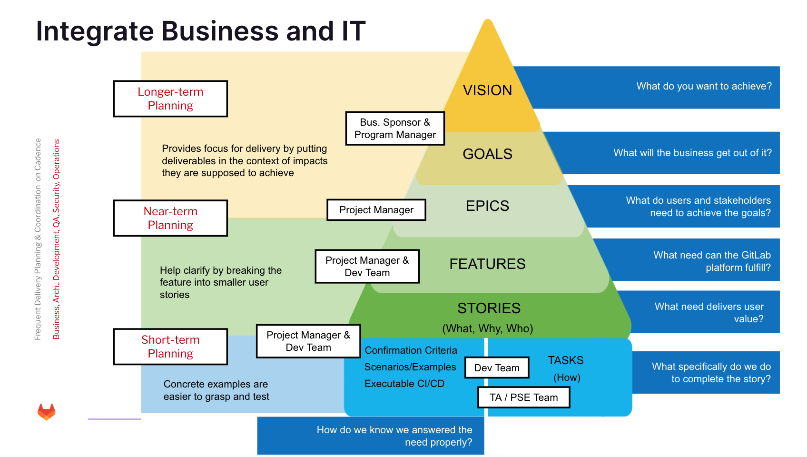
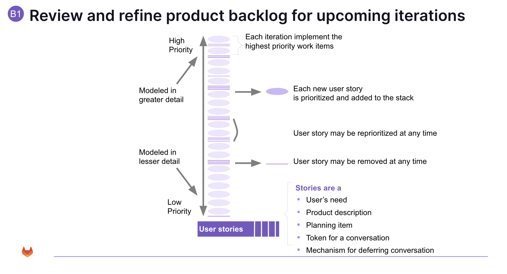

One of the most frequent challenges in Agile implementation teams is with the proactive management of their Product and Sprint Backlogs.

Teams struggle with the process of creating good backlogs, maintaining relevant information in backlogs, and regularly refining them.

The problem arises from a combination of issues such as:

* The Program Manager / Project Manager being overwhelmed or spread too thin
* The lack of a clear **vision** that translates into a product roadmap
* The lack of a product **roadmap** that translates into clearly expressed **release goals**
* Insufficient tools expertise or lack of understanding Agile best practices
* Problems estimating the backlogs in time

The following picture shows how these things are strongly related:

refi

## Prerequisites

To reiterate some of the basic preconditions that have to be met in order to effectively manage the Product and Sprint Backlogs, they are:

1. [Good user stories](../good-user-stories/_index.md)

2. [Good estimation techniques](../good-estimation-techniques/_index.md)

3. 1 and 2 result in the ability to perform [effective release planning](../release-and-engagement-planning/_index.md)

**_Without good user stories and applying good estimation techniques, the product and sprint backlogs become less useful and will ultimately prevent the Agile / Scrum process from becoming predictable._**

The Program Manager / Project Manager provides strategy and direction for the project, which means he/she is responsible for providing the vision, product roadmap, release goals, sprint goal. The Program Manager / Project Manager is expected to insert, re-prioritize, refine, or delete items from the product backlog; this can happen any time until the sprint scope is defined and committed to by the development team.

[Sizing and estimation](../good-estimation-techniques/_index.md) of the product backlog usually occurs in sprint planning meetings or at regularly intervals during ongoing sprints. Depending on how fast the Program Manager / Project Manager adds user stories, more frequent, maybe even daily estimation sessions might be needed. The GitLab Implementation Team and the Customer Development Team and Program Manager / Project Manager must work together to estimate the backlog items, may that be in sprint planning meetings or during ongoing regular sessions.

The important point here is that product backlog items need to get estimated continuously in order to avoid the big bang estimation effort at one critical juncture of the effort. The frequency of the estimation effort is depending on your engagement development effort. This has the added benefit of exposing the entire team to the Program Manager / Project Managers' thinking, keeping everybody in sync and with an improved understanding of requested product features and functionality.

Sprint Planning meetings or more frequent estimation session need to follow established Agile Estimation best practices, meaning Product Backlog Items are estimated using either Estimation Poker or T-Shirt sizing.

The Program Manager / Project Manager is responsible for initiating requirements, creating user stories, and exerting scope control.

The GitLab Implementation Team and the Customer Development Team are responsible for estimating the backlog in close collaboration with the Program Manager / Project Manager. This is a team effort and it is critical that GitLab and Customer team members agree on scope.

The Program Manager / Project Manager communicates with stakeholders to determine the priorities and constantly refines the backlog.

In GitLab, there are dynamically generated issue lists which users can view to track their backlog. Labels can be created and assigned to individual issues, which then allows you to filter the issue lists by a single label or multiple labels. This allows for further flexibility. Priority labels can be used to also order the issues in those lists. See "[How to Use CPR to Manage Engagements](../cpr/_index.md)" for more information.

## Product – Release – Sprint Backlogs

Many efforts require you to manage three backlogs:

1. The **Product Backlog**, which essentially is the requirements database for the engagement, expressed in user story format – exists for the lifetime of the engagement
2. The **Release Backlog**, which is the subset of functionality that will have to be delivered in a specific release (consisting of a set of sprints), according to the product roadmap and release plan – active for a specific release
3. The **Sprint Backlog**, which represents the work to be done for the upcoming sprint – active for the sprint duration

{width="767" height="518"}

Labels can be used to tag user stories / issues.

{width="330" height="45"}

Using such tagging lets you easily view relevant information about the specific user story and what state it is in.

Usually the next upcoming sprint is sized and estimated in detail using Estimation Poker, with the following two to three sprints and their contents being sized and estimated using either Estimation Poker or T-Shirt Sizing. Remember that once a sprint is committed to by the team, the scope should not change any longer as you are "in-flight" - changing stories "in-flight" causes unnecessary context switching, which is costly in terms of productivity. Future sprints can still be adjusted and items can be reshuffled as the Product Owner and Development Team agree on.

{width="767" height="518"}

{width="753" height="251"}

Product Backlog Items and Sprint Backlog Items may contain more than just user stories, but regardless what exactly is in the specific backlog, it is supposed to represents all work items that consume team capacity. This includes the actual user story describing the engagement feature to be implemented, defects, research, and other technical tasks.

Remember that the Sprint Backlog is supposed to be the most precise and fleshed out backlog due to its immediacy to actual delivery of a working product increment:

* Consists of committed Product Backlog Items negotiated between the team and the Product Owner during the Sprint Planning Meeting
* Scope commitment is fixed during Sprint Execution
* Initial tasks are identified by the team during Sprint Planning Meeting
* Team will discover additional tasks needed to meet the fixed scope commitment during Sprint execution
* Visible to the team
* Referenced during the Daily Scrum Meeting
* Used to measure Sprint Acceptance by the Program Manager / Project Manager based on the [Definition of Done](../definition-of-done/_index.md)

## Backlogs are the Fulcrum of Agile / Scrum

"Garbage in, garbage out", in the case of Agile backlogs, it is true.

The single most important artifact impacting the delivery success of the current sprint is the Sprint Backlog.

The single most important artifact impacting the success or failure of your engagement / project is your Product Backlog.

Agile is a simple process, with 6 roles, 5 events, and 9 artifacts.

Only 8 artifacts are shown above - the working system left behind is implicitly considered the 9th.

Backlogs hold the essence of what needs to get implemented, and as such need to be created, maintained and groomed with great care.

Unless the Program Manager / Project Manager, the GitLab Implementation Team and the Customer Development Team focus on keeping backlogs up to date and well refined, the Agile process will not be able to deliver what is most important to organizations: **Predictability**.

## Common Issues and Challenges

The section addresses some common issues and challenges that make managing product and sprint backlogs more difficult than it has to be.

## Poorly Written User Stories

User stories should follow the INVEST principle. They should be:

* Independent (to the degree possible, user stories should not rely on other user stories to be implemented)
* Negotiable
* Valuable (meaning they are feature focused, not task oriented, and are written in the user's language to the extent possible; where domain specific language is required, such as in genomics or medicine, a subject matter expert will have to be available)
* Estimable
* Small (half a Sprint or less for one Dev Team member)
* Testable (needs to have acceptance criteria and not be subjective)

The testability of a user story is usually documented in the form of Acceptance Criteria and lists pass/fail testable conditions that help us verify if the user story is implemented as intended.

All sounds simple enough, but frequently teams and Program Manager / Project Manager really struggle with writing good user stories, and 90% of all problems encountered are **based on user stories being too big**.

When a user story is too big, it is hard understand, estimate, implement, and prone to wildly different opinions. So what is a good size for a user story? Basic guidance is that the user stories at the top of the product backlog (the ones that should have sufficient specificity in order to be worked on by a developer) should be sized such that a team member could easily complete two user stories during a sprint.

[Good user stories](../good-user-stories/_index.md) are the basis for good backlogs.

## Rapid Requirements Inflow

Sometimes the Program Manager / Project Manager might start adding user stories to the backlog far faster than the Development Team can estimate the effort.

Or, the Program Manager / Project Manager, out of desperation because the Implementation and Development Teams are busy with implementation tasks, starts estimating the effort himself/herself, without the technical teams being involved. This is a bad idea!

One of the core Agile principles is that "business people and developers must work together daily", as such the Program Manager / Project Manager cannot simply hand over user stories to the technical teams as it defeats the purpose of jointly understanding and estimating user stories.

If the inflow of requirements outpaces the teams' ability to understand the requirements in detail and estimate them accordingly, the best course of action is to set up additional backlog refinement sessions to get things back on course.

## Fantasy Wish List

The backlogs need to contain user stories that are relevant to GitLab, the engagement, the release, and the sprints. Cluttering the backlogs with fantasy requirements that do not directly contribute to the engagement, release, or sprint goals is counterproductive.

Such wish list items need to be kept separate and managed outside of the backlogs, until such requirements become tangible goals at the engagement, release or sprint level. Providing a label such as "Future" allows project participants to log desired issues while keeping them out of the actionable sprint scopes.

## Backlogs = Requirements Specifications

Especially during Agile Transformation / Adoption efforts, teams often times deal with a long tail of old artifacts available from previous software development methodologies.

For example, customers might have many UML diagrams, functional or technical requirements specifications, etc. Why not put them to good use and just make them part of the user stories?

The reason not to do this is because specification have the side effect of shutting down discussions, as in "this is the specification we need to implement, nothing more, nothing less" – essentially specification hinder the discover of newly emerging requirements.

However, this is not to say that once a user story is well understood by the team, you will never, ever, write a technical specification document in order to document the implementation.

## Unavailable Program Manager / Project Manager

One of the most common challenges with Program Manager / Project Manager is their lack of availability to work with the GitLab Implementation and Customer Development Team. Program Manager / Project Manager are enablers, making the technical teams more productive – or less!

Without an available Program Manager / Project Manager, the technical teams will get stuck – this might manifest itself either in sprint goals not being met, in poor quality, low velocity, lack of stakeholder management, delayed status reports, etc.

## Lack of Backlog Refinement

There really is no excuse not to regularly refine and [estimate your backlog](../good-estimation-techniques/). As mentioned before, if for whatever reason your backlog is not being refined, the best course of action is to set up additional backlog grooming sessions to get things back on course.
