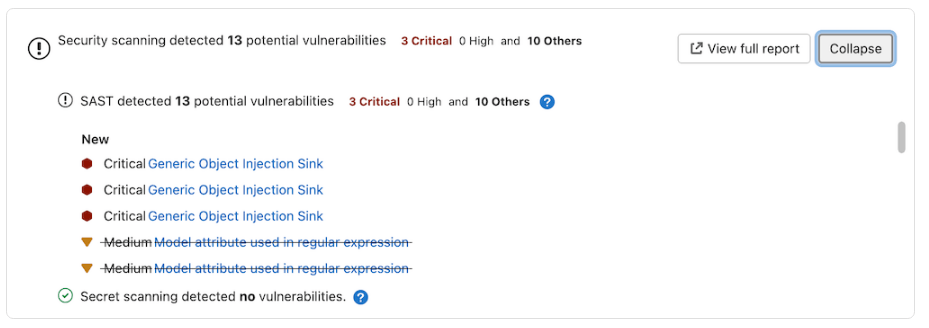
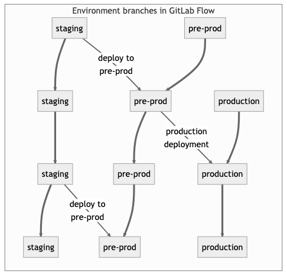
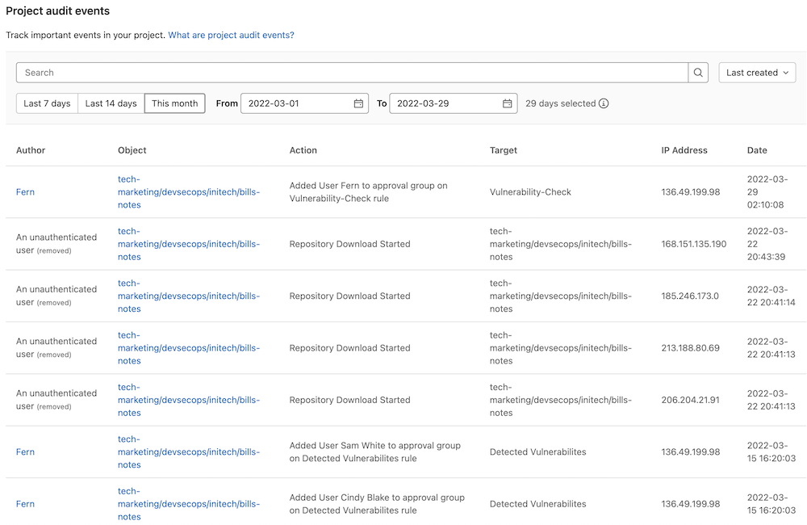
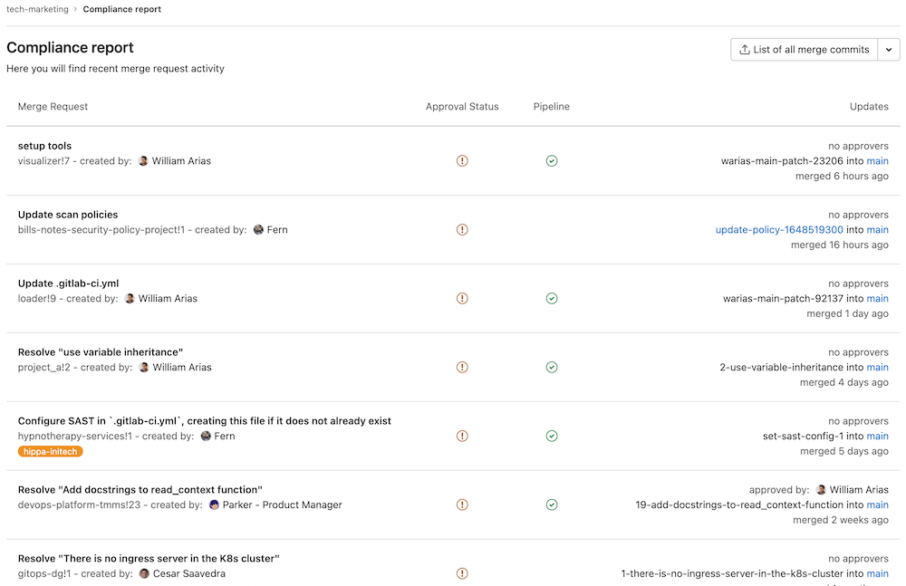

This section provides a comprehensive overview of best practices in Gitlab, highlighting key guidelines for efficient and effective usage. 

The documentation provides recommendations based on standards defined by the **National security agency \[NSA\]** along with **Cybersecurity and Infrastructure Security Agency \[CISA\]** for organizations to standardize and strengthen the security of their CI/CD pipelines. 

This [article](https://www.cisa.gov/news-events/alerts/2023/06/28/cisa-and-nsa-release-joint-guidance-defending-continuous-integrationcontinuous-delivery-cicd) can be referred to for relevant information on the defined standards.

## 1. Use feature branches rather than direct commits on the main branch

Using feature branches is a simple way to develop and keep the [source code](https://about.gitlab.com/stages-devops-lifecycle/source-code-management/) clean. If a team has recently transitioned to Git from SVN, for example, they'll be used to a trunk-based workflow. When using Git, developers should create a branch for anything they're working on so that contributors can easily start the [code review process](https://about.gitlab.com/topics/version-control/what-is-code-review/) before merging.

## 2. Test all commits, not only ones on the main branch

Some developers set up their CI to only test what has been merged into the main branch, but this is too late in the software development life cycle, and everyone - from developers to product managers - should feel confident that the main branch always has green tests. It's inefficient for developers to have to test main before they start developing new features.

Include [Application security](https://docs.gitlab.com/ee/user/application_security/) scans like SAST, Secret Detection, Dependency Scanning, Container Scanning etc in the feature branches for each commit

## 3. Run every test on all commits. (If tests run longer than 5 minutes, they can run in parallel)

When working on a feature branch and adding new commits, run tests right away. If the tests are taking a long time, try running them in parallel. Do this server-side in merge requests, running the complete test suite. If there is a test suite for development and another only for new versions, it's worthwhile to set up \[parallel\] tests and run them all.

You can also have these [displayed in each Merge Request](https://docs.gitlab.com/ee/user/application_security/#view-security-scan-information-in-merge-requests).

{width="624" height="220"}

## 4. Perform code reviews before merging into the main branch

Don't test everything at the end of a week or project. Code reviews should take place as soon as possible, because developers are more likely to identify issues that could cause problems later in the life cycle. Since they'll find problems earlier, they'll have an easier time creating solutions.

### GitLab code review workflow

The GitLab code review workflow is simple.

1. Push your changes to GitLab using a terminal or the GitLab interface,
2. Open a merge request from your terminal or the GitLab interface,
3. Request reviewers to approve your merge request,
4. (optional) If you have set up CI/CD automation, wait for the green light before merging,
5. Reviewers will approve your merge request or request changes, change your code accordingly,
6. If all required reviewers have approved the merge request, you can now safely merge if there is no conflict with the base branch.

Code Review best practices:

1. A merge request should be first reviewed by a reviewer in each [category (for example: backend, database)](https://docs.gitlab.com/ee/development/code_review.html#approval-guidelines) the MR touches, as maintainers may not have the relevant domain knowledge. This also helps to spread the workload. Add approval rules for each Code review. For example: 
   1. Backend approvers
   2. Frontend approvers
   3. Database approvers
   4. Documentation
   5. Etc
2. For assistance with security scans or comments, include the Application Security Team 
3. The reviewers use the [reviewer functionality](https://docs.gitlab.com/ee/user/project/merge_requests/reviews/index.html) in the sidebar. Reviewers can add their approval by [approving additionally](https://docs.gitlab.com/ee/user/project/merge_requests/approvals/index.html#approve-a-merge-request).
4. Depending on the areas your merge request touches, it must be approved by one or more [maintainers](/handbook/engineering/workflow/code-review/#maintainer). The Approved button is in the merge request widget.
5. Getting your merge request merged also requires a maintainer. If it requires more than one approval, the last maintainer to review and approve merges it.
6. Using [labels](https://docs.gitlab.com/ee/user/project/labels.html) in MR helps to identify the present status of the MR whether it is in code-review/work in-progress or anything else.
7. Below are some tips and guidelines to follow

### Having your merge request reviewed

Please keep in mind that code review is a process that can take multiple iterations, and reviewers may spot things later that they may not have seen the first time.

* The first reviewer of your code is you. Before you perform that first push of your shiny new branch, read through the entire diff. Does it make sense? Did you include something unrelated to the overall purpose of the changes? Did you forget to remove any debugging code?
* Write a detailed description as outlined in the [merge request guidelines](https://docs.gitlab.com/ee/development/contributing/merge_request_workflow.html#merge-request-guidelines-for-contributors). Some reviewers may not be familiar with the product feature or area of the codebase. Thorough descriptions help all reviewers understand your request and test effectively.
* If you know your change depends on another being merged first, note it in the description and set a [merge request dependency](https://docs.gitlab.com/ee/user/project/merge_requests/dependencies.html).
* Be grateful for the reviewer's suggestions. ("Good call. I'll make that change.")
* Don't take it personally. The review is of the code, not of you.
* Explain why the code exists. ("It's like that because of these reasons. Would it be more clear if I rename this class/file/method/variable?")
* Extract unrelated changes and refactorings into future merge requests/issues.
* Seek to understand the reviewer's perspective.
* Try to respond to every comment.
* The merge request author resolves only the threads they have fully addressed. If there's an open reply, an open thread, a suggestion, a question, or anything else, the thread should be left to be resolved by the reviewer.
* It should not be assumed that all feedback requires their recommended changes to be incorporated into the MR before it is merged. It is a judgment call by the MR author and the reviewer as to if this is required, or if a follow-up issue should be created to address the feedback in the future after the MR in question is merged.
* Push commits based on earlier rounds of feedback as isolated commits to the branch. Do not squash until the branch is ready to merge. Reviewers should be able to read individual updates based on their earlier feedback.
* Request a new review from the reviewer once you are ready for another round of review. If you do not have the ability to request a review, @ mention the reviewer instead.

### Requesting a review

* When you are ready to have your merge request reviewed, you should [request an initial review](https://docs.gitlab.com/ee/user/project/merge_requests/reviews/index.html) by selecting a reviewer based on the [approval guidelines](https://docs.gitlab.com/ee/development/code_review.html#approval-guidelines).
* When a merge request has multiple areas for review, it is recommended you specify which area a reviewer should be reviewing, and at which stage (first or second). This will help team members who qualify as a reviewer for multiple areas to know which area they're being requested to review. For example, when a merge request has both backend and frontend concerns, you can mention the reviewer in this manner: @John_doe can you please review \~backend? or @Jane_Doe - could you please give this MR a \~frontend maintainer review?
* You can also use workflow::ready for review label. That means that your merge request is ready to be reviewed and any reviewer can pick it. It is recommended to use that label only if there isn't time pressure and make sure the merge request is assigned to a reviewer.
* When your merge request receives an approval from the first reviewer it can be passed to a maintainer. You should default to choosing a maintainer with [domain expertise](https://docs.gitlab.com/ee/development/code_review.html#domain-experts), and otherwise follow the Reviewer Roulette recommendation or use the label ready for merge.
* Sometimes, a maintainer may not be available for review. They could be out of the office or [at capacity](/handbook/engineering/workflow/code-review/#review-response-slo). You can and should check the maintainer's availability in their profile. If the maintainer recommended by the roulette is not available, choose someone else from that list.
* It is the responsibility of the author for the merge request to be reviewed. If it stays in the ready for review state too long it is recommended to request a review from a specific reviewer.

### Reviewing a merge request

Understand why the change is necessary (fixes a bug, improves the user experience, refactors the existing code). Then:

* Try to be thorough in your reviews to reduce the number of iterations.
* Communicate which ideas you feel strongly about and those you don't.
* Identify ways to simplify the code while still solving the problem.
* Offer alternative implementations, but assume the author already considered them. ("What do you think about using a custom validator here?")
* Seek to understand the author's perspective.
* Check out the branch, and test the changes locally. You can decide how much manual testing you want to perform. Your testing might result in opportunities to add automated tests.
* If you don't understand a piece of code, say so. There's a good chance someone else would be confused by it as well.
* Ensure the author is clear on what is required from them to address/resolve the suggestion.
  * Consider using the [Conventional Comment format](https://conventionalcomments.org/#format) to convey your intent.
  * For non-mandatory suggestions, decorate with (non-blocking) so the author knows they can optionally resolve within the merge request or follow-up at a later stage.
  * There's a [Chrome/Firefox add-on](https://gitlab.com/conventionalcomments/conventional-comments-button) which you can use to apply [Conventional Comment](https://conventionalcomments.org/) prefixes.
* Ensure there are no open dependencies. Check [linked issues](https://docs.gitlab.com/ee/user/project/issues/related_issues.html) for blockers. Clarify with the authors if necessary. If blocked by one or more open MRs, set an [MR dependency](https://docs.gitlab.com/ee/user/project/merge_requests/dependencies.html).
* After a round of line notes, it can be helpful to post a summary note such as "Looks good to me", or "Just a couple things to address."
* Let the author know if changes are required following your review.

If the merge request is from a fork, also check the [additional guidelines for community contributions](https://docs.gitlab.com/ee/development/code_review.html#community-contributions).

### Merging a merge request

Before taking the decision to merge:

* Set the milestone.
* Confirm that the correct [MR type label](https://docs.gitlab.com/ee/development/labels/index.html#type-labels) is applied.
* Consider warnings and errors from danger bot, code quality, and other reports. Unless a strong case can be made for the violation, these should be resolved before merging. A comment must be posted if the MR is merged with any failed job.
* If the MR contains both Quality and non-Quality-related changes, the MR should be merged by the relevant maintainer for user-facing changes (backend, frontend, or database) after the Quality related changes are approved by a Software Engineer in Test.

At least one maintainer must approve an MR before it can be merged. MR authors and people who add commits to an MR are not authorized to approve the MR and must seek a maintainer who has not contributed to the MR to approve it. In general, the final required approver should merge the MR.

Scenarios in which the final approver might not merge an MR:

* Approver forgets to set auto-merge after approving.
* Approver doesn't realize that they are the final approver.
* Approver sets auto-merge but it is un-set by GitLab.

If any of these scenarios occurs, an MR author may merge their own MR if it has all required approvals and they have merge rights to the repository. This is also in line with the GitLab [bias for action](../../../../../values/_index.md#operate-with-a-bias-for-action) value.

This policy is in place to satisfy the CHG-04 control of the GitLab [Change Management Controls](/handbook/security/change-management-policy.html).

To implement this policy in gitlab-org/gitlab, we have enabled the following settings to ensure MRs get an approval from a top-level CODEOWNERS maintainer:

* [Prevent approval by author](https://docs.gitlab.com/ee/user/project/merge_requests/approvals/settings.html#prevent-approval-by-author).
* [Prevent approvals by users who add commits](https://docs.gitlab.com/ee/user/project/merge_requests/approvals/settings.html#prevent-approvals-by-users-who-add-commits).
* [Prevent editing approval rules in merge requests](https://docs.gitlab.com/ee/user/project/merge_requests/approvals/settings.html#prevent-editing-approval-rules-in-merge-requests).
* [Remove all approvals when commits are added to the source branch](https://docs.gitlab.com/ee/user/project/merge_requests/approvals/settings.html#remove-all-approvals-when-commits-are-added-to-the-source-branch).

To update the code owners in the CODEOWNERS file for gitlab-org/gitlab, follow the process explained in the [code owners approvals handbook section](/handbook/engineering/workflow/code-review/#code-owner-approvals).

Some actions, such as rebasing locally or applying suggestions, are considered the same as adding a commit and could reset existing approvals. Approvals are not removed when rebasing from the UI or with the [/rebase quick action](https://docs.gitlab.com/ee/user/project/quick_actions.html).

#### **When ready to merge:**

* Consider using the [Squash and merge](https://docs.gitlab.com/ee/user/project/merge_requests/squash_and_merge.html#squash-and-merge) feature when the merge request has a lot of commits. When merging code, a maintainer should only use the squash feature if the author has already set this option, or if the merge request clearly contains a messy commit history, it will be more efficient to squash commits instead of circling back with the author about that. Otherwise, if the MR only has a few commits, we'll be respecting the author's setting by not squashing them.
* Go to the merge request's Pipelines tab, and select Run pipeline. Then, on the Overview tab, enable Auto-merge. Note that:
  * If [the default branch is broken](/handbook/engineering/workflow/#broken-master), do not merge the merge request except for [very specific cases](/handbook/engineering/workflow/#criteria-for-merging-during-broken-master). For other cases, follow these [handbook instructions](/handbook/engineering/workflow/#merging-during-broken-master).
  * If the latest pipeline was created before the merge request was approved, start a new pipeline to ensure that the full RSpec suite has been run. You may skip this step only if the merge request does not contain any backend change.
  * If the latest [merged results pipeline](https://docs.gitlab.com/ee/ci/pipelines/merged_results_pipelines.html) was created less than 6 hours ago, and finished less than 2 hours ago, you may merge without starting a new pipeline as the merge request is close enough to main.
* When you set the MR to auto-merge, you should take over subsequent revisions for anything that would be spotted after that.
* For merge requests that have had [Squash and merge](https://docs.gitlab.com/ee/user/project/merge_requests/squash_and_merge.html#squash-and-merge) set, the squashed commit's default commit message is taken from the merge request title. You're encouraged to [select a commit with a more informative commit message](https://docs.gitlab.com/ee/user/project/merge_requests/squash_and_merge.html) before merging.

Thanks to merged results pipelines, authors no longer have to rebase their branch as frequently anymore (only when there are conflicts) because the Merge Results Pipeline already incorporates the latest changes from main. This results in faster review/merge cycles because maintainers don't have to ask for a final rebase: instead, they only have to start a MR pipeline and set auto-merge. This step brings us very close to the actual Merge Trains feature by testing the Merge Results against the latest main at the time of the pipeline creation.

## 5. Deployments are automatic based on branches or tags

If developers don't want to deploy main every time, they can create a production branch. Rather than using a script or doing it manually, teams can use automation or have a specific branch that triggers a [production deploy](https://docs.gitlab.com/ee/ci/yaml/#environment).

## 6. Tags are set by the user, not by CI

Developers should use [tags](https://docs.gitlab.com/ee/user/project/repository/tags/) so that the CI will perform an action rather than having the CI change the repository. 

## 7. Releases are based on tags

Each tag should create a new [release](https://docs.gitlab.com/ee/user/project/releases/). This practice ensures a clean, efficient development environment.

## 8. Pushed commits are never rebased

When pushing to a public branch, developers shouldn't rebase it, because that makes it difficult to identify the improvement and test results, while [cherry picking](https://git-scm.com/docs/git-cherry-pick). Sometimes this tip can be ignored when asking someone to squash and rebase at the end of a code review process to make something easier to revert. However, in general, the guideline is: Code should be clean, and history should be realistic.

## 9. Everyone starts from main and targets main

This tip prevents long branches. Developers check out main, build a feature, create a merge request, and target main again. They should do a complete review before merging and eliminating any intermediate stages.

## 10. Fix bugs in main first and release branches second

After identifying a bug, a problematic action someone could take is fix it in the just-released version and not fix it in main. To avoid it, developers should always fix forward by pushing the change in main, then cherry-pick it into another patch-release branch.

## 11. Commit messages reflect intent

Developers should not only say what they did, but also why they did it. An even more useful tactic is to explain why this option was selected over others to help future contributors understand the development process. Writing descriptive commit messages is useful for code reviews and future development.

## 12. CI best practice: Optimize pipeline stages

[CI pipelines](https://about.gitlab.com/topics/ci-cd/cicd-pipeline/) contain jobs and stages: Jobs are the activities that happen within a particular stage, and once all jobs pass, code moves to the next stage. To get the most out of your CI pipelines, optimize stages so that failures are easy to identify and fix.

Stages are an easy way to organize similar jobs, but there may be a few jobs in your pipeline that could safely run in an earlier stage without negatively impacting your project if they fail. Consider running these jobs in an earlier stage to [speed up CI pipelines](https://about.gitlab.com/blog/2019/07/12/guide-to-ci-cd-pipelines/).

## 13. CI best practice: Test environment should mirror production

 In continuous integration, every commit triggers a build. These builds then run tests to identify if something will be broken by the code changes you introduce. The [test pyramid](https://martinfowler.com/bliki/TestPyramid.html) is a way for developers to think of how to balance testing. [End-to end testing](https://docs.gitlab.com/ee/ci/examples/end_to_end_testing_webdriverio/#what-to-test) is mostly used as a safeguard, with unit testing being used most often to identify errors. One important thing to keep in mind with testing is the environment. When the testing and production environments match, it means that developers can rely on the results and deploy with confidence.

In GitLab, [Review Apps](https://docs.gitlab.com/ee/ci/review_apps/index.html) put the new code into a production-like live environment to visualize code changes. This feature helps developers assess the impact of changes.

Continuous integration helps developers deploy faster and get feedback sooner. Ultimately, the best continuous integration system is the one you actually use. Find [the right CI](https://about.gitlab.com/topics/ci-cd/choose-continuous-integration-tool/) for your needs and then incorporate these best practices to make the most of your new CI workflow.

## 14. CI best practice: Keep it safe: CI/CD is a shift left, so it offers a good opportunity to integrate security earlier in the process

## 15. Integrations with third-party

* If JIRA is used, integrate Jira with GitLab to get timely updates on builds/branches/MRs
  * [Add a rule to add JIRA ticket in every MR commit](https://docs.gitlab.com/ee/user/project/repository/push_rules.html) 
* [Teams-GitLab integration](https://docs.gitlab.com/ee/user/project/integrations/microsoft_teams.html) to send critical notifications like
  * Prod/Pre-prod deployment failure

## 16. Protected Branches

A [protected branch](https://docs.gitlab.com/ee/user/project/repository/branches/protected.html) controls:

* Which users can merge into the branch.
* Which users can push to the branch.
* If users can force push to the branch.
* If changes to files listed in the CODEOWNERS file can be pushed directly to the branch.
* Which users can unprotect the branch.

The [default branch](https://docs.gitlab.com/ee/user/project/repository/branches/default.html) for your repository is protected by default.

## 17. Environment Branching strategies

It might be a good idea to have an [environment](https://about.gitlab.com/blog/2023/07/27/gitlab-flow-duo/) that is automatically updated to the staging branch. Only, in this case, the name of this environment might differ from the branch name. Suppose you have a staging environment, a pre-production environment, and a production environment:

{width="356" height="340"}

In this case, deploy the staging branch to your staging environment. To deploy to pre-production, create a merge request from the staging branch to the pre-prod branch. Go live by merging the pre-prod branch into the production branch. This workflow, where commits only flow downstream, ensures that everything is tested in all environments. 

## 18. Compliance frameworks

It is important for compliance teams to be confident that their controls and requirements are set up correctly, but also that they stay set up correctly. To obtain this confidence, [compliance pipelines](https://docs.gitlab.com/ee/user/group/compliance_frameworks.html) can be configured.

A compliance officer will be responsible for creating and enforcing the usage of a pipeline. We can ensure that a developer cannot change a running pipeline. This is a task that can only be performed by a compliance officer, ensuring only compliant code can be pushed without approval.

## 19. Security policies

GitLab provides Security Policies, which enable security teams to require security scans to run according to a configuration. This provides the security teams with confidence that the configured scans have not been changed or disabled.

There are two types of policies, [Scan Execution Policies](https://docs.gitlab.com/ee/user/application_security/policies/scan-execution-policies.html) and [Merge Request Approval Policies](https://docs.gitlab.com/ee/user/application_security/policies/scan-result-policies.html).

## 20. Audit Management and Compliance Dashboard

Another important part of compliance is knowing it is actually happening in your groups/projects. GitLab has Audit Events and Compliance Reports to assist with audits.

Audit Events allows GitLab owners and administrators to track important events such as who performed certain actions and the time they occurred.

{width="496" height="322"}

Audit Events records different events per group and per project, which can be seen in the [audit events](https://docs.gitlab.com/ee/administration/audit_events.html) documentation. Audit Events can be accessed by going to Security & Compliance \> Audit Events Some examples include:

* user was added to project and their permissions
* permission changes of a user assigned to a project
* project CI/CD variable added, removed, or protected status changed
* user was added to group and their permissions
* group name or path changed

Audit Events can also be sent to an HTTP endpoint using Audit Event Streaming. I show how to implement Audit Event Streaming in this [video](https://youtu.be/zHwVF9-i7e4?t=52).

Compliance Report gives you the ability to see a group's merge request activity. It provides a high-level view for all projects in the group.

{width="524" height="339"}

You can use the report to:

* get an overview of the latest merge request for each project
* see if merge requests were approved and by whom
* see merge request authors
* see the latest CI/CD pipeline result for each merge request

The Compliance Report can be accessed in the top-level group by going to Security & Compliance \> Compliance Report.

## 21. Implementation of Correct User Permissions and Roles will have below Positive effects over the entire DevOps lifecycle in GitLab

[User Permissions and Roles](https://docs.gitlab.com/ee/user/permissions.html)

* Restricting Developers 
  * To take major decisions like changing Security Policies
  * Delete Issues and MRs
  * Self Approve MRS or manage MR Approval rules
  * Adding/Manage teams members to the projects
  * Configure Webhooks
  * Edit Project settings
  * Assign/remove project from compliance framework
  * Manage Push rules
  * Turn on/off protected branches.
* Risks: Users will be leveraged to perform the above activities which can be against best practices of GitLab
