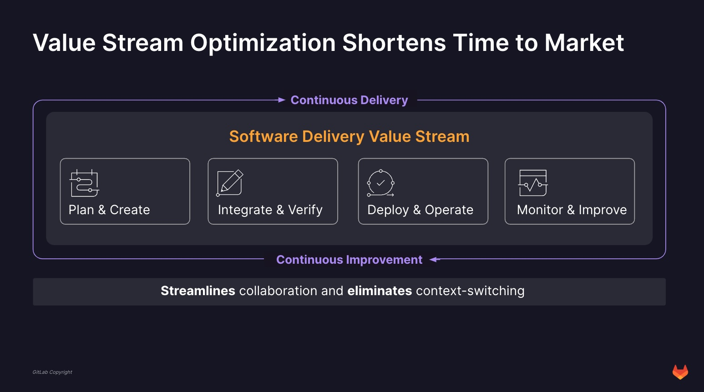

Customer success = GitLab product implementation, on time, on budget delivery of agreed upon scope, faster time to value that leads to satisfied customers that see the added value of Gitlab products and PS

.png>)

### SOW Close

Given the close collaboration between the PS Project Management and PS Operations [team functions](/handbook/customer-success/professional-services-engineering/#team-functions), please refer to the [PS Operations Wiki](https://gitlab.com/gitlab-com/customer-success/professional-services-group/ps-leadership-team/ps-operations/-/wikis/home) for details on processes related to scheduling, reporting, billing, partner processes, and more.

### Project Initiate & Plan

1. After obtaining Legal approval, PS Quote triggers an Epic in Gitlab.com around the recently sold Professional Services Project, at the [Professional Services Group](https://gitlab.com/gitlab-com/customer-success/professional-services-group) level. This _Customer Epic_ is labeled as SOW# + Customer and includes links to relevant Customer & contract information
1. Once a prosepctive Services deal reaches "Stage 5" (likely to close) or "Stage 6" (closing) in the PS Customer Journey, the PSOps team refers to the _Customer Epic_ to find the [_"Scheduling Intake" issue_](https://gitlab.com/gitlab-com/customer-success/professional-services-group/ww-consulting/ps-plan/-/blob/master/.gitlab/issue_templates/SchedulingIntakeQuestions.md?ref_type=heads). From this issue, the Resource Scheduling team works to gather the initial information needed to assign the PS Resources (PM, PSE, TA)
   * To find the right resources required, the PSOPs team will refer back to the Customer Epic to find the _"Scope Engagement and Write SoW"_ issue (managed by the Engagement Managment Team). This is where the scheduling team confirm skillsets needed, timing of the project, Project type (Time & Materials or Fixed Fee), etc.
   * This scoping issue this is where the PM's, TA's, and PSE's work to gather the initial project information, scoping breakdown, and estimated schedule
   * For [Consulting Blocks](#for-consulting-blocks-and-dedicated-engineer-projects) please see below
1. Below you can follow the steps of the Scheduling Intake process. _Note: Before the PSOPs team can begin PM assignment The Engagement Management Team must ensure Steps 1-2 are considered_ [The full checklist](https://gitlab.com/gitlab-com/customer-success/professional-services-group/ww-consulting/ps-plan/-/blob/master/.gitlab/issue_templates/SchedulingIntakeQuestions.md?ref_type=heads) is available within the Scheduling Intake Issue, found within the Customer Project Epic
   * Step 1: Customer Goal Summary - EM to provide
   * Step 2: EM/Sales defines the roles and personalities of all customer stakeholders
   * Step 3: PSops works with PMO Manager on PM assignment
   * Step 4: PM confirms information & PSops Schedules PSE
   * Step 5: Introductions - EM/AE
   * Step 6: Collaboration approach & Onboarding Gathered by PM
   * Step 7: Collaboration Space Preparation - PM
   * Step 8: Conduct Stakeholder Meeting - PM
   * Step 9: Step 9: Conduct Kickoff & Forecast Updates - PM

#### Collaboration Space Guidelines

1. Create Project in Gitlab.com using CPR (Customer Project requirements) _new steps to CPR coming soon_
   * Create sub group with customer name under [Gitlab Professional Services Group](https://gitlab.com/gitlab-com/customer-success/professional-services-group/professional-services-delivery/gitlab-professional-services) if staffed internally or [Gitlab Partner Collaboration Group](https://gitlab.com/gitlab-com/customer-success/professional-services-group/professional-services-delivery/gitlab-partner-collaboration) if staffed fully or partially with partners
   * Create a blank project under your new subgroup with SOW-<sow_number>
   * Add epics for each activity including labels: “PM::name” “PSD Workflow::Not Started” “SOW-00”. Issues will be created at a later stage by the technical team under the right epic

1. The PM to ensure the communiation plan, delivery methodology, scope definitions, time, and budget are aligned as we head into Delivery
   * _add Methodology steps_

#### For Consulting Blocks and Dedicated Engineer Projects

1. Description of Work (DoW) is used when a scope discrepancy (or lack of definition/clarity) is identified in the SoW and both GitLab and the customer agree to the scope change that does not impact the project budget ($0), project duration, project finances or any legal aspects. Unlike the Change Order process, for the DoW, the GitLab & customer signatory will be the technical stakeholder, or, a Director.
2. The DoW is also used to add additional detail to a Consulting Block SKU that has been sold. A DoW is created by the Engagement Management team and attached to the Customer Epic prior to the Customer Success Planning call.
3. If the DoW is intended to be reviewed and completed/approved during the Discovery meeting with the Customer, the EM needs to request this in the intake issue so the Delivery team can work on gathering the necessary inputs for Delivery.
4. [Template for a DoW](https://docs.google.com/document/d/1ZsMUvBUL9kt3CqB4YjYlX-E1uEJz-elO/edit) can be found here
5. The DoW does not need to be signed by the client. Simply attach the document, or write out the confirmation in an email, and request for Customer approval. Whichever is more convenient for the Customer. Attach the screenshot in the Epic.

#### Forecasting Process for PMO Team

##### PS/PMO Cadence Schedule

* Pinned to the ps_pmo Slack channel
* The purpose of this reference is to understand the relationship between PMO updates to Projects (health, forecasts, timecards) and PS Operations (reports, resource scheduling). Goal is to ensure Project and Program Managers are updating Project forecast in a consistent and symbiotic way to support both our PS Ops teams, as well as communicate our PS Project Portfolio review across the Gitlab organization

##### Kantata

Kantata is our primary Resource Management software. From here the PMO team reviews and manages the Delivery team hours against the Project scope in order to effectively report on Project progress with the Customer.

1. Make sure you are assigned as the lead of the project in Kantata
2. Go to Kantata > Resourcing > Resource Center > Projects and filter by Project Lead = you to review the allocations for your projects
3. Go to Kantata > Resourcing > Resource Center > Team Members to see a specific resource(s) availability in case you need to change or increase allocations
4. There are 2 types of bookings:
   * Soft bookings are non-confirmed allocations for team members (displayed as striped cells)
   * Hard bookings ate confirmed allocations (displayed as colored cells)
5. Allocations' review:
   *Soft allocations are introduced by the Operations team when opportunity is won and it needs to be reviewed once project is assigned
   *You can request your soft bookings to become hard bookings and hours to be adjusted as needed and agreed with the customer during the kick-off. You can do that from the Resource Center by clicking the resource row under the project and entering your request as a message for your assigned OPS person under Activity. Don't forget to click "Post" once ready!
6. If you need to create a new resource request, you do that from the Resource Center > Projects. Under the list of assigned team members, you can click "Add Team Member" or "Add unnamed Resource", fill-in the information at the top of the pop-up and click "Submit Request". NB: Clicking "Post" will not submit the request.

_Billable vs NonBillable information_, please refer to [Team Metrics](/handbook/customer-success/professional-services-engineering/#team-metrics) page

##### Reporting Project Health

The PMO team ensures our forecast & upside is updated by Monday, 11am EST, as the PS Ops team prepares the weekly reports per the PS Reporting schedule. The Top Customer is provided to the PM team by PS Ops by 12pm EST on Tuesdays, and the PM team is expected to update the notes (as outlined below) by The PS Reporting Schedule, Weekly Revenue Forecast Reports, and Kantata information pinned to the ps_PMO Slack channel

_Time & Materials (T&M) vs Fixed Fee (Fixed Fee)_
*defintions to be added_

##### Forecasting Time and Materials (T&M) and Fixed Fee (FF)

Forecast allocations impact PS revenue forecast and team members availability, utilization and planning

* Soft allocations are used when final schedule is not known yet, for visibility and planning. Soft allocation will not promise team member availability for a project, and will not be projected into the revenue forecast
* Hard allocations will promise team member availability, for the requested hours, once approved by the project coordinator. The allocated hours will also project into the revenue forecast

* For T&M and FF projects, it is the responsibility of the PM to forecast (hard-book) the PM, PSE, and TA time for the project 2 months out in Kantata. Our goal is to be able to be accurate within  +/- 5% of our estimated forecast.
* For Consulting Blocks and Dedicated Engineer Services,  we sometimes enter these engagements knowing very little about the project (as it is generally purchased as a SKU). Therefore, our goal is to be within +/- 10% of our estimated forecast after we have our initial EM>PS Transition Meeting

* To ensure forecast revenue is accurate go under Resource Center in Kantata:
  1. Select “Project Tab” and filter via “My Projects”
  1. Expand project you are allocating for so you can see all PS Engineers and yourself
  1. Click on each team member’s name and submit RR request via the “activity” window opened and assign to Project Coordinator as recipient

* If it's a FF project, we need to update the dates on the Milestones in order for it to reflect in our forecast:
  1. Open your project and open the “Task Tracker” tab
  1. Expand milestones
  1. Update sign off date

* It is helpful to call out forecast that "pushes" in the Top Customer report

##### How to Track Upside

* Upside is reviewed on a weekly, monthly and quarterly basis. There are four scenarios around when we need to track upside within our weekly revenue tracking sheet (which is pinned to our ps-pmo channel)
* If we are unable to confidently forecast the project resources 2 months out, we need to soft-book their/our time in Katata, and ensure that time is added to the upside report.
* If we have a pending CO that is not yet reflected in Katata, add it to Upside if the work in the CO will be completed this quarter
* If we anticipate a Milestone date will be adjusted to complete in the quarter, but it has not yet been confirmed/verified, add it to the Upside
* It is helpful to call upside out in the customer report. ex: can only soft-forecast “x” amount because of “y” restraints

##### Top Customer Report

* Updated by 8am EST Wed
* Pinned to ps_pmo Slack channel
* Update the following in the Notes section
* 1-lined progress update
* If there is an issue, what is the proposed action + timing of fix.
* If there is assistance needed
* DRI & contributors
* Internal temperature (R-Y-G) | Customer temperature (R-Y-G)
* Link to RAID & Internal Customer Epic if Y/R (to review WE, CO, WaR)

##### Forecast call prep (to be complete by 10am est Mondays)

1. Run "Remaining Funds to Forecast" report  
   a. Select project status
   b. Sort by project lead/PM
2. Ensure that you have start/complete dates in for ALL of your project tasks
3. Run your Forecast report and ensure it's accurate
4. Add upside added to forecast sheet (daily/weekly):
5. Run the "Task Audit Report"
6. a. Sort by PM
      b. NOTE: Donita will create a Loom recording to walk through the details of this new report
7. Run the Allocation report
      a. Review all soft & hard bookings and look at all team members in light blue
      b. Help to find work for these team members as they are under allocated!
8. Review all soft-bookings Allocation report
   a. Select All roles
   b. Select Full quarter
   c. There should be no soft allocations for the current month unless the project has just kicked off
   d. Ensure hard bookings are in place for all projects post kick-off

### Deliver, Train, and Monitor

1. PM to manage within Gitlab.com Customer Requirements Project (CPR)
   1. Tracking & Reporting on Project Status (with our Customers)
      * _coming soon_
   1. Tracking Risk (with our Customer) through the RAID issue
      * The RAID, Risks, Actions, Issues, and Decisions is our way to ensure a single source of truth for project risk & resolution
      * It is where our internal project stakeholders and leadership can reference the latest project information when the project is trending or sitting in a Y/R health status
      * The RAID is automatically created when the PM creates the CPR template. First step is to rename template “RAID - Customer - SOW/PO#
      * While the RAID is created, managed, and reported by the PM, **the internal team is encouraged to be updated the RAID as we work through Project challenges and mitigations**
      * [Example](https://gitlab.com/gitlab-com/customer-success/professional-services-group/professional-services-delivery/gitlab-professional-services/southwest/sow-2206/-/issues/8)
   1. [Reporting on Risk via RAID](https://gitlab.com/groups/gitlab-com/customer-success/professional-services-group/-/issues/?sort=updated_desc&state=opened&label_name%5B%5D=Escalated&first_page_size=20)
      * "Escalated" items are labeled as such to create immediate attention as it impacts the progress of the project. for internal visibility, the RAID link is included in the Top Customer Report when a project is Y/R
1. Track internal Project team wins, lessons learned, and Customer Stories within the Internal Project Retrospective issue
   * [The process of a project retrospective is started when the project starts](https://gitlab.com/gitlab-com/customer-success/professional-services-group/ww-consulting/ps-plan/-/blob/master/.gitlab/issue_templates/project_retrospective.md?ref_type=heads), as this is a collection of team celebration, lessons learned, what could be improved, questions, comments, assets created, etc. It is highly encouraged the entire GitLab project team contributes to the below information throughout the course of the Project
      * A meeting towards the end of each PS engagement will be held to celebrate our delivery as a team, review areas of improvement around our PS methodology, and to share our Customer Success stories. A PM will facilitate & work with the Project team to fill out the appropriate areas.
      * When in doubt, add it to the Project Journal!
      * It is asked by the PMs, PSE, TA’s callout “ProjectWin”’s throughout the course of the project within the Journal/Issue and attach it to the ps-internal Slack update - celebrating team wins!
      * Be sure to pin to internal Slack
      * If giving out a "thanks" or noticing a "thanks" related to a Project team member in Slack - be sure to track within the Project issue
   * Reporting on Project Wins, leasons learned, and Customer stories
      * [Project Wins](https://gitlab.com/groups/gitlab-com/customer-success/professional-services-group/-/issues/?sort=updated_desc&state=opened&label_name%5B%5D=ProjectWin&first_page_size=20) - Team & Project wins tracked throughout the Delivery Engagement
      * [Lessons learned](https://gitlab.com/groups/gitlab-com/customer-success/professional-services-group/-/issues/?sort=updated_desc&state=opened&or%5Blabel_name%5D%5B%5D=llPsProcess&or%5Blabel_name%5D%5B%5D=llProduct&or%5Blabel_name%5D%5B%5D=llExpectation&or%5Blabel_name%5D%5B%5D=llSupport&or%5Blabel_name%5D%5B%5D=llFinanceDelays&first_page_size=20) from Project Delivery
      * [Customer Story](https://gitlab.com/groups/gitlab-com/customer-success/professional-services-group/-/issues/?sort=updated_desc&state=opened&or%5Blabel_name%5D%5B%5D=RetroComplete&or%5Blabel_name%5D%5B%5D=CustomerStory&first_page_size=20) - information that can be used to generate a Customer story

### Professional Services Delivery Methodology (PSDM)

#### Introduction

This guide will provide a high level understanding about the PS Delivery Methodology (PSDM) and the underlying reasoning why we have it and why we want to follow it.

##### What Kind of Engagements is PSDM Suited For?

PSDM is intended to be used on the large, complex, customers ([see archetype definition](./professional-services-delivery-methodology/archetype-definition/_index.md)) that are falling into one of two use case scenarios:

1. **_Large Scale Tool Adoption -_** scaling usage of GitLab across the organization (tool adoption use case), or are
2. **_DevSecOps Transformation -_** assisting customers with transformational activities (transformational use case)

Some characteristics for both use cases include:

* Large customers (Fortune 500)
* Committed to substantial investments in new technologies and personnel, as well as a deep commitment to change at all levels of the organization
* Considering tools adoption and digital transformation a strategic overhaul that seeks to maximize digital tools to improve performance, meet customer expectations, and innovate
* Trying to shorten cycle time, and increase time to market velocity
* Involving changes that **impact people, process, and technology**
* Have been sold on GitLab benefits
  * One platform
  * Simplification of the DIY toolchain and saving on license costs
  * Shift-left security
  * Enhanced developer experience

The difference between the _tool adoption use case_ and the _transformational use case_ lies in the complexity and breadth of the approach.

**Tool adoption** is frequently limited to a set number of users, departments, and work streams, making the application of the methodology more predictable. Tool adoption frequently are multi-workstream engagements that manage parallel efforts of SCM migration, CI/CD transition, Security tool consolidation and workforce enablement and training. This use case is _similar to traditional IT system rollouts_:

1. Install GitLab SM / configure SasS / configure Dedicated
2. Migrate source repositories and user data - in waves
3. Train user in groups
4. CI/CD transition - [DevSecOps Workshop](https://drive.google.com/file/d/1mZm_DiwPdtssFqBolrDqPooaH6kA5Y5u/view?usp=share_link), [CI/CD Workshop](https://drive.google.com/file/d/10RzC-e0fhvgKBRaoZlxEgUQc90Z_0IVR/view?usp=sharing), [DevSecOps App Transformation](https://drive.google.com/file/d/1TDJSVO9uvy4NqC6uksQsSc_sSgEcpacV/view?usp=drive_link), [CI/CD App Modernization](https://drive.google.com/file/d/1ib6-xhja3WJbV_46rU2iDF9I-4I8xo8M/view)
5. Security tool consolidation
6. [Training and Education](https://university.gitlab.com/)

**Transformational** activities frequently involve cross departmental analysis of cycle times, processes, technical architectures and _tying specific technical activities to desired business outcomes_ (see a simple definition for Digital Transformation [here](./professional-services-delivery-methodology/digital-transformation/_index.md)). Transformations frequently _address business goals **and** technology adoption **and** adopting new ways of working in order to achieve step change improvements in **business performance**_. This necessitates transformational activities to be focused on:

1. People
2. Process
3. Technology
4. Continuous Improvement, and
5. Key Performance Indicators - [DORA metrics](https://docs.gitlab.com/ee/user/analytics/dora_metrics.html)

#### Key Principles

##### A Word about Terminology

Just like GitLab in general, Professional Services follows a light-weight, iterative, process. The goal is to be efficient and effective while minimizing administrative burden.

Most agile, iterative, process methodologies (such as Scrum, SAFe, or PMI-DA), define a set of terms and conventions. So does GitLab, and there is a [simple mapping of agile to GitLab terminology](./professional-services-delivery-methodology/agile-to-gitlab-terminology/_index.md) that documents the differences while acknowledging that essentially their meaning is the same.

Because industry parlance and GitLab terminology only differ slightly (for example, the common industry standard term for a time-boxed development cycle is "sprint" or "iteration", whereas GitLab uses the term "milestone") PSDM uses some of the terminology interchangeably.

##### Principles

There are eight (8) key principles to make any GitLab engagement successful. These are generally acknowledged to be industry best practice, and customers that understand and fully embrace these principles are more likely to succeed. This is important for PS to stress with customers before and during engagements.

The key principles are:

1. [Optimize communication](./professional-services-delivery-methodology/optimize-communication/_index.md) – especially focused on executive, buyer, and stakeholder alignment and addressing progress towards business outcomes
2. We iterate and work in Small Batches - with [work conducted according to a cadence and organized in backlogs and iterations / sprints](./professional-services-delivery-methodology/cadence-backlog-sprints/_index.md)
3. Enable ownership and personal accountability
4. [Small Teams](./professional-services-delivery-methodology/small-teams/_index.md) equal better and faster communication
5. Localized decision making – not in terms of geography but team organization
6. Allow for [continuous improvement / continuous learning](./professional-services-delivery-methodology/retrospectives/_index.md)
7. Understand the customers' products, value streams and associated lead (wait) times - critical to optimizing cycle times and achieving business goals
8. Embrace a new way of thinking, planning, and budgeting - instead of waterfall upfront scheduling and budgeting, work through iterative, prioritized deliverables, against a fixed project budget

These principles underly a disciplined 11 step implementation approach.

#### 11 Steps to Success

It is important to point out that GitLab’s PSDM is agnostic to popular implementation and process methodologies and can seamlessly be applied regardless of what the specific customer circumstances are.The steps are:

 1. Identify, document, and conduct an engagement strategy based on the specific customer situation
 2. Build awareness and excitement at all levels - regularly communicate status to all relevant parties: executives, buyers, stakeholders
 3. Identify MVP pilot project(s) - [we always utilize one or more MVPs to prove out our engagement strategy](./professional-services-delivery-methodology/mvp/_index.md)
 4. Train the customer development team(s)
 5. [Develop product backlog and estimates for the engagement](./professional-services-delivery-methodology/cadence-backlog-sprints/_index.md)
 6. [Run iterations / sprints producing incremental value](./professional-services-delivery-methodology/good-user-stories/_index.md)
 7. [Identify metrics - make data centric decisions](https://about.gitlab.com/solutions/value-stream-management/dora/)
 8. [Gather feedback and improve](./professional-services-delivery-methodology/retrospectives/_index.md) – adjust the process
 9. Mature
10. Scale across other teams, programs, portfolios - scale in waves
11. Regularly Assess and Refine

It is recommended to encourage the customer to follow [GitLab Best Practices](./professional-services-delivery-methodology/gitlab-best-practices/_index.md).

##### Iterative Basics

##### 1. Harden Implementation Success in MVP Pilot(s)

Each engagement will successfully deliver one or several [MVP pilot(s)](./professional-services-delivery-methodology/mvp/_index.md) - depending on the size and complexity of the engagement.

MVP Pilot Phases of an engagement consist of:

1. [Discovery](./professional-services-delivery-methodology/discovery/_index.md) - The initial phase to assess capabilities  and validate assumptions to ensure we’re **building the right thing and meeting customer needs**
2. [Team Readiness](./professional-services-delivery-methodology/team-readiness/_index.md) - The process to define people, process and structures to **prepare teams operating in an iterative way**
3. [Sprint 0](./professional-services-delivery-methodology/sprint0/_index.md) - The initial sprint where the **team aligns on norms and objectives, and key technology choices**
4. [Sprinting](./professional-services-delivery-methodology/cadence-backlog-sprints/_index.md) - The execution and delivery process for teams to **deliver the GitLab engagement**

[Scaling](./professional-services-delivery-methodology/scaling/_index.md) up across the organization is achieved by breaking down the overall implementation effort into waves that will be delivered successively - after successful delivery of one or several MVP pilot(s).

##### 2. Integrate Business and IT

Integrating business and IT needs is accomplished through a disciplined decomposition of higher level Vision and Goals into Epics and User Stories, which in turn drive the technical implementation of the customer engagement.Depending on the size and complexity of the engagement, one or several Program Managers are closely coordinating with executive level stakeholders and business sponsors in order to ensure that key business goals are achieved.Lower level technical coordination and tasking is done by one or several projects managers, working with the GitLab TA/PSE Team and the customer sourced Dev Team.

 

##### 3. Adopt GitLab's Consistent Tools

Helping customers adopt the GitLab platform across the entire software development life cycle delivery on two key promises:

1. Achieving significant license savings by replacing a complex DIY tool chain
2. Enabling productivity improvements due to an enhanced developer experience, streamlined collaboration, and reduced context switching

##### 4. Optimize Internal Controls

By optimizing and automating internal controls (sign-offs / approvals), cycle times are significantly reduced and Time to Market windows are shortened. Collaboration is streamlined, context switching is eliminated, and velocity is increased. Overall productivity increases.

 
 
##### 5. Establish Thought Leadership through Continuous Value Delivery and Cost Savings

* GitLab consultants are “catalysts” who show direction and provide coaching
* Focus is on setting up systems for people to work effectively
* Small, autonomous cross-functional teams deliver value constantly using GitLab, we live our values
* Teams are empowered to make decisions and are responsible for end-to-end outcomes
* Our engagements enable customers to conduct production deployments automatically without lengthy approval processes
* Cycle times are greatly reduced and value streams are more optimized
* Cost savings are achieved due to a simplified tool chain using the GitLab platform

### Iterate and Validate

Managing to Project Scope Changes

Project scope for Professional Services is the outline of the work required to deliver a Service against the Customer use case. This includes an overview of the work to be delivered (scope definitions), duration, and resources (cost). All of which is included in the Statement of Work (SOW). If there is a change in project scope, the Project/Program Manager will follow the guidelines below to ensure we properly capture

   1. Change Order
      * Change orders (CO) are common elements of Professional Services engagements that can modify the scope definitions, duration, or cost of an ongoing project. A [change order issue](https://gitlab.com/gitlab-com/customer-success/professional-services-group/ww-consulting/ps-plan/-/blob/master/.gitlab/issue_templates/change-order.md?ref_type=heads) and a [change order template](https://docs.google.com/document/d/1ogvv4MkEXy9ub4bldw-8m015j49R5HB0C7ayb2xw_Ss/edit) is created by the Project/Program Manager and communicated with the Engagement Manager and Account Team. It is always attached to the Internal Customer Epic Issue.

      * Common project scope change scenarios:
        * Does need a CO:
        * Change of scope definitions where the project budget requires additional funds. The PM should work with the EM/Account Team to fill out the Change Order template. From here, the EM will create a new PS opportunity for the amount required to fulfill the scope change. A new Kantata project will then be created by the PSOps team.
        * If an existing project is requested to be pushed out two months, with similar project activities and deliverables as the original scope, and the customer agrees to use the original SOW, a change order must be created and associated with a new PS opportunity that reflects the extension.
        * If the Project moves from T&M to FF (or vice versa)
        * If you feel the Project needs a CO (especially on FF projects)

      * Does not need a CO:
        * If there is a change of project scope definitions within the SOW duration and budget, no change order is needed. The PM must get written confirmation with the Customer on the change of Scope definitions. This written confirmation must be screenshot & attached to the associated Project Epic.
        * For extensions less than 2 months past the SOW expiration, the PM should capture [written confirmation](https://docs.google.com/document/d/1t2mkVr0eRs67rFkEOJVRLzC6u55aLWwGB5VCZm6G-iU/edit) (from email or Slack) and attach the confirmation to the _"Scope Engagement and Write SoW"_ issue found within the customer Epic.

   2. Work at Risk (WaR)
      * A [WaR issue](https://gitlab.com/gitlab-com/customer-success/professional-services-group/ww-consulting/ps-plan/-/issues/new?issue%5Bmilestone_id%5D=&issuable_template=work-at-risk&issue%5Btitle%5D=Work%20at%20Risk) serves as a means to gain approval from PS leadership to commence project staffing or initiation before all paperwork is finalized. This approval is necessary whenever there's a requirement to commit to project start dates before the opportunity is completely closed. It's essential for both consulting and training projects. The responsibility for initiating WaR lies with the assigned Project or Program Manager, enabling them to start staffing the project promptly. When seeking approval for Work at Risk, specific steps are followed to create an issue outlining the process involved in managing the work at risk
      * A WaR is not billed to the customer until after the contract is signed
      * Common scenarios:
        * Kicking off a project before SOW is signed by the Customer
        * Resuming work before the CO is signed by the Customer, or the change is captured in writing

   3. Work Exception (WE)
      * A Work Exception is used by a PM when seeking approval for a project to exceed the hours/budget originally allotted. Use the Work Exception issue template to gain approvals from PS leadership. It can be used independently or including a CO.
      * Ensuring we include labels as a PM is crucial, as this is how we will better track and improve our transition process from Sales to PS.

      [Work Exception Report](https://gitlab.com/groups/gitlab-com/customer-success/professional-services-group/-/issues/?sort=updated_desc&state=opened&or%5Blabel_name%5D%5B%5D=WE-product&or%5Blabel_name%5D%5B%5D=WE-ps&or%5Blabel_name%5D%5B%5D=WE-scoping&or%5Blabel_name%5D%5B%5D=WE-time&first_page_size=20) - callouts for reasonings behind additional PS effort without a CO request. This  includes Product challenges, scoping definition misalignment, insufficient PS hours, or other PS related items.

### Deploy & Close

_to be updated_

* Complete this [sign off workflow](/handbook/customer-success/professional-services-engineering/workflows/project_execution/sign-off.html)
* Schedule [Project closure meeting](https://docs.google.com/document/d/1Cw5eLe8VKFtHG9xGqUiCua8Pbu52reMzHujcPWq3ofQ/edit?usp=sharing)
* Schedule [Project Retrospective](https://docs.google.com/document/d/1CXfnCzjF_hwapy0R-89txiFUmSmvX7jvlEqWn48zN8A/edit?usp=sharing)
* Regional Manager to provide a closeout report including estimated hours, actual hours, deliverable documents, and lessons learned to broader team. Post this in [#ps-project-leadership](https://gitlab.slack.com/archives/GR4A7UJSF) and make sure to mention the Engagement Manager team `@em`
* Request/capture CSAT responses from Customer
* Close Project in Kantata
