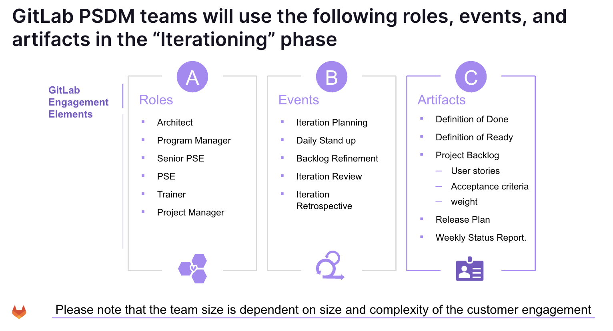
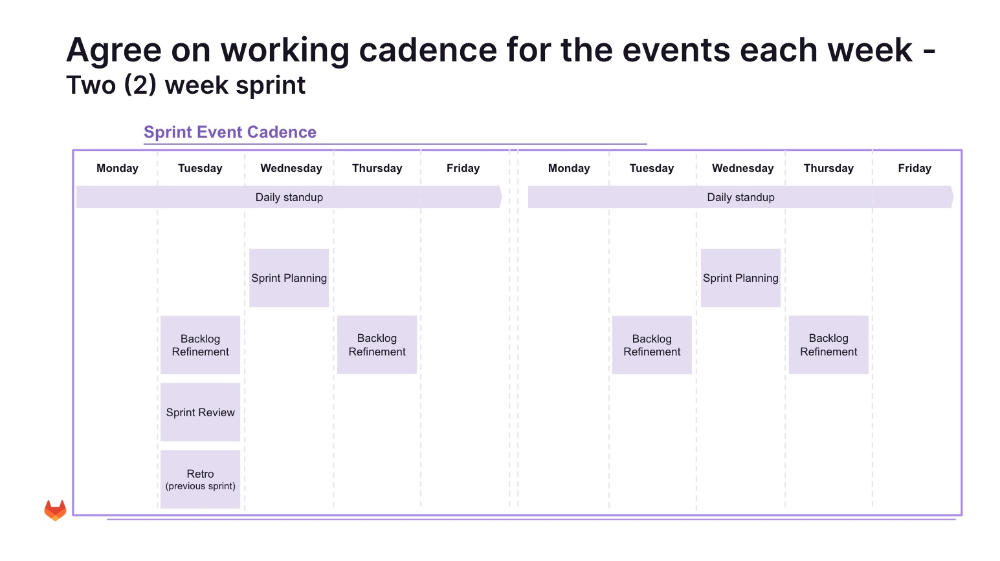
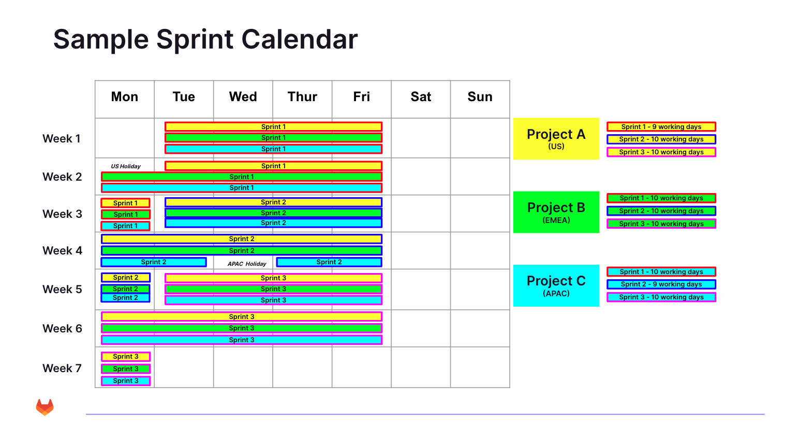
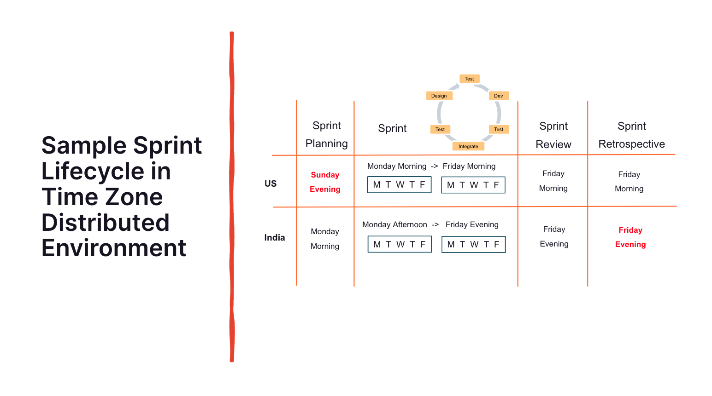
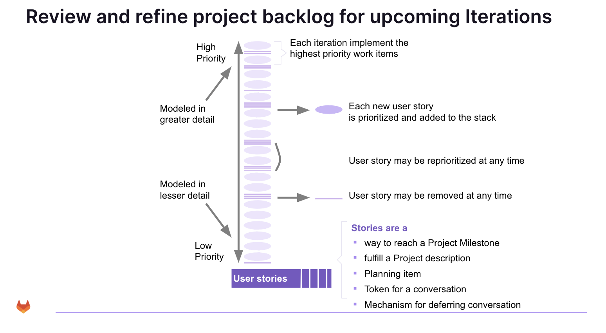
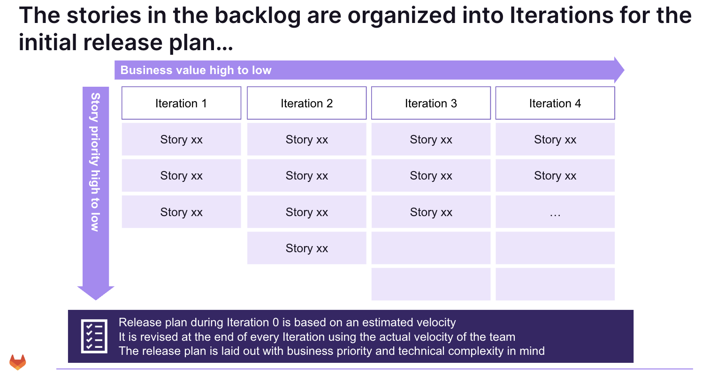
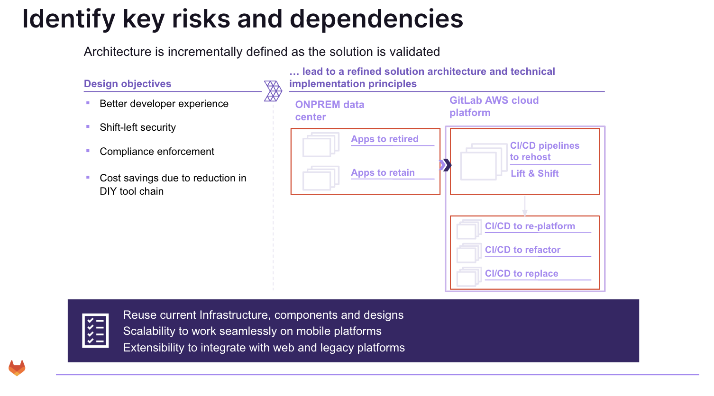

Part of the Communication Plan, managed by Gitlab Professional Services & Customer team, is the Professional Services Delivery Methodology (PSDM). This includes establishing an Iterative Cadence, ensuring that the team operates within a predictable time slice which enables engagement activities to be performed reliably, against the Project scope. A reliable Iteration Cadence simplifies engagement planning as we prepare for each phase of a Project

While the goal is to manage all projects out of Gitlab through our CPR automation, we suggest following the iterative approach when a project exceeds two months in duration (roughly, 5 Iterations).

Please review the [archetype definitions](../archetype-definition/_index.md) for further clarity around "when" to manage against an Iterative Cadence.

## Iteration 0

[Iteration 0](../iteration-0/_index.md) is the first discovery meetings between the Gitlab & Customer Project Team. To prepare for Iteration 0, the PM will work with the Gitlab Project team to review the timeline against the agreed upon scope and dependancies. This ensures we are gathering the right information and understanding the potential risks. Allowing us to show up to Iteration 0 as trusted advisors to our Customers. This is where we review the methodology and work with the Customer on establishing a cadence for updates and reporting against the Project. A reminder to [think big in discovery](https://gitlab.com/gitlab-com/customer-success/professional-services-group/ps-leadership-team/ps-delivery-methodology/-/wikis/Home/Discovery). A well-rounded Iteration 0, helps us (and the Customer team) head into the Initial Planning and Design meetings with our customers, confidently.

{width="862" height="443"}

### Managing the Project in Gitlab

GitLab will be used as a project management and collaboration platform. We will be using the following features in GitLab defined below, in case you are unfamiliar with the [terminology](../agile-to-gitlab-terminology/_index.md):

* Group - This is the landing page for the Customer Engagement. Single source of truth of Project Governance 
* Projects - If an engagement has more than one Workstream (or SOW), we will track against more than one Project
* Boards - typically organized by labels or scoped labels to keep the team on track together. Sometimes the Gitlab/Customer team works to track against multiple Boards over Projects 
* Epics - Generally from Workstreams or "Activities" from the SOW
* Issues - These are the atomic units of work that roll into the Epic
* Iterations - time-boxed two-week events, that are reviewed during the Agile ceremonies  
* Milestones - How we can track against the Project Phases
* Labels - we use these in a variety of ways, but the most important ones are
  * To manage progress during delivery using a left-to-right flow
  * To manage prioritization
  * To organize specific sub-categories of work to keep the team organized.
  * To manage risk and mitigation
  * Weight - size or level of effort of the issue. See [Good Estimation Techniques](../good-estimation-techniques/_index.md) for assigning weight

### Team Roles

Team roles vary based on the size and complexity of the engagement (see more in the [Scaling](../scaling/_index.md) section). Some roles are part-time in nature unless technical or organizational reasons warrant full-time involvement.

At a minimum, engagements will always have a part-time Project Manager and a full-time Professional Services Engineer (PSE). 

Our largest engagements usually have a combination of the following part- and full-time roles:

1. Technical Architect
2. Program Manager
3. Senior Professional Services Engineer
4. Professional Services Engineer
5. Trainer
6. Project Manager

{width="855" height="462"}

Along with gathering and discussing the technical dependancies, the Gitlab Project team will review the Methodology, and work to establish a cadence schedule for the following:

1. [Daily Stand up](../daily-standup/_index.md)
2. [Backlog Refinement](../backlog-management/_index.md)
3. [Iteration Review](../sprint-review/_index.md)

## Planning and Design

* Review information gathered in [Iteration 0](../iteration-0/_index.md)
* Refer to the [Delivery Kits](https://gitlab.com/gitlab-org/professional-services-automation/delivery-kits) for technical dependancies/guides
* Reference the [template gallery](https://docs.google.com/document/u/0/?ftv=1&tgif=d) for Migration Runbooks

## Iteration Planning and Scheduling

Sprint / iteration planning is the event where teams plan the work to be performed in the upcoming sprint / iteration. It begins in Sprint 0, and this plan is created by the collaborative work of the entire Engagement Team. It **i**s time-boxed to a maximum of four hours for a two-week sprint / iteration. For shorter sprints, the event is usually shorter. The Program Manager / Project Manager ensures that the event takes place and that attendees understand its purpose.

Please refer to the [Delivery Kits](https://gitlab.com/gitlab-org/professional-services-automation/delivery-kits) for technical dependancies

{width="908" height="510"}

Sprint / iteration planning is the event where teams plan the work to be performed in the upcoming sprint / iteration. 

This plan is created by the collaborative work of the entire Engagement Team.

It **i**s time-boxed to a maximum of four hours for a two-week sprint / iteration. For shorter sprints, the event is usually shorter.

The Program Manager / Project Manager ensures that the event takes place and that attendees understand its purpose.

Although the above pictures show a one-week and two-week sprint (aka iteration) it is assumed that iteration duration can be adjusted based on customer needs - as long as the duration stays consistent.

Generally established best practice is to **not** create iterations of varying durations as this prevents consistent measurement from one sprint to the next (velocity will appear skewed). Also, sprint durations between 1 week and 4 weeks are most common. This sample sprint (iteration) calendar shows 2-week sprints, starting on Tuesday, accommodating various US and APAC holidays. Note that the cadence stays the same but the number of working days fluctuates based on the sample holidays. Customer company holidays, vacations, and sick time also influence the number of working days in a sprint / iteration.

{width="849" height="476"}

Less than one week is possible if the work and coordination efforts can be optimized, more than 4 weeks is not recommended because longer sprints delay the feedback loop from working effectively and it is more like for engagement to "go dark" due to inactivity. Shorter sprints reinforce the sense of urgency and bias for action

_2 week sprints / iterations are a good target duration to use unless the customer insists otherwise_. For example, customers might want the GitLab engagement to follow the same sprint cadence as their own due to the integration into the customer's status and reporting process.

What do you do if you just cannot make it work? Between various stakeholders, locations, time zones, and other challenges, coordination can be difficult. Ultimately, the specific customer situation dictates what needs to be done. For example, working in different time zones might necessitate a flexible approach who works at what hours.

{width="796" height="444"}

It is important to point out that certain meetings really, really, really need to be attended - sprint reviews for example demonstrate to the customer the tangible progress that has been achieved, so it is important that both GitLab and customer stakeholders attend in order to see that progress.

Part of the established cadence allows for frequent review and refinement of engagement priorities. Well understood, high priority, items bubble to the top of the priority list; and less defined items, with insufficient detail to be taken action on, drop to the bottom of the stack.

Review and refinement of the backlog allows for the dynamic reprioritization of items as the situation on the engagement adjusts.

## Preparing for the Iteration

* [Weight Estimation](../good-estimation-techniques/_index.md)
* [Backlog Management](../backlog-management/_index.md)
* [Definition of Done](../definition-of-done/_index.md)
* [Definition of Ready](../definition-of-ready/_index.md)

{width="774" height="425"}

Prioritization occurs based on business value (front loaded into early sprints) and story priority.

{width="866" height="482"}

Release planning / engagement planning is critical to ensuring that expectations are set and the engagement is managed successfully.

## Reporting throughout an Iteration

### Iteration Status

As mentioned in Iteration 0, it is asked to report on the following per iteration review (also noted in the [Status Template](https://docs.google.com/presentation/d/1jSc5vAID3DMMwojyZnAnOT0aKY2UwDfH2Si-XxEHjLU/edit#slide=id.g26686cc4f34_0_233)):

1. Status against the Project Roadmap
2. Iteration achievements
3. Goals for the next iteration
4. In progress & Upcoming workstreams
5. Features Status
6. Project Burndown
7. RAID tracking
   1. Issues for discussion
8. Appendix to the Communication Plan (tools/links, cadences, DRI), Success Criteria, Collaboration/Training Session schedule

### Risk Management

To ensure we continuously surface & mitigate risk, we work out of the Customer facing Gitlab Project (CPR) and track our RAID log within the [RAID issue](https://gitlab.com/gitlab-com/customer-success/professional-services-group/professional-services-delivery/cpr_gitops/-/blob/main/cpr_gitops/issue_templates/raid_log.md). The RAID is created when the Proj/Prog Manager creates the initial CPR.

{width="913" height="507"}

### Capturing Lessons Learned

In the spirit of iterate..iterate..iterate...

Retrospective Meetings have a simple intent: To discover, discuss, and take note of tangible process improvement opportunities. When should we run a Retrospective?

* Throughout the Project, with the focus on improving ongoing engagement efforts and processes
* Closeout of the engagement, to identify larger process improvement items that might benefit future engagements

A Retrospective is essentially a process improvement meeting at the end of each iteration / sprint or engagement where the team discusses what went well, what should change, and how to implement any changes.

* [Internal Retrospectives](https://gitlab.com/gitlab-com/customer-success/professional-services-group/ww-consulting/ps-plan/-/blob/master/.gitlab/issue_templates/project_retrospective.md?ref_type=heads) (lessons learned, project wins, etc) are captured within the Internal Retrospective Issue
* [Customer Retrospectives](https://gitlab.com/gitlab-com/customer-success/professional-services-group/professional-services-delivery/cpr_gitops/-/blob/main/cpr_gitops/issue_templates/retrospective.md) are captured within the CPR issue
* [how to conduct a Retrospective](../retrospectives/_index.md) 

## Standard Set of Artifacts

The GitLab PSDM is focused on enabling customers to realize value from the GitLab platform without imposing unnecessary overhead. Because of this, the methodology proposes only six artifacts that will have to be maintained, most of which can be derived from a GitLab projects / backlog / board.

1. Definition of Done 
2. Definition of Ready
3. Product Backlog
4. User stories
5. Acceptance criteria
6. Weight
7. Release Plan
8. Working System
9. Weekly Status Reports

## Training and Education Resources

* [GitLab University](https://university.gitlab.com/)

## Enablement Session Presentations / Recordings

* [Value Stream Management](https://docs.google.com/presentation/d/1W9xF6USPO-lOPf3TbdG8-hmqbsQxoJNuvIGgDBoRAA0/edit?usp=sharing)
* **Material**: [Enterprise Agile Planning - Sync Sessions Q2 - 2024](https://docs.google.com/presentation/d/1vKA-WUjzKzIAmR1RWfsmVP9EegdaDUTgY2oRcDkHSp4/edit#slide=id.g2dc09a49267_0_1227)
  * **Recording**: https://gitlab.zoom.us/rec/share/5eiscybvsGAKN7HNR_jmPrtvc8nZmJB5TqrB-CQ7kniwuhn_R1acGDWgJ0Mq7Rfp.BcU5A76E02IQ-AQD?startTime=1715777898000
  * **Passcode**: Mu4#QWXS
* **Material**: [Lunch and Learn Agile Project Management](https://docs.google.com/presentation/d/1EYhbDjE2111z6ednA3eEPA2YS6sWdkXTZfN_b0A4G5U/edit?usp=sharing)
  * **Recording**:https://gitlab.zoom.us/rec/share/RWzOO55Spn-TR-9kRSd4ZjxtFqvJkIpvidGrolyKGlrs-jVg3QCNYlh49jCv7y6K.PGByVxvp02DXiuPg
  * **Passcode**: ^ach7eX7
* **GitLab University:** 
  * https://university.gitlab.com/pages/catalogue?labels=%5B%22Topic%22%5D&values=%5B%22Agile%20Project%22%5D

## Delivery Kits

* [Delivery Kits](https://gitlab.com/gitlab-org/professional-services-automation/delivery-kits)

## Methodology & CPR

* [PS Delivery Methodology (reason, purpose, approach, strategy) March 2024](https://docs.google.com/presentation/d/1YxRbt_EBVw1JMVE7zo3s1QPL9TK6pKFErOwv5lhr7XU/edit?usp=sharing)
* Gitlab CPR Board Management & Maintenance
  * CPR setup - _coming soon_
  * Guidelines on CPR board setup - _coming soon_
  * [Gitlab best practices](../gitlab-best-practices/)
  