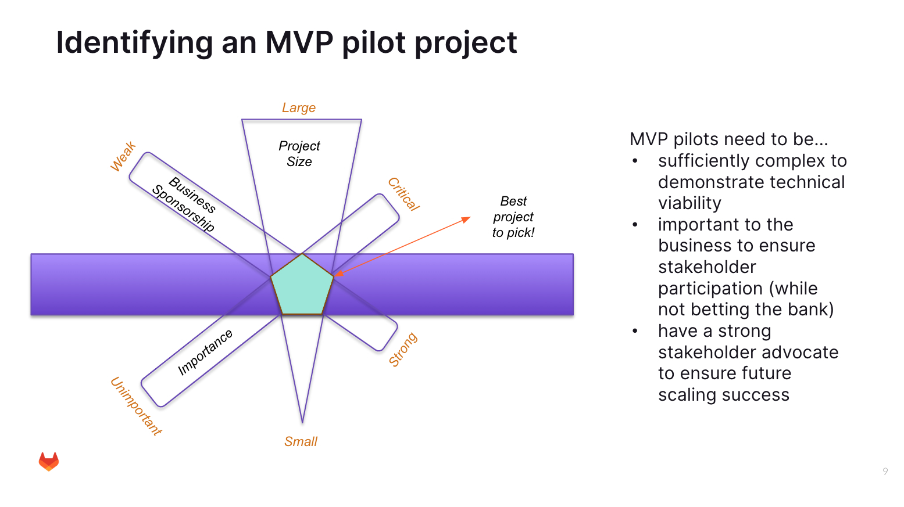

## Service Delivery Always Utilizes one or several MVP(s)

Any engagement assumes that we start small, with one or several Minimally Viable Projects (MVPs), to prove viability of the chosen implementation approach. 

The nature of an MVP is that experimentation and learning will lead to a better overall implementation approach during the Scaling phase of a project.

MVPs also serve the explicit purpose of getting customer stakeholders aligned, and customer Development Teams trained.

Many technically savvy teams will state that "_we know all about agile, DevOps, and DevSecOps, we don't need training_" but this is a fallacy which leads bad engagement outcomes.

Getting MVP teams trained on GitLab, [including full Education and Training courses](https://university.gitlab.com/), is a requirement not only for the MVP Development stage of the engagement but also to set the stage for later scaling across the organization.

