**_Disclaimer: Graphs and charts need updating!_**

## The Inevitable Question…

Imagine that you are working in a software company that just released its first product, _BubbleSoft Platform 1.0_. Sooner or later, you will have a conversation like this:

_“Our product, BubbleSoft Platform, just released version 1.0. Great job guys! We are selling like hotcakes, the press loves us, and the demand is far greater than anticipated! Off the charts! That’s the good news._

_Bad news is that we need to know by next Tuesday when we can release version 2.0, and we need to tell the market what the target release date for version 3.0 will be as well._

_Reason for this is that we are trying to put together marketing and tradeshow budgets and need to know what we can show at next years’ ABC tradeshow._

_Oh, and we are looking for next round funding and the venture capital guys ask us for those dates as well, because they want to understand our “burn rate”, whatever that is…  **Can anybody give me the dates?**”_

There it is, the dreaded question! In many organizations, this question causes a lot of consternation, followed by frantic estimation exercises trying to discern a somewhat realistic date.

Usually this is based on wild guesswork because requirements and specifications have not been written yet. This in turn leaves the engineers trying to guestimate as best they can based on their understanding of what the requirements might be.

Once they come up with a timeline, executives might push back due to their fear that timelines are unacceptable to the market, their venture investors, or their budgets. Or, the other extreme, executives might buffer imaginary schedules because they do not trust the estimates to begin with.

Point being is that this kind of estimation effort frequently results in fantasy schedules because they are built on quicksand: no or insufficient requirements, unknown scope, hasty estimation effort.

**_Does this sound vaguely familiar in our Professional Services context? We don't have to estimate product releases, in our case we are talking about customer engagements. Nevertheless, same estimation problem..._**

Theoretically, in an agile / iterative environment, you can answer this question relatively easily, assuming you have several key factors taken care of:

1. You have a Vision Statement that describes your Product or Project
2. You have a well maintained Product Backlog, including [well defined user stories](../good-user-stories/_index.md)
3. You have sized the Product Backlog Items, ideally [using Estimation Poker and story points](../good-estimation-techniques/_index.md), but if the volume of Product Backlog Items is too great, at a minimum you have T-Shirt sized stories that are not in the immediate next two sprints
4. Your Program Manager / Project Manager is able to assign specific Product Backlog Items to specific releases using a Product Release Roadmap that has been worked out between GitLab and the customer
5. You have a clear [Definition of Ready and Definition of Done](../definition-of-done/_index.md)
6. You understand your teams’ Velocity

## The Basics

## What is a Vision Statement?

A vision statement is an elevator pitch that puts the product or project goals in the context of the marketplace and your customer needs. Customers can be either internal (say for an IT project) or external (to be sold or made available for free to people outside of your organization). In the case of a professional services engagement, the vision statement usually should come from the customer, who is expressing what business goals should be addressed in the engagement.

It is strategic in nature and owned by the Product Owner / Product Manager / stakeholder **_on the customer side_**. In order for a vision statement to be effective, it must be communicated throughout the development and supporting organizations in order to set expectations.

Simply put, the vision statement provides context for how the current development effort supports the overall goal.

Vison statements are usually pretty short. [Geoffrey Moore (“Crossing the Chasm”)](http://www.amazon.com/Crossing-Chasm-3rd-Disruptive-Mainstream/dp/0062292986/ref=sr_1_1?s=books&ie=UTF8&qid=1486059674&sr=1-1&keywords=crossing+the+chasm) suggested the following phrasing format:

**For** \<target customer\> **who** \<statement of the need\> **the** \<product name\> **is a** \<product category\> **that** \<product key benefit, compelling reason to buy\>.

**Unlike** \<primary competitive alternative\>, **our product** \<final statement of primary differentiation\>, **which supports our strategy to** \<company strategy\>.

Pretty straightforward and to the point. **Again, in professional services, this kind of vision statement is usually implicitly expressed as part of the business needs discussion with the customer.**

## What is a Product or Project?

A vision statement usually initiates team members to the purpose of the product or project at an elevator pitch level of granularity. A product or project is a development effort that can be broken down into packages of progress.

**The first package of progress is _timing_ focused**. A product breaks down into different releases, which in turn breaks down into sprints, which in turn are made up of weeks that have several days.

Well, in professional services we don't have products and releases, you say! True. We have customer projects or engagements; projects / engagements effectively are like releases, and those projects / engagements still break down into sprints / iterations, which in turn... you get the idea.

According to Scrum / SAFe or other agile process models, a sprint can be as little as one day or as long as 4 weeks in duration, so weeks is an optional package, or only relevant if the sprint duration exceeds 7 days.

Please note, that products are usually “externally sold” whereas projects often are “internal efforts”. Think “BubbleSoft Platform” sold at $1,999 per seat versus an internal IT project called “GitHub to GitLab Migration effort”.

Products by their very nature are longer term solutions that lend themselves to feature / functionality delivery over multiple releases, whereas projects can be multi-phase but often are one-shot efforts. A large scale Digital Transformation could easily be the size and complexity of a product; as such, it could have multiple releases (multi-phase).

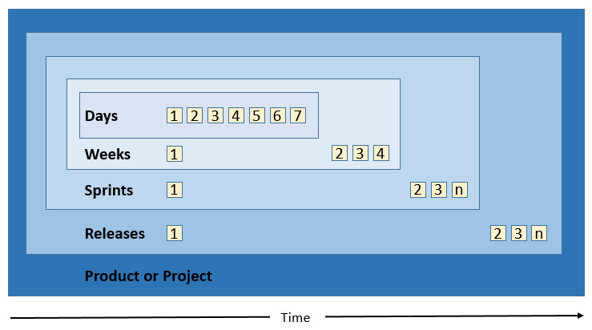

An alternative view looks like this:

**The second package of progress is _goal_ focused**. The high level vision translates into release goals that are further broken down into sprint goals, which finally break down into specific user story benefits.

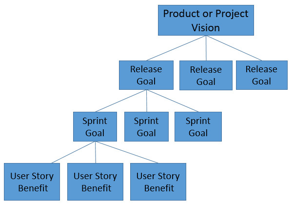

**The third package of progress is _scope_ focused**. The high level vision breaks down into a roadmap describing features, which are further broken down into epics, which break down into specific user stories, and associated tasks.

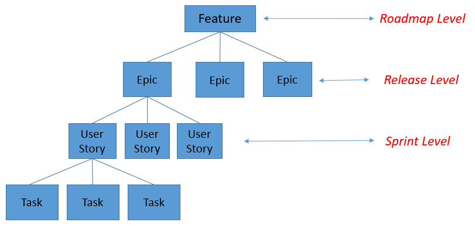

Now that we identified the vision statement, the product, and the package structure of progress (timing, goal, and scope focus), the questions becomes how to manage all of this? The answer is the product backlog!

## The Product Backlog aka The Backlog

The product backlog is the products’ or the projects’ **To-Do List**. All scope items, regardless of level of detail are in the product backlog.

**_It is ordered, not just prioritized_** – meaning product backlog items are prioritized according to business value. What is known, is written down and documented, with the expectation that discovery will lead to change. The product backlog is owned by the Program Manager / Project Manager.

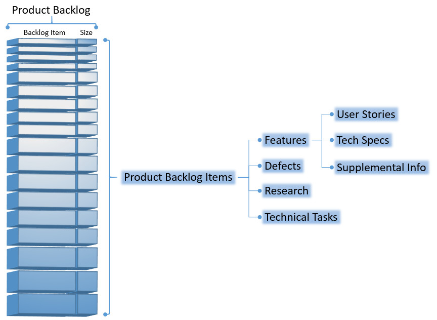

The product backlog is a living document / repository and is expected to change.

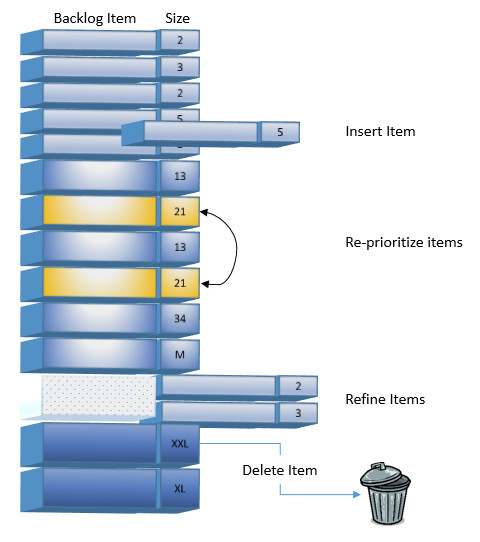

The Program Manager / Project Manager is expected to insert, re-prioritize, refine, or delete items from the product backlog; this can happen any time until the sprint scope is defined and committed to by the development team.

Sizing and estimation of the product backlog usually occurs in sprint planning meetings or at regularly intervals during ongoing sprints. Depending on how fast the Product Owner adds user stories, more frequent, maybe even daily estimation sessions might be needed.

The important point here is that product **backlog items need to get estimated continuously in order to avoid the big bang estimation effort** at one critical juncture of the effort. This has the added benefit of exposing the entire team to the Program Managers’ / Project Managers' thinking, keeping everybody in sync and with an improved understanding of requested project features and functionality.

Sprint Planning meetings or more frequent estimation session need to follow established Agile Estimation best practices, meaning Product Backlog Items are estimated using either Estimation Poker or T-Shirt sizing. To see how to effectively estimate user stories using Estimation Poker or T-Shirt sizing, [follow this link](../good-estimation-techniques/_index.md).

In order to have a somewhat comparable scheme between Estimation Poker and T-Shirt Sizing, I suggest to use the following quantification scheme:

* XS = 1 story point
* Small = 2 story points
* Medium = 3 story points
* Large = 5 story points
* XL = 8 story points
* XXL = 13 story points
* EPIC = Product Owner needs to break down the Epic into more refined User Stories (for example, the EPIC might state something like “Internationalization Support”. This needs to be broken down into more detailed user stories like “Provide Support for British English”, “Provide Support for Spanish”, in order to be able to estimate it).

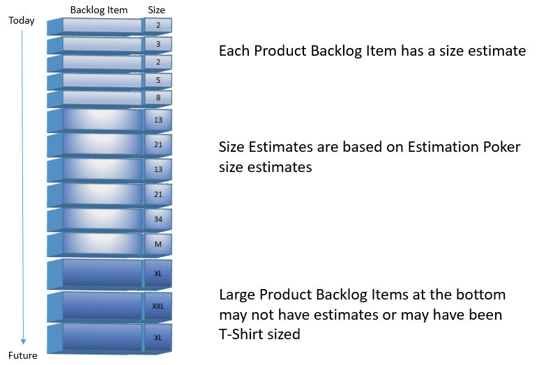

The product backlog is the source of the sprint backlog. Once a sprint goal / scope has been committed to by the development team, sprint backlog items should not be changed.

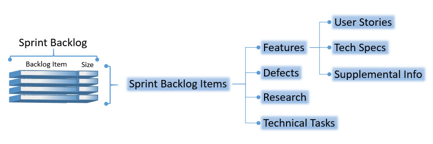

## Agile Release Planning is based on a Product Roadmap

A product roadmap represents a holistic, yet digestible, view of features that enable the product vision.

It enables affinities to be established, gaps to be identified, and in general shows release timing for product features. Highest priority features are released first. In product development efforts it is produced by the Product Manager and prepared at least bi-annually. In professional services environment, this is usually provided by the customer, during scoping discussions.

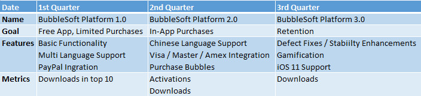

## Agile Estimation is based on Empirical Data – Not Guesswork

What is Velocity? Velocity is the rate at which the Development Team / Engagement Team can reliably deliver story points (usually packaged into time boxed sprints and resulting in a working product increment).

Using Estimation Poker, estimation variability decreases usually over the course of the first 4 to 6 sprints. I have rarely seen stable teams that did not achieve fairly accurate estimates after working together for 5 to 6 sprints.

This has implications for professional services teams working on very short engagements - if team assignments vary, they never get to the point of stabilizing their estimates. The way to improve on this is to keep the same teams together across similar engagements. For example, if the same team does migrations from GitHub to GitLab over an extended period of time, estimation accuracy will progressively increase.

Pleases note that “stable teams” is key here – teams need to be stable, meaning team members need to know each other, have worked with each other, and successfully formed a team – following the standard “forming–storming–norming–performing” model of group development, first proposed by [Bruce Tuckman in 1965](http://en.wikipedia.org/wiki/Tuckman%27s_stages_of_group_development). Again, for professional services teams that are operating in a fast growing environment, this has implications... teams never get to the norming and performing stage, getting stuck in forming and storming due to constant deal expansions, but that's a good problem to have!

Once a Development Team / Engagement Team has gone through the “forming–storming–norming–performing” process, team velocity is established. Estimation accuracy and predictable velocity allow for longer term forecasting.

## Agile Release Planning

For example purposes, if your product backlog contains 450 user stories representing 2,400 story point and your Development Team / Engagement Team is delivering at a steady velocity of 60 story points for every 2 week sprint, you are able to predict that the rest of the project will take another 40 sprints, which equals 80 weeks, or roughly 1 ½ years.

* 2,400 / 60 = 40 Sprints
* 40 Sprints x 2 week sprint duration = 80 weeks
* 80 weeks / 52 weeks in a year = 1.54 years

Accordingly, calculating your burn rate becomes a trivial exercise. Simply multiply your labor cost and overhead by the duration. For example, if you know that your 7 member Development Team / Engagement Team costs you $1,529,500 per year ($805,000 for salaries, $724,500 for overhead and fringe benefits, etc.) then you can easily figure out the cost per sprint ($1,529,500 / 26 = $58,827).

**_You cannot get any better at forecasting and predictability._**

Estimation Poker is an empirical, self-correcting, approach to short term software estimation where user stories are fully defined.

T-Shirt Sizing (Affinity Estimation) is used for higher level estimates needed for scoping, deal sizing, budgeting, staffing, and other longer term planning activities where not all user stories are defined in all detail and a quick assessment of upcoming work is needed.

Coming back to our original question “**…_we need to know by next Tuesday when we can release version 2.0, and we need to tell the market what the target release date for version 3.0 will be as well._**_”_ let us quickly figure out when the 2.0 and 3.0 releases will be able to ship.

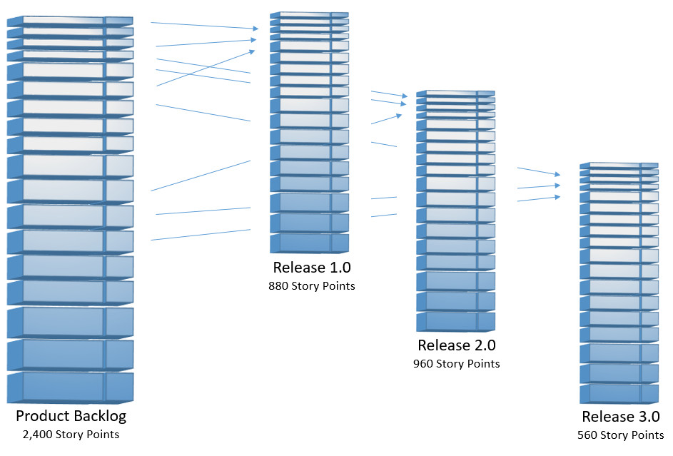

We released the 1.0 version of our product, BubbleSoft Platform, which consisted of 880 story points. That is done. The release provided us with a stable Development Team that delivered at a predictable velocity of 60 story points per sprint (two week sprint duration).

Based on our existing velocity of 60 story points, we now can calculate how long it will take us to deliver the remainder of the Product Backlog, which the Product Owner assigned to version 2.0 (960 story points) and version 3.0 (560 story points).

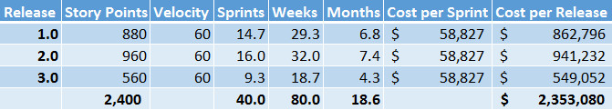

Assuming that the Development Team will improve and gain efficiencies, you might expect to improve on velocity over time, which could look like this:

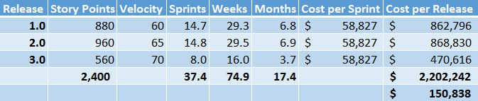

Basically, the increased velocity shortened the delivery time frame from a total of 80 weeks down to about 75 weeks, also resulting in a savings of about $150,838.

Let me say it again: **_Release planning, using Agile / Scrum, is easy! And, you cannot get any better at forecasting and predictability._**

## Common Issues and Challenges

The section addresses some common issues and challenges that make Agile Release Estimation more difficult than it has to be.

## No Vision Statement

I frequently come across product or project efforts that do not have a vision statement. The purpose of a vision statement is to communicate the high level goal of a product or project. Without it, frequently team members have no context why they do have to do certain work.

This is the equivalent of a truck driver knowing how to turn right or left, but having no idea what the final destination is. Vision statements are important in order to rally everybody around a common cause and to provide that “true north” compass.

Vision statements are important to realize what business value needs to get delivered. "GitHub to GitLab Migration" is not a vision statements. "Provide integrated security scanning across all CI pipelines in order to minimize security risks" is a better missing statement; "GitHub to GitLab Migration" is just one step in the effort to realize the vision statement.

## No Product Release Roadmap

Roadmaps are important because there is more to software development than simply a stream of software releases. Product roadmaps take into account market specifics, from seasonality of the product (watch out for the proverbial Christmas trees in June!), over competitive pressures (oh, our competitors just released stuff we were planning to do next year!), to external factors (like the yearly October-ish release of iOS).

Roadmaps are essential planning tools to lay out release timing for product features. Not having one means you are flying blind.

Even professional services engagements benefit from roadmaps, although they are sometimes hard to obtain from customers. If you think of a large DevSecOps transformation, the roadmap might well look something like this:

* Source code migration off legacy SCM system, such as GitHub
* Train / upskill customer development teams
* Migration off legacy build server, such as Jenkins, enable GitLab CI
* Configuration of Security Compliance pipelines in GitLab CI
* Infrastructure as Code configurations
* Value Stream Management and DORA Metrics analysis

## Product Roadmap (feature desires) and Velocity Calculations (delivery capabilities) Do Not Match

Sometimes product roadmaps perfectly express the desired release timing, but your Development Teams’ / Engagement Teams' velocity just cannot get you there.

From this problem, you might see many dysfunctions develop. One executive team I worked with simply would not admit that the desired release date was unrealistic, overriding the Development Teams’ estimates and forced the team to bulk up on additional developers (you know the old fallacy, just double your staff to cut your time in half!).

The result was a bloated team that was less productive, more expensive, and completely burned out after a death march.

Remember that the good thing is that the velocity is based on empirical data. However, you cannot bend the reality curve to your liking by simply doubling or quadrupling staff.

## User Stories are Inadequate

[The biggest problem when it comes to user stories, bar none, is their size. 90% of all problems encountered are based on user stories being too big](../good-user-stories/_index.md).

Writing good user stories is essential in order to do a good job during the Estimation Poker or T-Shirt sizing exercises. Inadequate or poorly written user stories make the downstream estimation process less reliable.

## Estimation is not done on a Regular Basis

If the team does not perform estimation activities on a regular basis, then the risk becomes an excessively big backlog. You do not know if you are dealing with a molehill or Mount Everest. Therefore, you cannot plan your release schedule.

In the ideal case you would have time to estimate all user stories using Estimation Poker. If you cannot do that, either because the user stories do not have sufficient detail or your backlog is too big, then use T-Shirt sizing.

When you have 2,986 user stories – it is not uncommon for a productive Program Manager / Project Manager to crank out hundreds and even thousands of user stories / issues / tasks – at varying levels of detail, some fully fleshed out, and some only with a subject line, then T-Shirt sizing is the only viable option. After all, you do not want to put your development effort on hold for 6 weeks simply to generate estimates with Estimation Poker?

The drawback is that T-Shirt sizing is not as precise as Estimation Poker – so you have to think about how to deal with estimation variance.

## The Development Team is Unstable

There are many reason why a Development Team / Engagement Team might be unstable. New technologies might lure team members into new jobs. Better benefits might entice people to leave. Use of contractors might shorten the tenure on the team. Personality conflicts might cause team members to leave. People get sick. People retire. The business might decide to outsource activities to a new partner. Your outsourcing partner experiences excessive turn over which you have no influence over. Etc., etc.

Having a stable Engagement Team is by far the biggest productivity enhancer and guarantees that velocity becomes predictable over time.

If your Engagement Team is unstable, most likely you will see that your velocity becomes unpredictable.

## Velocity is Unpredictable

Stable Development Teams / Engagement Teams make for very predictable velocity. Unstable Development Teams / Engagement Teams make for unpredictable velocity.

Only estimating using T-Shirt sizing introduces variance that ultimately gets expressed in unpredictable velocity. Detail level estimation using Estimation Poker increases precision.

Missing, too big, or poorly written user stories make any kind of estimation difficult, and often results in unpredictable velocity.

**_Question is, how do you deal with unpredictable velocity in your release planning efforts?_**

Following table shows an example of varying velocity:

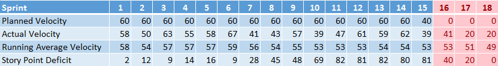

It uses the same assumptions as discussed before, 60 story points velocity per sprint, and a total sprint backlog of 880 story points for the release, BubbleSoft Platform 1.0.

Based on these assumptions we should have wrapped the release in sprint #15.

But, as you can see, the actual sprint velocity was different from the planned velocity, resulting in a varying story point deficit over the course of the sprints, and resulting in a deficit of 81 story points at the end of sprint #15.

It then takes another 3 sprints to work off the deficit, or assuming our 2 week sprint duration, a delay of 6 calendar weeks.

Here is another view of the data in the table:

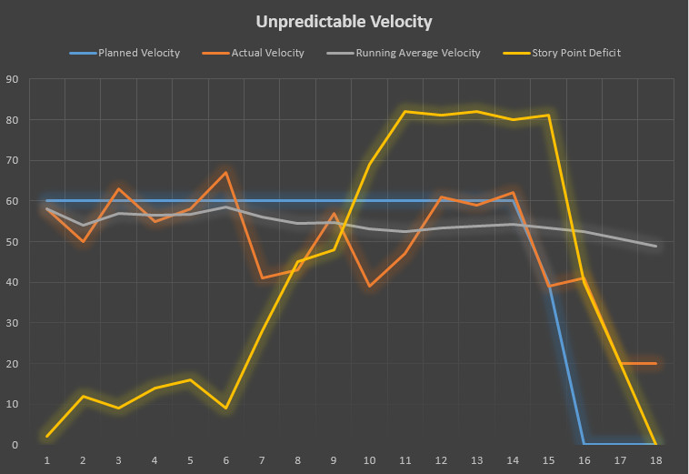

In terms of “slip”, we basically missed the mark by 81 story points, which is about 9% of the overall development effort of 880 story points.

But, for whatever reason the team productivity really took it on the nose in sprint #7, #8, #10, and #11. This kind of thing can happens due to team members leaving the team and not getting replaced in time; or due to illness. Or other reasons.

Also, looks like the team really lost steam in sprint #17 and #18, only delivering 20 story points towards the end. This resulted actually in a calendar time slip of 20% (6 week slip on a 30 week schedule, which originally assume 15 sprints at 2 week sprint duration).

Again, this kind of thing can happen when engineers leave the team before things are done, or are moved on to other development efforts before the product actually ships – leaving a smaller team to mop up remaining functionality.

Regardless of the specific reasons, at the end of sprint #10 (running a 69 point deficit) I would have sat down with the Program Manager to discuss options:

1. Deprioritize certain user stories to get the “ask” in line with the delivery capability – basically lowering the total amount of story points in the release from 880 to, say, 800
2. Planning on additional sprints to make up for the lower than expected velocity
3. A combination of both

## Summary

Release planning using Agile / Scrum is easy! But, it assumes you follow best practices for:

1. Laying out a vision,
2. Maintaining good user stories in a product backlog,
3. Assigning them to a product release roadmap, and
4. Actively managing the release as you progress through sprints towards your release goal

Predictability does not come for free.
