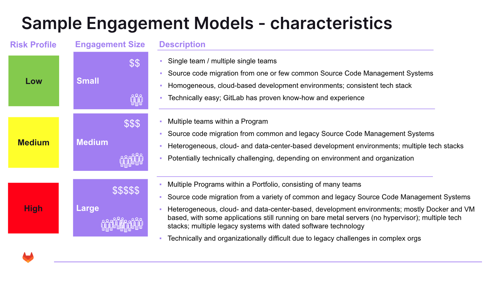
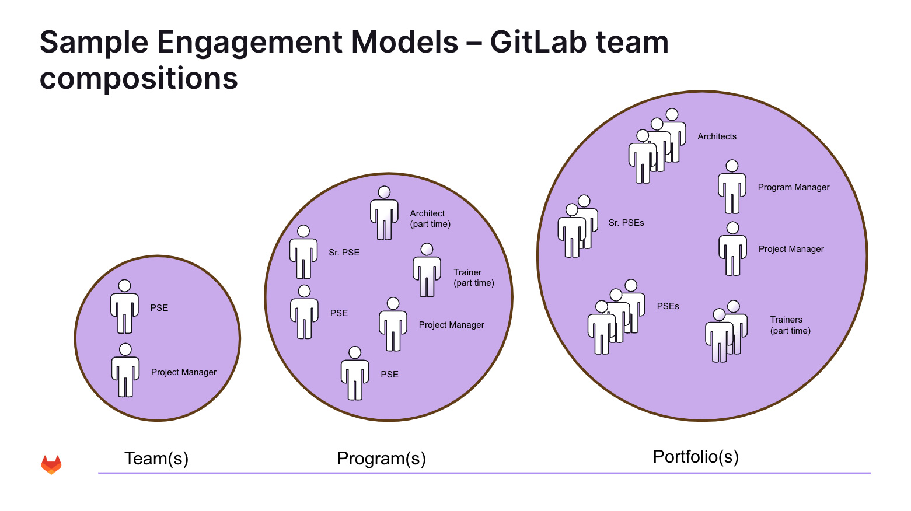

The MVP Development phase naturally leads into the part that most Fortune 500 companies are most interested in: **Scaling**

The business goals are usually focused on gaining efficiencies by scaling from **teams** to **programs** and ultimately across a set of complex **portfolios** with a strong incentive to realize cost savings.

## What Does a Large Customer Look Like? The Archetype

* Fortune 500
* Large Dedicated or Self Managed customer
* Complex portfolio with many programs and distributed application teams
* Geographically distributed office locations (for example: North East/NY, Houston/TX, Bangalore/India)
* $1M+ PS revenue
* Three (3) logical portfolio groupings along geographies
* Looking to expand current 1,000 Ultimate licenses to 3,900 Ultimate licenses in the coming year, while moving all developers over to GitLab
* Looking for total digital transformation and getting off a variety of legacy tooling
* Customer has two (2) critical dependencies / seasonal events that prevents them from development work 3 weeks before and 3 weeks after each event (system freeze, minimizing system changes), such as
  * Super Bowl
  * Black Friday
  * 4th of July Sales Event

 
 
 

## Scaling Considerations

* [ ] Company Size
* [ ] Locations / Time Zones
* [ ] Number of Portfolios / Programs / Teams
* [ ] Technical Environment
* [ ] DYI Tool Chain
* [ ] Legacy Systems
  * [ ] Jira
  * [ ] Jenkins
  * [ ] ADO
  * [ ] External Security Scanners (Fortify, Snyke, Black Duck, etc.)
  * [ ] Package Managers in Use
  * [ ] ... \<Action Item\>
* [ ] Number of Users
* [ ] Number of Transactions
* [ ] Data Volume
* [ ] Repository Size
* [ ] Repository Depth
* [ ] \<Action Item\>
* [ ] \<Action Item\>
