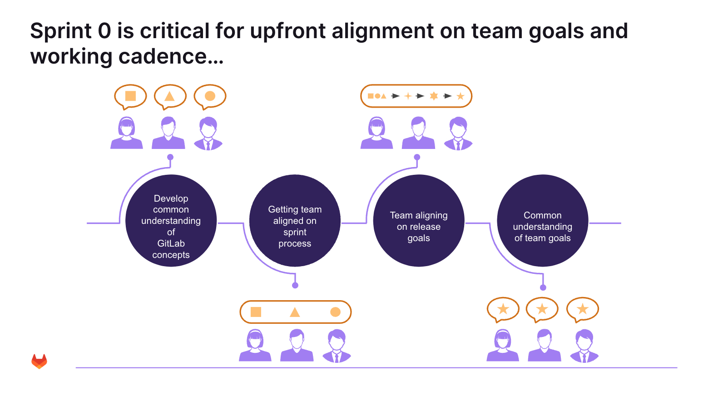

## Team Mobilization

1. Align on team norms and working agreements
2. Orient the team on roles and responsibilities
3. Agree on working cadences
4. Align on vision, scope, and goals for your specific team

## Engagement Planning

1. Refine and prioritize product backlog (user stories and acceptance criteria - two sprints) 
2. Slot stories into an initial release plan
3. Define Definition of Done (DoD) and, if needed, the Definition of Ready (DoR)
4. Understand constraints, impediments and risks for your specific team 

## Setup of Technical and Business Foundation

1. Identify key risks and dependencies based on initial backlog and tools
2. Design data and business architectures and CI/CD pipeline to support desired functionality
3. Define and implement engineering best practices to enable DevSecOps

## Prep for Production Readiness

1. Understand production readiness requirements based on impact and dependencies
2. Initiate production readiness including governance approval processes
