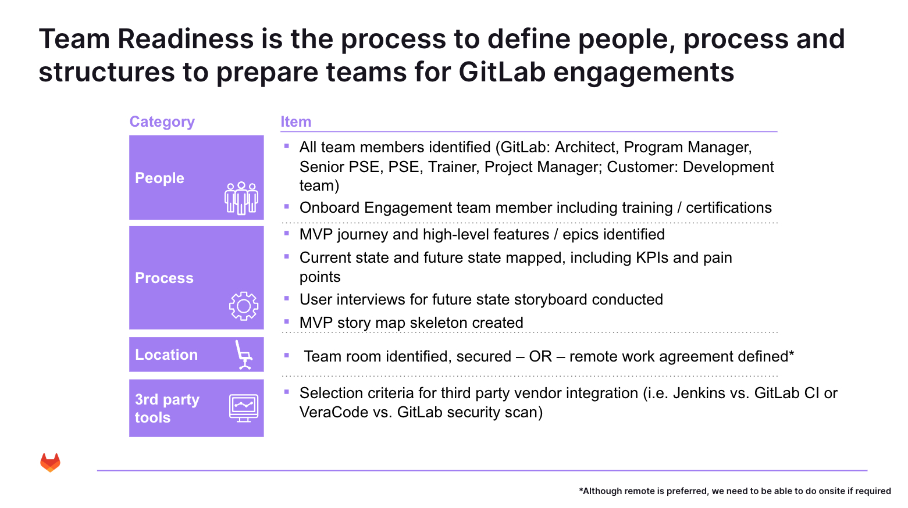

## How Will Team Readiness be Conducted?

* [ ] Team Members Identified
  * [ ] Internal
  * [ ] External / Partner Sourced
* [ ] Roles and Responsibilities Identified Based on SOW
  * [ ] Architect
  * [ ] Program Manager
  * [ ] Senior PSE
  * [ ] PSE
  * [ ] Trainer
  * [ ] Project Manager
* [ ] Role Allocations / Hour Assumptions by Role
* [ ] Laptop Requirements
  * [ ] GitLab Provided
  * [ ] Customer Provided
* [ ] VPN Access
* [ ] LDAP Entitlements
* [ ] Virtual Desktop Software Access
* [ ] Administrative Privileges to Enable Delivery (ability to spin VMs in customer environment, create Docker images, etc.)
* [ ] Security Clearance Requirements
* [ ] Citizen Ship Requirements
* [ ] ...
* [ ] ...
