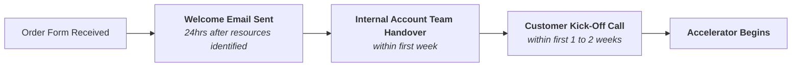

The Success Services department is part of the [Customer Success](/handbook/customer-success/) function who partners with our customers to deliver value and positive business outcomes throughout their journey with GitLab.

The team can be reached in [Slack channel](https://gitlab.enterprise.slack.com/archives/C05US54ETB3) (internal only).

For content for positioning the value of the service, how to price/quote the service and how to handle objections, please visit the internal handbook page [here](https://internal.gitlab.com/handbook/customer-success/success-services/).

## Success Services

### Overview

Our Success Services drive adoption and value realization of GitLab products whilst providing customers with Best Practices and a higher tier of White Glove support.   We achieve this by bundling a named Support Engineer, a Customer Success Architect (CSA) and Education services into a single orderable SKU as an annual renewable service.

The [Assigned Support Engineer (ASE)](/handbook/support/assigned-support-engineer/) is the primary point of contact for their customers and will  triage any support ticket logged by that customer.  Over time, because of this consistent resourcing, the knowledge of the customer's needs, environment and architecture results in faster resolution times to the most common logged issues.

The [Customer Success Architect (CSA)](/job-families/sales/customer-success-architect/) is accountable for their customer's success through GitLab product adoption using well understood Best Practices.  CSA's bring deeper product knowledge and technical depth than the industries traditional CSM role.  With experience across many customers, they are experts at ensuring features are leveraged the right way for maximum value.   This customer experience has lead to development of best practice content and prescriptive road-maps.  This content is folded into the Success Services offering as "Accelerators".

> Customer Success is not permitted to be "Hands on Keyboard" with customers.   We can and do provide best practices, architectural guidance and will tailor adoption and success plans to a specific customer need.  If a customer needs GitLab to develop a bespoke solutions or actively change or manage their configuration, we will need to engage our [Professional Services](/handbook/customer-success/professional-services-engineering/) team.

Education Services included with Success Services encompasses 1day of Instructor-led Training  as well as a significant number of Training Certification Exam vouchers.   This enables us to partner the running of specific accelerators, aligned to training and certification, to ensure your team is ready and able to drive the cost benefits that GitLab brings.

### Accelerators

Success Services include up to 4 Accelerators, 1 per quarter, that your [Customer Success Architect (CSA)](/handbook/customer-success/csm/segment/csa/) will deliver.

> An accelerator is a customized form of enablement that a GitLab CSA will define and deliver to a customer. These accelerators span a quarter and they're mapped to your mutual success plan.

An Accelerator, depending on customer requirements and defined outcomes, will pull together one or more of the below content modules.   Typically the accelerator runs over 12 weeks.  It kicks off with a discovery workshop to document required customer outcomes.  From that, we will run a planning workshop outlining with the customer the steps necessary to achieve their outcomes.   The output of the Planning Workshop is a backlog of issues logged, in a GitLab project, that includes all the necessary activities that will be managed over the following 10 weeks to achieve those outcomes and close out the Accelerator

#### Accelerator Content Modules

| Category | Content Modules | Description | Outcome|
|---|---|---|---|
|CI/CD|Introduction to CI/CD Workshop|The Intro to CI accelerator for the CI Pipeline track is a Getting Started/How to accelerator, focused on building initial familiarity and basic understanding of usage of GitLab CI for users who are new to the platform.|You'll come away understanding the architecture of GitLab ci yaml and GitLab runners, how to create a gitlab-ci.yml, as well as common patterns and rules|
|CI/CD|Runner fleet guidance  |A Customer Success accelerator to optimize and manage a GitLab Runner fleet at scale.|Your CSA will walk through a maturity assessment, informational sessions and interactive training including|
|CI/CD|Rules and pipeline flow|The Rules & Pipeline Flow accelerator for the CI Pipeline track is an Advanced Concepts accelerator, which covers methods of defining the flow of a pipeline using rules, DAG, parent/child pipelines, and any other optimization methods to control the operations of pipelines.|Training that is delivered with best practices|
|CI/CD|CI templates and reusability|The Templates & Reusability accelerator for the CI Pipeline track is an Advanced Concepts accelerator, covering the creation and use of CI templates and optimization of the workflow.|Best practices that have been tailored to your level of maturity|
|CI/CD|Product coach|The Product Coach accelerator for the CI Pipeline track is a Deep Dive accelerator, focused on consultative guidance on best practices and pipeline optimization for customer pipelines.|Your CSA will provide a detailed "guidance report" with 20+ categories to optimize your pipeline|
|Security and Compliance|Intro to security workshop|60 - 90 minute presentation of security concepts, security features, and getting started recommendations|Customer will be appraised of security scanners, vulnerability dashboards, and how to begin using these features|
|Security and Compliance|Hands-on security lab|90 - 120 minute, hands-on lab that you will have access to a gitlab.com sandbox; we provide the code and have prescriptive steps to configure security and compliance features|Customer will come away with actual experience adding security scanners to a pipeline, configuring security policies and compliance frameworks, and how to triage vulnerabilities|
|Security and Compliance|Intro to audit, compliance, and separation of duties workshop|60 - 90 minute presentation of audit concepts, compliance and security policy features, and best practices|Your CSA will tailor this content to your needs and maturity; you'll come away with knowledge that'll allow you pass audits, institute consistency across your groups, and recommndations for where to go next|
|Security and Compliance|Security rollout strategy|This content module will provide a complete plan for rolling out security and compliance features; including timelines and milestones that are mutually agreed upon with GitLab's best practices |The result of this content module will be a presentation of the rollout strategy and how it maps to your outcomes and timelines; additionally, the milestones and tasks will be in the collaboration project backlog so that your CSA can continue to guide on the rollout process|
|Security and Compliance|Product Coach - Compliance Framework/Security Policies Audit|The Product Coach accelerator for the Security & Compliance track is a Deep Dive accelerator, focused on consultative guidance on best practices for security policies, developer workflow, and separation of duties|Your CSA will spend weeks learning your existing workflow and then provide a guidance report that will have best practices and recommendations|
|Security and Compliance|Security Policy Rollout Strategy|The Security Policy accelerator for the Security & Compliance track is a multi-quarter program that your CSA will guide you through. The work is broken out into 5 phases: Architecture & Design, Compliance, Audit & Enablement, Dashboards & Integration, and Scaling. |By following our best practices, you'll be able to have a standardized and auditable GitLab instance. [Internal material](https://drive.google.com/drive/folders/1r_d1Lk5RyKoPvdN9HmzNKhHhAfKsSVAh) CSAs will leverage.|
|Agile Planning|Intro to GitLab Plan workshop|Overview of GitLab issue management and backlog workflows|Your teams will come away with an understanding of all the backlog planning features, reporting, and best practices|
|Agile Planning|Jira + GitLab workshop|This workshop will detail the options you have when integrating Jira and GitLab|Your CSA will spend time discovering your current needs and setup; then they'll deliver a customized workshop catered to your outcomes|
|AI/ML|AI/ML hands on lab|Bootstrap your developers on all the AI/ML features GitLab has and how to use them|Your team will walk away being familiar with how to invoke all the AI features and suggested usages for them; they will also have access to a gitlab.com sandbox for 3 days to keep experimenting|
|System administration|Upgrade package|This deep dive accelerator will prepare your system administration team for upcoming upgrades|The outcome will be a detailed upgrade plan, a presentation on the depreprecations as well as new features you need to be aware of, and a collaboration project to track any and all questions you have leading up to the upgrade|

## CSA Processes

We have CSA specific processes that go above and beyond the CSM role. It is expected that this is layered on top of the CSM processes and responsibilities.

### SPS Customer Onboarding

1. Introduction Email
   1. This email will be sent within 24hrs of both CSA and ASE resources being identified and as close as possible to Order Form being received from Customer.
   2. Utilize [this internal email](https://docs.google.com/document/d/1eDj4zSzuHega_wvZrWMkOC9TAWMWs_bjVwnn7GeJzzY/edit) and customize to your customer's needs
   3. The first priority is getting the kick-off call locked in so that you can review the program and get in front of the customer

2. Internal Kick-off Call
   1. Internal prep call for the CSA to perform knowledge transfer and coordinate with the account team on what is the priority work to wrap an accelerator around
   2. Customer Objectives identified prior to the Order Form being signed are to be documented by CSA and shared with account team

3. Customer Kick-off Call
   1. This will be scheduled within the first week of the agreement, subject to customer availability.
   2. If customer is not available in first week for a formal kick-off, both ASE and CSA should begin work async and will start any needed conversations via email.
   3. Utilize the slide [template](https://docs.google.com/presentation/d/1uQpuSwPV43ZkNvG18y_XBRRoBaCtWiyhYoHHAT3QBY4/edit) (internal)
   4. Share the .pdf version post call as well as immediate next steps, such as a discovery workshop
    
### Logging Accelerator Events

In order to keep track of key deliverables in the Accelerator process, CSAs need to log these events in Gainsight. This will allow reporting and a complete account timeline within Gainsight.

Instructions:

1. Add new activity (utilize the calendar plugin to auto-populate details of the meeting)
2. Select customer
3. "Activity Type" = "CSA Engagement"
4. Choose "Acceleratory Type". Use your best judgement to categorize the type of activity it is:
   * Agile Planning
   * CI
   * CD
   * Security
   * AI
   * Compliance
   * System Administration
5. Fill in "Accelerator Content Module"
   * Use this optional field to document the activity itself
   * i.e. "Delivered guidance report for cost optimization", or "Custom Security Policy Workshop"
   